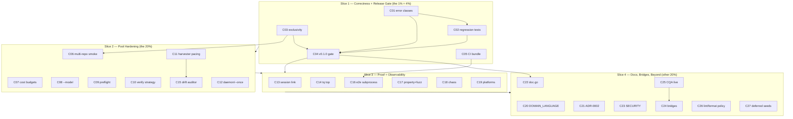

# SUPERB: Round 2 — Release Gate + Agent-Pool Hardening

**Date:** 2026-09-06 16:28 CEST
**Status:** PLANNED (awaiting approval → EXECUTING)
**Scope:** Everything currently known-open: 19 TODO_LIST items, the 10 audit
findings from the 16:19 status report, and the ROADMAP backlog — deduplicated,
Pareto-ranked, and split into 26 coarse (30–100 min) + 100 fine (≤12 min) tasks.
**Inputs:** docs/status/2026-09-06_16-19 report §f, TODO_LIST.md (19 items),
ROADMAP.md raw ideas, FEATURES.md PLANNED rows, round-1 plan (docs/planning/).
**Repo strategy:** same repo, no scope change. v0.1.0 single-node foundation is
BUILT — this round makes it correct, observable, proven under contention, and
RELEASED.

## The Problem

The queue core works and the agent pool loop is proven live, but five things
keep it from being trustworthy: (1) permanent errors burn agent money through
retries, (2) nothing proves multi-pool per-repo serialization, (3) the drain
fix and the TODO parser have no regression protection, (4) doc drift is
caught by luck, and (5) nothing is tagged — `go install @latest` in the
README is a promise the module cannot keep yet.

## Product Thesis (this round)

One release (v0.1.0), one correctness spine (error classes + exclusivity +
regression tests), one protection layer (CI drift guards + nix gate), one
proof (multi-repo live smoke), and honest documentation (ADR-0002, domain
language, doc surfaces). Everything else is tracked, scheduled, or explicitly
deferred to ROADMAP — no hidden work.

**Non-goals (this round):** rewriting the store backend (spike only),
building the web UI, GPU scheduling, modifying go-cqrs-lite/PapDashboard.

---

## Pareto Breakdowns

### The 20% that delivers 80%

1. **Permanent-vs-transient error classes** — dirty-tree / missing-autonomy /
   bad-payload failures must dead-letter after ONE attempt. Kills the #1 real
   money-burner for unattended pools.
2. **v0.1.0 release gate** — full gates, tag, GitHub release, pkg.go.dev
   verification. Turns a working repo into a consumable module.
3. **Store-level per-project claim exclusivity** — real per-repo
   serialization across ALL pools, not just harvester pacing.
4. **CI reliability bundle** — nix build gate, TODO_LIST harvest-parse guard,
   ghost-reference check. Doc/code drift dies in PRs, not in audits.
5. **Long-task + drain regression tests** — pin the fixed drain-context bug
   and de-flake TestShutdownDrains.
6. **Agent-pool hardening set** — cost budgets, --model, autonomy preflight,
   verify strategy, harvester backoff, daemon mode.

### The 4% that delivers 64%

1. **Permanent-error class** (C01) — one type + one worker branch; the single
   highest money-saving change.
2. **v0.1.0 tag + release** (C04) — everything already built becomes real.
3. **nix gate + harvest-parse guard in CI** (C05) — the two drift classes
   that actually bit this week, automated.
4. **Long-task regression test** (C02) — the drain bug shipped because no
   test outlived 30 seconds.

### The 1% that delivers 51%

1. **C01's worker branch**: honor a `PermanentError` sentinel in `Fail` →
   dead-letter immediately. ~20 lines; ends the retry-burn class.
2. **C04's annotated tag**: `git tag -a v0.1.0` after one all-gates run —
   the difference between "a repo" and "a module".

### The other 20% (hygiene + long tail to reach 100%)

- Docs: DOMAIN_LANGUAGE.md, ADR-0002, doc.go surfaces, SECURITY.md
- Observability: session-id result detail, `tq top`, docs-drift auditor
- Proof: multi-repo live smoke, chaos test, property/fuzz tests, E2E
  subprocess test, platform hygiene (Windows paths, i18n hashing)
- Bridges: CQA live verification, PapDashboard E2E script, question fan-out
  design, SSE fan-out PoC
- Tooling policy: golangci-lint decision, dprint in devShell
- Deferred bundles (tracked in ROADMAP, seeded in Table 2): Postgres store,
  HTTP API, consumer groups, cron tasks, cross-repo DAG, PR-mode, worktree
  isolation, session chains, output sidecar, Prometheus, web UI, DB rotation,
  rescues/JSON/timeouts/rate-limits, internal→public decision

---

## Table 1 — Coarse Plan (30–100 min tasks)

Sorted by importance / impact / effort / customer-value. S1–S4 are execution
slices. ★ = already in TODO_LIST.md; ◇ = ROADMAP-fueled; new = surfaced by the
16:19 audit.

| ID  | Task                                                                                                                                                    | Slice | Impact | Effort | Value | Deps    | Source        |
| --- | ------------------------------------------------------------------------------------------------------------------------------------------------------- | ----- | ------ | ------ | ----- | ------- | ------------- |
| C01 | Permanent-vs-transient error classes: `PermanentError` type, worker dead-letters after 1 attempt                                                        | 1     | 10     | L 100m | 10    | —       | ★ TODO #1     |
| C02 | Long-task regression test + TestShutdownDrains de-flake                                                                                                 | 1     | 10     | M 60m  | 9     | —       | ★ TODO #3,27  |
| C03 | Store-level per-project claim exclusivity (`WithProjectExclusivity`, opt-in)                                                                            | 1     | 10     | L 100m | 9     | —       | ★ TODO #2     |
| C04 | v0.1.0 release gate: all-gates run, squash decision, tag, gh release, pkg.go.dev                                                                        | 1     | 10     | M 60m  | 10    | C01,C02 | ★ TODO #6     |
| C05 | CI reliability bundle: nix build+check job, TODO_LIST harvest-parse guard, ghost-path check                                                             | 1     | 9      | M 60m  | 8     | —       | new (audit)   |
| C06 | Multi-repo live smoke: ≥3 repos, concurrency 2, two agent-pool processes, one DB                                                                        | 2     | 9      | M 60m  | 8     | C03     | ★ TODO #9     |
| C07 | Cost budgets: per-repo + global daily cap enforced in agent-pool                                                                                        | 2     | 9      | L 100m | 9     | —       | ★ TODO #5     |
| C08 | `--model` pass-through: agent-pool/harvest → AgentPayload.Model                                                                                         | 2     | 8      | S 30m  | 7     | —       | ★ TODO #7     |
| C09 | Autonomy/dirty-tree preflight: fail fast before burning an agent run                                                                                    | 2     | 9      | S 40m  | 8     | —       | ★ TODO #8     |
| C10 | Verify strategy: `.tq-verify` file, Makefile/flake/cargo detection, harvest-sourced verify                                                              | 2     | 8      | M 60m  | 8     | —       | ★ TODO #10,11 |
| C11 | Harvester pacing: per-repo poll interval + DLQ backoff for poisoned repos                                                                               | 2     | 8      | M 60m  | 7     | —       | ★ TODO #12    |
| C12 | Daemon story: `tq agent-pool --once` + systemd user unit + docs                                                                                         | 2     | 8      | M 60m  | 7     | —       | ★ TODO #13, ◇ |
| C13 | Observability: crush session id as task result detail, linked from `tq show`                                                                            | 3     | 8      | S 40m  | 7     | —       | ★ TODO #15    |
| C14 | `tq top`: live per-project view over the facts projection                                                                                               | 3     | 7      | M 60m  | 7     | —       | ★ TODO #14    |
| C15 | Docs-drift auditor: enqueue catch-up when done-in-code but unchecked                                                                                    | 3     | 7      | S 40m  | 6     | C11     | ★ TODO #16    |
| C16 | E2E CLI-as-subprocess test with stub agent (`$TQ_AGENT_BIN`)                                                                                            | 3     | 8      | M 60m  | 7     | C05     | ★ TODO #18    |
| C17 | Property test (dedup keys) + TODO parser fuzzing, fix findings                                                                                          | 3     | 7      | M 60m  | 6     | —       | ★ TODO #19, ◇ |
| C18 | Chaos test: SIGKILL pool mid-run → lease reclaim, no double-complete                                                                                    | 3     | 7      | S 40m  | 6     | —       | ◇             |
| C19 | Platform hygiene: Windows path handling in harvest, i18n-safe hashing                                                                                   | 3     | 5      | S 40m  | 4     | —       | ◇             |
| C20 | `docs/DOMAIN_LANGUAGE.md`: task/fact/claim/lease/harvest/dedup-key glossary                                                                             | 4     | 7      | M 60m  | 6     | —       | new (audit)   |
| C21 | ADR-0002: agent-pool architecture, autonomy/trust model, drain semantics                                                                                | 4     | 8      | M 60m  | 7     | —       | ★ TODO #4     |
| C22 | `doc.go` per package + godoc examples, `go doc` clean                                                                                                   | 4     | 6      | M 60m  | 5     | C04     | new / F37     |
| C23 | SECURITY.md + `.crushrc` permissions lint warning at pool start                                                                                         | 4     | 6      | S 40m  | 5     | —       | ◇             |
| C24 | Bridges maturation: PapDashboard E2E script, question fan-out design, SSE PoC                                                                           | 4     | 7      | L 100m | 6     | C25     | ◇ + new       |
| C25 | CQA live verification against a real instance, fix contract drift, update FEATURES                                                                      | 4     | 8      | M 60m  | 8     | —       | new (audit)   |
| C26 | Tooling policy: golangci-lint gate-or-drop, dprint in devShell + run over docs                                                                          | 4     | 6      | S 40m  | 5     | —       | new (audit)   |
| C27 | Deferred-bundle seeds: Postgres spike, HTTP API PoC, internal→public decision, cron/PR-mode/worktree/sidecar/Prometheus/rescue-JSON-timeout/guard seeds | 4     | 6      | L 100m | 5     | C04     | ◇             |

**26 coarse tasks · ≈ 33h focused · critical path (C01→C02→C04) ≈ 4h.**

---

## Table 2 — Fine-Grained Plan (≤ 12 min tasks)

Every row = one artifact + verify command. ★ = mirrored in TODO_LIST.md.

| ID   | Task                                                                     | Parent | Impact | Effort | Verify                           |
| ---- | ------------------------------------------------------------------------ | ------ | ------ | ------ | -------------------------------- |
| D01  | Design `executor.PermanentError` contract (wrap + `errors.As`)           | C01    | 10     | 12m    | contract agreed in review        |
| D02  | Wrap agent validation failures (payload, repo, dirty, autonomy)          | C01    | 10     | 12m    | unit: Is(PermanentError)         |
| D03  | Worker `Fail` honors permanent → immediate dead-letter                   | C01    | 10     | 12m    | test: 1 attempt only             |
| D04  | Facts: dead-letter detail carries error class                            | C01    | 8      | 12m    | `tq facts` shows class           |
| D05  | sh/http executors: classify permanent vs transient                       | C01    | 8      | 12m    | unit green                       |
| D06  | Long-task regression test: task claimed after >30s uptime                | C02    | 10     | 12m    | test green, would fail on revert |
| D07  | TestShutdownDrains: await first claim instead of sleeping                | C02    | 8      | 12m    | 20/20 green under load           |
| D08  | Race-run the worker package loop 5×                                      | C02    | 7      | 12m    | -race -count=5 green             |
| D09  | Exclusivity API + SQL guard sketch (opt-in struct field)                 | C03    | 9      | 12m    | sketch committed                 |
| D10  | Implement claim-time per-project running guard                           | C03    | 10     | 12m    | unit: second claim blocked       |
| D11  | Tests: same-process exclusivity semantics                                | C03    | 8      | 12m    | go test ./internal/queue         |
| D12  | Tests: two SQLiteStore handles = two "processes"                         | C03    | 8      | 12m    | test green                       |
| D13  | CLI flag `--project-exclusive` on worker/agent-pool                      | C03    | 7      | 12m    | smoke run                        |
| D14  | Release checklist doc + squash decision note (owner input)               | C04    | 8      | 12m    | checklist in release PR          |
| D15  | Full gate run: vet/build/race/gofmt/nix/flake check                      | C04    | 10     | 12m    | all green in one log             |
| D16  | Annotated tag v0.1.0 from CHANGELOG                                      | C04    | 10     | 12m    | `git tag` lists v0.1.0           |
| D17  | `gh release create` with CHANGELOG notes                                 | C04    | 9      | 12m    | release URL live                 |
| D18  | pkg.go.dev appears; test README `go install` claim                       | C04    | 9      | 12m    | install works on clean cache     |
| D19  | ci.yml: nix build + nix flake check job                                  | C05    | 9      | 12m    | CI green incl. nix               |
| D20  | TODO_LIST harvest-parse guard (tq harvest --dry-run in CI)               | C05    | 9      | 12m    | guard fails on broken format     |
| D21  | Ghost-reference check: doc-cited paths must exist                        | C05    | 8      | 12m    | fails on planted bad path        |
| D22  | Smoke fixtures: 3 scratch repos with TODO_LISTs                          | C06    | 8      | 12m    | fixtures exist                   |
| D23  | Scripted run: 2 agent-pool processes, stub agent                         | C06    | 9      | 12m    | run log captured                 |
| D24  | Assertions: no double-enqueue, no co-run per repo                        | C06    | 9      | 12m    | findings recorded                |
| D25  | Budget config design (repo cap, global cap, window)                      | C07    | 8      | 12m    | design noted in ADR-0002         |
| D26  | Spend projection from facts (agent-run counter per day)                  | C07    | 8      | 12m    | unit: counts match facts         |
| D27  | agent-pool enforcement + flags (--daily-budget, --budget-cmd)            | C07    | 9      | 12m    | pool refuses over-budget tick    |
| D28  | Budget tests + docs                                                      | C07    | 7      | 12m    | go test ./internal/harvest       |
| D29  | harvest.Config.Model → AgentPayload.Model                                | C08    | 8      | 12m    | unit: payload carries model      |
| D30  | CLI flags --model on agent-pool + harvest                                | C08    | 8      | 12m    | smoke: crush gets --model        |
| D31  | Argv-contract test updated for --model                                   | C08    | 7      | 12m    | contract test green              |
| D32  | Autonomy probe: user-global crush config detection                       | C09    | 8      | 12m    | unit: probe true/false           |
| D33  | Dirty-tree preflight at claim (skip without burning attempt)             | C09    | 9      | 12m    | test: 0 attempts burned          |
| D34  | Preflight tests (global-config, dirty, missing verify tool)              | C09    | 7      | 12m    | go test ./internal/executor      |
| D35  | `.tq-verify` file support in agent executor                              | C10    | 8      | 12m    | unit: file command wins          |
| D36  | Auto-detect Makefile / flake.nix / cargo                                 | C10    | 7      | 12m    | table test                       |
| D37  | Harvest reads repo verify config into payload                            | C10    | 8      | 12m    | e2e: payload has verify          |
| D38  | Verify-strategy tests + README snippet                                   | C10    | 7      | 12m    | go test ./...                    |
| D39  | Per-repo poll interval config                                            | C11    | 7      | 12m    | unit: intervals honored          |
| D40  | DLQ backoff: poisoned repo pauses harvesting                             | C11    | 8      | 12m    | unit: skip reason shown          |
| D41  | Pacing tests                                                             | C11    | 7      | 12m    | go test ./internal/harvest       |
| D42  | `tq agent-pool --once` (single harvest+drain)                            | C12    | 7      | 12m    | smoke: exits after one pass      |
| D43  | systemd user unit + Restart=on-failure                                   | C12    | 7      | 12m    | systemd-analyze verify           |
| D44  | Daemon docs in README/AGENTS                                             | C12    | 6      | 12m    | docs updated                     |
| D45  | Result-detail schema (session id, verify tail)                           | C13    | 7      | 12m    | schema in agent.go               |
| D46  | Executor extracts crush session id from output                           | C13    | 7      | 12m    | unit: id parsed                  |
| D47  | `tq show` renders session link                                           | C13    | 6      | 12m    | smoke output shows link          |
| D48  | Facts aggregation for tq top (per-project counts, last dur)              | C14    | 7      | 12m    | unit: counts match facts         |
| D49  | tq top render loop + flags                                               | C14    | 7      | 12m    | smoke on seeded DB               |
| D50  | tq top test                                                              | C14    | 6      | 12m    | go test ./cmd/tq                 |
| D51  | Drift check: checkboxes vs terminal task states per repo                 | C15    | 7      | 12m    | unit: drift detected             |
| D52  | Enqueue catch-up item + test                                             | C15    | 7      | 12m    | e2e: catch-up enqueued once      |
| D53  | Subprocess harness: build tq, spawn agent-pool                           | C16    | 8      | 12m    | test starts/stops cleanly        |
| D54  | Stub-agent assertions: full loop from outside                            | C16    | 8      | 12m    | loop completes in test           |
| D55  | Wire into CI (no API cost)                                               | C16    | 7      | 12m    | CI job green                     |
| D56  | Property test: dedup keys stable + collision-free                        | C17    | 7      | 12m    | go test -run Property            |
| D57  | Fuzz harness for ParseRepo (CRLF, BOM, nesting)                          | C17    | 7      | 12m    | fuzz run 30s no panic            |
| D58  | Fix fuzz findings + document parser contract                             | C17    | 7      | 12m    | fuzz clean                       |
| D59  | Chaos script: SIGKILL pool mid-run                                       | C18    | 7      | 12m    | reclaim observed in facts        |
| D60  | No-double-complete invariant test                                        | C18    | 8      | 12m    | invariant holds                  |
| D61  | Windows path audit + separator tests in harvest                          | C19    | 5      | 12m    | tests green (GOOS windows)       |
| D62  | i18n hash test vectors (non-ASCII items)                                 | C19    | 5      | 12m    | stable keys across runs          |
| D63  | Glossary draft harvested from code identifiers                           | C20    | 7      | 12m    | ≥15 terms defined                |
| D64  | Bounded contexts + cross-links to ADR-0001                               | C20    | 6      | 12m    | reviewed                         |
| D65  | Link DOMAIN_LANGUAGE from AGENTS/README                                  | C20    | 6      | 12m    | links resolve                    |
| D66  | Write ADR-0002 (autonomy, pacing, drain semantics)                       | C21    | 8      | 12m    | docs/adr/0002-*.md               |
| D67  | Cross-check ADR vs code; link from AGENTS                                | C21    | 7      | 12m    | claims match code                |
| D68  | doc.go for queue, worker, executor, harvest, journal                     | C22    | 6      | 12m    | go doc renders                   |
| D69  | Godoc examples polished (executor + worker examples exist)               | C22    | 6      | 12m    | pkg.go.dev preview clean         |
| D70  | `go doc` clean pass over all packages                                    | C22    | 6      | 12m    | no broken refs                   |
| D71  | SECURITY.md: autonomy grants, blast radius of `bash`                     | C23    | 6      | 12m    | doc committed                    |
| D72  | Pool-start warning when repo grants bash unsandboxed                     | C23    | 6      | 12m    | warning in smoke run             |
| D73  | PapDashboard E2E script (docker pap + tq worker)                         | C24    | 7      | 12m    | script green once                |
| D74  | Decision→question fan-out design note                                    | C24    | 6      | 12m    | design in docs/planning          |
| D75  | SSE fan-out PoC (tq tail -f → http stream)                               | C24    | 5      | 12m    | curl shows live facts            |
| D76  | CQA live verify: fix response shapes/paths                               | C25    | 8      | 12m    | Collect() returns real issues    |
| D77  | FEATURES.md: CQA row upgraded after verification                         | C25    | 6      | 12m    | status now FULLY_FUNCTIONAL      |
| D78  | golangci-lint: config with errcheck exclusions OR drop from CONTRIBUTING | C26    | 6      | 12m    | policy consistent repo-wide      |
| D79  | dprint in devShell + one formatted pass over docs                        | C26    | 5      | 12m    | dprint check green               |
| D80  | Postgres spike: schema + FOR UPDATE SKIP LOCKED claim sketch             | C27    | 6      | 12m    | sketch in docs/planning          |
| D81  | HTTP API thin-wrapper PoC over Store                                     | C27    | 6      | 12m    | curl enqueue works               |
| D82  | internal→public decision note (which packages, when)                     | C27    | 8      | 12m    | decision in ADR/ROADMAP          |
| D83  | Cron recurring tasks PoC (dedup-keyed re-enqueue)                        | C27    | 5      | 12m    | recurring task loops             |
| D84  | Structured result payload schema {files_changed, commit_sha}             | C27    | 6      | 12m    | schema + writer + reader         |
| D85  | Output sidecar: full stdout to file, path in result detail               | C27    | 5      | 12m    | sidecar written on run           |
| D86  | Prometheus metrics endpoint over facts                                   | C27    | 5      | 12m    | /metrics renders counters        |
| D87  | `tq harvest --json` + `--repo-subset` glob                               | C27    | 5      | 12m    | smoke flags                      |
| D88  | `tq dlq --rescue-all --older-than`                                       | C27    | 5      | 12m    | smoke bulk rescue                |
| D89  | Guard: refuse `--projects-dir /` and `$HOME`                             | C27    | 6      | 12m    | refuses with clear error         |
| D90  | Per-repo-size timeout defaults                                           | C27    | 4      | 12m    | config + unit                    |
| D91  | Crush rate-limit + version detection at pool start                       | C27    | 5      | 12m    | warns on drift                   |
| D92  | PR-mode PoC: branch + gh pr create                                       | C27    | 6      | 12m    | PoC PR opened in scratch repo    |
| D93  | Worktree isolation PoC                                                   | C27    | 5      | 12m    | agent touches worktree only      |
| D94  | Session chains via AgentPayload.Session                                  | C27    | 5      | 12m    | follow-up task continues         |
| D95  | Web UI spike over facts projection                                       | C27    | 4      | 12m    | single-page view of stats        |
| D96  | DB rotation/backup guidance doc                                          | C27    | 4      | 12m    | doc committed                    |
| D97  | Cross-repo DAG templates in harvest                                      | C27    | 6      | 12m    | dep created across repos         |
| D98  | ai-task-prioritizer hook writing `priority`                              | C27    | 5      | 12m    | priority set from ranking        |
| D99  | Smart retry: error-class → policy mapping (beyond C01)                   | C27    | 6      | 12m    | policy table + unit              |
| D100 | Consumer-group pool spike (fencing tokens)                               | C27    | 5      | 12m    | design note                      |

**100 fine tasks · ≈ 18h · every coarse task decomposed; every known TODO covered.**

---

## Execution Graph

## Verification Protocol (every task)

1. Write code/doc → 2. `go vet` + `go test` the touched package → 3. run the
   row's Verify command → 4. only then mark done → 5. commit at slice
   boundaries with detailed messages. No task is done until its Verify column
   passes. Doc claims follow docs-health VERIFY: run the command before
   writing the status.

## Harvest Notes

- ★ items already live in TODO_LIST.md (do not duplicate).
- New actionable items NOT yet in TODO_LIST.md: CQA live verification (C25),
  CI bundle (C05), DOMAIN_LANGUAGE.md (C20), doc.go surfaces (C22),
  dprint devShell + lint policy (C26), PapDashboard E2E script (D73) —
  added to TODO_LIST.md with this plan.
- Owner decisions still open: squash-before-tag (C04/D14), golangci-lint
  policy (D78), cancelled-dedup semantics, pool-manages-this-repo, cost
  ceiling — ROADMAP "Open questions".
