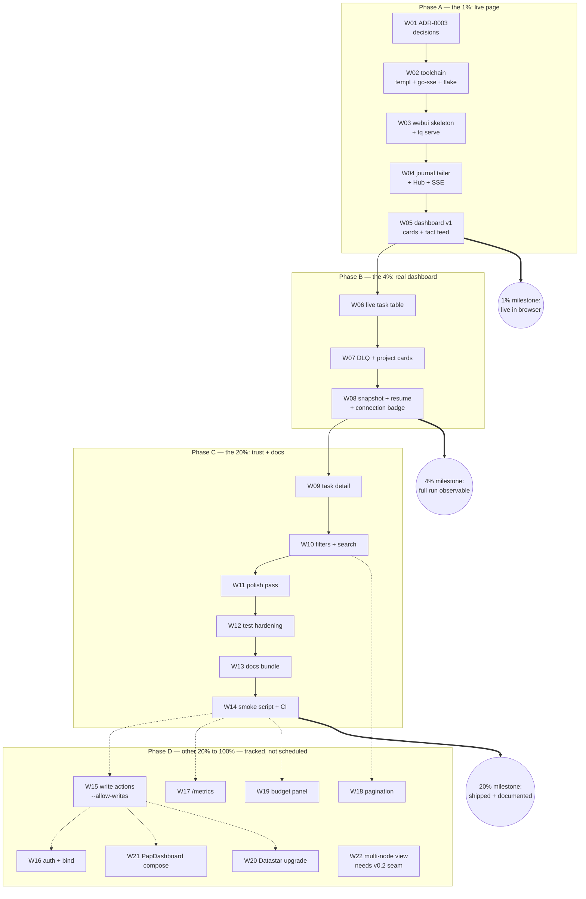

# SUPERB: Round 3 — Live Web UI over the Facts Projection

**Date:** 2026-09-07 16:25 CEST
**Status:** PLANNED (awaiting approval → EXECUTING)
**Scope:** Productionize the "Web UI over the projections" raw idea from
ROADMAP.md into a live-updating, read-only ops dashboard served by
`tq serve` — the go-taskqueue equivalent of samber-do-auditlog's `live/`
package. 22 coarse (30–100 min) + 76 fine (≤12 min) tasks, Pareto-ranked.
**Inputs:** ROADMAP.md raw ideas, FEATURES.md:90 (HTTP API 🟡),
examples/sse (D75, SSE + `Last-Event-ID` resume PoC), examples/api (stats +
metrics + polling page PoC), round-2 plan D95 ("Web UI spike over facts
projection", deferred), samber-do-auditlog `live/` reference implementation.
**Repo strategy:** same repo, one new internal package (`internal/webui`) +
one new CLI subcommand (`tq serve`). Zero changes to store schema, worker,
executor, or journal semantics.

---

## The Problem

The queue is only observable through the terminal: `tq stats` is a snapshot,
`tq top` is a refresh loop, `tq tail -f` is a firehose of JSON. During an
unattended agent-pool run there is no single place to *watch* the system
live — pending → running → completed/dead, DLQ growth, per-project progress.
The journal already contains everything needed (facts-first architecture:
queue views ARE projections); what is missing is a browser rendering of
those projections that updates itself.

Proven building blocks already exist:

| Building block                              | Where                                        | Status |
| ------------------------------------------- | -------------------------------------------- | ------ |
| Journal tailing (`Facts(ctx, after)`)       | `internal/queue` Store interface             | 🟢     |
| SSE with `Last-Event-ID` resume             | `examples/sse` (round-2 task D75)            | 🟢 PoC |
| Status counts + Prometheus text             | `examples/api`                               | 🟢 PoC |
| Single-tailer → fan-out watermark pattern   | `internal/bridge/papdashboard`               | 🟢     |
| Live dashboard reference (Hub + fragments)  | `samber-do-auditlog/live/`                   | 🟢     |

## Product Thesis (this round)

One command — `tq serve` — one browser tab: status cards, a live task
table, the DLQ, and the fact feed, updated by SSE within one poll interval,
reconnect-safe, driven by a single journal tailer fanning out
server-rendered HTML fragments. Read-only by construction: the UI is a pure
projection consumer and cannot corrupt the journal even if it bugs out.

**Non-goals (this round):** write actions from the UI (cancel/rescue/
enqueue — deferred, opt-in flag designed), auth/TLS for non-localhost
serving, the v0.2 "HTTP API for non-Go producers" arc, multi-node views,
replacing `tq` CLI views.

---

## Architecture (decided here, recorded in ADR-0003 by W01)

```text
journal (SQLite, facts) ──► tailer (1 goroutine, poll Facts(after), 500ms)
                                │ coalesced bursts
                                ▼
                              Hub (subscriber fan-out, sse.Broadcaster)
                                │ per-client SSE (id = fact Seq)
                                ▼
                     browser (vanilla JS EventSource)
                                │ patch-by-id
                                ▼
                     DOM fragments (server-rendered templ)
```

- **Projection, not client-side state**: on each coalesced burst the server
  re-queries `List` + status counts and re-renders every fragment. The
  client only swaps `innerHTML` by container id — no missed-event drift, no
  client-side reducer. A full snapshot ships on (re)connect.
- **Transport**: SSE (one-way flow, like auditlog `live/doc.go` argues);
  `Last-Event-ID` → `after` resume, exactly the D75 semantics.
- **Rendering**: `templ` fragments, generated `*_templ.go` **committed**
  (auditlog v0.9.0 retract lesson: Nix builds vendor source without codegen).
- **Client JS**: vanilla (~30 lines: EventSource + patch + badge). Datastar
  (56 KB vendored runtime) is deferred until interactive features demand
  signals; the server-rendered-fragment shape makes the swap cheap later.
- **Server**: stdlib `http.ServeMux` (Go 1.26 pattern routing, as in
  `examples/api`), `http.Server` WITH timeouts (kills the G114 class the
  PoCs carry), graceful shutdown on SIGINT.
- **New deps**: `github.com/larsartmann/go-sse` (pure Go, own lib, proven in
  auditlog; verify CGO-free in W02.2) + `a-h/templ` (tool directive +
  runtime import in generated files). Alternative if dep-minimalism wins at
  ADR time: hand-rolled hub (~80 lines) and/or `html/template` — both
  documented in the ADR as abort paths, both leave this plan's shape intact.

### Anti-verschlimmbesserung guardrails

1. **No store/schema/worker/executor changes.** No migrations. The
   single-writer `MaxOpenConns(1)` invariant is untouched; `serve` opens its
   own read-mostly connection (WAL + busy_timeout already handle
   multi-process, proven by the papdashboard bridge running beside workers).
2. **Read-only by default.** Worst failure mode is a stale dashboard, never
   a corrupted journal. Write endpoints only ever appear behind an explicit
   future `--allow-writes` flag (Phase D).
3. **examples/ stays PoC** — `tq serve` is the production path; examples are
   not "fixed" or migrated.
4. **TODO_LIST.md policy: this plan's tasks are NOT added there.** This
   repo's TODO_LIST is harvester pool food; ROADMAP open question #1 notes
   the repo deliberately has no `.crushrc`. Enqueueing 22 agent tasks here
   would burn money and collide with 5+ concurrent editing agents. Tasks
   live in this doc; HARVEST into TODO_LIST only by explicit owner decision.
5. **vendorHash dance** after go.mod changes (AGENTS known issue) — W02.3.
6. **golangci-lint is not a gate** — new code should be clean anyway, but
   the pre-existing example warnings are not mass-fixed.

---

## Pareto Breakdowns

### The 1% that delivers 51%

`tq serve` + one HTML page: status cards + live fact feed, SSE-driven.
(D95, productionized minimal.) **Exit:** with a worker running, open the
browser and watch tasks move live.

### The 4% that delivers 64%

1. Hub with multi-client fan-out + coalesced bursts (W04)
2. Live task table fragment (W06)
3. DLQ + per-project breakdown (W07)
4. Snapshot-on-(re)connect + resume + connection badge (W08)

**Exit:** an entire unattended agent-pool run observable end-to-end in one
tab; page refresh is seamless.

### The 20% that delivers 80%

1. Task detail view — per-task facts, the `tq show` of the browser (W09)
2. Filters/search — project, status, text (W10)
3. Polish — design pass, keyboard nav, empty states (W11)
4. Test hardening — SSE e2e, races, goldens, resume-under-load (W12)
5. Honest docs — README, FEATURES, ROADMAP sync, DOMAIN_LANGUAGE,
   CHANGELOG, AGENTS (W13)
6. Smoke script + CI wiring (W14)

### The other 20% to reach 100% (Phase D — tracked, not this round)

Write actions (cancel/rescue/enqueue buttons, `--allow-writes`, CSRF +
confirm) · auth/bind hardening for non-localhost · `/metrics` merged into
`tq serve` · pagination/virtualization for big tables · budget panel over
`internal/budget` · Datastar upgrade (conditional on interactivity growth) ·
PapDashboard question fan-out compose (v0.3 arc) · multi-node view (v0.2
Postgres seam).

---

## Coarse Plan (22 tasks, 30–100 min each)

Sorted by importance / impact / effort / customer-value within phases;
execute phases in order, tasks within a phase mostly in ID order.

### Phase A — The 1% (spike to live page)

| ID  | Task                                                             | Impact | Effort | Depends | Exit criteria                                                        |
| --- | ---------------------------------------------------------------- | ------ | ------ | ------- | -------------------------------------------------------------------- |
| W01 | ADR-0003: web UI architecture + tech decisions (templ, go-sse, vanilla JS, read-only) with alternatives & abort checkpoints | H      | 30m    | —       | `docs/adr/0003-*` merged; decisions table complete                   |
| W02 | Toolchain & deps: go-sse + templ tool directive, flake devShell, CGO-free proof, vendorHash dance, `*_templ.go` commit policy | H      | 45m    | W01     | `go build ./...`, `CGO_ENABLED=0 go build`, `nix build` all green     |
| W03 | `internal/webui` server skeleton + `tq serve` subcommand (flags `--addr 127.0.0.1:8090 --db --poll`), http.Server timeouts, graceful shutdown | H      | 60m    | W02     | `tq serve` serves `/`, `/api/stats`; Ctrl-C exits cleanly            |
| W04 | Journal tailer + Hub: single tailer polling `Facts(after)`, coalesced bursts, subscriber fan-out, SSE handler with resume + heartbeats, leak-free shutdown | H      | 90m    | W03     | 2+ SSE clients see facts <1s after append; `-race` clean             |
| W05 | Dashboard page v1: templ layout, status cards, fact feed fragment, vanilla SSE client, dark minimal CSS | H      | 90m    | W04     | browser shows live cards + feed during a worker run (1% exit)        |

### Phase B — The 4% (the real dashboard)

| ID  | Task                                                             | Impact | Effort | Depends | Exit criteria                                                        |
| --- | ---------------------------------------------------------------- | ------ | ------ | ------- | -------------------------------------------------------------------- |
| W06 | Live task table fragment: id, project, type, status, attempts, age, last error; sorting | H      | 60m    | W05     | table updates live; row count matches `tq stats`                     |
| W07 | DLQ fragment (dead tasks + errors) + per-project status cards    | M      | 45m    | W06     | DLQ mirrors `tq dlq`; cards mirror `tq top`                          |
| W08 | Snapshot-on-connect + `Last-Event-ID` resume e2e + connection badge | M      | 60m    | W07     | refresh/reconnect mid-run loses nothing (4% exit)                    |

### Phase C — The 20% (trustworthy, usable, documented)

| ID  | Task                                                             | Impact | Effort | Depends | Exit criteria                                                        |
| --- | ---------------------------------------------------------------- | ------ | ------ | ------- | -------------------------------------------------------------------- |
| W09 | Task detail view `/task/{id}`: full record + per-task fact timeline | M      | 60m    | W08     | detail matches `tq show` + `tq facts` for that task                  |
| W10 | Filters & search: `?project=&status=&q=`, server-side filtered List, search box, clear | M      | 60m    | W09     | filters narrow table + cards; URL is shareable                      |
| W11 | Polish: keyboard nav (tabs/search), time-ago + tooltips, empty states, favicon/title with counts, responsive | M      | 60m    | W10     | no rough edges in a 10-min passive watch                             |
| W12 | Test hardening: SSE e2e (enqueue→claim→complete → fragment assertions), hub race tests, golden fragment tests, resume-under-load, store-closed error paths | H      | 90m    | W11     | `go test ./... -race` green incl. new suite                          |
| W13 | Docs bundle: README section + quickstart, FEATURES row (honest status), ROADMAP raw-idea → v0.3 arc + link here, DOMAIN_LANGUAGE terms (projection, dashboard, serve), CHANGELOG entry, AGENTS serve notes | H      | 45m    | W12     | ghost-reference guard passes; all surfaces consistent               |
| W14 | Smoke script `scripts/smoke/webui.sh` (stub worker + serve + curl/SSE assertions, no browser needed) + CI wiring | M      | 45m    | W13     | script green locally and in CI (20% exit)                            |

### Phase D — The other 20% to 100% (tracked, not scheduled this round)

| ID  | Task                                                             | Impact | Effort | Depends | Notes                                                                |
| --- | ---------------------------------------------------------------- | ------ | ------ | ------- | -------------------------------------------------------------------- |
| W15 | UI write actions: cancel/rescue (+enqueue) behind `--allow-writes`, POST + confirm + CSRF story | H      | 100m   | W14     | must reuse Store mutations verbatim (facts stay source of truth)     |
| W16 | Auth/bind hardening: token or basic auth, non-localhost bind docs | M      | 60m    | W15     | prerequisite for any remote serving                                  |
| W17 | `/metrics` (Prometheus) merged from examples/api into `tq serve` | M      | 30m    | W14     | ROADMAP raw idea "Metrics endpoint"                                  |
| W18 | Pagination / windowing for large task tables                     | M      | 60m    | W10     | trigger: >2k tasks rendered                                          |
| W19 | Budget panel over `internal/budget` projections                  | L      | 45m    | W14     | pairs with agent-pool cost caps                                      |
| W20 | Datastar upgrade (conditional)                                   | L      | 45m    | W15     | only when interactive features outgrow vanilla JS                    |
| W21 | PapDashboard compose: question fan-out surfaces in both UIs      | M      | 100m   | W15     | v0.3 arc; needs decision-question-fanout design                      |
| W22 | Multi-node view (Postgres store seam, v0.2)                      | M      | 100m   | v0.2    | out of scope until the store seam lands                              |

---

## Fine Plan (76 tasks, ≤12 min each)

Every executable coarse task (Phases A–C) split into verifiable steps.
Phase D stays coarse-only this round (round-2 deferred-seed precedent).
"Gate" = `go build ./... && go vet ./... && go test ./... -race` (+
`nix build` where noted).

| ID     | Task (each ≤12m)                                                                        | Up to | Est |
| ------ | ---------------------------------------------------------------------------------------- | ----- | -- |
| W01.1  | Draft ADR-0003 skeleton: problem, context, read-only projection architecture diagram      | W01   | 12 |
| W01.2  | ADR decision table: templ vs html/template, go-sse vs hand-rolled, vanilla vs Datastar; defaults + abort checkpoints | W01 | 12 |
| W01.3  | ADR self-review pass, commit                                                             | W01   | 6  |
| W02.1  | `go get github.com/larsartmann/go-sse`; add `tool github.com/a-h/templ/cmd/templ`; `go mod tidy` | W02 | 12 |
| W02.2  | Prove dep tree CGO-free: `go list -deps` inspection + `CGO_ENABLED=0 go build ./...`      | W02   | 12 |
| W02.3  | flake devShell: add templ; vendorHash fakeHash dance (`nix build` → copy `got:`)          | W02   | 12 |
| W02.4  | AGENTS.md convention note: `*_templ.go` is committed (auditlog v0.9.0 retract lesson)     | W02   | 6  |
| W02.5  | Full gate + `nix build`; commit toolchain state                                           | W02   | 12 |
| W03.1  | `internal/webui` package doc + `Server` struct + `New(store)` + route table (`/`, `/api/events`, `/api/stats`) | W03 | 12 |
| W03.2  | Index handler serving embedded HTML (placeholder layout)                                  | W03   | 12 |
| W03.3  | `tq serve` subcommand: `--addr` (default `127.0.0.1:8090`), `--db`, `--poll`; usage text  | W03   | 12 |
| W03.4  | `http.Server` with Read/Header/Write/Idle timeouts + SIGINT graceful shutdown            | W03   | 12 |
| W03.5  | `serve_test.go`: httptest `/` HTML + `/api/stats` JSON shape                              | W03   | 12 |
| W03.6  | Gate; commit skeleton                                                                     | W03   | 12 |
| W04.1  | Hub: subscribe/unsubscribe/broadcast over `sse.Broadcaster`, buffer 128; 2-subscriber test | W04  | 12 |
| W04.2  | Tailer goroutine: poll `Facts(after)` every `--poll`, advance watermark; test with temp SQLite DB | W04 | 12 |
| W04.3  | Burst coalescing (drain-then-notify-once); test N facts → 1 notification                  | W04   | 12 |
| W04.4  | `/api/events` SSE handler: headers, `id:` = Seq, `Last-Event-ID` → after, 15s heartbeats  | W04   | 12 |
| W04.5  | Shutdown propagation: tailer + hub stop with server context; no goroutine leak            | W04   | 12 |
| W04.6  | Multi-client race test (3 clients, `-race`)                                               | W04   | 12 |
| W04.7  | Gate; commit hub                                                                          | W04   | 12 |
| W05.1  | `layout.templ`: page skeleton, header, fragment containers with stable ids                | W05   | 12 |
| W05.2  | Stats-cards fragment from `List` counts; golden test                                       | W05   | 12 |
| W05.3  | Fact-feed fragment: ring of last N facts, formatted                                        | W05   | 12 |
| W05.4  | Burst renderer: re-query List + counts, render all fragments server-side                  | W05   | 12 |
| W05.5  | `sse.js` vanilla client: EventSource, patch-by-id, reconnect badge                         | W05   | 12 |
| W05.6  | `dashboard.css`: dark minimal, house aesthetic                                             | W05   | 12 |
| W05.7  | Live smoke: worker + `tq serve` side by side; updates appear <2s                           | W05   | 12 |
| W05.8  | Gate; commit dashboard v1 (1% milestone)                                                  | W05   | 12 |
| W06.1  | Task-row fragment: id, project, type, status, attempts, age, lastError                    | W06   | 12 |
| W06.2  | Table fragment + default sort (status, then age desc)                                     | W06   | 12 |
| W06.3  | Formatting helpers: age/duration humanize, error tail truncation with title tooltip       | W06   | 12 |
| W06.4  | Wire table into burst renderer + client patch                                             | W06   | 12 |
| W06.5  | Test: table row count == `List` count for seeded DB; gate; commit                         | W06   | 12 |
| W07.1  | DLQ fragment: dead tasks + lastError + attempts                                           | W07   | 12 |
| W07.2  | Per-project status cards (reuse `tq top` aggregation shape)                                | W07   | 12 |
| W07.3  | Layout: sections/tabs for cards, table, DLQ, feed                                         | W07   | 12 |
| W07.4  | Test: DLQ mirrors `Filter{Status: dead}`; gate; commit                                    | W07   | 12 |
| W08.1  | Full-snapshot SSE event on connect (all fragments pre-rendered)                           | W08   | 12 |
| W08.2  | e2e resume test: disconnect mid-run, reconnect with Last-Event-ID, assert no gap          | W08   | 12 |
| W08.3  | Connection badge states: live / reconnecting / stale (no events > N s)                    | W08   | 12 |
| W08.4  | Gap fallback: unknown Last-Event-ID → full snapshot, not partial                          | W08   | 12 |
| W08.5  | Gate; commit (4% milestone)                                                               | W08   | 12 |
| W09.1  | `/task/{id}` route + handler (Get + 404 shape)                                            | W09   | 12 |
| W09.2  | Facts-for-task query: filter journal by TaskID (server-side scan of Facts)                | W09   | 12 |
| W09.3  | Detail fragment: full task record + fact timeline                                         | W09   | 12 |
| W09.4  | Link table rows → detail (plain link; works without JS)                                   | W09   | 12 |
| W09.5  | Test: detail matches `Get` + filtered facts; gate; commit                                 | W09   | 12 |
| W10.1  | Filter state in URL: `?project=&status=&q=`; server-side filtered List                    | W10   | 12 |
| W10.2  | Search box (substring over type/payload/id/project)                                       | W10   | 12 |
| W10.3  | Filter chips + clear-all control                                                          | W10   | 12 |
| W10.4  | Filters compose with burst re-render (URL as source of truth)                             | W10   | 12 |
| W10.5  | Test: filtered table matches CLI `tq stats --project`; gate; commit                       | W10   | 12 |
| W11.1  | Keyboard nav: 1–4 section jump, `/` focus search, `?` help hint                           | W11   | 12 |
| W11.2  | Time-ago utility + absolute timestamps on hover                                           | W11   | 12 |
| W11.3  | Empty states (no tasks / no DLQ / no facts) with copy                                     | W11   | 12 |
| W11.4  | Favicon + `<title>` with live counts (`tq — 3 running`)                                   | W11   | 12 |
| W11.5  | Responsive check (narrow window), overflow handling for long payloads                     | W11   | 12 |
| W11.6  | Gate; commit polish                                                                       | W11   | 12 |
| W12.1  | SSE e2e test: enqueue→claim→complete drives fragment content assertions                   | W12   | 12 |
| W12.2  | Hub race test: concurrent subscribe/broadcast/unsubscribe under `-race`                   | W12   | 12 |
| W12.3  | Golden tests for every fragment (fixed seed DB)                                           | W12   | 12 |
| W12.4  | Resume-under-load: 100-fact backlog, reconnect, all applied once                          | W12   | 12 |
| W12.5  | Error paths: store closed mid-stream, malformed Last-Event-ID                             | W12   | 12 |
| W12.6  | Full `go test ./... -race` + `nix build`; commit test suite                               | W12   | 12 |
| W13.1  | README: "Web UI" section, `tq serve` quickstart, screenshot                                                               | W13   | 12 |
| W13.2  | FEATURES.md: web UI row with honest status + details                                      | W13   | 12 |
| W13.3  | ROADMAP: move raw idea → v0.3 arc, link this plan                                         | W13   | 12 |
| W13.4  | DOMAIN_LANGUAGE: projection, dashboard, tailer, hub, fragment, serve                      | W13   | 12 |
| W13.5  | CHANGELOG: unreleased entry for `tq serve`                                                | W13   | 12 |
| W13.6  | AGENTS.md: `tq serve` row in package table + known-issue notes; commit docs (20% milestone) | W13 | 12 |
| W14.1  | `scripts/smoke/webui.sh`: stub worker + serve + curl SSE assertions                        | W14   | 12 |
| W14.2  | Make script browser-free and CI-safe (timeouts, temp DB, cleanup)                         | W14   | 12 |
| W14.3  | Wire into CI workflow next to existing smoke scripts                                      | W14   | 12 |
| W14.4  | Ghost-reference guard passes (all doc paths cited exist)                                  | W14   | 12 |
| W14.5  | Final full gate + `nix flake check`; commit (round exit)                                  | W14   | 12 |

**Sums:** Phase A 315m · Phase B 165m · Phase C 360m · **840m ≈ 14h**
executable this round (fine sum ≈ 836m, consistent). Phase D ≈ 600m future
work, tracked above.

---

## Execution Graph



Dotted edges are future-round dependencies, not this round's work.

## Verification Protocol (every task)

1. `go build ./...` — compile
2. `go vet ./...` — static
3. `go test ./... -race` — behavioral (the standard gate from AGENTS.md)
4. `nix build` — after toolchain/go.mod changes (plus vendorHash dance)
5. Task-specific exit criterion from the tables above
6. `git status` before committing — parallel agents may have landed changes;
   read them, build on them, never revert

## Owner Decision Points

1. **ADR-0003 defaults** (W01): templ + go-sse + vanilla JS as recommended,
   or the documented minimal-dep abort paths (html/template, hand-rolled
   hub)? Checkpoint before W02 executes.
2. **Phase D scheduling**: which of W15–W22 go into the next round?
3. **TODO_LIST.md policy confirmation**: tasks intentionally NOT harvested
   into TODO_LIST.md (guardrail #4). Override only if the pool should
   actually chew on this repo.
