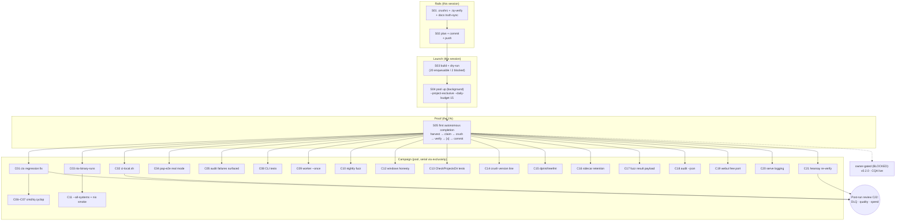

# SUPERB: Round 4 — Dogfood: the Pool Eats This Repo

**Date:** 2026-09-07 20:47 CEST
**Status:** EXECUTING (owner-directed: "run go-taskqueue on ~/projects/go-taskqueue itself")
**Scope:** Turn this repo into the first real tenant of its own agent pool —
`.crushrc` + `.tq-verify` rails, a budget-capped `tq agent-pool --repos
~/projects/go-taskqueue` running against the fresh 22-item TODO_LIST, with the
first autonomous completion proven live. This ANSWERS ROADMAP Open question #1
("should the pool work on go-taskqueue itself?": YES).
**Inputs:** TODO_LIST.md (22 open items, 2 owner-BLOCKED), AGENTS.md known
issues, ROADMAP Open questions, the 20:32 docs-health status report,
`docs/adr/0002-agent-pool-autonomy-pacing-drain.md`.
**Format note:** the pareto-planning skill defaults to a styled HTML report;
the owner's instruction explicitly requires `.md` with a mermaid/d2 graph —
this file is Markdown (same override as rounds 1–3).

---

## The Problem

The queue works, the pool works, and this repo's TODO_LIST was just rebuilt
into 22 verified, evidence-cited items — but they are worked by humans and
ad-hoc sessions, not by the system's own pool. The ROADMAP deliberately kept
this repo out of the pool's menu ("no `.crushrc`, 5+ concurrent agents
already edit it"). The owner has now called that question: dogfood it. The
risk is real (concurrent writers, autonomous commits on master), which is
exactly why the run must be rails-first, budget-capped, and exclusive.

## Product Thesis (this round)

One repo-local `.crushrc` grants agents the minimum autonomy; one
`.tq-verify` pins how work is proven (the same hard gates CI enforces); one
`agent-pool` process with `--project-exclusive --concurrency 2 --daily-budget
15 --max-per-tick 3 --dlq-backoff 30m` eats the TODO_LIST serially, one agent
per repo, never pushing. The first autonomous completion (harvest → claim →
agent works → verify green → checkbox ticked → commit → completed fact) is
the 1% exit. Everything else is pacing, observability, and honest docs.

**Non-goals (this round):** any store/worker/executor semantic changes;
harvesting ANY other repo in `~/projects` (the pool is pinned with `--repos`
to this repo only); pushing from agents (prompt contract: commit, never
push); the v0.2.0 release and CQA live verification (owner-gated, BLOCKED in
TODO_LIST); modifying the auto-commit daemon.

### Anti-verschlimmbesserung guardrails

1. **Minimum autonomy**: `.crushrc` grants exactly
   `permissions allow view ls grep glob edit write bash` — the README line,
   no more. The pool cannot over-grant what the repo never offered.
2. **Verify = CI hard gates**: `.tq-verify` = `go build && go vet && go test
   -race && gofmt clean`. An agent that breaks the build or formats badly
   fails its verify and dead-letters — visible in `tq dlq`, not silent.
3. **Serialization**: all harvested tasks carry project `go-taskqueue`;
   `--project-exclusive` means ONE agent works in this repo at any time,
   across ALL pools sharing the DB (the feature gets its first real workout).
4. **Cost ceilings**: `--max-per-tick 3` (≤3 new tasks per harvest tick),
   `--daily-budget 15` (journal-projected daily cap), `--repo-interval
   go-taskqueue=10m` (enqueue pacing), `--dlq-backoff 30m` (a poisoned repo
   pauses instead of burning money).
5. **Agents never push** (agent contract); the human/daemon owns master.
6. **The queue DB is `./tasks.db` (gitignored)** — dogfood-pure, no new
   infrastructure; WAL + busy_timeout already make multi-process safe.
7. **Known accepted risk**: an agent could edit `.crushrc`/TODO_LIST itself
   (self-modifying autonomy). Mitigations: the prompt contract ("smallest
   correct change"), reviewable commits on master, budget caps bounding the
   blast radius. Watch for it in the post-run review.

---

## Pareto Breakdowns

### The 1% that delivers 51%

Rails + launch + ONE autonomous completion: `.crushrc` + `.tq-verify` +
`agent-pool --repos ~/projects/go-taskqueue --yolo` in the background, and a
TODO item goes from `[ ]` to `[x]` by an agent, verified by `.tq-verify`,
committed, recorded as a `task.completed` fact. **Exit:** `tq facts` shows the
full lifecycle for a real item; `TODO_LIST.md` has one fewer open box.

### The 4% that delivers 64%

1. Live observability during the run (`tq stats` / `tq top` / `tq serve`)
2. The DLQ path exercised for real if an agent fails verify (poisoned-repo
   backoff proven, not theoretical)
3. Docs truth-sync: ROADMAP OQ#1 answered inline; AGENTS.md carries the
   dogfood facts (rails, flags, how to stop the pool)

### The 20% that delivers 80%

The pool chews the whole unblocked TODO_LIST serially — the top
impact-ranked items first (ctx regression fix, ci-local.sh, flake
binary-runs check, pap-e2e real mode, audit swallow fix) — with the
campaign's progress visible in `tq top` and the TODO_LIST shrinking.

### The other 20% to reach 100%

Post-run review (agent quality vs AGENTS.md contract, scope creep check,
`.crushrc` self-modification check), DLQ rescue flow if needed, budget
telemetry, multi-day unattended ops via the systemd user unit, and the
owner-gated items (v0.2.0, CQA) once the dogfood proves the loop.

---

## Coarse Plan (24 tasks, 30–100 min each)

Sorted by execution order: S-rows are THIS session's setup (human/agent,
now); C-rows are the pool campaign (executed serially by agents under
exclusivity; IDs map to TODO_LIST items). Owner-gated items are NOT enqueued
(BLOCKED) and listed for completeness.

| ID      | Task                                                                                                                                                                                                                                                                                                        | Who         | Impact | Effort  | Depends | Exit criteria                                                      |
| ------- | ----------------------------------------------------------------------------------------------------------------------------------------------------------------------------------------------------------------------------------------------------------------------------------------------------------- | ----------- | ------ | ------- | ------- | ------------------------------------------------------------------ |
| S01     | Dogfood rails: `.crushrc` (min permissions), `.tq-verify` (CI hard gates), ROADMAP OQ#1 answered inline, AGENTS.md dogfood facts                                                                                                                                                                            | session     | 10     | 30m     | —       | files committed; docs carry no "no .crushrc" lie                   |
| S02     | Plan doc (this file) + commit + push (incl. the 7 unpushed daemon commits — owner authorized push)                                                                                                                                                                                                          | session     | 9      | 30m     | S01     | origin/master = HEAD; push watched                                 |
| S03     | Build `./tq`, `tq harvest --dry-run --repos ~/projects/go-taskqueue` parses 22 items (2 BLOCKED excluded)                                                                                                                                                                                                   | session     | 9      | 30m     | S02     | dry-run lists 20 enqueuable items                                  |
| ~~S04~~ | ~~Launch `tq agent-pool --repos ~/projects/go-taskqueue --yolo --project-exclusive --concurrency 2 --max-per-tick 3 --daily-budget 15 --repo-interval go-taskqueue=10m --dlq-backoff 30m` in background~~ done — budget 15 practice-superseded: round-9 window raised it to 30 (owner ratification pending) | ~~session~~ | ~~10~~ | ~~30m~~ | ~~S03~~ | ~~pool process up; first tasks enqueued + claimed~~                |
| S05     | First autonomous completion proven live (harvest → claim → crush works → `.tq-verify` green → `[x]` → commit → completed fact)                                                                                                                                                                              | pool        | 10     | 45m     | S04     | `tq facts` shows the full lifecycle; TODO_LIST box ticked by agent |
| C01     | Fix papdashboard watermark ctx regression + pre-cancelled-ctx test (TODO #2)                                                                                                                                                                                                                                | pool        | 10     | 60m     | S05     | `.tq-verify` green; regression test pinned                         |
| C02     | `scripts/ci-local.sh` replicating the CI sequence + AGENTS/CONTRIBUTING wiring (TODO #1)                                                                                                                                                                                                                    | pool        | 10     | 100m    | S05     | script runs the exact ci.yml gates; docs reference it              |
| C03     | `checks.nix-binary-runs` in flake.nix (TODO #3)                                                                                                                                                                                                                                                             | pool        | 9      | 30m     | S05     | `nix flake check` executes the built binary                        |
| C04     | Fix `papdashboard-e2e.sh` real-dashboard mode (TODO #6)                                                                                                                                                                                                                                                     | pool        | 8      | 60m     | S05     | PAP_URL mode no longer greps the stub log                          |
| C05     | `harvest.Audit` per-repo failure reporting + lying comment fix (TODO #7)                                                                                                                                                                                                                                    | pool        | 8      | 45m     | S05     | scan failures surface as Skipped entries; tests                    |
| C06     | cmd/tq cyclop: extract `cmdHarvest` (TODO #8a)                                                                                                                                                                                                                                                              | pool        | 7      | 60m     | S05     | cyclop ≤ threshold; behavior unchanged                             |
| C07     | cmd/tq cyclop: `aggregateTop`, `cmdStats`, `cmdDLQ` (TODO #8b)                                                                                                                                                                                                                                              | pool        | 7      | 100m    | C06     | same pattern; `-race` green                                        |
| C08     | CLI-level tests: audit golden output, dispatch exit codes, `splitRepos` tables (TODO #9)                                                                                                                                                                                                                    | pool        | 8      | 100m    | S05     | new tests in `cmd/tq`; `-race` green                               |
| C09     | `tq worker --once` (TODO #10)                                                                                                                                                                                                                                                                               | pool        | 8      | 60m     | S05     | one-shot drain mode; smoke + e2e updated                           |
| C10     | Nightly fuzz job + `testdata/fuzz` corpus seeds (TODO #11)                                                                                                                                                                                                                                                  | pool        | 6      | 60m     | S05     | scheduled job config committed; seeds present                      |
| C11     | `nix flake check --all-systems` + smoke the nix binary through webui.sh (TODO #12)                                                                                                                                                                                                                          | pool        | 7      | 60m     | C03     | recorded result; smoke runs the nix binary                         |
| C12     | Windows honesty: `//go:build unix` markers on POSIX-only tests (TODO #13)                                                                                                                                                                                                                                   | pool        | 6      | 60m     | S05     | compile gate no longer overclaims                                  |
| C13     | `TestCheckProjectsDir` unit tests (TODO #14)                                                                                                                                                                                                                                                                | pool        | 5      | 30m     | S05     | refusal guard CI-tested                                            |
| C14     | D91-lite: `crush --version` in pool startup line (TODO #15)                                                                                                                                                                                                                                                 | pool        | 5      | 30m     | S05     | version logged; warn on missing binary                             |
| C15     | dprint into treefmt OR a formal manual-formatting decision note (TODO #16)                                                                                                                                                                                                                                  | pool        | 4      | 30m     | S05     | one of the two outcomes committed                                  |
| C16     | Sidecar retention: `--log-dir-max-age`/size cap + plaintext warning (TODO #17)                                                                                                                                                                                                                              | pool        | 5      | 60m     | S05     | flags + tests + docs                                               |
| C17     | Fuzz `ExtractResultPayload` + corpus (TODO #18)                                                                                                                                                                                                                                                             | pool        | 6      | 60m     | S05     | fuzz target committed; 30s campaign clean                          |
| C18     | `tq audit --json` + `--todo-file/--type/--max-attempts` (TODO #19)                                                                                                                                                                                                                                          | pool        | 5      | 60m     | S05     | flags smoke-verified                                               |
| C19     | Free-port selection in `webui.sh` (TODO #20)                                                                                                                                                                                                                                                                | pool        | 4      | 30m     | S05     | no fixed 8095; smoke green                                         |
| C20     | Request-logging option for `tq serve` (TODO #21)                                                                                                                                                                                                                                                            | pool        | 4      | 45m     | S05     | `--verbose`/slog handler; smoke green                              |
| C21     | Re-verify the 5 hearsay-routed TODO items against code (TODO #22)                                                                                                                                                                                                                                           | pool        | 5      | 30m     | S05     | each item confirmed or corrected in TODO_LIST                      |
| C22     | Post-run review: DLQ sweep, agent-quality vs AGENTS.md contract, `.crushrc` self-modification check, budget telemetry notes                                                                                                                                                                                 | session     | 8      | 60m     | C01+    | review notes in a status report; rescues if needed                 |

**Owner-gated (NOT enqueued — `— BLOCKED:` in TODO_LIST):** v0.2.0 cut · CQA
live verification. **Not in any queue:** the other ~295 repos in
`~/projects` (pool is `--repos`-pinned to this repo).

**26 rows incl. 2 owner-gated · campaign ≈ 26h of serial agent work · the
daily budget (15) paces it across ~2 days by design.**

---

## Fine Plan (≤ 12 min tasks)

Setup fine-steps (S-rows, this session) + per-campaign fine-steps (the agent
executes these under its TODO-item prompt; the table documents expected steps
and exit criteria).

| ID    | Task (each ≤12m)                                                                                           | Up to | Est |
| ----- | ---------------------------------------------------------------------------------------------------------- | ----- | --- |
| S01.1 | Write `.crushrc`: `permissions allow view ls grep glob edit write bash`                                    | S01   | 2   |
| S01.2 | Write `.tq-verify`: build + vet + race tests + gofmt clean                                                 | S01   | 3   |
| S01.3 | ROADMAP OQ#1: inline-annotate ANSWERED (pool on this repo, rails, flags)                                   | S01   | 4   |
| S01.4 | AGENTS.md: add dogfood known-issue (rails, launch command, how to stop, TODO_LIST is live pool food)       | S01   | 6   |
| S01.5 | Confirm `.gitignore` covers `*.db/*.db-wal/*.db-shm` (verified) and `.crushrc`/`.tq-verify` are tracked    | S01   | 2   |
| S02.1 | Write this plan doc with mermaid graph                                                                     | S02   | 12  |
| S02.2 | `git status` → stage rails + plan → detailed commit                                                        | S02   | 4   |
| S02.3 | `git push` (incl. unpushed daemon commits) → `git ls-remote` verify                                        | S02   | 3   |
| S03.1 | `go build -o ./tq ./cmd/tq`                                                                                | S03   | 1   |
| S03.2 | `./tq harvest --dry-run --repos ~/projects/go-taskqueue` → expect 20 enqueuable / 2 blocked                | S03   | 3   |
| S03.3 | Confirm working tree clean (agents refuse dirty repos)                                                     | S03   | 2   |
| S04.1 | Launch the pool in background with the S04 flags (TQ_DB default `./tasks.db`)                              | S04   | 3   |
| S04.2 | Watch `./tq stats` + `./tq facts` until first `task.enqueued` + `task.claimed` for project go-taskqueue    | S04   | 8   |
| S05.1 | Observe the first agent run (heartbeat facts, `tq top` last-dur)                                           | S05   | 12  |
| S05.2 | Confirm `.tq-verify` ran (verify tail in `task.completed` detail) and the checkbox got ticked by the agent | S05   | 6   |
| S05.3 | Confirm the agent's commit landed on master (never pushed) and the TODO_LIST diff is ONLY the ticked box   | S05   | 6   |
| S05.4 | `tq serve` spot-check: the run visible in the dashboard (optional, read-only)                              | S05   | 6   |
| C01.1 | Reproduce: cancel ctx before `Bridge.Run`, observe the misleading "cannot read journal head"               | C01   | 12  |
| C01.2 | Guard `ctx.Err()` after `startWatermark`; return clean nil                                                 | C01   | 6   |
| C01.3 | Test: cancelled-before-Run returns nil; bridge tests `-count=1`                                            | C01   | 12  |
| C02.1 | Script skeleton: exact ci.yml test-job steps in order, raw exit codes, no pipes without pipefail           | C02   | 12  |
| C02.2 | Tracked-tree assertion (`git status --porcelain` empty) before nix build + flake check                     | C02   | 8   |
| C02.3 | Run it green locally; wire into AGENTS.md + CONTRIBUTING as the pre-push gate                              | C02   | 12  |
| C03.1 | Flake check `nix-binary-runs`: build → `test -x result/bin/tq` → run `--help`                              | C03   | 10  |
| C03.2 | `nix flake check` green with the new check; vendorHash untouched                                           | C03   | 8   |
| C04.1 | Real-mode assertions: read alerts from the live dashboard (or split scripts per mode)                      | C04   | 12  |
| C04.2 | Stub mode still green; document both modes in the header                                                   | C04   | 8   |
| C05.1 | `auditRepo` failures → Skipped entries (Run-parity); fix the comment                                       | C05   | 10  |
| C05.2 | Drift tests: unreadable repo reported, audit continues                                                     | C05   | 12  |
| C06.1 | Extract harvest flag parsing/report into helpers; `cmdHarvest` complexity down                             | C06   | 12  |
| C06.2 | Behavior-parity smoke (JSON output shape unchanged)                                                        | C06   | 8   |
| C07.1 | Extract `aggregateTop` helpers; C07.2 `cmdStats`; C07.3 `cmdDLQ` (same pattern, one commit each)           | C07   | 36  |
| C08.1 | Golden-output test for `tq audit` drift report                                                             | C08   | 12  |
| C08.2 | Dispatch test: unknown command / help exit codes                                                           | C08   | 8   |
| C08.3 | Table tests for `splitRepos` (empty, spaces, trailing comma)                                               | C08   | 8   |
| C09.1 | `--once` flag on worker: claimable-drain then exit                                                         | C09   | 12  |
| C09.2 | e2e: `worker --once` completes a stub task and exits 0                                                     | C09   | 12  |
| C10.1 | Scheduled CI job: `go test -fuzz FuzzParseRepo -fuzztime 60s`                                              | C10   | 12  |
| C10.2 | Commit corpus seeds; document the cadence                                                                  | C10   | 8   |
| C11.1 | `nix flake check --all-systems` result recorded                                                            | C11   | 12  |
| C11.2 | webui.sh gains an optional `TQ_BIN` override; smoke the nix binary                                         | C11   | 12  |
| C12.1 | Identify POSIX-only tests (SIGKILL, subprocess signals)                                                    | C12   | 6   |
| C12.2 | `//go:build unix` markers + GOOS=windows build still green                                                 | C12   | 10  |
| C13.1 | Unit tests: `--projects-dir /` and `$HOME` refused with remediation                                        | C13   | 12  |
| C14.1 | Pool startup: run `crush --version`, log it, warn if missing                                               | C14   | 10  |
| C14.2 | Test: stub bin prints version → startup line carries it                                                    | C14   | 8   |
| C15.1 | Either wire dprint into treefmt (md/json) or commit the decision note                                      | C15   | 12  |
| C16.1 | `--log-dir-max-age` / size-cap flags on the sidecar writer                                                 | C16   | 12  |
| C16.2 | Docs: sidecars are plaintext, may contain repo paths                                                       | C16   | 6   |
| C17.1 | `FuzzExtractResultPayload` + seeds (hostile regex input)                                                   | C17   | 12  |
| C18.1 | `tq audit --json` + `--todo-file/--type/--max-attempts` parity flags                                       | C18   | 12  |
| C19.1 | webui.sh: derive a free port instead of fixed 8095                                                         | C19   | 10  |
| C20.1 | `tq serve --verbose` request logging via slog handler                                                      | C20   | 12  |
| C21.1 | For each hearsay item: grep the code, confirm or correct TODO_LIST                                         | C21   | 12  |
| C22.1 | Post-run review notes: DLQ sweep, agent quality, `.crushrc` untouched, spend vs budget                     | C22   | 12  |

**Sums:** setup ≈ 80m · campaign ≈ 26h serial agent work (budget-paced across
days) · review ≈ 1h.

---

## Execution Graph



Campaign edges are pacing, not dependencies: exclusivity serializes
execution; the pool picks items in claim order (priority, then FIFO).

## Launch Command (the dogfood, verbatim)

```sh
go build -o ./tq ./cmd/tq
./tq harvest --dry-run --repos ~/projects/go-taskqueue   # 20 enqueuable / 2 BLOCKED
./tq agent-pool \
  --repos ~/projects/go-taskqueue \
  --yolo --project-exclusive --concurrency 2 \
  --interval 5m --task-timeout 45m \
  --max-per-tick 3 --daily-budget 15 \
  --repo-interval go-taskqueue=10m --dlq-backoff 30m
# observe (separate terminal):
./tq stats && ./tq top --once && ./tq facts | tail
./tq serve    # http://127.0.0.1:8090 (read-only)
# stop: Ctrl-C (graceful drain lets in-flight agents finish) or kill the bg job
```

`TQ_AGENT_BIN` stays UNSET — this is the real-crush run (that is the point).
The queue DB is the default `./tasks.db` (gitignored).

## Verification Protocol (every task, human and agent)

1. The agent's work is proven by `.tq-verify`: `go build ./... && go vet ./...`
   `&& go test ./... -count=1 -race -timeout 180s && test -z "$(gofmt -l .)"`
   — the same hard gates CI enforces (minus nix/smoke/doc-refs).
2. Human-side checks per observation cycle: `tq stats` (pending/running/dead
   counts), `tq facts | tail` (lifecycle facts), `tq dlq` (verify-failures
   with output tails), `git log --oneline` (agent commits, never pushes),
   `git status` (TODO_LIST ticks).
3. If a repo-poison pattern appears (recent work all dead): `--dlq-backoff
   30m` pauses automatically; the human reviews `tq dlq` and rescues or
   cancels — never let the pool refill a poisoned repo.

## Owner Decision Points

1. **Daily budget 15** — raise/lower? (20 items are enqueuable; the cap paces
   the campaign across ~2 days.)
2. **Model pin** — default crush model is used; pass `--model
   provider/model` to pin a cheaper/better one.
3. **Persistence** — after this supervised first run: keep the background
   pool, hand it to the systemd user unit
   (`deploy/systemd/tq-agent-pool.service`), or stop after the review?

## Relation to prior rounds

Round 1 built the queue, round 2 hardened the pool, round 3 built the web UI
— all proven with stubs and smokes. Round 4 is the first time the system eats
its own backlog with real agents, which is the strongest possible end-to-end
test of every guardrail built so far (dedup keys, exclusivity, budgets,
preflight, verify gates, DLQ backoff, BLOCKED markers).
