# Superb Plan — Round 5: Pareto Execution of the 100 Improvement Ideas

> **Point-in-time plan**, written 2026-09-07 23:51 CEST. Raw material: the
> 100-idea improvement catalog distilled from tonight's sessions, status
> reports, TODO_LIST, FEATURES, ROADMAP and AGENTS.md known issues
> (reproduced in Appendix A so this document is self-contained).
> Method: pareto-planning skill — identify the 1% that delivers 51%, the 4%
> that delivers 64%, the 20% that delivers 80%, and keep the other 80% of
> items for the last 20% of value. Commit **and push** explicitly authorized
> by the owner for this plan artifact.

---

## 0. Context (state at planning time)

| Fact                       | Value                                                                                                                                                                                                                                                 |
| -------------------------- | ----------------------------------------------------------------------------------------------------------------------------------------------------------------------------------------------------------------------------------------------------- |
| HEAD                       | `424f212` (master, **6 commits ahead of origin — unpushed**)                                                                                                                                                                                          |
| Working tree               | clean (auto-commit daemon + agent pool swept everything)                                                                                                                                                                                              |
| Agent pool                 | PID 3117483, dogfooding this repo, `--yolo --project-exclusive`, budget-capped                                                                                                                                                                        |
| LAN dashboard              | PID 3654482, **still the OLD pre-redesign binary**                                                                                                                                                                                                    |
| New since the 23:08 report | Agent pool shipped the nightly fuzz job (`.github/workflows/fuzz.yml`, `scripts/fuzz/nightly.sh`, 165 committed seeds, `cd9b2c9`) — TODO_LIST's fuzz item is DONE; this plan re-scopes fuzz work to `unwrapCommand`/`ExtractResultPayload` (M26/F140) |
| Fresh verification         | build/vet/tests green as of the 23:08 report; re-run before push (§5)                                                                                                                                                                                 |

Sources read before planning: `AGENTS.md`, `TODO_LIST.md`, `FEATURES.md`,
`ROADMAP.md`, `docs/status/2026-09-07_23-08_webui-templ-components-redesign-ledger-and-lamp.md`
(sections e/f), `docs/adr/0003-web-ui-architecture.md`, prior round plans in
`docs/planning/`.

---

## 1. Pareto Breakdown

The 100 ideas split into four value tiers. **The 1% is five ideas; do those
first, in order, before anything else.**

| Tier | Share of value | Ideas (Appendix A numbering)                                                                                                                                                                     | Count |
| ---- | -------------- | ------------------------------------------------------------------------------------------------------------------------------------------------------------------------------------------------ | ----- |
| 1%   | **~51%**       | 1 (bounded journal reads), 2 (SQL search pushdown), 11 (W16 serve auth), 19 (systemd pool), 20 (pool persistence)                                                                                | 5     |
| 4%   | **→ 64%**      | 3, 4, 12, 13, 21, 29, 30, 31, 43, 48, 58, 70, 82, 83, 93, 96                                                                                                                                     | 16    |
| 20%  | **→ 80%**      | 5, 6, 9, 23, 24, 25, 26, 27, 28, 32, 33, 34, 36, 39, 42, 44, 45, 46, 47, 49, 50, 51, 54, 55, 61, 64, 77, 80, 89, 100                                                                             | 30    |
| Tail | **→ 100%**     | 7, 8, 10, 14, 15, 16, 17, 18, 22, 35, 37, 38, 40, 41, 52, 53, 56, 57, 59, 60, 62, 63, 65, 66, 67, 68, 69, 71, 72, 73, 74, 75, 76, 78, 79, 81, 84, 85, 86, 87, 88, 90, 91, 92, 94, 95, 97, 98, 99 | 49    |

Why these are the 1%: (1) every webui render currently rescans the ENTIRE
journal (`render.go:180`) and (2) every search full-scans tasks in memory —
both are O(N) walls that get worse every day the pool runs; (3) the LAN
dashboard exposes payloads with zero auth; (4)+(5) the pool that eats this
repo dies with the terminal session and restarts with drifted flags.

---

## 2. Comprehensive Plan — 27 medium tasks (30–100 min each)

Covers **ALL 100 ideas** (`I<n>` = Appendix A idea number). Sorted by
importance/impact/effort/customer-value: Wave 1 first. Wave = execution order.

| M#  | Task (30–100 min)                                                                                                                                                                                   | Ideas                                                           | Wave | Impact      | Effort | Notes                                  |
| --- | --------------------------------------------------------------------------------------------------------------------------------------------------------------------------------------------------- | --------------------------------------------------------------- | ---- | ----------- | ------ | -------------------------------------- |
| M1  | **Bounded journal reads**: `Facts` cursor + webui last-N, kill the full-scan                                                                                                                        | I1, I3                                                          | 1    | Very high   | 70 min | `render.go:180`                        |
| M2  | **List search pushdown** (`q=` into SQL, drop in-memory scan)                                                                                                                                       | I2                                                              | 1    | Very high   | 50 min | feeds M6                               |
| M3  | **W16 serve auth**: token default-deny on non-loopback + guardrails                                                                                                                                 | I11                                                             | 1    | Very high   | 70 min | owner coordinates LAN restart          |
| M4  | **Pool durability**: systemd unit + `--config` persistence file                                                                                                                                     | I19, I20                                                        | 1    | Very high   | 70 min | answers owner Q①                       |
| M5  | **Security pack**: CSP headers, `--allow-writes` design, read-only guardrail test                                                                                                                   | I12, I13, I14                                                   | 2    | High        | 60 min | ADR-0003                               |
| M6  | **Scale test 100k → pagination**: measure, then paginate the task table                                                                                                                             | I4, I43                                                         | 2    | High        | 70 min | W18 trigger                            |
| M7  | **Budget + retry visibility UI**: budget stat card, `notBefore` column                                                                                                                              | I29, I30                                                        | 2    | High        | 70 min | internal/budget exists                 |
| M8  | **Live task detail**: SSE on `/task/{id}`                                                                                                                                                           | I31                                                             | 2    | High        | 50 min | static today                           |
| M9  | **Cooperative cancel of running tasks** (heartbeat-checked fact)                                                                                                                                    | I58                                                             | 2    | High        | 70 min | only pending cancels today             |
| M10 | **`tq doctor`**: DB/lease/budget/autonomy/crush health checks                                                                                                                                       | I70                                                             | 2    | High        | 60 min |                                        |
| M11 | **Platform honesty**: Windows test tags vs real runner + `nix flake check --all-systems`                                                                                                            | I82, I83                                                        | 2    | Medium-high | 60 min |                                        |
| M12 | **Release automation + docs truth pass**: `scripts/release.sh`, FEATURES/README/CONTRIBUTING refresh                                                                                                | I93, I96, I97, I98                                              | 2    | High        | 70 min | gates v0.2.0                           |
| M13 | **Hygiene + quality**: OFL license, adoption guard test, webui helper table tests, templ-LSP false positives, sentinel burn-down pass 1                                                             | I48, I77, I87, I88                                              | 2    | Medium-high | 70 min |                                        |
| M14 | **Dogfood ops**: agent-commit review, session-status script, budget telemetry → papdashboard                                                                                                        | I23, I24, I25                                                   | 3    | Medium-high | 60 min |                                        |
| M15 | **Pool ops pack**: chaos test, repo timeout ladders, machine agent cap, crush version probe, model/budget decision propagation                                                                      | I21, I22, I26, I27, I28                                         | 3    | Medium-high | 70 min | owner Q②/Q③                            |
| M16 | **Queue health**: stuck-running detector, heartbeat cadence knob, SQLite contention test, 10k load baseline                                                                                         | I5, I8, I9, I10                                                 | 3    | High        | 60 min | baseline feeds M21                     |
| M17 | **Journal future**: compaction ADR + `tq journal compact` + hot-cold split sketch                                                                                                                   | I6, I7                                                          | 3    | Medium-high | 50 min | ADR-0001 debt                          |
| M18 | **UI interactions pack**: fact click-through, project pages, sortable table, error popover, shortcuts, live ages                                                                                    | I32, I33, I34, I36, I37, I38                                    | 3    | Medium      | 70 min |                                        |
| M19 | **UI metrics + journal**: sparkline, histogram, journal/watermark cards, `/facts?after=` viewer                                                                                                     | I39, I40, I42                                                   | 3    | Medium      | 60 min |                                        |
| M20 | **UI QA pack**: a11y audit, ARIA/reduced-motion, contrast matrix, golden snapshots, screenshot script, CSS drift guard                                                                              | I44, I45, I46, I47                                              | 3    | Medium      | 70 min | needs M13                              |
| M21 | **Postgres store** (first slice): DDL, Enqueue/Claim `SKIP LOCKED`, conformance suite                                                                                                               | I49                                                             | 3    | High        | 70 min | v0.2 arc                               |
| M22 | **v0.2 surfaces**: production HTTP API (token auth) + fencing tokens + consumer-group design                                                                                                        | I50, I51                                                        | 3    | High        | 70 min | PoC exists                             |
| M23 | **Feature design pack**: cron, per-repo budgets, retry tables, cross-repo DAG, session chains, per-project concurrency, webhooks, `/metrics`                                                        | I52, I53, I54, I55, I56, I57, I59, I60                          | 4    | Medium      | 70 min | design notes + first slices            |
| M24 | **Executor pack**: CQA live dry-run, decision→question fanout, example corpus, resource limits, result schema, HTTP auth, SDK contract, Windows kill                                                | I61, I62, I63, I64, I65, I66, I67, I68                          | 4    | Medium      | 70 min | CQA live = owner-gated                 |
| M25 | **CLI pack**: `tq version`, audit flags, rescue preview, completions, `--json` parity, top contract test, enqueue UX                                                                                | I69, I71, I72, I73, I74, I75, I76                               | 4    | Medium      | 60 min |                                        |
| M26 | **Quality + CI pack**: audit/top e2e, smoke promotion, fuzz extension, race/concurrency jobs, lint scoping, templ drift, dprint, changelog convention, gosec triage, lint ADR, TestCheckProjectsDir | I78, I79, I80, I81, I84, I85, I86, I89, I90, I91, I92, I94, I95 | 4    | Medium      | 84 min | fuzz harness already shipped by agents |
| M27 | **Security/misc/docs pack**: secrets test, redact, sidecar retention, govulncheck, UI pills, status index, D2 diagram, website kickoff                                                              | I15, I16, I17, I18, I35, I41, I99, I100                         | 4    | Medium      | 70 min | website = separate launch flow         |

Coverage proof: every idea I1–I100 appears in exactly one M row (verified by
script in §5).

---

## 3. Fine Breakdown — 150 micro-tasks (≤12 min each)

All 27 medium tasks decomposed into **150 micro-tasks ≤12 minutes**, in
execution order (= impact order). `F<n>` numbering is global and stable.

### Wave 1 — the 1% (51% of value) · F1–F22

| F#  | Micro-task (≤12 min)                                                                   | M  | Min |
| --- | -------------------------------------------------------------------------------------- | -- | --- |
| F1  | Add `Facts(ctx, after Seq, limit)` cursor to the `Store` interface + `MemoryJournal`   | M1 | 12  |
| F2  | SQLite impl: seq-cursor `WHERE seq > ? … LIMIT ?`; confirm index use                   | M1 | 12  |
| F3  | `loadSnapshot`: seq watermark + last-N fetch; delete the full-journal scan             | M1 | 12  |
| F4  | Tests: bounded-query units + golden fragments unchanged                                | M1 | 12  |
| F5  | Gate: build/vet/`test -race` + webui smoke                                             | M1 | 12  |
| F6  | CHANGELOG entry + commit M1                                                            | M1 | 6   |
| F7  | `ListFilter` struct (project/status/q/limit/offset) on `Store.List`                    | M2 | 12  |
| F8  | SQLite WHERE builder incl. LIKE escaping for `q`                                       | M2 | 12  |
| F9  | Wire webui + `tq top` to pushdown; delete the in-memory scan path                      | M2 | 12  |
| F10 | Table tests + LIKE-escape seeds + gates + commit M2                                    | M2 | 12  |
| F11 | ADR-0003 amendment: W16 decision — token default-deny on non-loopback binds            | M3 | 12  |
| F12 | `--auth-token` / `TQ_SERVE_TOKEN`; refuse LAN bind without a token                     | M3 | 12  |
| F13 | Middleware: constant-time compare, 401/403, SSE token path                             | M3 | 12  |
| F14 | Middleware matrix tests: loopback exempt / missing token / wrong token                 | M3 | 12  |
| F15 | Docs: AGENTS.md, README, `--help`; smoke script asserts the headers                    | M3 | 12  |
| F16 | Commit M3 + owner note to restart LAN serve under the token                            | M3 | 6   |
| F17 | Review `deploy/systemd/tq-agent-pool.service`: Restart, NoNewPrivileges, ProtectSystem | M4 | 12  |
| F18 | `--config <file>` / `TQ_POOL_CONFIG` flag-file loading                                 | M4 | 12  |
| F19 | Precedence flag > env > file; unknown-key errors                                       | M4 | 12  |
| F20 | Parse + precedence unit tests                                                          | M4 | 12  |
| F21 | Install + enable the unit; migrate the running pool off the session                    | M4 | 12  |
| F22 | Restart-survival verification + docs + commit M4                                       | M4 | 12  |

### Wave 2 — the 4% (to 64%) · F23–F71

| F#  | Micro-task (≤12 min)                                                              | M   | Min |
| --- | --------------------------------------------------------------------------------- | --- | --- |
| F23 | CSP header + nonce plumbing through the layout shell                              | M5  | 12  |
| F24 | Verify SSE + inline styles still work under CSP (screenshots, both themes)        | M5  | 12  |
| F25 | `--allow-writes` design note: CSRF story, capability flag (ADR-0003 Phase D)      | M5  | 12  |
| F26 | Read-only guardrail test: assert zero mutating HTTP handlers                      | M5  | 12  |
| F27 | Smoke assertions for security headers + commit M5                                 | M5  | 12  |
| F28 | Seed harness: 100k tasks + facts into a temp DB                                   | M6  | 12  |
| F29 | Measure snapshot bytes/latency/RSS; record the numbers                            | M6  | 12  |
| F30 | W18 pagination decision note from the measured trigger                            | M6  | 12  |
| F31 | `?page=` param + pager fragment on the task table                                 | M6  | 12  |
| F32 | Pagination edge tests (page 0, overflow, combined filters)                        | M6  | 12  |
| F33 | Gates + commit M6                                                                 | M6  | 6   |
| F34 | Budget projection exposed in the webui snapshot                                   | M7  | 12  |
| F35 | Budget stat card with tone progress bar (green/amber/red)                         | M7  | 12  |
| F36 | `notBefore` column: "in 12m" / overdue styling                                    | M7  | 12  |
| F37 | Golden fragments + unit tests for the new column                                  | M7  | 12  |
| F38 | Screenshot verification, both themes                                              | M7  | 12  |
| F39 | Commit M7                                                                         | M7  | 6   |
| F40 | Per-task SSE filter on `/task/{id}` + fragment re-render                          | M8  | 12  |
| F41 | Live fact-timeline append + connection lamp on the detail page                    | M8  | 12  |
| F42 | Detail SSE contract test                                                          | M8  | 12  |
| F43 | Smoke + screenshot + commit M8                                                    | M8  | 12  |
| F44 | Design note: cooperative cancel semantics (fact checked at heartbeat)             | M9  | 12  |
| F45 | Store: `CancelRunning` → `task.cancel-requested` fact                             | M9  | 12  |
| F46 | Worker: heartbeat observes the flag → cancels the exec context                    | M9  | 12  |
| F47 | Executors kill the process tree on ctx cancel (`sh` + `agent`)                    | M9  | 12  |
| F48 | CLI `tq cancel --force` + mid-run chaos test                                      | M9  | 12  |
| F49 | Docs + commit M9                                                                  | M9  | 6   |
| F50 | `tq doctor` skeleton: DB/WAL/lease checks + exit codes                            | M10 | 12  |
| F51 | Doctor: budget state, autonomy files, crush binary checks                         | M10 | 12  |
| F52 | Human + `--json` output                                                           | M10 | 12  |
| F53 | Unit tests against seeded bad DBs                                                 | M10 | 12  |
| F54 | Docs + commit M10                                                                 | M10 | 6   |
| F55 | Audit e2e/chaos tests for POSIX-only calls; `//go:build unix` or adapt            | M11 | 12  |
| F56 | CI: Windows job runs only honestly-tagged tests                                   | M11 | 12  |
| F57 | `nix flake check --all-systems` locally + CI matrix note                          | M11 | 12  |
| F58 | Smoke the nix-built binary through `scripts/smoke/webui.sh`                       | M11 | 12  |
| F59 | Commit M11                                                                        | M11 | 6   |
| F60 | `scripts/release.sh` codifying the archived v0.1.0 checklist                      | M12 | 12  |
| F61 | Tag + GitHub-release steps scripted; nix-binary smoke                             | M12 | 12  |
| F62 | FEATURES.md Web UI section rewrite (redesign/theming/CSS/adoption)                | M12 | 12  |
| F63 | FEATURES pool/CLI rows + README screenshot + `--once` quickstart                  | M12 | 12  |
| F64 | CONTRIBUTING: CSS build step + doc-reference check                                | M12 | 12  |
| F65 | Commit M12                                                                        | M12 | 6   |
| F66 | Ship OFL-1.1 license file into `static/fonts/`                                    | M13 | 12  |
| F67 | Guard test: AGENTS adoption table vs actual templ-components imports              | M13 | 12  |
| F68 | Helper table tests batch 1: statusBadgeType, factTone, shortIDTail, factTimestamp | M13 | 12  |
| F69 | Helper table tests batch 2: detailItems, statusHref, taskRowClass + commit        | M13 | 12  |
| F70 | templ LSP false-diagnostics investigation + documented workaround                 | M13 | 12  |
| F71 | Sentinel-error burn-down pass 1 + commit M13                                      | M13 | 12  |

### Wave 3 — the 20% (to 80%) · F72–F120

| F#   | Micro-task (≤12 min)                                                       | M   | Min |
| ---- | -------------------------------------------------------------------------- | --- | --- |
| F72  | Review the five agent commits for quality and self-modification safety     | M14 | 12  |
| F73  | Verify `.tq-verify` ran per agent commit; record findings                  | M14 | 12  |
| F74  | `scripts/tq-session-status.sh`: live PIDs, ports, DB paths                 | M14 | 12  |
| F75  | Budget telemetry → papdashboard alert + stub E2E                           | M14 | 12  |
| F76  | Commit M14                                                                 | M14 | 6   |
| F77  | Pool chaos test: SIGKILL mid-drain under `--once`; assert reclaim safety   | M15 | 12  |
| F78  | `--repo-timeout repo=10m` ladder flag + validation                         | M15 | 12  |
| F79  | Machine-wide agent cap (`--max-concurrent-agents`)                         | M15 | 12  |
| F80  | `crush --version` probe at pool start; warn when missing                   | M15 | 12  |
| F81  | Model pin + budget value propagation (owner decisions) + flag tests        | M15 | 12  |
| F82  | Commit M15                                                                 | M15 | 6   |
| F83  | Stuck-running query (lease expired, unreclaimed) + `task.orphaned` fact    | M16 | 12  |
| F84  | Doctor integration for orphaned leases                                     | M16 | 12  |
| F85  | Heartbeat cadence = lease/3 knob + tests                                   | M16 | 12  |
| F86  | Multi-process SQLite contention test (2W+N readers) + AGENTS contract note | M16 | 12  |
| F87  | 10k-task load script + baseline into FEATURES + commit M16                 | M16 | 12  |
| F88  | Compaction ADR: semantics for a facts-first journal                        | M17 | 12  |
| F89  | `tq journal compact --before SEQ` design sketch                            | M17 | 12  |
| F90  | Hot-cold archive schema sketch + prototype                                 | M17 | 12  |
| F91  | Projections survive archiving; verify + commit M17                         | M17 | 12  |
| F92  | Fact lines link to `/task/{id}`                                            | M18 | 12  |
| F93  | `/project/{name}` page reusing the filter pipeline                         | M18 | 12  |
| F94  | Sortable columns via the library DataTable                                 | M18 | 12  |
| F95  | Expandable error popover + keyboard-shortcut overlay (`?`)                 | M18 | 12  |
| F96  | Live relative-age ticking between bursts                                   | M18 | 12  |
| F97  | Golden tests + commit M18                                                  | M18 | 12  |
| F98  | Fact-rate sparkline + task-duration histogram                              | M19 | 12  |
| F99  | Journal-size + watermark stat card                                         | M19 | 12  |
| F100 | `/facts?after=` cursor endpoint                                            | M19 | 12  |
| F101 | Infinite-scroll journal viewer + tests                                     | M19 | 12  |
| F102 | Screenshots + commit M19                                                   | M19 | 12  |
| F103 | a11y pass: focus order, skip link, form labels                             | M20 | 12  |
| F104 | ARIA on lamp/feed (`aria-live`, `role=status`) + reduced-motion verify     | M20 | 12  |
| F105 | Contrast matrix in both themes + fixes                                     | M20 | 12  |
| F106 | Full-page golden snapshots, light + dark                                   | M20 | 12  |
| F107 | `scripts/webui-screenshots.sh` + CSS drift-guard smoke                     | M20 | 12  |
| F108 | Commit M20                                                                 | M20 | 6   |
| F109 | pgx dependency + DDL schema (CGO stays disabled)                           | M21 | 12  |
| F110 | Enqueue + Claim with `SKIP LOCKED`                                         | M21 | 12  |
| F111 | Facts append + projection queries                                          | M21 | 12  |
| F112 | Shared Store-conformance suite run against both backends                   | M21 | 12  |
| F113 | CI Postgres service harness                                                | M21 | 12  |
| F114 | Bench vs the SQLite baseline + ADR + commit M21                            | M21 | 12  |
| F115 | HTTP API design: token auth + route set                                    | M22 | 12  |
| F116 | Enqueue/stats handlers + payload validation                                | M22 | 12  |
| F117 | Fencing-tokens design note (D100)                                          | M22 | 12  |
| F118 | Consumer-group claim path sketch                                           | M22 | 12  |
| F119 | `examples/api` upgrade path + tests                                        | M22 | 12  |
| F120 | ADR + commit M22                                                           | M22 | 6   |

### Wave 4 — the tail (to 100%) · F121–F150

| F#   | Micro-task (≤12 min)                                                        | M   | Min |
| ---- | --------------------------------------------------------------------------- | --- | --- |
| F121 | Cron recurring tasks design (D83, time-bucketed dedup keys)                 | M23 | 12  |
| F122 | Per-repo daily budgets design + schema                                      | M23 | 12  |
| F123 | Retry-policy table (D99) + cross-repo DAG templates (D97) designs           | M23 | 12  |
| F124 | Session chains (D94) + per-project concurrency designs                      | M23 | 12  |
| F125 | Completion webhooks + `/metrics` sketch                                     | M23 | 12  |
| F126 | Design-batch commit M23                                                     | M23 | 6   |
| F127 | CQA live dry-run contract test (live pass owner-gated)                      | M24 | 12  |
| F128 | Decision→question fanout design + `examples/agent-pool` demo repo           | M24 | 12  |
| F129 | Resource limits (ulimit/nice) for the `sh` executor                         | M24 | 12  |
| F130 | Agent result-payload schema validation                                      | M24 | 12  |
| F131 | HTTP executor headers/signing + external executor SDK subprocess contract   | M24 | 12  |
| F132 | Windows process-group kill + tests + commit M24                             | M24 | 12  |
| F133 | `tq version`: verify ldflags wiring + test                                  | M25 | 12  |
| F134 | `tq audit --json` + parity flags                                            | M25 | 12  |
| F135 | DLQ rescue-plan preview before `--rescue-all --older-than`                  | M25 | 12  |
| F136 | Shell completions + `--json` parity sweep                                   | M25 | 12  |
| F137 | `tq top --json` contract test + enqueue payload-shape error UX + commit M25 | M25 | 12  |
| F138 | e2e: `tq audit` + `tq top --json` on a seeded DB                            | M26 | 12  |
| F139 | Promote the multi-repo shell smoke into `internal/e2e`                      | M26 | 12  |
| F140 | Extend the nightly fuzz harness to `unwrapCommand` + `ExtractResultPayload` | M26 | 12  |
| F141 | Nightly `-race -count=3` job + CI `concurrency:` group                      | M26 | 12  |
| F142 | Lint scoping (`--new-from-rev` / scheduled) + `templ generate` drift check  | M26 | 12  |
| F143 | dprint gate decision + daemon-safe CHANGELOG convention                     | M26 | 12  |
| F144 | gosec triage + lint-endgame ADR + `TestCheckProjectsDir` + commit M26       | M26 | 12  |
| F145 | Secrets-in-logs test + `--redact` payload redaction                         | M27 | 12  |
| F146 | Sidecar `--log-dir-max-age` + govulncheck + dependabot                      | M27 | 12  |
| F147 | Pause-on-hover pill + humanized payload preview                             | M27 | 12  |
| F148 | Status-report index + D2 package/fact-flow diagram                          | M27 | 12  |
| F149 | Website skeleton + demo-video kickoff (website-launch flow)                 | M27 | 12  |
| F150 | Commit M27                                                                  | M27 | 6   |

---

## 4. Execution Graph

```mermaid
flowchart TD
    subgraph W1["Wave 1 - the 1% (51% of value)"]
        M1["M1 Bounded journal reads"]
        M2["M2 List search pushdown"]
        M3["M3 W16 serve auth"]
        M4["M4 Pool durability"]
    end
    subgraph W2["Wave 2 - the 4% (to 64%)"]
        M5["M5 CSP + guardrails"]
        M6["M6 Scale test + pagination"]
        M7["M7 Budget + retry UI"]
        M8["M8 Live task detail"]
        M9["M9 Cooperative cancel"]
        M10["M10 tq doctor"]
        M11["M11 Platform honesty"]
        M12["M12 Release + docs"]
        M13["M13 Hygiene + quality"]
    end
    subgraph W3["Wave 3 - the 20% (to 80%)"]
        M14["M14 Dogfood ops"]
        M15["M15 Pool ops"]
        M16["M16 Queue health"]
        M17["M17 Journal future"]
        M18["M18 UI interactions"]
        M19["M19 UI metrics + journal"]
        M20["M20 UI QA"]
        M21["M21 Postgres store"]
        M22["M22 v0.2 surfaces"]
    end
    subgraph W4["Wave 4 - the tail (to 100%)"]
        M23["M23 Feature pack"]
        M24["M24 Executor pack"]
        M25["M25 CLI pack"]
        M26["M26 Quality + CI pack"]
        M27["M27 Security + docs pack"]
    end
    REL(("v0.2.0"))
    LAN(("LAN serve restart"))

    M1 --> M6
    M4 --> M15
    M13 --> M20
    M16 --> M21
    M22 --> M23
    M22 --> M24
    M3 --> LAN
    M12 --> REL
    M27 --> REL
    M9 --> M27
```

Parallelism: within a wave, tasks touch disjoint packages and can be farmed
to the agent pool (per-project exclusivity serializes same-repo work);
M21/M22 run last in their wave because they need the M16 baseline and are
the largest surface.

---

## 5. Verification Gates

**Plan-level (run at write time):**

- Coverage script: all 100 idea numbers from Appendix A appear in exactly
  one medium-task row; 27 medium tasks (cap respected); 150 fine tasks
  (cap respected); every fine task ≤12 min.
- Appendix A reproduces the chat's idea list 1:1 (same numbering).

**Per-task (every F row that touches code ends a package with):**

- `go build ./...`, `go vet ./...`, `gofmt -l`, `go test ./... -race -count=1`
- `scripts/smoke/webui.sh` when webui files changed
- `scripts/check-doc-refs.sh` when docs changed
- `nix build` + `nix flake check` when go.mod/go.sum/flake changed
  (fakeHash dance on vendor drift)
- `TestRepoTodoListParses` guard is automatic — never break the checkbox
  format in TODO_LIST.md
- One commit per medium task, messages understandable without the codebase

**Pre-push:** `scripts/ci-local.sh` (the AGENTS.md pre-push gate) — run
before pushing this plan and before any wave-1 completion claim.

---

## 6. Owner-Gated Items

| Item                                         | Gate                          |
| -------------------------------------------- | ----------------------------- |
| LAN serve restart under token auth (M3/F16)  | owner coordinates the restart |
| systemd install on the host (M4/F21)         | host access                   |
| v0.2.0 go/no-go (M12)                        | owner decision                |
| `--model` pin + daily budget value (M15/F81) | owner decisions Q③/Q②         |
| CQA live-instance credentials (M24/F127)     | owner provides URL/token      |
| Website launch + demo video (M27/F149)       | owner go                      |

---

## Appendix A: The 100 Ideas (self-contained catalog)

### A. Correctness & performance (1–10)

1. Bound the webui fact fetch — `render.go:180` loads the entire journal per 500ms burst.
2. Push `List` search (`q=`) into SQL — webui/top search scans every task in memory.
3. `after`/limit cursor on `Store.Facts` — one seam for all bounded consumers.
4. Web UI scale test at 100k tasks — number the W18 pagination trigger.
5. 10k-task claim-throughput load test recorded as a SQL regression guard.
6. Journal compaction design note + `tq journal compact --before SEQ`.
7. Hot-cold fact split: archive facts older than N days.
8. Heartbeat cadence scaled to lease length.
9. Stuck-`running` detector (lease expired, unreclaimed) + distinct fact.
10. Multi-process SQLite contention test; document the `MaxOpenConns(1)` contract.

### B. Security & posture (11–18)

11. W16: token auth for non-localhost binds (or loopback-only + tunnel doc).
12. CSP header + nonce plumbing through layout.
13. `--allow-writes` design note before any write endpoint (CSRF).
14. Executable read-only guardrail: test asserting zero mutating handlers.
15. `--redact` payload redaction for webui/`tq show`.
16. Sidecar retention (`--log-dir-max-age`, size cap) + plaintext warning.
17. govulncheck + dependabot; move pinned actions past Node 20 EOL.
18. Test that prompts/payloads never land in logs at info level.

### C. Pool & dogfood ops (19–28)

19. Hand the pool to the systemd unit — it dies with the session today.
20. Pool persistence: flags/env file so restarts can't drift policy.
21. `--model` pin decision + propagation.
22. Daily budget value decision + document it.
23. Dogfood commit review: audit every agent commit.
24. `scripts/tq-session-status.sh` — live PIDs/ports/DB paths.
25. Budget telemetry → papdashboard alert.
26. SIGKILL-the-pool chaos test mid-drain under `--once`.
27. Per-repo timeout ladders (45m for docs repos is waste).
28. Machine-level crush session cap + `crush --version` at pool start.

### D. Web UI (29–48)

29. Budget usage stat card/progress bar.
30. Retry visibility: `notBefore`/next-attempt column.
31. Live task detail page (SSE on `/task/{id}`).
32. Journal click-through: fact lines link to task detail.
33. Per-project drilldown pages.
34. Sortable task table via library DataTable.
35. Pause-on-hover + "N new facts" jump pill.
36. Expandable error detail popover.
37. Keyboard-shortcut overlay (`?`).
38. Live relative-age ticking.
39. Pool metrics: fact-rate sparkline + duration histogram.
40. Journal-size + watermark stat card.
41. Humanized payload preview in table rows.
42. Journal viewer mode (`/facts?after=` infinite scroll).
43. Pagination (W18) once the scale test names the trigger.
44. a11y audit: focus order, ARIA, contrast.
45. Full-page golden/snapshot tests, light + dark.
46. Screenshot script (chromium, both themes, desktop + 390px).
47. CSS drift-guard smoke (critical classes present in compiled CSS).
48. OFL-1.1 license file with font subsets + adoption-table guard test.

### E. Queue core & features (49–60)

49. Postgres store (`SKIP LOCKED`) behind the Store seam.
50. Production HTTP API server (with auth) for non-Go producers.
51. Consumer groups + fencing tokens.
52. Cron/recurring tasks via time-bucketed dedup keys.
53. Per-repo daily budgets.
54. Retry-policy table keyed on error class.
55. Cross-repo DAG templates from harvest.
56. Session continuation chains via `AgentPayload.Session`.
57. Per-project concurrency limits as a store concept.
58. Cooperative cancellation of RUNNING tasks.
59. Generic completion webhooks.
60. Prometheus `/metrics` merged into serve.

### F. Executors & agent integration (61–68)

61. CQA bridge live-instance verification (httptest-informed guesses today).
62. Decision→question fan-out (agent asks, human answers, queue proceeds).
63. Runnable example corpus `examples/agent-pool/`.
64. Executor resource limits (CPU/mem/fs) beyond wall-clock timeout.
65. Structured result-payload schema validation for agent tasks.
66. HTTP executor auth: header/signing support.
67. External executor SDK: subprocess contract for non-Go executors.
68. Windows agent executor: process-group kill.

### G. CLI ergonomics (69–76)

69. `tq version` with verified ldflags wiring.
70. `tq doctor`: DB health, orphaned leases, budget, autonomy, crush binary.
71. `tq audit --json` + `--todo-file/--type/--max-attempts` parity.
72. DLQ rescue-plan preview before `--rescue-all --older-than`.
73. Shell completions (bash/zsh/fish).
74. `--json` output parity across all commands.
75. `tq top --json` shape contract test (agents consume it).
76. `tq enqueue` error UX naming the accepted payload shapes.

### H. Testing & quality (77–88)

77. Unit tests for webui mapping helpers.
78. E2E for `tq audit` + `tq top --json` on a seeded DB.
79. Promote the multi-repo shell smoke into `internal/e2e`.
80. Nightly fuzz job + committed seed corpus — **SHIPPED by agents (`cd9b2c9`)**; remaining: extend coverage.
81. Fuzz `unwrapCommand` and `ExtractResultPayload`.
82. Windows honesty: real runner or `//go:build unix` tags.
83. `nix flake check --all-systems` + nix-binary webui smoke.
84. Nightly `-race -count=3` flake-catcher job.
85. gosec triage (32 findings).
86. Lint endgame → ADR-0004.
87. templ LSP false-diagnostics investigation.
88. Sentinel-error burn-down per package.

### I. CI, tooling & release (89–95)

89. CI `concurrency:` group for daemon push bursts.
90. Advisory lint scoping to changed packages / scheduled job.
91. dprint gate for markdown/json or formal manual decision.
92. `templ generate` drift check in CI.
93. Release automation codifying the v0.1.0 checklist.
94. CHANGELOG workflow that tolerates the auto-commit daemon.
95. `TestCheckProjectsDir` unit tests + crush-missing warning at pool start.

### J. Docs, website & demo (96–100)

96. FEATURES.md Web UI section update.
97. CONTRIBUTING.md: CSS build step + templ workflow.
98. README: new-dashboard screenshot + `--once` quickstart.
99. Status-report index + D2 package/fact-flow diagram.
100. Public website launch with a rendered demo video.

---

_Plan snapshot per the pareto-planning skill; TODO_LIST remains the living
source. When a later session brings this plan current, use docs-health →
ANNOTATE, never rewrite._
