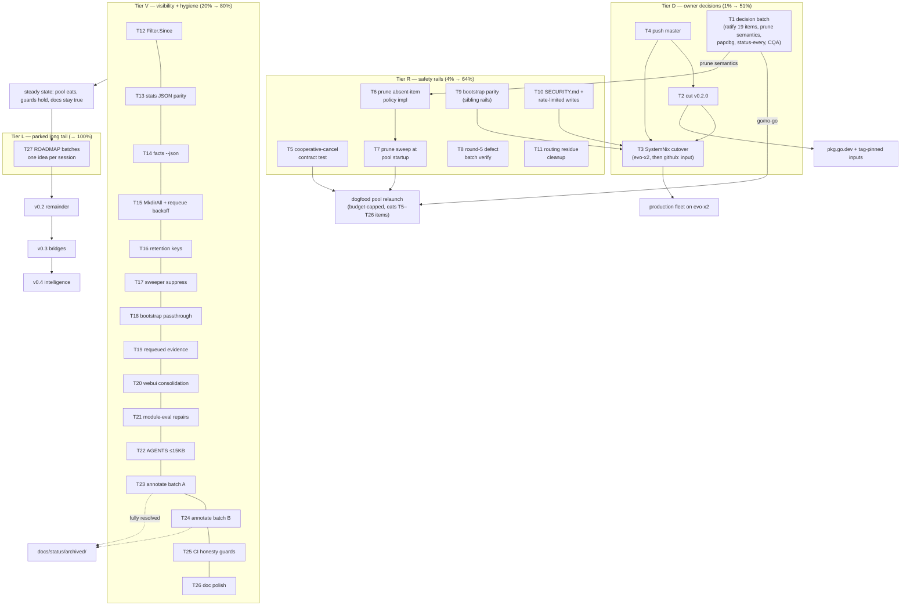

# SUPERB PLAN — ROUND 10: Pareto Execution of the Post-Audit Backlog

**Date:** 2026-09-09 03:23 CEST
**Status:** PLAN — ready for owner go/no-go on the Tier-D decision gates; Tiers R/V are pool-executable immediately after.
**Author session:** docs-health audit session (02:16 + 02:52 reports) + pareto-planning skill pass.
**Inputs (all re-read at plan time):** `TODO_LIST.md` (29 items: 19 machine-executable + 10 owner-BLOCKED), `ROADMAP.md` (raw ideas + open questions), the 02:16/02:52 reports' carryovers, `CHANGELOG.md [Unreleased]`, `FEATURES.md`, `AGENTS.md`.
**Method:** pareto-planning — 1%→51%, 4%→64%, 20%→80%; the remaining 20% of effort completes to 100%. Medium tasks 30–100 min; micro tasks ≤12 min. This plan is a snapshot: the living source of work is `TODO_LIST.md` (new tasks surfaced here route there via docs-health HARVEST).

---

## 0. Situation in one paragraph

The docs-health audit rebuilt the six living docs, annotated 12 reports, archived 7 fully-done files — and minted 19 machine-executable TODO items (pool food) that are NOT yet ratified by the owner. Master sits 7 commits ahead of origin (the push go/no-go was the oldest standing block). v0.2.0 is fully staged (`[Unreleased]` CHANGELOG complete, `scripts/release.sh` exists). The SystemNix/evo-x2 production deployment is wired and waiting on a sudo-gated cutover. In other words: **~28 hours of queued engineering work is blocked behind ~6 owner decisions worth maybe 90 minutes total.** That asymmetry IS the Pareto story of this plan.

## 1. Pareto breakdown

### The 1% that delivers 51% — OWNER DECISIONS + RELEASE + UNBLOCK (Tier D)

Six decisions/actions, ≈90 min total (mostly owner time), unlock everything else:

| # | Action | Why it is 51% | Cost |
|---|--------|---------------|------|
| D1 | **Push master** (7 commits; explicitly authorized in the session that wrote this plan) | CI visibility, SystemNix `github:` input flip, tag-pinned inputs, the 21:40→02:52 "push?" question finally closed | 5 min |
| D2 | **Ratify (or trim) the 19 minted TODO items** — the docs-health harvest the 01:48 session deferred to the owner | One word converts 19 filed items into live, budget-capped pool execution (~28 h queued engineering) | 15 min |
| D3 | **Cut v0.2.0** via `scripts/release.sh v0.2.0 --tag` + smoke | Published tag, pkg.go.dev refresh, GitHub release, SystemNix pin-by-tag; CHANGELOG is already complete | 60 min |
| D4 | **Prune-stale absent-item semantics** (02:52 report g1): absent text = cancelled vs absent = external work | Gates the only known safety gap in the zombie-cleanup loop (found by the audit itself) | 10 min decision |
| D5 | **SystemNix cutover** (`nix run .#deploy` on evo-x2, seed, first tick, dashboard) | The pool becomes a real production service instead of a terminal process | 60 min (sudo) |
| D6 | **Kill the `/tmp/papdbg` worker** (audit: self-contained, inert, safe) | Closes a 6-hour-old zombie-process question; zero risk | 2 min |

### The 4% that delivers 64% — LOOP SAFETY + CORRECTNESS RAILS (Tier R)

With D2 granting execution, these make autonomous execution TRUSTWORTHY (they protect money, correctness, and the fleet contract — the failure classes that burn budget or corrupt trust):

1. Cooperative-cancel finalize contract test (`context.Canceled` ⇒ Cancelled, never Failed — zero coverage today, near-miss already happened).
2. Prune-stale absent-item implementation + tests (after D4).
3. Prune-stale sweep at pool startup (self-cleaning relaunches).
4. Round-5 §f defect batch verification (7 unverified defects from 20:58 — verify-first, fix what's real).
5. `tq bootstrap` parity check vs the hand-rolled sibling-repo rails (carried THREE reports).
6. SECURITY.md writes blast radius + rate-limited write endpoints (the `--allow-writes` surface shipped without its security doc).
7. Routing residue cleanup (the ~9 dropped small items + the 02:16 count correction + seeds-doc strikes).

### The 20% that delivers 80% — VISIBILITY + HYGIENE + DOCS DEBT (Tier V)

The long-queued mechanical pack: `Filter.Since` pushdown, `journal_head` JSON, `tq facts --json`, `MkdirAll` sidecar dir, dirty-tree requeue backoff, retention keys in generated configs, status-sweeper suppression, bootstrap passthrough flags, `task.requeued` evidence + tail constant, the four webui consolidations, AGENTS.md ≤15 KB prune, the 20-report annotation backlog, and four CI consistency guards (FEATURES↔ROADMAP cross-check, TODO BLOCKED linter, pre-commit index hook, index date check) that mechanically prevent this session's own defect classes.

### The remaining 20% → 100% — PARKED LONG TAIL (Tier L)

ROADMAP raw ideas, executed one-per-session (pool or owner), NOT decomposed here: v0.2 remainder (CLI `--store`, consumer-group fencing, API cancel/claim), dispatcher v2 + bridge migration, `tq status`/loop-stats, webui polish pack, fleet pack, CI/tooling pack, observability/ops pack, multi-agent process pack, v0.3 arcs (decision→question fan-out, `/metrics`, Datastar), v0.4 intelligence. Full list lives in `ROADMAP.md` — this plan deliberately does not duplicate it.

---

## 2. Medium-granularity plan — ALL open work as 27 tasks (30–100 min each)

Sorted by importance/impact (tier) then customer-value then effort. "Cust." = who feels it (O=owner-operator, U=external users at v0.2.0+, A=agents/pool). Effort in minutes.

### Tier D — decision gates (owner; 1% → 51%)

| # | Task | Impact | Cust. | Effort | Unblocks |
|---|------|--------|-------|--------|----------|
| T1 | Owner decision batch: ratify/trim 19 minted items; prune-absent semantics; papdbg kill; `--status-every` N; CQA creds window | Everything | O | 30 | T6, T27, pool relaunch |
| T2 | Cut & publish v0.2.0: `release.sh v0.2.0` (gate→tag→proxy→GitHub Release→`go get` smoke) | Public release | U,O | 60 | pkg.go.dev, SystemNix pin |
| T3 | SystemNix cutover on evo-x2: deploy, seed queue, first live tick, dashboard check, input flip `github:…?ref=master` | Production fleet | O | 60 | 24/7 autonomous loop |
| T4 | Push master + verify CI green on origin + close the standing TODO row | Repo truth | U,O | 15 | D1 (all GitHub-side) |

### Tier R — safety rails (4% → 64%)

| # | Task | Impact | Cust. | Effort | Evidence |
|---|------|--------|-------|--------|----------|
| T5 | Cooperative-cancel finalize contract test (cancelled agent run ⇒ Cancelled, never Failed) | Money+correctness | A,O | 45 | 01:48 d7/e5 |
| T6 | Prune-stale absent-item policy implementation + tests (per T1 decision) | Zombie-loop safety | O | 90 | 02:52 d1 |
| T7 | `--prune-stale` sweep at agent-pool startup + e2e | Self-cleaning relaunches | O | 45 | 01:48 f11 |
| T8 | Round-5 §f defect batch: verify 7 defects at HEAD, fix real ones, refile/close others | Truth about 7 bugs | O,U | 90 | 21:22 §c5 |
| T9 | `tq bootstrap` parity check vs hand-rolled sibling rails (3 repos) | Fleet contract | O | 60 | 22:42 §d1 |
| T10 | SECURITY.md writes blast radius + CSRF/token matrix + rate-limited write endpoints | Security debt | U,O | 75 | 01:35 §c5/f6/f29 |
| T11 | Routing residue: route the ~9 dropped items; annotate 02:16 wrong counts; strike shipped D-seeds | No silent drops | O | 45 | 02:52 b2 |

### Tier V — visibility + hygiene (20% → 80%)

| # | Task | Impact | Cust. | Effort | Evidence |
|---|------|--------|-------|--------|----------|
| T12 | `Filter.Since` SQL pushdown (both stores) + `tq tasks` uses it | O(1) windows | O,U | 75 | 01:48 f3 |
| T13 | `tq stats --json` `journal_head` + scope-or-label the budget line | Script parity | O | 30 | 01:48 f4/f5 |
| T14 | `tq facts --json` + non-truncating detail rendering | Debuggability | O | 60 | 23:10 e8 |
| T15 | Pool `MkdirAll` log-dir + dirty-tree requeue backoff/jitter + log rate-limit | Ops robustness | O | 75 | 23:10 e5/e7 |
| T16 | Retention keys (`log-dir-max-age`/`-max-bytes`) in `renderPoolConfig` + NixOS module | Generated-config truth | O | 45 | 01:48 f7/f8 |
| T17 | Suppress `status-sweeper` when `--status-every 0` + idle-watermark label | Watermark truth | O | 30 | 23:10 e11 |
| T18 | `tq bootstrap`: `--repo-interval`/`--dlq-backoff` passthrough | Parity | O | 45 | 23:10 e9 |
| T19 | `task.requeued` structured evidence + ONE `FailureEvidence.Tail` constant | Forensics | O | 60 | 01:48 f2/f23 |
| T20 | WebUI consolidation: one status-color table, shared empty-state helper, banner-text shared const | Drift-proof UI | U | 75 | 00:21 e4/e5 |
| T21 | Module-eval repairs: broken-argv `extraArgs` example, unknown-key negative branch, `authTokenFile`→`EnvironmentFile` assertion | NixOS DX | O | 45 | 23:48 e5/f16-f19 |
| T22 | AGENTS.md prune to ≤15 KB (merge KIs, adoption-table→link, drop resolved incidents) + guard-test run | Session quality | A | 60 | 02:52 b3 |
| T23 | Annotation backlog A: 10 oldest reports (09-06/09-07 batch), item-by-item inline | Doc truth | O | 100 | 02:16 b1 |
| T24 | Annotation backlog B: remaining 10 reports (09-08 morning + 21-19/21-44/23-08) | Doc truth | O | 100 | 02:16 b1 |
| T25 | CI consistency guards: FEATURES↔ROADMAP cross-check script, TODO "sudo/owner/policy without BLOCKED" linter, pre-commit status-index hook, index DATE-column check | Mechanized honesty | O | 90 | 02:52 e-items |
| T26 | Doc polish batch: FEATURES PLANNED-section split, index archived-counter, shared "item done" wording constant, adoption-table custom-row pin | Polish | O | 45 | 02:52 f14 |

### Tier L — parked long tail (remaining 20% → 100%)

| # | Task | Impact | Cust. | Effort | Rule |
|---|------|--------|-------|--------|------|
| T27 | ROADMAP execution batches: ONE idea per session (pool-executable or owner), in ROADMAP's own priority order — v0.2 remainder (CLI `--store`, fencing, API cancel/claim) first, then dispatcher v2 + bridge migration, `tq status`/loop-stats, webui/fleet/CI/ops/process packs, v0.3/v0.4 arcs | Long-term | U,O | ~100/session | Parked: no fake decomposition of uncommitted ideas; pull per session via docs-health HARVEST |

**Coverage proof:** TODO_LIST 19 unblocked items → T5–T21; 10 BLOCKED items → T1 (7 decisions), T2, T3, T4 + parked (CQA live-verify waits on creds window in T1); session carryovers → T8, T11, T22–T26; ROADMAP raw ideas → T27. Nothing open is unlisted.

**Scheduled total (T1–T26):** ≈ 1,655 min ≈ 28 h. Tier D ≈ 165 min (owner-heavy); Tier R ≈ 450 min; Tier V ≈ 1,040 min.

---

## 3. Fine-granularity plan — micro tasks ≤12 min each

Sorted by task (importance) then execution order inside the task. "→" = output/verification. Effort in minutes.

### Tier D micro

| ID | Micro-task | Est | Task |
|----|-----------|-----|------|
| M1 | `git push origin master` (7 commits) | 2 | T4 |
| M2 | Watch GitHub Actions run on pushed HEAD; confirm green (vet/test/smokes) | 5 | T4 |
| M3 | Delete the resolved "Push master" TODO row | 2 | T4 |
| M4 | Render the 19 minted items as a one-page cost/risk table for the owner | 10 | T1 |
| M5 | Write the prune-absent semantics options memo (cancel vs keep; examples) | 10 | T1 |
| M6 | Kill `/tmp/papdbg` worker (PID 1039418) + append outcome to TODO row | 3 | T1/D6 |
| M7 | Pick `--status-every` N + CQA creds window (calendar hold) | 5 | T1 |
| M8 | Run `scripts/release.sh v0.2.0` gate phase (full ci-local inside) | 12 | T2 |
| M9 | `release.sh v0.2.0 --tag` (annotated tag from CHANGELOG) | 5 | T2 |
| M10 | Verify module proxy serves v0.2.0 (`go list -m @v0.2.0`) | 8 | T2 |
| M11 | Clean-room `go get github.com/larsartmann/go-taskqueue@v0.2.0` smoke | 10 | T2 |
| M12 | Publish GitHub Release w/ notes from the CHANGELOG section | 5 | T2 |
| M13 | Post-release: nix-built binary smoke (`TQ_BIN=result/bin/tq scripts/smoke/webui.sh`) | 10 | T2 |
| M14 | evo-x2: `nix run .#deploy`; `systemctl status tq-agent-pool tq-serve` | 10 | T3 |
| M15 | evo-x2: seed queue (`tq bootstrap …` against pool DB or copy dogfood journal per decision) | 10 | T3 |
| M16 | Watch first live tick: harvest → claim → crush → completed fact | 10 | T3 |
| M17 | Dashboard check `tq.home.lan` (token, SSE live ticks, Gatus green) | 10 | T3 |
| M18 | Flip SystemNix input to `github:…?ref=master` (post-push) + `nix flake check` | 8 | T3 |
| M19 | Update SystemNix `docs/services/tq.md` runbook w/ final option names | 10 | T3 |

### Tier R micro

| ID | Micro-task | Est | Task |
|----|-----------|-----|------|
| M20 | Write `TestCooperativeCancelFinalizesAsCancelled` skeleton (stub agent, mid-run cancel) | 12 | T5 |
| M21 | Assert fact trail: `task.cancelled` with cooperative detail, attempts unburned | 10 | T5 |
| M22 | Add the near-miss regression variant (wrapped error must still match `errors.Is`) | 10 | T5 |
| M23 | Run suite `-race` ×3; review the contract's wrapping sites in `runAgent` | 10 | T5 |
| M24 | Encode T1 decision as a constant/doc line (absent = cancel / absent = keep) | 5 | T6 |
| M25 | Extend `pruneRepo` with the absent-item branch (item set diff vs pending tasks) | 12 | T6 |
| M26 | Test: pending + deleted item → cancelled w/ reason (both policy variants) | 12 | T6 |
| M27 | Test: pending + item moved-to-blocked → NOT cancelled | 12 | T6 |
| M28 | Test: external-work guard (absent but task type ≠ harvested agent → untouched) | 12 | T6 |
| M29 | Update AGENTS Known Issue caveat + TODO row closure | 8 | T6 |
| M30 | Wire one prune sweep into agent-pool startup (before first tick) behind existing flag semantics | 12 | T7 |
| M31 | e2e: relaunch inherits zero zombies (seed stale pending → start pool → cancelled) | 12 | T7 |
| M32 | Docs: README/AGENTS line for startup sweep; CHANGELOG entry | 8 | T7 |
| M33 | Verify round-5 d1: sort lost on filter — repro or close (w/ test if real) | 12 | T8 |
| M34 | Verify d2: budget undercount after bridge restart | 12 | T8 |
| M35 | Verify d3: ghost `webui-css-drift-check` nix app | 8 | T8 |
| M36 | Verify d4: "load older" pages newer | 10 | T8 |
| M37 | Verify d5: data-age client/server fmtAge parity | 10 | T8 |
| M38 | Verify d6: `migrateOnOpenFail` dead field | 8 | T8 |
| M39 | Verify d7: screenshots script detail-URL from JSON object | 10 | T8 |
| M40 | Fix + test each confirmed defect (≤7 × 12) | 12×n | T8 |
| M41 | Annotate the 20:58 report's defect list with verdicts (done/not-real/still-open) | 10 | T8 |
| M42 | Scratch-clone 3 sibling repos; run `tq bootstrap --dry-run` against each | 12 | T9 |
| M43 | Diff generated rails vs the committed hand-rolled `.crushrc`/`.tq-verify` | 12 | T9 |
| M44 | Reconcile: adopt bootstrap output or port the deltas; document the winner | 10 | T9 |
| M45 | Apply the chosen rails to drifted repos (one commit per repo) | 12 | T9 |
| M46 | SECURITY.md: draft "UI-originated writes" section (cancel/rescue blast radius) | 12 | T10 |
| M47 | SECURITY.md: token/CSRF/loopback matrix table + hardening checklist rows | 10 | T10 |
| M48 | Rate-limit middleware for the two write routes (3 failed CSRF → lockout) | 12 | T10 |
| M49 | Tests: lockout triggers, unlocks, read-routes unaffected | 12 | T10 |
| M50 | Smoke assertion in `webui.sh` (write-route lockout path) | 10 | T10 |
| M51 | Route the ~9 dropped items (excerpt helpers, mintPass, widths, totals, e2e review-mint, verify-content assert, date check, JSON parity) → TODO/ROADMAP rows | 12 | T11 |
| M52 | Annotate the 02:16 report's wrong counts inline (strike + corrected numbers) | 5 | T11 |
| M53 | Strike shipped D-seeds (D80/D90/D91) in `deferred-bundle-seeds.md` | 10 | T11 |

### Tier V micro

| ID | Micro-task | Est | Task |
|----|-----------|-----|------|
| M54 | Add `Filter.Since *time.Time` + doc contract | 10 | T12 |
| M55 | SQLite `WHERE created_at >= ?` + index check | 12 | T12 |
| M56 | Postgres twin + conformance assertion | 12 | T12 |
| M57 | `tq tasks` drops CLI-side filter; uses pushdown | 8 | T12 |
| M58 | Table tests both stores + boundary (tz/eq) | 12 | T12 |
| M59 | `journal_head` into `tq stats --json` (+ test) | 10 | T13 |
| M60 | Budget line: label GLOBAL when `--project` scopes the table (+ test) | 10 | T13 |
| M61 | `tq facts --json` flag + payload shape | 12 | T14 |
| M62 | Non-truncating per-fact detail render mode | 12 | T14 |
| M63 | Golden test for JSON + detail mode | 10 | T14 |
| M64 | `MkdirAll` the log dir at pool startup (+ test) | 8 | T15 |
| M65 | Requeue backoff field + jitter (bounded, monotonic) | 10 | T15 |
| M66 | Requeue log rate-limit (1/interval/repo) | 10 | T15 |
| M67 | Tests: backoff ladder, no-hot-loop, log suppression | 12 | T15 |
| M68 | `renderPoolConfig` emits retention keys when flags set (+ test) | 12 | T16 |
| M69 | NixOS module: retention keys in poolSettings docs/render (+ eval test) | 12 | T16 |
| M70 | Suppress status-sweeper consumer when `--status-every 0` (+ test) | 10 | T17 |
| M71 | `tq watermarks show`: label idle consumers (off ≠ lagging) | 10 | T17 |
| M72 | Bootstrap `--repo-interval`/`--dlq-backoff` flags + config keys (+ tests) | 12 | T18 |
| M73 | Docs: bootstrap README section for fine-grained windows | 8 | T18 |
| M74 | `RequeueEvidence{reason,…}` struct + `Store.Requeue` evidence param | 12 | T19 |
| M75 | Both stores append evidence on `task.requeued` fact (+ tests) | 12 | T19 |
| M76 | Worker/preflight publishers wired (+ e2e assertion) | 10 | T19 |
| M77 | ONE `FailureEvidence.Tail` size constant; dedupe the three 4096s (+ test) | 10 | T19 |
| M78 | `statusColorTable` producing badge+accent outputs; delete the two maps | 12 | T20 |
| M79 | Shared empty-state templ helper (TaskTable + Board) | 10 | T20 |
| M80 | Serve banner const shared by `cmd/tq` + e2e parse test | 10 | T20 |
| M81 | WebUI suite + `templ generate` + `nix run .#webui-css` regen | 12 | T20 |
| M82 | Fix `extraArgs` example in `checks.module-eval` (`"--max-per-tick" "3"`) | 5 | T21 |
| M83 | Negative eval branch: unknown poolSettings key fails loudly | 12 | T21 |
| M84 | Eval assertion: `authTokenFile` → `EnvironmentFile` wiring | 12 | T21 |
| M85 | `nix flake check` green (module-eval both branches) | 10 | T21 |
| M86 | AGENTS pass 1: merge the 3 newest KIs into 2; drop resolved-incident wording | 12 | T22 |
| M87 | AGENTS pass 2: adoption table → one-line link to guard test | 8 | T22 |
| M88 | AGENTS pass 3: payload-contract tightening (link, don't inline) | 10 | T22 |
| M89 | `wc -c AGENTS.md` ≤15,000; guard test + doc checks green | 5 | T22 |
| M90–M99 | Annotate reports batch A (10 × ~10 min: 16-19, 18-00, 18-34, 19-49, 18-41, 19-33, 20-32, 21-44, 23-08, 04-19) — per report: read f/b/c, verdict every item, annotate, archive if fully resolved | 10×10 | T23 |
| M100–M109 | Annotate reports batch B (10 × ~10 min: 05-24, 05-54, 07-48, 15-30, 16-20, 17-20, 17-21, 21-19, + stragglers from batch A) | 10×10 | T24 |
| M110 | `scripts/check-features-roadmap.sh`: cross-file contradiction grep (shipped-in-one/planned-in-other) | 12 | T25 |
| M111 | TODO linter: unchecked items with sudo/owner/policy/decision lacking `— BLOCKED:` → fail | 12 | T25 |
| M112 | Pre-commit hook: status-index check (`.git/hooks` installer script) | 10 | T25 |
| M113 | Index DATE-column vs filename check in `check-status-index.sh` | 10 | T25 |
| M114 | Wire M110–M113 into `ci-local.sh` + one green run | 10 | T25 |
| M115 | FEATURES: split PLANNED-only rows into their own section | 8 | T26 |
| M116 | Index: archived-counter line per month | 8 | T26 |
| M117 | Shared "item done" reason wording const (prune + audit catch-up) | 10 | T26 |
| M118 | Pin the adoption-table custom rows (nowband/board) in the guard test | 10 | T26 |

### Tier L micro

T27 is deliberately NOT decomposed: each ROADMAP idea becomes its own session (often its own plan) pulled via docs-health HARVEST when its turn comes. Fake 12-minute decomposition of uncommitted ideas is how plans lie.

**Micro totals:** 118 concrete micro-tasks (M40 = ≤7 slots); scheduled micro effort ≈ 1,300 min + the two 100-min annotation batches (M90–M109) ≈ 28 h total, matching the medium plan.

---

## 4. Execution graph

**Order that matters:** T4 → T2 → T3 (release chain); T1 gates T6 and the pool relaunch; T5/T6/T7 should land BEFORE the first big unattended pool window; everything in Tier V is order-free (pool-executable in any sequence, one item per agent session).

---

## 5. VERSCHLIMMBESSER guards (do NOT break these while executing)

1. **Single serialized writer**: never add a connection pool or drop `RowsAffected()` re-checks (`OpenSQLite` MaxOpenConns(1)).
2. **Task contexts survive pool shutdown** — no shared drain deadline in the task context, ever again.
3. **Facts in the same tx as state** — every mutation appends its fact, or it didn't happen.
4. **TODO_LIST is machine state**: `- [ ]` format, one item/line; every new unchecked item agent-executable + single-session; `— BLOCKED:` for anything human-gated; deletion forfeits prune-stale matching.
5. **Generated files are committed** (`*_templ.go`, `app.css`); rerun `templ generate` + `nix run .#webui-css` after template edits.
6. **nix traps**: vendorHash fakeHash dance after go.mod changes; `GOEXPERIMENT=jsonv2` stays; `git add` new files before `nix build`.
7. **Workers/servers never outlive their session**: `--once` or `timeout` wrappers, always.
8. **Docs**: dprint stays manual (decision 2026-09-08); status reports get indexed on creation; CHANGELOG is append-only.
9. **Per-task gate**: `./scripts/ci-local.sh` before declaring any task done (mid-session checkpoints in hot files).
10. **No mass-lint rewrites**; fix in passing only. Platform honesty: `//go:build unix` on POSIX suites.

## 6. Verification gates per tier

- **Tier D:** green CI on origin; v0.2.0 visible on proxy + pkg.go.dev; `systemctl status` green on evo-x2; first completed fact observed on the production pool.
- **Tier R:** each task ships with the pinning test named in its row; full `-race` suite green ×3 for T5/T6.
- **Tier V:** per-task tests + `ci-local.sh` green; T22 verifies `wc -c AGENTS.md` ≤ 15,000; T23/T24 verify via `check-status-index.sh` + zero unmarked numbered items in the touched reports.
- **Tier L:** one ROADMAP idea per session, each with its own plan slice + HARVEST routing.

---

*Point-in-time plan. When tasks complete, close them in TODO_LIST.md (the living source) and record evidence in CHANGELOG.md; bring THIS file current only via docs-health ANNOTATE (strikethroughs), never rewrites.*
