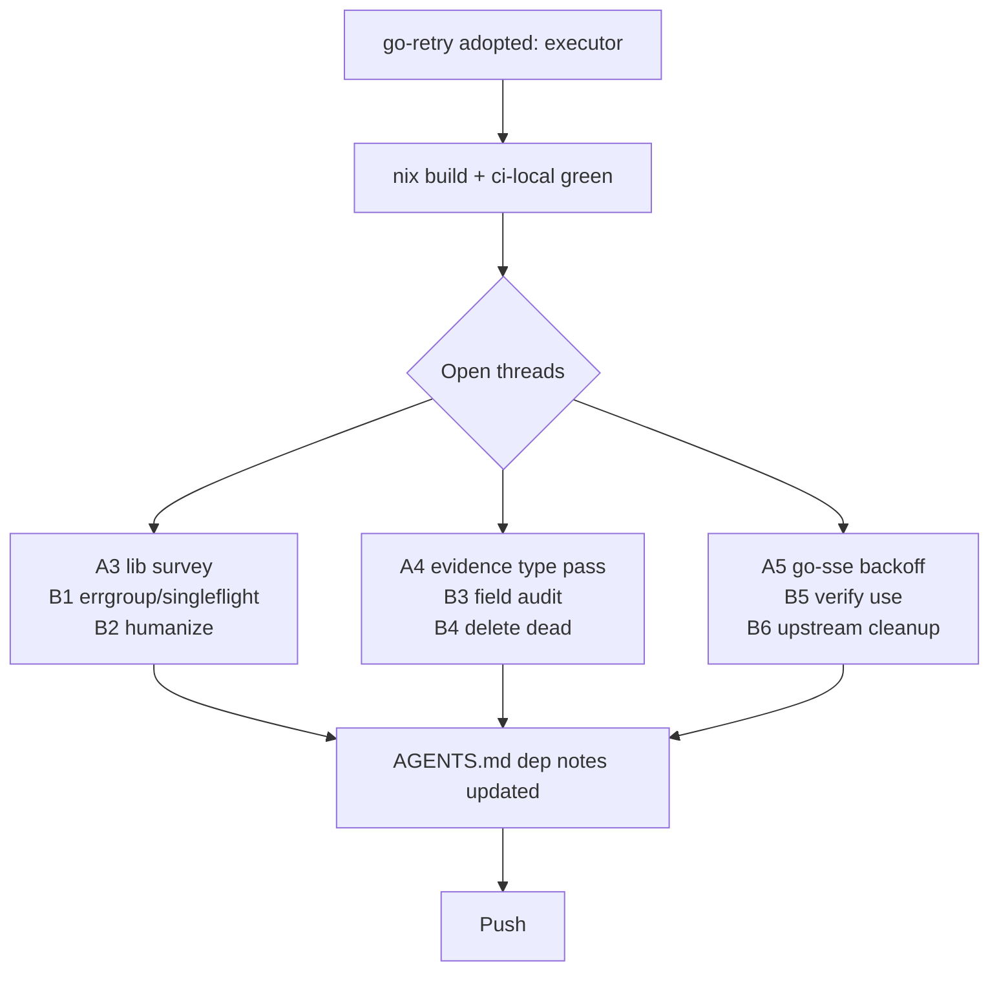

# Dependency, Reuse & Type-Model Review — Execution Plan

**Date:** 2026-09-10 02:02 CEST
**Trigger:** Operator mandate: stop hand-rolling what our own libs already
solve; deeply review every dependency AND every "decided against"
dependency; improve type models while shipping real work.

---

## 1. What the previous session forgot (found in reflection)

| Miss                                                        | Impact                                                 | Fixed?                                                      |
| ----------------------------------------------------------- | ------------------------------------------------------ | ----------------------------------------------------------- |
| `internal/executor/go.sum` was untracked                    | `nix build` breaks (flakes only see git-tracked files) | Yes — committed                                             |
| `vendorHash` stale after go.mod/go.sum edits                | Nix build fails                                        | Yes — parallel agent updated it; verified `nix build` green |
| Ran only root+executor gates, skipped `scripts/ci-local.sh` | Partial verification declared as done                  | Yes — full gate green                                       |
| Declared "minimal deps" without inventorying all 8 modules  | Claim was vibes, not facts                             | Yes — table below                                           |
| `DoWithValue` drops the value on the error path             | Cancel-kill test caught nil-buffer SIGSEGV             | Yes — `retry.Do` + outer capture                            |

## 2. Dependency inventory (verified 2026-09-10)

Direct third-party deps, all 8 modules (root + 7 sub-modules):

| Dependency                                | Version  | Module                                    | Verdict                                                 |
| ----------------------------------------- | -------- | ----------------------------------------- | ------------------------------------------------------- |
| `modernc.org/sqlite`                      | 1.58.0   | root, queue/sqlite                        | Keep. Pure-Go is load-bearing (CGO_ENABLED=0).          |
| `github.com/jackc/pgx/v5`                 | 5.11.0   | queue/postgres                            | Keep. The Postgres driver.                              |
| `github.com/a-h/templ`                    | 0.3.1020 | root (webui)                              | Keep.                                                   |
| `github.com/larsartmann/go-sse`           | 0.6.0    | root (webui SSE)                          | Keep. Own lib; pulls `cenkalti/backoff/v4` as indirect. |
| `github.com/larsartmann/templ-components` | 1.16.0   | root (webui)                              | Keep. Adoption table is suite-guarded.                  |
| `golang.org/x/sync`                       | 0.23.0   | root                                      | Keep.                                                   |
| `github.com/larsartmann/go-retry`         | 0.5.0    | executor (direct), worker/root (indirect) | Keep. Replaced hand-rolled ETXTBSY retry.               |

Notable indirect: `cenkalti/backoff/v4` (via go-sse) — the tree now carries
three backoff implementations: cenkalti (indirect), go-retry (direct), and
the deliberate hand-rolled reconnect supervisor in `harvest/watch.go`
(documented exception in AGENTS.md). Acceptable; do not "unify" by force.

**"Decided against" reviews (this session):**

- `go-cqrs-lite` — stays composition-only, no dependency. Overlap
  (journal/facts) is ~hundreds of lines already shipped and stable; the
  80-module graph would tax a one-binary tool. Re-verify only if we need
  durable delay timers (`scheduling/`) or upcasters.
- `vision-review-agent` — not a crush substitute (no tools/repo access);
  future _addition_ as a screenshot-review executor plugin. Not needed now.
- `go-branded-id` — **considered for `task.ID`, rejected**: we have exactly
  ONE id type; the mixing-IDs bug class it prevents cannot occur here, the
  hand-rolled ID carries a time-sortability property the lib doesn't, and
  the refactor touches every layer (store, JSON, facts, CLI). Revisit if a
  second ID type (lease token? run ID?) appears — mixing risk is the trigger.
- `go-retry` for the queue's NotBefore backoff ladder — rejected: it is
  persisted journal-fact domain state, not a retry loop.

## 3. Execution plan (sorted: impact ÷ effort)

### Table A — 30-minute-scale items

| #  | Task                                                                                                                                                                        | Impact                  | Effort  | Status            |
| -- | --------------------------------------------------------------------------------------------------------------------------------------------------------------------------- | ----------------------- | ------- | ----------------- |
| A1 | Finish go-retry adoption: commit, nix build, full ci-local gate                                                                                                             | High (correctness)      | Low     | DONE this session |
| A2 | AGENTS.md convention: "no new hand-rolled retry loops; go-retry or documented exception"                                                                                    | High (stops recurrence) | Trivial | DONE              |
| A3 | Survey hand-rolled utilities with proven-lib equivalents (backoff done; next: coalescing channels vs `x/sync`, humanize formatting vs `dustin/go-humanize` already in tree) | Medium                  | Medium  | OPEN              |
| A4 | Type-model pass on evidence structs (`FailureEvidence`, `RequeueEvidence`): are all fields consumed? dead fields → delete                                                   | Medium                  | Low     | OPEN              |
| A5 | Consider cenkalti/backoff → go-retry upstream in go-sse (verify-before-filing: confirm go-sse actually uses it beyond re-export)                                            | Low-Med                 | Medium  | OPEN              |

### Table B — 12-minute-scale breakdown of open items

| #  | From | Micro-task                                                                                             | Verify                               |
| -- | ---- | ------------------------------------------------------------------------------------------------------ | ------------------------------------ |
| B1 | A3   | grep for `errgroup`/`singleflight` opportunities in pool/consumer fan-out                              | per-module tests                     |
| B2 | A3   | check where byte/duration humanizing is hand-written in `tq top`/`stats`                               | gofmt + tests                        |
| B3 | A4   | `rg` each evidence field for readers; list dead ones                                                   | dead-export audit (substring match!) |
| B4 | A4   | delete dead fields + their facts are append-only: keep fact JSON, drop struct fields only if no reader | tests + smokes                       |
| B5 | A5   | read go-sse source: is cenkalti used or vestigial?                                                     | none (read-only)                     |
| B6 | A5   | if vestigial: drop dep in go-sse repo, bump, re-pin here                                               | check-go-mods + vendorHash dance     |
| B7 | —    | re-run `./scripts/check-dead-exports.sh` after any deletion                                            | script exit 0                        |

## 4. Graph

## 5. Guardrails honored

- Parallel-agent churn: flake vendorHash + worker go-retry adoption landed
  mid-session from another agent; verified, built on, never reverted.
- LSP "missing go.sum" diagnostics were stale (known issue); CLI gates are
  the source of truth and all green.
