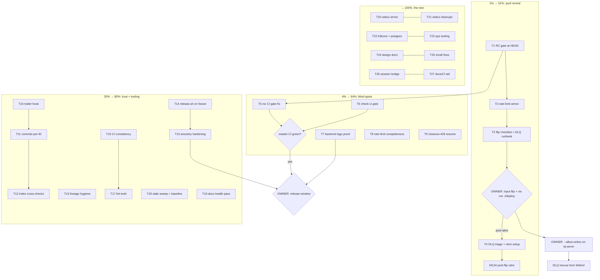

# SUPERB PLAN — ROUND 11: Pool Revival & Queue Trust (Pareto execution plan)

- **When**: 2026-09-11 14:01 CEST (via `date`)
- **Method**: Pareto breakdown of the ENTIRE open backlog (102 open TODO_LIST items
  - 11 new rate-limit items added this window) into tiers (1% → 51%, 4% → 64%,
    20% → 80%, remainder → 100%), then two granularity layers: 27 medium tasks
    (30–100 min each) and ~124 micro-tasks (≤12 min each). Every open TODO item is
    mapped into at least one micro-task; BLOCKED items are routed to the owner lane.
- **Inputs**: TODO_LIST.md @ 2026-09-11 (102 open), docs/status/2026-09-11_13-29
  rate-limit close-out (§b/§c/§f), the 2026-09-11 incident (dead task
  `000001a08edf`, Z.ai 429 wall, 21 dead tasks in the live pool), AGENTS.md
  operational contracts.
- **Standing constraint**: never VERSCHLIMMBESSERN — every task below carries its
  verify step; nothing lands without the repo gate (build + vet + test -race +
  gofmt, per-module for touched modules). Plans are snapshots; TODO_LIST.md stays
  the living source.

---

## 1. The Pareto answer

### 1% → 51% of the result: **make the deployed pool healthy again**

Everything this repo does is downstream of the dogfood pool actually working.
Right now: 21 dead tasks, the rate-limit fix is committed but NOT deployed, the
DLQ is untriaged, and the dashboard cannot even rescue (read-only). One
deployment event (SystemNix input flip + `nix run .#deploy`, owner-run) plus
one triage pass converts the entire incident into forward motion. The agent's
1% contribution: prove HEAD is release-grade (T1), armor the rate-limit
behavior with regression tests BEFORE the flip (T3), and hand the owner a
one-page flip checklist + DLQ decision table (T2).

### 4% → cumulative 64%: **kill the reliability blind spots**

The pool has already been silently dead once (20h) and master CI has been red
for hours five times without anyone looking. The blind spots: the nix CI gate
(runner-only FOD mismatch — the gate protecting every future deploy is RED),
no master-CI state gate, unverified backend tags on the proxy, and the
rate-limit feature's remaining holes (http executor, closeout double-work,
cross-provider gates). T5–T9.

### 20% → cumulative 80%: **queue ↔ git trust + release tooling + CI consistency**

The system's memory is the journal↔git cross-reference (`Task-Queue-ID`
footers, status index, CHANGELOG). The 07:49 reword incident proved how
fragile that is. Hardening: trailer hook, commits-per-ID view, index
cross-checks, release.sh executed on a fixture for the first time ever,
tag-ancestry defenses, CI loop deduplication. T10–T19.

### The remaining 80% → 100%

Webui test armor, fullcore/postgres proof, ops tooling (`tq pool-health`,
`--parked`), design docs (worktree-per-agent, session-close bridge,
attribution convention), lint-baseline quantification + slice-triage round 2,
and the small-fix sweep. T20–T27. Owner-lane decisions (the true levers the
agents cannot pull) are listed separately in §5.

---

## 2. Medium plan — 27 tasks, 30–100 min each, sorted by impact (covers ALL open TODOs)

| #   | Task (30–100 min)                                                                                                                                                                                                          | Min | Impact (why it matters now)                                                                    | Effort | Covers (open TODO slugs)                       |
| --- | -------------------------------------------------------------------------------------------------------------------------------------------------------------------------------------------------------------------------- | --- | ---------------------------------------------------------------------------------------------- | ------ | ---------------------------------------------- |
| T1  | Release-candidate gate at HEAD: full ci-local + nix build + all smokes green, evidence recorded                                                                                                                            | 90  | The flip is only safe if HEAD is proven release-grade; nothing else matters until this is true | Med    | (gate for the whole plan)                      |
| T2  | Post-flip checklist + DLQ triage runbook: owner steps, per-dead-task cancel-vs-rescue table, `--allow-writes` enable note                                                                                                  | 60  | Converts the 21-dead DLQ into decisions; removes every owner guess                             | Low    | SystemNix deploy (prep), --allow-writes (prep) |
| T3  | Rate-limit regression armor: incident-paste fixture, parked-vs-reclaim pin (sqlite+postgres), scratch-DB e2e smoke, fuzz seeds                                                                                             | 90  | Proves the 51% fix BEFORE the flip; a regression here re-creates the incident                  | Med    | 5 new rate-limit items                         |
| T4  | DLQ triage execution support + post-flip retro setup (agent-runnable parts; rescue/cancel stays owner)                                                                                                                     | 30  | Dead tasks either come back to life or stop being noise                                        | Low    | post-deploy retro                              |
| T5  | Restore the nix CI gate: reproduce runner FOD mismatch, differential-dump, fix or scope the vendor decision                                                                                                                | 100 | Master CI has been red since 06:25; every merge since is unprotected                           | High   | nix FOD gate                                   |
| T6  | Master-CI state gate: `scripts/check-ci.sh` (gh run list) wired into ci-local                                                                                                                                              | 40  | Five DONE verdicts shipped on a 3h-red master; this class must die                             | Low    | check-ci item                                  |
| T7  | Backend-tag verification: per-module proxy check + clean-room `go install`                                                                                                                                                 | 70  | The multi-module promise is unproven from outside; blocks release confidence                   | Med    | push-auth remainder                            |
| T8  | Rate-limit completeness: http-executor 429 class, provider-tagged gates, doctor gate visibility, `tq tasks --parked` + stats counts                                                                                        | 100 | Same incident class, three other surfaces; ops visibility for parked pools                     | Med    | 4 new rate-limit items                         |
| T9  | Closeout-429 double-work fix: persist work-turn session id, resume at closeout, tests                                                                                                                                      | 80  | Every 429-during-closeout currently doubles real agent cost                                    | Med    | closeout gap item                              |
| T10 | Commit-msg `Task-Queue-ID` trailer hook: shape check + duplicate rejection, wired via install-pre-commit                                                                                                                   | 50  | The queue↔git cross-reference is enforced at commit time instead of by eyeball                 | Med    | commit-msg hook                                |
| T11 | `tq facts`/`tq show` commits-per-ID view: wrong/duplicate footers surface mechanically                                                                                                                                     | 40  | Catches the f26 three-ID cluster class mechanically                                            | Med    | commits-per-ID                                 |
| T12 | check-status-index extensions: filename-ID ↔ trailer cross-check + filename-date drift                                                                                                                                     | 40  | The index is the discovery surface; drift = lost reports                                       | Med    | 2 index items                                  |
| T13 | Lineage hygiene: CHANGELOG v0.2.0 SHA audit, `41b817b` sweep, workflow fast-forward assumption check                                                                                                                       | 30  | Dangling SHAs and FF assumptions are landmines under the next release                          | Low    | 3 lineage items                                |
| T14 | Execute `scripts/release.sh` on a fixture repo: gates, `--tag`, sub-tag cutting                                                                                                                                            | 60  | The release flow has only ever been line-read; first live execution                            | Med    | fixture release                                |
| T15 | Release tooling vs forked lineages: ancestry audit, doctor warning, RELEASE.md sections, `--push` CI-green automation                                                                                                      | 90  | v0.2.0 tags already descend from the forked side; next release must not trip                   | Med    | 4 release items                                |
| T16 | CI consistency bundle: `for-each-module.sh` extraction, golangci pin unify, actionlint, lint-job summary, testdata go.mod check                                                                                            | 80  | 4+ duplicated loops drift independently; actionlint saves CI round trips                       | Low    | 5 CI items                                     |
| T17 | Lint truth: config-resolution verification + AGENTS.md rule, annotations scope decision, per-module baseline quantification, slice-triage round 2 kickoff                                                                  | 90  | The ~400 advisory baseline is unmeasured per module; triage without numbers is guessing        | Med    | 4 lint items                                   |
| T18 | Stale-item sweep + lint baseline file: mark verified items [x], backfill root counts                                                                                                                                       | 40  | A stale DONE backlog poisons harvest trust                                                     | Low    | 2 items                                        |
| T19 | Docs-health pass: annotate six 2026-09-07 reports, archive-eligibility re-eval, index digest cadence                                                                                                                       | 60  | Unannotated reports age into misinformation (the 2026-09-08 five-unindexed lesson)             | Low    | 3 docs-health items                            |
| T20 | Webui test armor: FilterState round-trip pins (all fields), handler e2e `?q=`, filterHref encoding, param single-source, LIKE cap                                                                                          | 80  | The eaf73a9 literal-leak class bit twice; emitter↔parse drift needs pins                       | Med    | 5 webui test items                             |
| T21 | Webui/advisory cleanups: literal-leak sweep, help-text smoke, waitFor hint, dead exports triage, KanbanBoard + SEO/icons evals                                                                                             | 70  | Small debts that each cost a future session                                                    | Low    | 6 webui items                                  |
| T22 | Fullcore proof: hermetic smoke, drain-deadline pin, postgres example run, status payload window paths, postgres CLI spike                                                                                                  | 90  | The postgres backend has no live proof; the example is the embed story                         | Med    | 5 fullcore items                               |
| T23 | Pool ops tooling: `tq pool-health`, harvest /tmp hot-item flag, status-index digest cadence                                                                                                                                | 70  | Liveness ≠ process-up; the second silent-death needs a faster detector                         | Med    | 3 ops items                                    |
| T24 | Design docs: worktree-per-agent, daemon attribution convention, history-rewrite policy, consumer ghost ADR draft, interface-dedup comparison                                                                               | 100 | Four standing architecture questions get written answers owners can rule on                    | Med    | 5 design items                                 |
| T25 | Small-fix sweep: err113 sentinel, varnamelen renames, runactor rename + scoped lint, examples hardening, SECURITY.md rows, AGENTS gotcha, SHA256SUMS                                                                       | 80  | Seven sub-12min fixes that each unblock a gate or an audit                                     | Low    | 7 small items                                  |
| T26 | Session-close bridge: design doc from the finished trigger research + PreToolUse registry prototype                                                                                                                        | 90  | Extends close-out trust to interactive sessions; research is done, build starts                | Med    | session bridge item                            |
| T27 | Docs/CI tail: FEATURES/DOMAIN_LANGUAGE/README rows, required-checks proposal, scan job summaries, gosec FP config, govulncheck hard gate, release-gates env fix, AllStatuses prep, ghost report upstream, dependabot draft | 100 | Closes every remaining loose thread in the backlog                                             | Low    | 10 tail items                                  |

Sum ≈ 1,947 min ≈ 32.5 h of focused work.

---

## 3. Micro plan — ≤12 min per task, sorted by impact (covers ALL open TODOs)

### Tier 1% — pool revival (T1–T4)

| #   | Micro-task (≤12 min)                                                                 | Min | Task |
| --- | ------------------------------------------------------------------------------------ | --- | ---- |
| M1  | Root gate: GOEXPERIMENT build + vet + `go test ./... -race` at HEAD                  | 10  | T1   |
| M2  | Per-module gates loop (all internal/* modules, GOWORK=off)                           | 12  | T1   |
| M3  | `./scripts/ci-local.sh` full replicant run, record result                            | 12  | T1   |
| M4  | `nix build` + `nix flake check`, record output path                                  | 10  | T1   |
| M5  | Smokes: webui, status-loop, dogfood-once (stub), multi-repo with `TQ_BIN`            | 12  | T1   |
| M6  | RC evidence note: commit SHA × gate × result table (short status report)             | 8   | T1   |
| M7  | Draft post-flip smoke checklist (flip → deploy → first-harvest → 429-park check)     | 10  | T2   |
| M8  | Pull `tq dlq` listing; build the 21-dead triage table (task, item, verdict)          | 12  | T2   |
| M9  | Write cancel-vs-rescue rules + exact CLI commands into the runbook                   | 10  | T2   |
| M10 | Add incident-paste Z.ai output as testdata + DetectRateLimit fixture row             | 12  | T3   |
| M11 | Store pin: parked requeue vs stale-lease reclaim (sqlite)                            | 12  | T3   |
| M12 | Same pin, postgres conformance parity                                                | 10  | T3   |
| M13 | Scratch-DB e2e rate-limit smoke (`TQ_DB` exported, stub 429 agent, real binary)      | 12  | T3   |
| M14 | Confirm rate-limit tests are windows-CI safe (time.Local assumptions)                | 8   | T3   |
| M15 | Fuzz seed corpus: real provider failure logs → FuzzDetectRateLimit seeds             | 12  | T3   |
| M16 | Owner handoff message: flip URL, checklist link, triage table, `--allow-writes` note | 8   | T2   |
| M17 | Post-flip retro scaffold: metric definitions (429 requeues vs dead-letters/week)     | 8   | T4   |

### Tier 4% — reliability blind spots (T5–T9)

| #   | Micro-task                                                                       | Min | Task |
| --- | -------------------------------------------------------------------------------- | --- | ---- |
| M18 | Reproduce nix FOD: eval the failed drv from the failed commit (`getFlake ?rev=`) | 12  | T5   |
| M19 | Differential-dump runner vs local module fetch tree                              | 12  | T5   |
| M20 | Identify the divergent fetch; write findings into the TODO item                  | 12  | T5   |
| M21 | Implement the fix (or scope the vendor decision); clean-eval `nix build` green   | 12  | T5   |
| M22 | `scripts/check-ci.sh`: master run-state via `gh run list`, non-zero on red       | 12  | T6   |
| M23 | Wire check-ci.sh into ci-local.sh + one-line doc                                 | 8   | T6   |
| M24 | Backend-tag proxy check: `go list -m -versions` for sqlite/postgres modules      | 10  | T7   |
| M25 | Clean-room `go install` proof in a throwaway module                              | 12  | T7   |
| M26 | Record verification results; update the BLOCKED push item's residual ask         | 8   | T7   |
| M27 | http executor: 429 response → `*RateLimitError` classification                   | 12  | T8   |
| M28 | http tests: 429 → requeue, attempts unburned                                     | 10  | T8   |
| M29 | Bridge audit: alert-post retry behavior under 429; fix if it hammers             | 12  | T8   |
| M30 | Provider-tag extraction (`provider=<x>` line) + per-provider gate map            | 12  | T8   |
| M31 | Two-provider gate independence tests                                             | 10  | T8   |
| M32 | `tq doctor`: armed-gate + parked-count surface                                   | 12  | T8   |
| M33 | `tq tasks --parked` filter + stats park counts                                   | 12  | T8   |
| M34 | Closeout resume design: work-turn session id → payload persistence               | 12  | T9   |
| M35 | Implement closeout resume on re-claim                                            | 12  | T9   |
| M36 | Tests: 429-in-closeout → requeue resumes at closeout, work turn NOT re-run       | 12  | T9   |

### Tier 20% — queue ↔ git trust + release + CI (T10–T19)

| #   | Micro-task                                                                 | Min | Task |
| --- | -------------------------------------------------------------------------- | --- | ---- |
| M37 | Trailer-shape regex + reject logic in the pre-commit hook                  | 12  | T10  |
| M38 | Duplicate/used-ID rejection + tests                                        | 12  | T10  |
| M39 | install-pre-commit.sh wiring + local smoke                                 | 10  | T10  |
| M40 | `tq show/facts`: scan `git log` for a task ID's commits                    | 12  | T11  |
| M41 | Commits-per-ID view: missing/duplicate footer surfacing                    | 12  | T11  |
| M42 | check-status-index: filename-ID ↔ commit-trailer cross-check               | 12  | T12  |
| M43 | Filename-date vs report "Written" line drift check                         | 10  | T12  |
| M44 | CHANGELOG v0.2.0 SHA audit against the corrected lineage                   | 10  | T13  |
| M45 | `rg 41b817b` over non-status docs; keep clean                              | 5   | T13  |
| M46 | Workflow fast-forward assumption check (ci.yml vs origin/master state)     | 8   | T13  |
| M47 | Fixture repo scaffold (multi-module shape release.sh expects)              | 12  | T14  |
| M48 | Execute release.sh gates + `--tag` on the fixture                          | 12  | T14  |
| M49 | Sub-tag cutting on fixture modules + local module-resolution proof         | 12  | T14  |
| M50 | release.sh ancestry audit: git describe/merge-base/rev-list assumptions    | 12  | T15  |
| M51 | Doctor/release-gate warning for release tags unreachable from master       | 12  | T15  |
| M52 | RELEASE.md: tag-ancestry section + `--push` failure path                   | 10  | T15  |
| M53 | release.sh `--push`: automate the confirm-CI-green-on-tag step             | 12  | T15  |
| M54 | Extract `scripts/for-each-module.sh`; consume from ci.yml + ci-local.sh    | 12  | T16  |
| M55 | Unify the golangci-lint version pin to one source                          | 8   | T16  |
| M56 | actionlint into devShell + ci-local.sh                                     | 10  | T16  |
| M57 | Advisory lint job end-of-step summary line                                 | 10  | T16  |
| M58 | Verify `find internal -name go.mod` excludes testdata go.mods; document    | 8   | T16  |
| M59 | Changed-lines line-length gate (lll/golines, 120) in ci-local.sh           | 12  | T16  |
| M60 | Prove root `.golangci.yml` resolution inside a sub-module (experiment)     | 12  | T17  |
| M61 | Document the config-resolution rule (or per-module policy) in AGENTS.md    | 10  | T17  |
| M62 | lint-annotations scope decision note (root-only vs per-module)             | 10  | T17  |
| M63 | Quantify per-sub-module lint baselines (run + record counts)               | 12  | T17  |
| M64 | Slice-triage round 2: goconst policy-or-fix                                | 12  | T17  |
| M65 | Slice-triage round 2: mnd policy-or-fix                                    | 12  | T17  |
| M66 | Slice-triage round 2: paralleltest policy-or-fix                           | 12  | T17  |
| M67 | Slice-triage round 2: testpackage policy-or-fix                            | 12  | T17  |
| M68 | Mark the three verified stale-done items [x] with DONE verdicts            | 8   | T18  |
| M69 | Create the checked-in per-linter baseline file (root ~380 backfill)        | 12  | T18  |
| M70 | Docs-health: annotate the six 2026-09-07 reports (verification per report) | 12  | T19  |
| M71 | Docs-health: archive-eligibility re-eval + `git mv` where earned           | 12  | T19  |
| M72 | Status-index digest row / archived-sweep cadence check                     | 10  | T19  |

### The remaining 80% → 100% (T20–T27)

| #    | Micro-task                                                                           | Min | Task   |
| ---- | ------------------------------------------------------------------------------------ | --- | ------ |
| M73  | FilterState round-trip pins: Project/Status fields                                   | 12  | T20    |
| M74  | Round-trip pins: Sort/View/Page fields                                               | 10  | T20    |
| M75  | Handler e2e: `GET /?q=sh` renders filtered rows + search chip                        | 12  | T20    |
| M76  | filterHref URL-encoding verification + pin test                                      | 12  | T20    |
| M77  | Query-param single source (constants or one table-driven test)                       | 12  | T20    |
| M78  | Unbounded `?q=` SQLite LIKE scan: cap/escape check + fix                             | 12  | T20    |
| M79  | eaf73a9 rename-diff literal-leak sweep (`git log -S` probes)                         | 12  | T21    |
| M80  | Help-text smoke: `tq dlq -h` etc., no parenthesized-identifier artifacts             | 10  | T21    |
| M81  | gopls "unused waitFor" hint: verify genuine, delete if real                          | 5   | T21    |
| M82  | Triage dead webui exports (BudgetView, BoardColumn, DashboardData)                   | 10  | T21    |
| M83  | Evaluate templ-components KanbanBoard vs custom board columns                        | 10  | T21    |
| M84  | Evaluate PageProps.SEO + icons.Render adoption                                       | 10  | T21    |
| M85  | `scripts/smoke/fullcore.sh` skeleton (explicit `TQ_DB=<scratch>`)                    | 12  | T22    |
| M86  | Drain-deadline determinism pin (exercise the deadline path N times)                  | 12  | T22    |
| M87  | Run examples/fullcore against a throwaway postgres DB                                | 12  | T22    |
| M88  | Status-task payload: include the window's report paths                               | 12  | T22    |
| M89  | Postgres CLI store wiring spike behind `--store` (prep for the owner release call)   | 12  | T22    |
| M90  | `tq pool-health`: per-repo skip streaks + last activity from the journal             | 12  | T23    |
| M91  | pool-health tests + README/FEATURES rows                                             | 12  | T23    |
| M92  | Harvest /tmp hot-item priority flag                                                  | 12  | T23    |
| M93  | Status-index monthly digest row or archive-sweep cadence check                       | 10  | T23    |
| M94  | Worktree-per-agent design doc, part 1 (claim → worktree → verify → merge flow)       | 12  | T24    |
| M95  | Worktree-per-agent design doc, part 2 (tradeoffs + open questions)                   | 12  | T24    |
| M96  | Daemon-attribution convention proposal (docs/planning/)                              | 12  | T24    |
| M97  | History-rewrite policy line draft for AGENTS.md                                      | 10  | T24    |
| M98  | consumer ghost ADR draft: wire into serve vs delete, with recommendation             | 12  | T24    |
| M99  | Interface-dedup comparison: consumer.Source vs budget vs papdashboard FactSource     | 12  | T24    |
| M100 | Verification-claims guidance (DONE notes must state gate scope)                      | 10  | T24    |
| M101 | CI topology one-pager (docs/planning/)                                               | 12  | T24    |
| M102 | err113 fix: static sentinel at cmd/tq/doctor.go:472                                  | 8   | T25    |
| M103 | varnamelen raw-site renames (`o`, `f`) or ignore-list extension                      | 10  | T25    |
| M104 | runactor `exitCause` local rename to exitErr vocabulary                              | 5   | T25    |
| M105 | Scoped golangci run on internal/runactor (errname quiet proof)                       | 8   | T25    |
| M106 | Examples hardening: IdleTimeout/ReadTimeout, SSE WriteTimeout=0 exemption documented | 12  | T25    |
| M107 | SECURITY.md: add govulncheck + gosec advisory jobs to the defense-layers matrix      | 8   | T25    |
| M108 | AGENTS.md gotcha: `git check-ignore` before evidence copies + daemon `--stat` diff   | 10  | T25    |
| M109 | SHA256SUMS manifest for the dogfood-proof archive                                    | 10  | T25    |
| M110 | Session-close bridge design doc (from the 2026-09-10 trigger research)               | 12  | T26    |
| M111 | PreToolUse session-registry prototype (hook appends {id,cwd,last_seen})              | 12  | T26    |
| M112 | Session-registry sweeper: mint close-out when no crush process owns the ID           | 12  | T26    |
| M113 | Prototype test + ADR/plan note update                                                | 10  | T26    |
| M114 | FEATURES.md rate-limit row + README reliability sentence                             | 8   | T27    |
| M115 | DOMAIN_LANGUAGE: rate-limit window / gate / park terms                               | 8   | T27    |
| M116 | Required-checks proposal (test-windows + release-gates first) (docs/planning/)       | 12  | T27    |
| M117 | gosec/govulncheck findings as CI job-summary artifacts                               | 12  | T27    |
| M118 | gosec FP exclusion config encoding the 2026-09-10 triage                             | 12  | T27    |
| M119 | Flip govulncheck to a hard gate once runner-green                                    | 8   | T27    |
| M120 | ci-local: release-gates smoke under `GIT_CONFIG_GLOBAL=/dev/null`                    | 10  | T27    |
| M121 | `task.AllStatuses` export + twin-list retirement prep (rides next re-tag)            | 12  | T27    |
| M122 | Session-snapshot ghost: upstream report draft (harness state-capture artifact?)      | 10  | T27    |
| M123 | Dependabot/renovate policy draft for the 8-module tree                               | 10  | T27    |
| M124 | Post-deploy retro execution (one week after flip): record the numbers                | 12  | T4/T27 |

**Coverage check**: all 102 open TODO items map to ≥1 micro-task (M1–M124);
owner-gated items additionally appear in the owner lane (§5); BLOCKED items
with agent-preparable halves (consumer ADR, interface dedup, postgres spike,
dependabot draft, --allow-writes prep) get their agent halves here (M89, M98,
M99, M123, M7/M16).

---

## 4. Execution graph

Read it as: T1–T3 are the strict preconditions for the owner flip; the flip
unblocks DLQ triage and the retro. T5/T6 gate everything release-shaped.
Tier-20% work is safe to parallelize freely (multiple agents/tabs). The rest
of the backlog has no hidden ordering — pick by table order.

---

## 5. Owner lane (the levers agents cannot pull — all BLOCKED TODO items)

| Decision / action                                                                                                                                                    | Unblocks                                        |
| -------------------------------------------------------------------------------------------------------------------------------------------------------------------- | ----------------------------------------------- |
| SystemNix input flip + `nix run .#deploy` (after T1–T3)                                                                                                              | The 51%: pool revival, rate-limit handling live |
| DLQ rescue/cancel go-ahead (per the T2 table)                                                                                                                        | 21 dead tasks resolved                          |
| `--allow-writes` on tq-serve (same flip window)                                                                                                                      | DLQ rescue/cancel from the WebUI                |
| Origin reconciliation verdict (append-only vs force-with-lease) + master push policy                                                                                 | TODO g1/g2; the push-question class ends        |
| Tag-lineage fork acceptance                                                                                                                                          | release tooling hardening scope (T15)           |
| Canonical ID for the f26 cluster + ticket 915cf6f close-out                                                                                                          | queue↔git cross-reference cleanliness           |
| consumer wire-or-delete; interface dedup; task.AllStatuses public surface; postgres CLI release timing                                                               | T24/T22/T27 outputs become decisions            |
| gosec gate-vs-advisory; red-master pool policy; CHANGELOG policy; TODO-append caps; closeout-report placement; CI-time budget; module-fetch trust; dependabot policy | the eight standing policy BLOCKEDs              |
| CQA live instance URL + creds; first multi-module release (retro prerequisite)                                                                                       | CQA verification; release retrospective         |

---

## 6. What this plan changes elsewhere

- **TODO_LIST.md gained 11 items** (new "Rate-limit window follow-ups" section,
  harvested from the 13:29 close-out §f) — the plan's T3/T8/T9/M17/M124 cover them.
- No TODO items were removed or reworded; `[x]` marks happen only via the
  verification sweeps (T18/M68).
- This plan is a snapshot: annotate it later (docs-health ANNOTATE mode),
  never rewrite it.
