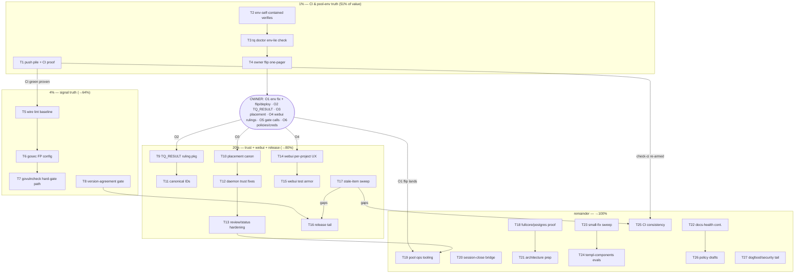

# SUPERB PLAN — ROUND 13: Truth in Every Green (Pareto execution plan)

- **When**: 2026-09-12 02:15 CEST (via `date`)
- **Method**: Pareto breakdown of the ENTIRE open backlog (98 open TODO_LIST items
  - 9 new items harvested from the 2026-09-12 01-47 per-project session and the
    round-12 T17 tail = 107 items) into tiers (1% → 51%, 4% → cumulative 64%,
    20% → cumulative 80%, remainder → 100%), then two granularity layers:
    27 medium tasks (30–100 min each) and 137 micro-tasks (≤12 min each).
    Every open TODO item is mapped into at least one task (§4 coverage map);
    BLOCKED items route to the owner lane (§5).
- **Inputs**: TODO_LIST.md @ 2026-09-12 02:15 (98 open), status index rows
  2026-09-12 (00-10 … 01-47) and 2026-09-11 (rounds 11/12 close-outs),
  round-11 plan + its execution state (T1–T16 complete, T17 ~80%),
  AGENTS.md operational contracts, the push authorization granted this
  window (owner instruction 2026-09-12 02:11: "git commit & git push").
- **Standing constraint**: never VERSCHLIMMBESSERN — every task carries its
  verify step; nothing lands without the repo gate (`GOEXPERIMENT=jsonv2`
  build + vet + `go test -race`, per-module for touched modules); advisory
  lint baselines are never mass-fixed; owner-gated levers are prepared, never
  pulled by agents. Plans are snapshots; TODO_LIST.md stays the living source.
- **State at planning time**: master ahead of origin by 12 commits (the
  round-12 toolchain pins are committed but UNPROVEN until a CI run);
  `ci-local.sh` check-ci bypassed-by-necessity until master green; pool-env
  GOEXPERIMENT lie has burned 5+ windows; T17 tail (baseline checker) exists
  on disk (`.golangci-baseline.txt` + `scripts/lint-baseline.sh`) but is not
  wired into ci-local.

---

## 1. The Pareto answer

### 1% → 51% of the result: **make every GREEN trustworthy again (CI truth + pool-env truth)**

Two liars currently poison every decision downstream of them:

1. **Unproven CI**: the setup-go 1.26.7 pins + workflow GOEXPERIMENT fix that
   ended the three-round CI-red saga are sitting UNPUSHED (12 commits ahead).
   Until a runner goes green, every "master is fine" claim — including
   ci-local's own check-ci gate, currently bypassed — is faith, not signal.
   Pushing is sanctioned THIS window (T1). One push converts the biggest
   open epistemic debt into a verified fact.
2. **The pool-env lie**: every pool verify outside the flake devShell dies on
   `encoding/json/v2` build constraints because the tq-agent-pool unit has no
   GOEXPERIMENT. Five-plus windows burned on re-dispatches of ALREADY-DONE
   work. The permanent fix is one `Environment=` line only the owner can set
   (SystemNix, sudo-gated) — the agent's 51% contribution is to make every
   minted verify env-self-contained (T2), give `tq doctor` an env-lie
   detector so no attempt is ever again judged on a lying gate (T3), and hand
   the owner a copy-paste one-pager (T4).

Everything else in this plan is downstream of being able to trust a green.

### 4% → cumulative 64%: **signal truth (lint/vuln/version gates that mean what they say)**

The advisory lint job shows red with an unmeasured ~400-finding baseline; the
round-12 baseline artifact exists but is not wired (T17's last 20%); gosec is
advisory-red with a triage that lives only in AGENTS.md prose; govulncheck
cannot become a hard gate; the flake/CHANGELOG/ldflags version trio can
silently disagree. T5–T8 wire the round-12 artifacts in, encode the triages
as config so NEW classes stand out, and put a set-gate on version surfaces.

### 20% → cumulative 80%: **queue↔git trust + the webui per-project surface + release tail**

The system's memory is the journal↔git cross-reference; its face is the web
dashboard. Round 13 hardens both: implement the owner rulings that un-block
five standing questions (TQ_RESULT schema, report placement, canonical IDs),
fix the daemon's pre-commit-hook bypass and the status-append re-fire loop
(T9–T13), then ship the per-project UX decisions + test armor on the webui
(T14–T15) and close the release-doc tail plus the stale-TODO verify-then-close
sweep (T16–T17).

### The remaining 80% → 100%

Fullcore/postgres proof, pool ops tooling, session-close bridge, architecture
ruling prep, docs-health continuation, the small-fix sweep, templ-components
evals, CI consistency batch, policy drafts, and the dogfood/security tail
(T18–T27). Owner-lane levers the agents cannot pull are in §5.

---

## 2. Medium plan — 27 tasks, 30–100 min each, sorted by impact (covers ALL 107 open items)

| #   | Task (30–100 min)                                                                                                                                                                                                                                                                           | Min | Impact (why it matters now)                                                                                | Effort | Covers (open TODO slugs)                                         |
| --- | ------------------------------------------------------------------------------------------------------------------------------------------------------------------------------------------------------------------------------------------------------------------------------------------- | --- | ---------------------------------------------------------------------------------------------------------- | ------ | ---------------------------------------------------------------- |
| T1  | Push the 12-commit pile + master-CI proof run: watch every job to completion, record verdicts; green → record check-ci un-bypass evidence; red → in-window triage                                                                                                                           | 40  | The toolchain pins that fixed the 3-round CI saga are UNPROVEN until a runner runs; un-bypass check-ci     | Low    | L211, L138 precedent, unpushed pile (15-10/16-00)                |
| T2  | Env-self-contained verify armor: canonical export prelude, sweep minted-verify producers (.tq-verify contract, agent-pool mint, AGENTS.md gate line), pin with a test; AGENTS.md claims-with-citations convention                                                                           | 50  | Ends the class that burned 5+ windows regardless of when the owner flips the env fix                       | Med    | NEW-2, NEW-9                                                     |
| T3  | `tq doctor` env-lie check: detect the jsonv2 build-constraint failure mode, verdict ENV-LIE + exact fix line, hermetic tests                                                                                                                                                                | 40  | No attempt is ever again judged on a lying gate; doctor becomes the first thing a re-dispatch consults     | Med    | NEW-3                                                            |
| T4  | Owner flip one-pager v2: exact SystemNix module diff (Environment=GOEXPERIMENT=jsonv2 on tq-agent-pool), input-flip + deploy steps appended to the 14-45 runbook + post-flip doctor verification step                                                                                       | 30  | The true 51% lever is owner-run; the agent's job is to make it copy-paste                                  | Low    | L45 prep, NEW-4                                                  |
| T5  | Wire lint-baseline into ci-local: advisory step consumes scripts/lint-baseline.sh + .golangci-baseline.txt (fail on growth), red-probe before declaring done, per-module baseline quantification recorded                                                                                   | 50  | Round-12's artifact is dead weight until wired; makes advisory lint shrink measurable                      | Low    | NEW-1, L186                                                      |
| T6  | gosec FP config: encode the 2026-09-10 triage as exclude rules (root + sub-module resolution facts), triage the 3 ratelimit-code findings, advisory job reads green                                                                                                                         | 60  | A red-by-baseline advisory job hides NEW real classes; green-with-config makes them visible                | Med    | L106, L214, L237                                                 |
| T7  | govulncheck → hard-gate path: run, fix blockers, job-summary artifacts, flip continue-on-error only with runner-green evidence                                                                                                                                                              | 40  | A vuln gate nobody trusts is decoration; evidence-first hardening                                          | Low    | L107, L113                                                       |
| T8  | Version-agreement gate: CHANGELOG ↔ flake attr ↔ ldflags checked as one set + collapse the duplicated flake version literal                                                                                                                                                                 | 30  | Closes VERSION-SURFACES.md's declared coverage gap before the next release                                 | Low    | L218                                                             |
| T9  | TQ_RESULT schema ruling package: fields-allowlist proposal, record-vs-work sha semantics, verification-only attempt semantics; test pins + executor gate update the moment the owner rules                                                                                                  | 60  | Invented TQ_RESULT fields re-offended across 3 windows; the contract needs one ruling, then teeth          | Med    | NEW-5                                                            |
| T10 | Report-placement canon: implement the file-per-window-vs-append ruling in the closeout executor, retro-index convention documented, status-index expectations updated                                                                                                                       | 50  | 01-06 CONTRADICTS 00-54 §e3; every dispatch currently guesses placement                                    | Med    | L135 prep, NEW-6                                                 |
| T11 | Canonical-ID mechanics: f26 cluster + phantom-footer ticket repointed per ruling; check-status-index trailer-warning resolution path                                                                                                                                                        | 40  | Three IDs for one work item corrupts the queue↔git xref the trailer hook was built to protect              | Med    | L166, L137                                                       |
| T12 | Daemon trust fixes: status-index check on the daemon commit path (or documented amend maneuver), TQ_BIN rot-guard parity for papdashboard-e2e + release-gates smokes, attribution-convention note for daemon-folded commits                                                                 | 70  | Daemon commits bypass hooks; unindexed reports were silently lost twice; TQ_BIN green-lie class            | Med    | L216, L215, L160                                                 |
| T13 | Review/status pipeline hardening: findings anchor sha+quoted text, status-append cap/dedup + re-dispatch root cause (the loop's TOP fix), reviews.sh stub-reviewer smoke                                                                                                                    | 80  | 36/75 close-outs re-fired up to 5×; a TODO fix item was proven LOST between report and append              | Med    | L217, L235, L222                                                 |
| T14 | Webui per-project UX batch (after §5-O4 rulings): unknown-/project/{name} behavior, budget scope marker or per-project budget, chip totals + "all" reset link, redundant project column drop when filtered, chips overflow cap                                                              | 80  | The dashboard is the operator's face; two product rulings unlock a five-item batch                         | Med    | NEW-7, NEW-8                                                     |
| T15 | Webui test armor: FilterState round-trip pins (all fields), handler e2e `?q=` + `?project=`, filterHref URL-encoding, param-name single source, `?q=` LIKE-scan cap, payload-section smoke, payloadSection golden test                                                                      | 80  | The literal-leak class bit twice; emitter↔parse drift and payload regressions need pins                    | Med    | L172, L173, L174, L175, L176, L229, L230                         |
| T16 | Release tail: RELEASE.md additions (multi-commits norm, clean-room backend step, --push notes), doc↔script drift smoke, first-multi-module-release retro scaffold                                                                                                                           | 40  | The next release must not re-derive what rounds 11/12 already learned                                      | Low    | L234, L219, L54                                                  |
| T17 | Stale-item verify-then-close sweep: lll gate (L110), baseline/triage state (L145/146), release rows (L147–151), config resolution (L181), actionlint (L183), summary lines (L184) — each closure cites commit + gate; gaps route to T16/T25                                                 | 40  | Stale-DONE rows poison harvest trust (f30 class); rounds 11/12 shipped work the list still calls open      | Low    | L110, L145, L146, L147–151, L181, L183, L184                     |
| T18 | Fullcore/postgres proof: hermetic fullcore smoke with explicit TQ_DB, drain-deadline ×N pin, postgres example vs throwaway DB, postgres CLI wiring spike, backend proxy+clean-room checks                                                                                                   | 90  | The postgres backend and the example are the embed story — zero live proof today                           | Med    | L131, L132, L144, L52, L49                                       |
| T19 | Pool ops tooling: `tq pool-health` (skip streaks + last harvest), harvest /tmp hot-item flag, status payload window paths, rate-limit observability batch, `tq enqueue --wait`                                                                                                              | 80  | Liveness ≠ process-up — the second silent death needs a faster detector; cron one-shots need blocking runs | Med    | L89, L88, L133, L232, L224                                       |
| T20 | Session-close bridge prototype: PreToolUse session-registry hook + sweeper minting close-outs for interactive crush sessions                                                                                                                                                                | 60  | Extends close-out trust to interactive sessions; trigger research is DONE, build starts                    | Med    | L91                                                              |
| T21 | Architecture ruling prep: consumer ghost-package ADR draft, interface-trio comparison, AllStatuses export prep + public-API/versioning note riding the next re-tag                                                                                                                          | 50  | Three near-identical interfaces and a zero-importer package are standing architecture debt                 | Low    | L50, L51, L112, L124                                             |
| T22 | Docs-health continuation: annotate/archive the six 2026-09-07 reports, status-index digest cadence, verification-claims guidance (DONE notes state gate SCOPE)                                                                                                                              | 40  | Unannotated reports age into misinformation; the archive convention needs its next batch                   | Low    | L134, L161, L162, L119                                           |
| T23 | Small-fix sweep: varnamelen 2 sites, exitCause rename + scoped lint confirm, rename-leak sweep, help-text smoke, rename-hygiene scanner script, enqueue TQ_DB guardrail, auth strikes prune, examples hardening, factLines + DOMAIN_LANGUAGE terms                                          | 80  | Nine sub-12min fixes that each unblock a gate, an audit, or a footgun                                      | Low    | L143, L170, L171, L177, L178, L221, L223, L226, L118, L236, L225 |
| T24 | templ-components evals: KanbanBoard vs custom board columns/cards, PageProps.SEO + icons.Render adoption                                                                                                                                                                                    | 30  | The library grew features the custom code predates; adopt or document why not                              | Low    | L116, L117                                                       |
| T25 | CI consistency batch: for-each-module.sh extraction, golangci pin unify, annotations scope decision, `golangci-lint config verify`, orphaned-guard audit, check-webui-css into ci.yml, release-gates env sanitation, CI retry wrapper, concurrency group + GOMODCACHE pin                   | 80  | Four duplicated module loops drift independently; each item prevents a wasted CI round trip                | Low    | L182, L185, L180, L220, L212, L213, L108, L231, L233             |
| T26 | Policy drafts + owner-question packaging: dependabot policy, required-checks proposal, CI topology one-pager, history-rewrite policy line, CHANGELOG policy, TODO-accuracy bar, CI-time budget question, module-fetch trust draft, push-policy line, append-cap package, pool red-CI policy | 60  | Eleven standing questions get written proposals owners can rule on in one sitting                          | Low    | L53, L114, L188, L163, L190, L192, L191, L139, L138, L136, L125  |
| T27 | Dogfood/security tail: secrets-in-logs redact pass, httpapi parity hardening, --allow-writes flip prep, post-deploy retro setup, CQA live-verify prep checklist                                                                                                                             | 50  | Closes the remaining security and dogfood loose threads                                                    | Low    | L227, L228, L193, L207, L99                                      |

Sum ≈ 1,640 min ≈ 27.3 h of focused work.

---

## 3. Micro plan — ≤12 min per task, sorted by impact (covers ALL 107 open items)

### Tier 1% — CI & pool-env truth (T1–T4)

| #   | Micro-task (≤12 min)                                                                                                  | Min | Task |
| --- | --------------------------------------------------------------------------------------------------------------------- | --- | ---- |
| M1  | Re-verify push scope: `git log origin/master..HEAD --stat` — confirm all 12 commits are intended for remote           | 6   | T1   |
| M2  | `git push origin master` (owner-sanctioned this window); capture pushed range                                         | 4   | T1   |
| M3  | `gh run list --branch master` + `gh run watch` the triggered run — record every job verdict                           | 12  | T1   |
| M4  | On green: record the evidence line that re-arms `scripts/check-ci.sh` (no bypass needed)                              | 4   | T1   |
| M5  | On red: triage the failing job in-window (log pull, local repro with the pinned toolchain)                            | 12  | T1   |
| M6  | Write the CI-proof row (run URL, verdicts) into a short status note for the index                                     | 8   | T1   |
| M7  | Write the canonical export prelude (`export GOEXPERIMENT=jsonv2; …`) into AGENTS.md gate line if not verbatim already | 6   | T2   |
| M8  | Grep every minted-verify producer (agent-pool mint, status/review payloads, docs) for verify commands                 | 8   | T2   |
| M9  | Patch the mint to embed the export prelude (or a `tq verify-env` wrapper) in generated commands                       | 12  | T2   |
| M10 | Update the `.tq-verify` contract section: file must be env-self-contained                                             | 8   | T2   |
| M11 | Add the claims-with-citations convention line to AGENTS.md Conventions                                                | 6   | T2   |
| M12 | Test: assert the minted verify command string contains the env prelude                                                | 8   | T2   |
| M13 | Reproduce the env lie once for the doctor fixture: bare build without GOEXPERIMENT, capture exact error               | 8   | T3   |
| M14 | Implement `tq doctor` env check: run the probe build in temp, classify ENV-LIE vs real failure                        | 12  | T3   |
| M15 | Add the fix hint ("export GOEXPERIMENT=jsonv2 / SystemNix Environment= line") to the doctor output                    | 6   | T3   |
| M16 | Hermetic test for the doctor check (no host go tooling assumptions — nix checkPhase rule)                             | 12  | T3   |
| M17 | Root gate: build + vet + targeted `go test ./cmd/tq/...` for the doctor change                                        | 12  | T3   |
| M18 | Draft the exact SystemNix module diff (one Environment= line + agentPath parity check)                                | 8   | T4   |
| M19 | Append flip v2 section to docs/planning/2026-09-11_14-45 runbook (diff + input flip + deploy + doctor)                | 10  | T4   |
| M20 | Add post-flip verification step: run new `tq doctor` env check ON the deployed host                                   | 6   | T4   |
| M21 | Package owner questions O1–O6 (§5) with copy-paste answers-expected format                                            | 8   | T4   |

### Tier 4% — signal truth (T5–T8)

| #   | Micro-task (≤12 min)                                                                                      | Min | Task |
| --- | --------------------------------------------------------------------------------------------------------- | --- | ---- |
| M22 | Read scripts/lint-baseline.sh + .golangci-baseline.txt invocation contract (flags, exit codes)            | 8   | T5   |
| M23 | Wire the baseline step into ci-local.sh after the advisory lint loop (fail on growth, advisory on shrink) | 12  | T5   |
| M24 | Red-probe: inject a finding, run ci-local lint+baseline slice, confirm gate fails, revert                 | 12  | T5   |
| M25 | Quantify per-module baselines (loop modules × lint-baseline), record counts in the baseline README/note   | 12  | T5   |
| M26 | Document usage + the "never mass-fix" boundary in AGENTS.md advisory-lint paragraph                       | 6   | T5   |
| M27 | Draft the gosec exclude-rule set from the 2026-09-10 triage list (13 G-classes, per-class rationale)      | 12  | T6   |
| M28 | Apply config to root .golangci.yml; run gosec on root until baseline-green                                | 12  | T6   |
| M29 | Verify sub-module config resolution (run gosec inside one sub-module dir; record which config applied)    | 10  | T6   |
| M30 | Triage the 3 ratelimit-code gosec findings (L237): real → fix, FP → config, evidence per finding          | 12  | T6   |
| M31 | Re-run gosec across modules; record the new (post-config) counts per module                               | 10  | T6   |
| M32 | Write the L123 ruling one-pager: gate-vs-advisory tradeoff with the new green-baseline numbers            | 10  | T6   |
| M33 | Run govulncheck at HEAD; list findings with module/version                                                | 10  | T7   |
| M34 | Fix/bump the x/text-class blockers; re-run until clean locally                                            | 12  | T7   |
| M35 | Add job-summary output to the govulncheck + gosec CI steps                                                | 10  | T7   |
| M36 | Evidence gate: only after a runner-green run, flip govulncheck continue-on-error → hard                   | 6   | T7   |
| M37 | Grep the three version surfaces (CHANGELOG top, flake attr, ldflags default) — list current values        | 6   | T8   |
| M38 | Write scripts/check-version-agreement.sh (three-way compare, exit 1 on drift)                             | 12  | T8   |
| M39 | Collapse the duplicated flake version literal to one attr reference                                       | 8   | T8   |
| M40 | Wire the checker into ci-local (release-adjacent step) + red-probe                                        | 10  | T8   |

### Tier 20% — queue↔git trust, webui per-project, release tail (T9–T17)

| #   | Micro-task (≤12 min)                                                                                        | Min | Task |
| --- | ----------------------------------------------------------------------------------------------------------- | --- | ---- |
| M41 | Collect every TQ_RESULT variant observed across reports (fields, sha semantics) into one comparison table   | 10  | T9   |
| M42 | Draft the schema proposal: allowlisted fields, record-vs-work sha rule, verification-only semantics         | 12  | T9   |
| M43 | Add schema-validation pins (executor gate test: unknown field ⇒ fail) behind the ruling                     | 12  | T9   |
| M44 | Prepare the executor-gate diff applying the ruling; land only after §5-O2 answer                            | 10  | T9   |
| M45 | Write the placement ruling proposal (file-per-window vs append) with cost/benefit from 01-06 vs 00-54       | 10  | T10  |
| M46 | Prepare the closeout-executor diff for either ruling outcome (flag-guarded)                                 | 12  | T10  |
| M47 | Document the retro-index convention (who indexes a concurrent session's unindexed report)                   | 8   | T10  |
| M48 | Update check-status-index expectations for the ruled placement                                              | 10  | T10  |
| M49 | Enumerate every f26 artifact citing each of the three IDs (reports, index rows, trailers)                   | 10  | T11  |
| M50 | Repoint refs to the canonical ID per §5 ruling (git-tracked files only; mechanical, grep-verified)          | 12  | T11  |
| M51 | Implement the trailer-warning resolution path in check-status-index (canonical match ⇒ no warning)          | 12  | T11  |
| M52 | Close the phantom-footer ticket L137 queue-side per the same ruling                                         | 8   | T11  |
| M53 | Read the auto-commit daemon path; identify the hook bypass point                                            | 8   | T12  |
| M54 | Implement: daemon commit path runs check-status-index (or emits the documented amend instruction)           | 12  | T12  |
| M55 | Add TQ_BIN parity to papdashboard-e2e.sh + release-gates.sh (honor TQ_BIN, print version+path)              | 12  | T12  |
| M56 | Write the daemon-folded-work attribution convention note (footer-only commit pattern)                       | 10  | T12  |
| M57 | Update the review-prompt contract: findings must anchor commit sha + quoted text                            | 10  | T13  |
| M58 | Implement queue-side re-anchoring pre-flight for cited line ranges                                          | 12  | T13  |
| M59 | Root-cause the status-append re-fire loop (36/75 close-outs): trace mint→append→re-enqueue path             | 12  | T13  |
| M60 | Implement append cap + dedup key for status-appends                                                         | 12  | T13  |
| M61 | Write scripts/smoke/reviews.sh: stub reviewer through approve/request_changes on the real binary            | 12  | T13  |
| M62 | Implement unknown-/project/{name} behavior per §5-O4 ruling (404 page or empty-state)                       | 12  | T14  |
| M63 | Implement budget scope: per-project budget projection OR "global" marker in filtered nowband                | 12  | T14  |
| M64 | Add per-chip total count to projectSummaries + badge text                                                   | 8   | T14  |
| M65 | Add "all" reset link to the chips row when a project filter is active                                       | 6   | T14  |
| M66 | Drop the project column/cell in table + board cards when filtered to one project                            | 10  | T14  |
| M67 | Chips overflow cap + "+N more" if projects exceed N                                                         | 10  | T14  |
| M68 | templ generate + nix run .#webui-css after template edits; byte-equal gate green                            | 12  | T14  |
| M69 | Extend TestParseFilterQuery-style pins to Project/Status/Sort/View round-trips                              | 12  | T15  |
| M70 | Handler e2e: GET `/?q=sh` and `/?project=alpha` render filtered rows + carry chips                          | 12  | T15  |
| M71 | Verify filterHref/pageHref URL-encode query values (spaces, `&`); fix + pin if gaps                         | 12  | T15  |
| M72 | Param-name single source: table-driven test enumerating q/project/status/sort/view/page                     | 10  | T15  |
| M73 | Decide + implement `?q=` LIKE-scan cap (length cap or metachar escaping)                                    | 12  | T15  |
| M74 | Webui smoke: /task/<id> fetch asserts payload section + retry strip render                                  | 10  | T15  |
| M75 | Golden/snapshot test for payloadSection rendered HTML                                                       | 12  | T15  |
| M76 | Full webui module suite -race green after T14+T15                                                           | 12  | T15  |
| M77 | Cross-check round-11/12 evidence vs TODO rows L147–151 (release fixture/sub-tag/--push)                     | 10  | T17  |
| M78 | Cross-check L110 (lll gate) + L183 (actionlint) + L184 (summary lines) vs shipped commits; mark [x] + cites | 12  | T17  |
| M79 | Cross-check L145/146 (triage config + baseline file) vs .golangci-baseline.txt state; mark or re-scope      | 10  | T17  |
| M80 | Cross-check L181 (config resolution) vs 01-09 evidence; mark [x] with the proof citation                    | 8   | T17  |
| M81 | Route any genuine gaps found to T16/T25 rows; add DONE notes to TODO_LIST                                   | 10  | T17  |
| M82 | RELEASE.md: add multi-commits-per-task norm + clean-room backend step + --push notes (L234)                 | 12  | T16  |
| M83 | Doc↔script drift smoke: pin RELEASE.md cited modes/gates to release.sh behavior                             | 12  | T16  |
| M84 | Scaffold the first-multi-module-release retro doc (fills after the next release)                            | 8   | T16  |

### Remainder → 100% (T18–T27)

| #    | Micro-task (≤12 min)                                                                                                                  | Min | Task |
| ---- | ------------------------------------------------------------------------------------------------------------------------------------- | --- | ---- |
| M85  | Write scripts/smoke/fullcore.sh: sqlite path, explicit TQ_DB scratch export, drain-deadline ×N loop                                   | 12  | T18  |
| M86  | Run the fullcore example against a throwaway postgres DB (--backend postgres; schema applied by example)                              | 12  | T18  |
| M87  | Backend tags: per-module `go list -m -versions` proxy check + clean-room `go install` proof                                           | 12  | T18  |
| M88  | Spike doc: postgres CLI store wiring (`--store postgres://…`) with the v0.3 sequencing note                                           | 10  | T18  |
| M89  | Implement `tq pool-health`: per-repo skip streaks + last harvest activity from the journal                                            | 12  | T19  |
| M90  | Harvest: surface /tmp-referencing items as hot at harvest time                                                                        | 10  | T19  |
| M91  | Status payload: include window closeout/status report paths in the mint                                                               | 10  | T19  |
| M92  | Rate-limit observability slice 1: `tq facts --commits`, parked×MarkOrphaned pin, closeout-resume flag in requeue fact                 | 12  | T19  |
| M93  | Rate-limit observability slice 2: HTTP-date Retry-After fixture, stats parked JSON contract test, nowband parked count                | 12  | T19  |
| M94  | Implement `tq enqueue --wait [--timeout]`: block, stream the task's facts to the terminal                                             | 12  | T19  |
| M95  | Draft the PreToolUse session-registry hook (append {id,cwd,last_seen} on tool calls)                                                  | 12  | T20  |
| M96  | Implement the sweeper: mint close-out when no crush process owns the session ID                                                       | 12  | T20  |
| M97  | Prototype end-to-end on one interactive session; document attribution-gap limits                                                      | 12  | T20  |
| M98  | Write the consumer ghost-package ADR draft (wire into serve vs delete; either way the outcome is recorded)                            | 12  | T21  |
| M99  | Write the interface-trio comparison (consumer.Source / budget.FactSource / papdashboard.FactSource)                                   | 10  | T21  |
| M100 | Prepare task.AllStatuses export diff + the twin-list retirement note (rides next re-tag)                                              | 10  | T21  |
| M101 | Annotate + archive-verify the six 2026-09-07 reports (batch 1 of 2)                                                                   | 12  | T22  |
| M102 | Annotate + archive-verify batch 2; update index rows + archive counters                                                               | 12  | T22  |
| M103 | Add the status-index digest cadence check (monthly digest row or sweep reminder)                                                      | 8   | T22  |
| M104 | Write the verification-claims guidance (DONE notes must state gate SCOPE) into docs/planning/ + AGENTS.md pointer                     | 10  | T22  |
| M105 | Rename the 2 varnamelen sites (agentpool.go:278 `o`, poolconfig.go:26 `f`); grep diff for literal leaks                               | 10  | T23  |
| M106 | Rename exitCause in runactor Run() to exitErr; run golangci scoped to internal/runactor                                               | 10  | T23  |
| M107 | Sweep the eaf73a9 rename diff (`git log -S` probes) for further literal leaks                                                         | 12  | T23  |
| M108 | Write the help-text smoke: `tq dlq -h` (+ core subcommands) asserts no parenthesized-identifier artifacts                             | 10  | T23  |
| M109 | Write scripts/check-rename-hygiene.sh: identifier-shaped corruptions in quoted literals of a diff                                     | 12  | T23  |
| M110 | `tq enqueue` guardrail: warn when TQ_DB points somewhere other than ./tasks.db                                                        | 8   | T23  |
| M111 | Auth: bound the write-lockout strikes map (rotating-IP prune)                                                                         | 12  | T23  |
| M112 | Examples hardening: IdleTimeout/ReadTimeout on both example servers, keep SSE WriteTimeout=0 documented                               | 10  | T23  |
| M113 | Delete dead factLines; add retry-trail/payload-section/work-item/verify-gate terms to DOMAIN_LANGUAGE.md                              | 10  | T23  |
| M114 | `tq doctor --hygiene`: stale .tq-verify payload pins vs current repo gate                                                             | 12  | T23  |
| M115 | Evaluate templ-components KanbanBoard vs custom board; adoption-table + test update either way                                        | 12  | T24  |
| M116 | Evaluate PageProps.SEO + icons.Render; adopt or document the verdict                                                                  | 10  | T24  |
| M117 | Extract scripts/for-each-module.sh; consume from ci.yml (4+ sites) + ci-local                                                         | 12  | T25  |
| M118 | Unify the golangci-lint version pin to one source                                                                                     | 6   | T25  |
| M119 | Decide annotations scope (sub-module --new-from-rev baseline vs root-only, documented)                                                | 10  | T25  |
| M120 | Add `golangci-lint config verify` step to ci-local before runs                                                                        | 6   | T25  |
| M121 | Orphaned-guard audit: every scripts/check-*.sh + smoke referenced by ci-local/ci.yml/flake — else delete                              | 12  | T25  |
| M122 | Wire check-webui-css.sh into ci.yml (byte-canonical pin)                                                                              | 8   | T25  |
| M123 | ci-local: run release-gates smoke under GIT_CONFIG_GLOBAL=/dev/null                                                                   | 8   | T25  |
| M124 | CI retry wrapper for ci-local: poll 45s ×3 on foreign-break signatures, then fail with context                                        | 12  | T25  |
| M125 | ci.yml concurrency group (cancel superseded runs) + check-ci "red predates your tree" wording + GOMODCACHE pin                        | 12  | T25  |
| M126 | Draft the dependabot/renovate policy for the 8-module tree                                                                            | 10  | T26  |
| M127 | Write the required-checks proposal (test-windows + release-gates first, then scan jobs)                                               | 10  | T26  |
| M128 | Write the CI topology one-pager (every job/step, module loops, why)                                                                   | 12  | T26  |
| M129 | Draft the history-rewrite policy line for AGENTS.md (07:49 case study)                                                                | 8   | T26  |
| M130 | Draft the CHANGELOG policy answer (rolling-release internal changes)                                                                  | 8   | T26  |
| M131 | Draft the TODO-accuracy bar (harvest-time verify vs pickup-time verify)                                                               | 8   | T26  |
| M132 | Package the remaining owner questions with evidence: CI-time budget, module-fetch trust, push policy, append caps, pool red-CI policy | 12  | T26  |
| M133 | Secrets-in-logs pass: find provider tokens in facts/sidecars; implement --redact for tails                                            | 12  | T27  |
| M134 | httpapi parity: nosniff header + failed-bearer lockout decision note on tq api                                                        | 10  | T27  |
| M135 | --allow-writes flip prep: SystemNix module flag note + security-model checklist for the owner                                         | 8   | T27  |
| M136 | Post-deploy retro setup: 429-requeues-vs-dead-letters counting query + scheduled note                                                 | 8   | T27  |
| M137 | CQA live-verify prep checklist (needs owner creds; contract-drift test list ready to run)                                             | 8   | T27  |

Sum ≈ 1,614 min (overheads between micros account for the medium-plan delta).

---

## 4. Coverage map — every open item → task

| Open items (TODO_LIST line numbers)                              | Task                                    |
| ---------------------------------------------------------------- | --------------------------------------- |
| L45                                                              | T4 (+ owner O1)                         |
| L49, L131, L132, L144, L52                                       | T18                                     |
| L50, L51, L112, L124                                             | T21                                     |
| L53, L114, L125, L136, L138, L139, L163, L188, L190, L191, L192  | T26                                     |
| L54                                                              | T16                                     |
| L88, L89, L133, L224, L232                                       | T19                                     |
| L91                                                              | T20                                     |
| L99                                                              | T27 (+ owner creds)                     |
| L106, L214, L237                                                 | T6                                      |
| L107, L113                                                       | T7                                      |
| L108, L180, L182, L185, L212, L213, L220, L231, L233             | T25                                     |
| L110, L145, L146, L147, L148, L149, L150, L151, L181, L183, L184 | T17 (verify-then-close; gaps → T16/T25) |
| L116, L117                                                       | T24                                     |
| L118, L143, L170, L171, L177, L178, L221, L223, L225, L226, L236 | T23                                     |
| L119, L134, L161, L162                                           | T22                                     |
| L135, NEW-6                                                      | T10                                     |
| L137, L166                                                       | T11                                     |
| L160, L215, L216                                                 | T12                                     |
| L172, L173, L174, L175, L176, L229, L230                         | T15                                     |
| L193, L207, L227, L228                                           | T27                                     |
| L211                                                             | T1                                      |
| L217, L222, L235                                                 | T13                                     |
| L218                                                             | T8                                      |
| L219, L234                                                       | T16                                     |
| NEW-1, L186                                                      | T5                                      |
| NEW-2, NEW-9                                                     | T2                                      |
| NEW-3                                                            | T3                                      |
| NEW-4, L45-prep                                                  | T4                                      |
| NEW-5                                                            | T9                                      |
| NEW-7, NEW-8                                                     | T14                                     |

No open item is unmapped. Stale-DONE candidates are verify-then-close (T17), never re-implemented blind.

---

## 5. Owner lane — the true levers (agents prepare; only the owner pulls)

| #  | Lever                                                                                                           | Unblocks                                                                  |
| -- | --------------------------------------------------------------------------------------------------------------- | ------------------------------------------------------------------------- |
| O1 | SystemNix tq-agent-pool unit: `Environment=GOEXPERIMENT=jsonv2` (+ input flip + `nix run .#deploy`, sudo-gated) | THE 51% fix; ends the re-dispatch burn; L45 cutover rides the same deploy |
| O2 | TQ_RESULT schema ruling (fields, sha semantics, verification-only attempts)                                     | T9 lands; review loop stops re-litigating                                 |
| O3 | Report-placement ruling (file-per-window vs append)                                                             | T10 lands; dispatches stop guessing                                       |
| O4 | Webui rulings: unknown-/project behavior + per-project-vs-global budget                                         | T14 batch ships                                                           |
| O5 | gosec gate-vs-advisory call (L123) + CI-time budget number (L191)                                               | T6/T25 finalize                                                           |
| O6 | Backlog append-cap policy (L136), module-fetch trust (L139), CQA creds (L99), AllStatuses release call (L124)   | T18/T26/T27 tails                                                         |

---

## 6. Execution graph

Order of execution: T1 first (the push is sanctioned NOW and everything downstream
reads its verdict), then T2→T3→T4, then the 4% chain T5→T6→T7→T8 in parallel with
T17's verify-then-close sweep (it feeds T16/T25), then the 20% block, then the
remainder by table order. Owner rulings (O2–O4) are requested EARLY (M21 package)
so T9/T10/T14 are unblocked by the time the 20% tier starts.

---

## 7. Non-negotiables (Verschlimmbesserung guards)

1. Every task ends with its verify step; the repo gate is `export GOEXPERIMENT=jsonv2; go build ./... && go vet ./... && go test ./... -race` (root) + the per-module loop for touched sub-modules.
2. Advisory lint: never mass-fix; new findings in touched functions only; baseline growth fails, shrink is recorded.
3. Generated artifacts (`*_templ.go`, `app.css`) regenerate via `templ generate` + `nix run .#webui-css` after ANY template edit — the byte-equal gate is the proof.
4. Owner-gated levers (§5) are prepared and packaged, never pulled by agents.
5. Verify-then-close for stale rows: closure cites commit + gate, never memory.
6. Variable renames never touch string literals (grep the diff's quoted lines before declaring done).
7. No task context outlives its session: smokes and manual workers always `--once`/`timeout`-wrapped, scratch DBs always `TQ_DB=<scratch>`.

---

## 8. Harvest note

Nine NEW items entered TODO_LIST.md this window (section "Round-13 planning
additions", verified 2026-09-12): NEW-1 baseline wiring, NEW-2 env-self-contained
verifies, NEW-3 doctor env check, NEW-4 SystemNix env line (BLOCKED: owner),
NEW-5 TQ_RESULT ruling (BLOCKED: owner), NEW-6 placement ruling (BLOCKED: owner),
NEW-7 webui UX rulings (BLOCKED: owner), NEW-8 webui UX batch, NEW-9
claims-with-citations convention. Everything else routes to existing rows.

_Point-in-time snapshot (2026-09-12 02:15 CEST). TODO_LIST.md remains the living source; pull items from this plan via docs-health HARVEST._
