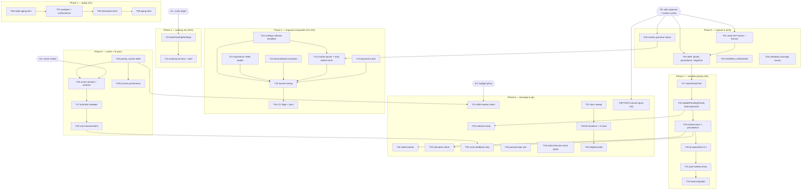

# Priority System — SUPERB Pareto Execution Plan

**Created:** 2026-09-12 14:19 (interactive owner session)
**Input:** `docs/status/2026-09-12_14-03_priority-projection-design-research.md`
(design v2 + §f 50-item backlog + §g open questions) and the owner's Pareto
directive. All research provenance tags ([v] verified / [a] sub-agent) carry
over from that report.

**Goal:** a 2000-issue / 50-project backlog that stays well organized —
owner-intent ordering, no starvation, self-correcting priorities, bounded AI
cost — integrated from project-meta (importance) and ai-task-prioritizer
(ideas only), without breaking a single tq invariant.

---

## 0. Decision gates & default assumptions

The three §g questions become gates with working defaults so execution never
blocks; the owner can flip any default and only the gated tasks change.

| Gate | Question | Default assumption | Gates |
| ---- | -------- | ------------------ | ----- |
| **G0** | Plan approval + marker syntax (`— P1:` … `— P4:` proposed) | approved on silent acceptance of this plan | TODO_LIST minting (T39), marker parser (T12) |
| **G1** | 2000/50 is a real 12-month target vs aspiration | **real target** | admission control (T23, T24), onboarding follow-ups |
| **G2** | importance scales per-repo budget vs global-flat | **ordering-only, budget stays flat** | effort-aware claims (T31) |
| **G3** | scorer model: repo `.crushrc` vs cheaper tier | **reuse `.crushrc` model, measure first** | AI pass (T26–T28) |

## 1. Non-negotiable invariants (anti-verschlimmbessern contract)

1. **Store invariants untouched**: single serialized writer, facts in the
   same tx as state, `RowsAffected()` re-checks stay (AGENTS.md).
2. **Zero new dependencies** — pure Go, `CGO_ENABLED=0`; project-meta is
   read via its flat YAML contract only (PROPRIETARY license), ATP is
   idea-only; any ported table is REWRITTEN from spec, never copied.
3. **Phase 1 lands with zero schema churn** — aging is a claim-query term.
4. **Priority never mutates running/terminal tasks** — PENDING only.
5. **Band ladder is total and documented before code**: machine (150+) >
   hot (100–149) > backlog (0–99); cqa migrates 80 → 150-band; precedence
   human marker > hot > AI > keyword > default; minted tasks keep
   inheritance. One scale (0–100), one threshold table, tested both
   directions.
6. **Dedup keys hash marker-stripped text** — priority edits must never
   fork tasks; prune-stale reword semantics preserved.
7. **`runRepo` refactor precedes priority wiring** (gocognit 38 → extract
   first; behavior-identical, tests green before new logic).
8. Tests hermetic (no host tools in nix checkPhase); POSIX suites carry
   `//go:build unix`; every backend change lands sqlite + postgres +
   conformance together.
9. **No TODO_LIST.md minting before G0** — unchecked items are live pool
   food (spends money).
10. `.tq-verify` / ENV-SELF-CONTAINED / footer rules untouched.

## 2. Pareto breakdown

### The 1% that delivers 51%

**Aging at claim + importance-based base priority at harvest.**
Four small tasks (T06, T07, T11, T15 ≈ one day of agent windows) make the
queue owner-intent ordered across 50 projects AND starvation-free — the two
failure modes that make a 2000-item backlog "not organized". Everything
else refines this.

### The 4% that delivers 64%

**Self-correcting ordering** (T12–T14, T17–T22): per-item markers without
dedup forking, keyword fallback, `task.reprioritized` + `tq reprioritize`
so importance changes propagate to already-pending tasks, band migration
for existing data. The queue stops being a snapshot of enqueue-time truth.

### The 20% that delivers 80%

**Working set + visibility** (T08, T09, T23–T25, T29, T32): admission
control (`MaxPendingPerRepo`) keeps prompts fresh and AI cost O(working
set); the score cache table; webui band/importance surfaces. Hardening of
the aging core (interaction tests) lives here too.

### The other 20% (→ 100%)

**Intelligence & operations** (T01–T05, T26–T28, T30–T40): capture/ADR
(they gate correctness, not user value), batch AI scorer + budget gating +
cost model, unblock bump, effort-aware claims, starvation alarm, feedback
loop, paused-repo rule, status/session-close integration, docs, lint
baseline, TODO harvest, dogfood pilot.

## 3. Execution graph

## 4. L1 comprehensive plan — 40 tasks, 30–100 min each

Sorted by impact (tier), then value, then effort. "Order" = recommended
execution sequence (dependencies first). Est = focused agent-window minutes.

| Order | ID | Task (deliverable) | Tier | Impact | Value | Est | Depends |
| ----- | -- | ------------------ | ---- | ------ | ----- | --- | ------- |
| 1 | T06 | sqlite `ClaimDue` aging term (`priority + LEAST(age/AgingDays, AgeBonus)`) + config flag + failing-test-first unit | 1% | H | H | 90 | — |
| 2 | T07 | postgres aging term + mirrored conformance case | 1% | H | H | 60 | T06 |
| 3 | T11 | strict `.config/metadata.yaml` importance reader (default 50, malformed ⇒ repo skip reason) + unit + fuzz corpus | 1% | H | H | 60 | — |
| 4 | T15 | harvest wiring: computed effective priority from importance(+marker/keyword), Config fields, defaults | 1% | H | H | 60 | T10, T11, T14 |
| 5 | T10 | `runRepo` extraction refactor (behavior-identical; gocognit 38 → <25) — enabler, zero feature | enabler | H | M | 90 | — |
| 6 | T17 | `task.reprioritized` fact type (old,new,source,reason) + journal append/replay + tests | 4% | H | H | 45 | T02 |
| 7 | T18 | store `UpdatePendingPriority` (PENDING-only guard, in-tx fact) sqlite + postgres | 4% | H | H | 90 | T17 |
| 8 | T19 | conformance + precedence resolution (hot 100–149 & machine 150+ bands never overwritten; same-value ⇒ no fact) | 4% | H | H | 60 | T18 |
| 9 | T12 | marker parser (`— P1:`..`P4:`) + strip-before-dedup-hash + hash-stability + prune-stale reword tests + fuzz | 4% | H | H | 60 | T05, T10 |
| 10 | T14 | formula/band constants package + two-direction tests + exported ladder for webui | 4% | H | H | 45 | T02 |
| 11 | T13 | keyword scorer (rewritten table: security +30, critical/urgent +25, production/breaking +20, base 50, cap 100) + table tests | 4% | H | M | 45 | T01 |
| 12 | T22 | band migration for live journal (cqa 80→150-band, hot values, backup + offline run + verify) | 4% | H | M | 45 | T19 |
| 13 | T23 | `MaxPendingPerRepo` admission knob + tests (admit-below-K, skip-at-K, no-starve-small-K) | 20% | H | H | 60 | G1 |
| 14 | T25 | `priority_scores` table both backends (item_key, score, effort, source, reasoning, tokens, scored_at) + upsert/read + conformance; share dedup-key derivation | 20% | H | H | 90 | T19 |
| 15 | T32 | webui: band badge, importance column, `--band` filter (templ generate + webui-css regen + adoption-table rows if components used) | 20% | H | M | 90 | T19 |
| 16 | T02 | ADR: band ladder, precedence table, aging-key decision (created_at vs last-requeue, with evidence), migration story, rejected alternatives | +20% | H | H | 90 | T01 |
| 17 | T01 | spot-verify ATP claims (weights sum, stub cite, cache key, dedupe=AST) + read ATP LICENSE + write porting-rules note | +20% | H | M | 30 | — |
| 18 | T04 | sibling-repo `.config/metadata.yaml` coverage survey + pilot-importance proposal (tq, CV, SystemNix) | +20% | H | M | 30 | — |
| 19 | T05 | marker grammar compatibility check (check-todo-list.sh, status-sweeper parse, prune-stale) + syntax decision note | +20% | H | M | 30 | — |
| 20 | T39 | mint G0-approved items into TODO_LIST.md (machine-parseable, no BLOCKED) + check-todo-list gate | +20% | H | M | 30 | G0, T02 |
| 21 | T27 | prioritize sweeper: mint per-repo batch scorer tasks (dedup `prioritize:<repo>:<key-hash>`), apply verdicts as repri facts, budget-gated | +20% | H | M | 100 | T26 |
| 22 | T26 | batch scorer agent prompt (score+effort+confidence per item, `TQ_RESULT` JSON contract) + payload type + argv-contract-style test | +20% | H | M | 60 | T25, G3 |
| 23 | T40 | dogfood pilot: enable flags in SystemNix proposal, watch first window, report | +20% | H | M | 45 | T37 |
| 24 | T08 | aging interaction tests: ×NotBefore ladder, ×requeue/reclaim, ×project exclusivity, clock boundaries | 20% | M | H | 60 | T07 |
| 25 | T09 | aging docs (scheduling-not-state principle) + webui effective-rank hint | 20% | M | M | 30 | T08 |
| 26 | T16 | `tq harvest --priority-from importance` flags + help + docs | 4% | M | M | 30 | T15 |
| 27 | T20 | `tq reprioritize` CLI (full pending scan, dry-run, value-idempotent) | 4% | M | H | 45 | T19 |
| 28 | T21 | agent-pool pre-actor repri sweep (prune-stale pattern) + idempotency proof test | 4% | M | H | 60 | T20 |
| 29 | T24 | working-set docs (queue=working set, TODO=warehouse) + repri-scan perf assertion | 20% | M | M | 30 | T23 |
| 30 | T29 | `tq show` score provenance section (source, age, reasoning) + test | 20% | M | M | 30 | T25 |
| 31 | T30 | unblock bump at repri time (dependents COUNT; verify deps.task_id index) + tests | +20% | M | M | 60 | T18 |
| 32 | T33 | starvation alarm (oldest-pending-below-band threshold) → PapDashboard bridge pattern + test | +20% | M | M | 45 | T19 |
| 33 | T34 | score feedback loop: review verdicts tagged by score source + calibration report | +20% | M | M | 60 | T27 |
| 34 | T36 | status-report prompt band-drift section + session-close parity | +20% | M | M | 45 | T19 |
| 35 | T37 | docs sweep: CHANGELOG, FEATURES, README, SECURITY, AGENTS conventions | +20% | M | M | 45 | all features |
| 36 | T38 | lint-baseline check (regen only if policy-owned) + full ci-local | +20% | M | M | 30 | T37 |
| 37 | T03 | DOMAIN_LANGUAGE.md vocabulary (Importance, Item Score, Effective Priority, Band, Working Set, Aging, Unblock Bump, Score Cache) | +20% | M | M | 30 | T02 |
| 38 | T28 | AI cost measurement (tokens/$ per working-set refresh) + cadence recommendation report | +20% | M | M | 30 | T27 |
| 39 | T31 | effort-aware claim preference under low remaining budget (G2-gated) | +20% | M | M | 90 | T25, G2 |
| 40 | T35 | paused-repo rule: importance=none(0) ⇒ no auto-admission + test + docs | +20% | L | M | 30 | T23 |

**L1 totals:** 40 tasks ≈ 2,400 min (~40 agent windows). Tier 1% = 4 tasks
(360 min) — ship those first and the backlog is already "well organized".

## 5. L0 micro plan — every task ≤ 12 min

Pattern per implementation task: recon → types → impl → test → gate → docs.
Module gate = `cd <module> && export GOEXPERIMENT=jsonv2 && GOWORK=off go
build ./... && go vet ./... && go test ./... -count=1`.

### Phase 0

| ID | Step | Est | Dep |
| -- | ---- | --- | --- |
| T01.1 | Read ATP service.go:66-85, verify weights sum 1.0 ±0.01 | 10 | — |
| T01.2 | Verify stub cite next_task_issue_conversion.go:101-110 | 8 | T01.1 |
| T01.3 | Verify analysis_cache.go content-hash key + TTL 24h | 10 | — |
| T01.4 | Verify dedupe.go is AST/code dedup (not issue dedup) | 8 | — |
| T01.5 | Read ATP LICENSE; write porting-rules note (rewrite-from-spec only) | 10 | — |
| T01.6 | Record [v] provenance flips in the ADR notes | 6 | T01.5 |
| T02.1 | Draft ADR skeleton + status-quo section | 12 | T01 |
| T02.2 | Band ladder + migration table (incl. cqa 80→150) | 12 | T02.1 |
| T02.3 | Precedence table (marker > hot > ai > keyword > default; inheritance) | 12 | T02.2 |
| T02.4 | Aging-key decision w/ requeue evidence + parameters | 12 | T02.3 |
| T02.5 | Rejected alternatives + risks section | 10 | T02.4 |
| T02.6 | Self-review pass, commit ADR | 10 | T02.5 |
| T03.1 | Draft 8 vocabulary entries with cross-refs | 12 | T02 |
| T03.2 | Link from AGENTS.md conventions paragraph | 8 | T03.1 |
| T04.1 | Check pool repos + ~/projects for `.config/metadata.yaml` | 10 | — |
| T04.2 | Record coverage table + pilot proposal (3 repos) | 10 | T04.1 |
| T05.1 | Grep grammar guards: check-todo-list.sh, status parse, prune-stale | 10 | — |
| T05.2 | Marker syntax proposal + collision counterexamples | 10 | T05.1 |
| T05.3 | Decision note into ADR | 6 | T05.2 |

### Phase 1 — aging

| ID | Step | Est | Dep |
| -- | ---- | --- | --- |
| T06.1 | Read ClaimDue + write failing test: aging flips claim order | 12 | — |
| T06.2 | Add aging SQL term + constants (AgingDaysPerPoint, MaxAgeBonus) | 12 | T06.1 |
| T06.3 | Config plumbing: worker/pool flag + defaults doc | 10 | T06.2 |
| T06.4 | sqlite module gate green | 10 | T06.3 |
| T07.1 | Port term + write failing postgres conformance case | 12 | T06 |
| T07.2 | Implement + module gate green | 12 | T07.1 |
| T07.3 | Conformance suite run both backends | 10 | T07.2 |
| T08.1 | Test aging × NotBefore (future task stays gated) | 12 | T07 |
| T08.2 | Test aging × requeue/reclaim (retried task not doubly aged per ADR key) | 12 | T08.1 |
| T08.3 | Test aging × project exclusivity + clock boundary values | 12 | T08.2 |
| T09.1 | AGENTS/DOMAIN docs: aging is scheduling, not state | 10 | T08 |
| T09.2 | Webui effective-rank hint text + test | 10 | T09.1 |

### Phase 2 — enqueue composite

| ID | Step | Est | Dep |
| -- | ---- | --- | --- |
| T10.1 | Outline runRepo extraction (scanItem/enqueueItem seams) | 12 | — |
| T10.2 | Extract helpers, behavior-identical, no logic change | 12 | T10.1 |
| T10.3 | Harvest tests green + gocognit re-check <25 | 10 | T10.2 |
| T11.1 | Strict-subset parser types + rules (flat keys, importance int) | 10 | — |
| T11.2 | Implement reader (default 50 absent; malformed ⇒ error) | 12 | T11.1 |
| T11.3 | Unit tests: valid/missing/malformed/license-nested | 10 | T11.2 |
| T11.4 | Fuzz corpus seeds + FuzzParseMetadata wired | 12 | T11.3 |
| T11.5 | Decide skip-reason wiring (ReasonScanFailed pattern) | 8 | T11.4 |
| T12.1 | Marker grammar fn + strip fn | 10 | T05, T10 |
| T12.2 | Hash-stability test: marker edit ⇒ same dedup key | 10 | T12.1 |
| T12.3 | Prune-stale reword interaction test | 12 | T12.2 |
| T12.4 | Fuzz seeds for marker parser | 10 | T12.3 |
| T13.1 | Keyword table rewritten from spec + provenance comment | 10 | T01 |
| T13.2 | Scorer fn + table-driven tests incl. cap | 12 | T13.1 |
| T14.1 | Band constants + mapping fn | 10 | T02 |
| T14.2 | Two-direction tests (score⇔band; cqa/hot bands protected) | 12 | T14.1 |
| T14.3 | Export ladder for webui/CLI reuse | 8 | T14.2 |
| T15.1 | Config fields + defaults | 10 | T11, T14 |
| T15.2 | Compose effective priority in enqueue path | 12 | T15.1 |
| T15.3 | Tests: default-50 fallback, marker override, keyword bump | 12 | T15.2 |
| T15.4 | Harvest module gate green | 10 | T15.3 |
| T16.1 | CLI flags + help text | 10 | T15 |
| T16.2 | Docs: harvest section + example | 10 | T16.1 |

### Phase 3 — mutable priority

| ID | Step | Est | Dep |
| -- | ---- | --- | --- |
| T17.1 | Fact struct + fields + validation | 10 | T02 |
| T17.2 | Journal append + replay switch case + tests | 12 | T17.1 |
| T18.1 | sqlite method: tx + PENDING guard + RowsAffected | 12 | T17 |
| T18.2 | PENDING-only guard tests (running/dead untouched) | 12 | T18.1 |
| T18.3 | postgres port + module gates both | 12 | T18.2 |
| T19.1 | Conformance case (both backends identical behavior) | 12 | T18 |
| T19.2 | Precedence resolution: band protection (hot/machine) | 12 | T19.1 |
| T19.3 | Idempotency test: same value ⇒ no fact appended | 10 | T19.2 |
| T20.1 | cmd wiring + flags + dry-run output | 12 | T19 |
| T20.2 | Help/docs + tq smoke line | 10 | T20.1 |
| T21.1 | Pool pre-actor call (prune-stale pattern) | 12 | T20 |
| T21.2 | Budget-guard around sweep | 10 | T21.1 |
| T21.3 | Tests + status-loop smoke update if surface changed | 12 | T21.2 |
| T22.1 | Enumerate live priority values (read-only `tq tasks`) | 8 | T19 |
| T22.2 | Migration mapping + offline script (backup first) | 12 | T22.1 |
| T22.3 | Run + verify + record in report | 10 | T22.2 |

### Phase 4 — working set

| ID | Step | Est | Dep |
| -- | ---- | --- | --- |
| T23.1 | Config knob + default (0=off) | 8 | G1 |
| T23.2 | Admission logic in enqueue loop | 12 | T23.1 |
| T23.3 | Tests: admit-below-K, skip-at-K, no-starve-small-K | 12 | T23.2 |
| T23.4 | CLI flag + help | 8 | T23.3 |
| T24.1 | Working-set docs section | 10 | T23 |
| T24.2 | Repri-scan perf assertion test (bounded rows) | 10 | T24.1 |

### Phase 5 — cache + AI pass

| ID | Step | Est | Dep |
| -- | ---- | --- | --- |
| T25.1 | Schema + migrate() both backends (column-exists ladder) | 12 | T19 |
| T25.2 | Upsert/read methods + tests | 12 | T25.1 |
| T25.3 | Conformance case both backends | 10 | T25.2 |
| T25.4 | Shared dedup-key derivation helper extracted + reused | 12 | T25.3 |
| T26.1 | Prompt draft: batch items → score/effort/confidence JSON | 12 | T25, G3 |
| T26.2 | Payload type + sweeper-side parse | 10 | T26.1 |
| T26.3 | Contract test (argv/`TQ_RESULT` shape) | 12 | T26.2 |
| T27.1 | Sweeper skeleton + cursor (head-bootstrapped) | 12 | T26 |
| T27.2 | Mint dedup key `prioritize:<repo>:<hash>` + guard | 10 | T27.1 |
| T27.3 | Apply verdicts as repri facts via precedence | 12 | T27.2 |
| T27.4 | Budget gate class for scorer tasks | 10 | T27.3 |
| T27.5 | Tests + AGENTS payload-contract entry | 12 | T27.4 |
| T28.1 | Instrument tokens/cost per refresh | 10 | T27 |
| T28.2 | Run on working set, record numbers | 10 | T28.1 |
| T28.3 | Cadence recommendation (report) | 8 | T28.2 |
| T29.1 | `tq show` provenance section | 10 | T25 |
| T29.2 | Test + formatting | 10 | T29.1 |

### Phase 6 — leverage & ops

| ID | Step | Est | Dep |
| -- | ---- | --- | --- |
| T30.1 | Verify deps.task_id index (EXPLAIN QUERY PLAN) | 8 | T18 |
| T30.2 | Dependents-count query + bump in repri + tests | 12 | T30.1 |
| T31.1 | Budget remaining API surface read | 8 | T25, G2 |
| T31.2 | Effort preference in pool tick ordering + tests | 12 | T31.1 |
| T31.3 | Flag + docs | 8 | T31.2 |
| T32.1 | fragments: band badge component + tests | 12 | T19 |
| T32.2 | Importance column + definition-list entry | 10 | T32.1 |
| T32.3 | `--band`/`--min-importance` filters + URL params + tests | 12 | T32.2 |
| T32.4 | `templ generate` + `nix run .#webui-css` + adoption-table rows | 12 | T32.3 |
| T33.1 | Starvation threshold query + test | 10 | T19 |
| T33.2 | PapDashboard notify wiring (NotifyDeadPool pattern) + test | 12 | T33.1 |
| T34.1 | Tag review verdicts with score source (read-model join) | 12 | T27 |
| T34.2 | Calibration report (source × verdict rates) | 10 | T34.1 |
| T35.1 | importance=none ⇒ skip admission rule + test | 10 | T23 |
| T35.2 | Docs note | 6 | T35.1 |
| T36.1 | Status-prompt band-drift section + prompt test | 12 | T19 |
| T36.2 | Session-close report band summary parity | 10 | T36.1 |
| T37.1 | CHANGELOG entry (all phases) | 10 | features |
| T37.2 | FEATURES.md inventory rows | 10 | T37.1 |
| T37.3 | README + SECURITY.md (no new endpoints; aging/priority semantics) | 12 | T37.2 |
| T37.4 | AGENTS.md conventions + payload contracts | 10 | T37.3 |
| T38.1 | lint-baseline check script run; regen ONLY if policy-owned | 10 | T37 |
| T38.2 | Full ci-local (CI_CHECK on) green | 12 | T38.1 |
| T39.1 | Mint G0-approved items to TODO_LIST.md (checkbox lines) | 10 | G0, T02 |
| T39.2 | check-todo-list.sh green | 6 | T39.1 |
| T40.1 | SystemNix flag proposal (importance/aging/repri on) | 10 | T37 |
| T40.2 | Watch first window (dogfood) + record band behavior | 12 | T40.1 |
| T40.3 | First-window report + calibration follow-ups | 10 | T40.2 |

**L0 totals:** 136 steps ≈ 1,380 min; largest step 12 min. Every L1 task
decomposes fully — nothing unaccounted.

## 6. Verification ladder

1. Per-step: the step's own test (red → green).
2. Per-task: module gate (`GOWORK=off` build+vet+test -count=1 with
   `GOEXPERIMENT=jsonv2`).
3. Backend tasks: conformance suite, both stores, same session.
4. Cross-cutting: root race suite + ci-local (master-CI check ON) before
   any window claims DONE.
5. Docs: doc gates (status-index, todo-list, doc-refs) in ci-local.
6. Claims-carry-citations: DONE notes cite the gate run.

## 7. Risks & abort criteria

| Risk | Mitigation | Abort signal |
| ---- | ---------- | ------------ |
| Aging double-counts retried tasks | aging-key decided in T02 with requeue evidence (default: age from created_at, cap bonus) | interaction test red ⇒ freeze phase 1, revisit ADR |
| Marker × dedup fork | strip-before-hash + stability test before any wiring | hash-stability test red ⇒ T12 blocked |
| Dual-backend drift | conformance case lands WITH each backend step | any conformance divergence blocks merge |
| Band migration corrupts live journal | offline script, backup, enumerate-first (T22.1) | row count mismatch ⇒ restore + stop |
| AI pass cost overrun | budget-gated sweeper + T28 measurement before cadence | $/refresh above budget class ⇒ G3 revisit |
| Verschlimmbessern | invariants §1; runRepo refactor is behavior-identical and gated; zero-dep rule | any invariant break = revert that task |

## 8. Out of scope (deliberate)

- Per-repo budget scaling (G2 default: flat) — revisit after pilot.
- Issue-dedup across projects (ATP has none to port; tq dedup stays exact).
- Cross-repo dependency inference at harvest (DAG deps stay explicit).
- project-meta tags in the formula (visibility only, T32).
