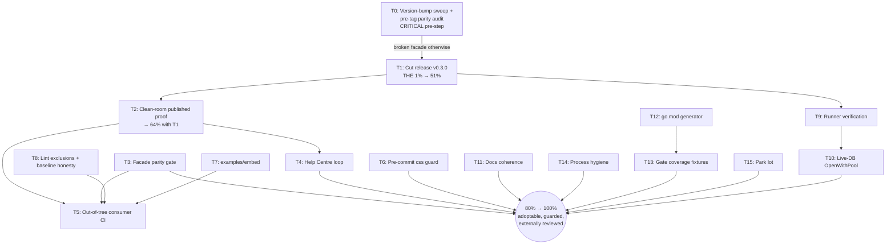

# Plan: monetize the facade work — Pareto execution plan (facade adoption)

**Created:** 2026-09-13 06:43 CEST
**Context:** The external-adoption feedback (docs/feedback/new/2026-09-13_external-adoption-blocked-by-internal-paths.md)
has been EXECUTED: seven public facade modules (ADR-0016), `postgres.OpenWithPool`,
references doc, README overhaul, all gates wired, ci-local FULLY GREEN
(aed920b, 2ac3e24). The work is one release cut away from being real for the
first external consumer. This plan sequences ALL remaining known items
(the status report's §f 1-50) by impact, split twice: 30-100min tasks, then
≤12min subtasks.

**Prime directive (§5):** the multi-module release machinery, the daemon
commit flow, and the gates are load-bearing and subtle (vendorHash, tag
immutability, proxy behavior, lint baseline). Every task below touches ONE
seam at a time, verifies against the existing gates, and NEVER regenerates
baselines or rewires scripts as a side effect.

---

## The Pareto cut

### The 1% → 51% of the result

**Cut the release (v0.3.0).**
Everything shipped this session is inert on the proxy until
`scripts/release.sh v0.3.0 --tag && scripts/release.sh v0.3.0 --push` runs:
no facade is `go get`-able, OpenWithPool doesn't exist for consumers, the
Help Centre stays forked-and-drifting, and all downstream items (docs on
pkg.go.dev, conformance offer, adoption) are blocked behind it. One command
sequence, owner-gated, delivers the majority of the total outcome. (The cut
is only valid after T0's version-bump sweep + parity audit — see the task
table; tags are immutable.)

### The 4% → 64% (the 1% plus)

1. **Cut the release** (above).
2. **Prove the release from a clean room:** `go get` + build + run a
   consumer module against the PUBLISHED facades (no replaces), verify
   pkg.go.dev renders all seven modules and `OpenWithPool`. Without this
   step we don't KNOW the 51% actually landed — the proxy has burned us
   before (stale-tag class: worker facade resolved journal@v0.2.0 and lost
   `journal.Reprioritized`).

### The 20% → 80% (the 4% plus, in impact order)

3. **Facade parity guard** — filesystem AST walk comparing exported decls
   of each `internal/<pkg>` against the facade alias file; fails the gate
   on a missing alias. Closes the only structural hole ADR-0016 left open
   (b2). Small, self-contained, protects the public contract forever.
4. **Help Centre loop closed** — reply/notify their channel that facades
   landed, accept the conformance offer, open a tracking issue for the
   port diff. Converts a one-way fix into an external review pipeline.
5. **Pre-commit css drift guard** — the unminified app.css sat on master
   ~12h because the check only runs in ci-local; the daemon folds in
   whatever is on disk. Move (or duplicate) `check-webui-css.sh` to
   pre-commit for `internal/webui/static/app.css` changes only.
6. **In-repo embedder example on facade paths** (`examples/embed/`) —
   dogfoods the public surface, becomes the copy-paste starting point for
   every future adopter, and catches facade rot in-repo instead of via an
   angry issue.
7. **Honest baseline maintenance** — facade-scoped lint exclusions
   (gochecknoglobals on alias files: by-design), regen baseline with an
   honest shrink, update AGENTS.md's stale "~400" prose number.
8. **Docs coherence pass** — FEATURES.md facade entry, ROADMAP movement
   (Postgres CLI wiring un-blocked narrative), link the profile doc from
   README, DOMAIN_LANGUAGE "facade module" term, VERSION-SURFACES facades
   as the 8th surface.

### The remaining 80% → 100%

Everything else from §f, batched below: CI verification on runners
(9-10), live-DB OpenWithPool proof (11), tooling ergonomics (go.mod
generator 19, feedback lifecycle 20, daemon-revert investigation 21),
hygiene sweeps (22, 25, 29, 38, 39, 41, 46-48), and park-lot items
(27-28, 30-35, 37, 42-45, 49-50).

---

## Task table — 30-100min tasks (sorted by importance / impact / effort / customer-value)

| # | Task (T-ID) | Items covered | Impact | Effort | Value | Why this order |
|---|-------------|---------------|--------|--------|-------|----------------|
| 0 | **T0: Version-bump sweep + pre-tag parity audit** (all internal requires v0.2.0 → the cut version in root + 7 facade go.mods + internal cross-requires; tidy ×16; manual parity diff per facade) | NEW (flaw fix) | blocker | 30-45min | ★★★ | CRITICAL: queue/postgres facade pins internal/queue/postgres@v0.2.0 — a tag that PREDATES OpenWithPool. In-repo replaces hide it; on the proxy the published facade would not compile. Also: v0.3.0 scope must be confirmed with the owner (05-29 report earmarks v0.3 for Postgres CLI wiring) |
| 1 | T1: Cut release v0.3.0 (CHANGELOG section, flake version+ldflags bump, `release.sh v0.3.0 --tag`, CI-green poll, `--push`, GH Release) | §f 1, 40 | **51%** | 60-100min | ★★★ | The 1%. Everything else is blocked behind it — but ONLY valid after T0 |
| 2 | T2: Clean-room published-consumer proof (go get facades, build+run, pkg.go.dev check ×7, `go list -m -versions` per facade) | §f 2, 3, 32 | 13% | 30-45min | ★★★ | The 4%. Without proof the release is unverified |
| 3 | T3: Facade parity gate (`scripts/check-facade-parity.sh`, go/parser over internal pkgs vs alias files, wire into ci-local + ci.yml) | §f 6, b2 | 6% | 60-90min | ★★★ | Closes ADR-0016's structural hole permanently |
| 4 | T4: Consumer loop — notify Help Centre, tracking issue for port diff + conformance | §f 4, 16, 43 | 4% | 30min | ★★★ | External review pipeline, near-free |
| 5 | T5: Permanent out-of-tree consumer CI job (fixture module built with GOPROXY=direct against released tags) | §f 35, 49 | 3% | 45-60min | ★★☆ | Regression net for the public contract on every push |
| 6 | T6: Pre-commit css drift guard (daemon-exclusion or hook for app.css only) | §f 8, d-class | 3% | 30-45min | ★★☆ | Kills a recurring master-red class at the commit boundary |
| 7 | T7: `examples/embed/` on facade paths (sqlite + postgres variants, README snippet parity) | §f 13, 34 | 2% | 45-60min | ★★☆ | Adopter on-ramp + in-repo facade dogfood |
| 8 | T8: Facade lint exclusions + honest baseline regen + AGENTS.md "~400" correction | §f 7, 39 | 2% | 30-45min | ★★☆ | Baseline honesty; removes ~20 by-design findings |
| 9 | T9: Runner verification — first push with facade loop, watch Windows jobs + postgres service job run the new tests | §f 10, 24 | 1.5% | 30min (mostly waiting) | ★★☆ | Cheap; catches runner-only drift class early |
| 10 | T10: Live-DB OpenWithPool proof (throwaway initdb cluster like the 04-15 fullcore recipe, run conformance + pool test) | §f 11, 45 | 1% | 30-45min | ★★☆ | Closes status report §b1 |
| 11 | T11: Docs coherence pass (FEATURES/ROADMAP/README link/DOMAIN_LANGUAGE/VERSION-SURFACES/ADR index) | §f 15, 17, 18, 41, 47 | 1% | 45-60min | ★★☆ | Keeps the doc fleet from split-braining |
| 12 | T12: go.mod generator helper for new modules (require+replace scaffolding, kills the d1 failure class) | §f 19 | 0.5% | 30-45min | ★☆☆ | Tooling for the NEXT module |
| 13 | T13: Hygiene sweep — release-gates fixture for facade go.mods (positive + v0.0.0 poison), dependabot entries for facade go.mods, `^internal` script grep | §f 31, 33, 48 | 0.5% | 45-60min | ★☆☆ | Gate coverage for the new module class |
| 14 | T14: Process hygiene — feedback lifecycle convention, daemon-revert investigation writeup, stale prose fixes (lint counts), dprint pass on new docs | §f 20, 21, 22, 46 | 0.5% | 30-60min | ★☆☆ | Environment debt from this session |
| 15 | T15: Park-lot batch (doctor facade-skew check, alias-only lint rule, maxConns=0 conformance line, darwin test-loop check, ROADMAP promotion note) | §f 27, 28, 30, 37, 44 | 0.3% | 60-100min | ★☆☆ | Only after 1-11 |

## Subtask table — ≤12min each (execution checklist, same sort)

| # | Subtask | Belongs to | ≤12min because |
|---|---------|-----------|----------------|
| 0.1 | Owner scope call: v0.3.0 = facades only, or facades + Postgres CLI wiring (05-29 report earmarked v0.3 for it)? | T0 | one question |
| 0.2 | Sweep: sed all internal requires v0.2.0 → v0.3.0 in go.mod + 7 facade go.mods + internal cross-requires | T0 | loop + verify |
| 0.3 | `go mod tidy` × 16 modules; rebuild + retest module loop | T0 | loop |
| 0.4 | Verify the sweep: `queue/postgres` facade resolves OpenWithPool from the PINNED version, not the replace (GOWORK=off + GOFLAGS=-mod=mod spot check; full proof is T2) | T0 | targeted check |
| 0.5 | Manual parity audit: `go doc -all ./internal/<pkg>` exports vs facade alias file, ×7 (the 12-min spike of T3, done pre-tag because tags are immutable) | T0 | diff ×7 |
| 1.1 | Write `## [v0.3.0] - 2026-09-13` CHANGELOG section from [Unreleased] | T1 | pure edit |
| 1.2 | Bump flake.nix version attr + ldflags line to 0.3.0 | T1 | 2-line sed, gate-checked |
| 1.3 | Run `release.sh v0.3.0` (gates-only, safe mode) and fix anything it flags | T1 | read-only gate run |
| 1.4 | Confirm master CI green (`check-ci`) before tagging | T1 | gh run list |
| 1.5 | `release.sh v0.3.0 --tag`; verify all 16 tags cut (root + 15 module dirs incl. internal/journal/cqrs; count with `git tag --list '*v0.3.0'` — NOT 22, that number was wrong) | T1 | command + count |
| 1.6 | `release.sh v0.3.0 --push`; watch CI on the tag; GH Release publishes | T1 | owner-gated command + poll |
| 2.1 | Clean-room: fresh /tmp module, `go get` all 7 facades (NO replaces), build | T2 | single command chain |
| 2.2 | Run enqueue→claim→complete consumer against published facades | T2 | reuse session proof main.go |
| 2.3 | pkg.go.dev check ×7 + `go list -m -versions` ×7 | T2 | browser + loop |
| 2.4 | Record evidence (URLs, go.sum, run output) into the release retro | T2 | file append |
| 3.1 | Spike: go/parser walk of one internal package's exported decls (≤80 lines) | T3 | single-file prototype |
| 3.2 | Compare-walk against task facade alias file; settle AST-matching rules (types/consts/vars/funcs) | T3 | design lock |
| 3.3 | Generalize to the 7 pairs, table-driven | T3 | loop over pairs |
| 3.4 | Write `check-facade-parity.sh`, wire into ci-local + ci.yml lint step | T3 | one hook each |
| 3.5 | Negative test: remove an alias, gate must fail; restore | T3 | poison-pattern proof |
| 4.1 | Draft the Help Centre reply (github-voice, verified claims only) | T4 | text only |
| 4.2 | Open tracking issue "external consumer conformance + port diff" | T4 | gh issue create |
| 5.1 | Choose mechanism: pre-commit hook vs daemon path-exclusion; write one-page decision | T5 (css) | decision doc |
| 5.2 | Implement + test the guard (commit an unminified css → hook must block) | T5 (css) | fixture test in /tmp |
| 6.1 | Scaffold examples/embed (go.mod on facade paths, main.go) | T6-ex | copy of session proof |
| 6.2 | Postgres variant + README snippet sync | T6-ex | small file |
| 6.3 | Wire into ci-local dead-export/lint skips if flagged | T6-ex | config line |
| 7.1 | Add gochecknoglobals exclude for the 7 facade files in .golangci.yml | T7-lint | config block |
| 7.2 | Regen baseline (shrink expected), update AGENTS.md 400→real number | T7-lint | regen + prose |
| 8.1 | Push, poll CI: Windows facade loop + postgres service job | T8-runner | gh run watch |
| 8.2 | Confirm new tests (OpenWithPool, facade suites) RAN on runners, not skipped | T8-runner | job log grep |
| 9.1 | Throwaway initdb on 127.0.0.1:5543x (04-15 recipe), TQ_TEST_POSTGRES set | T9-db | known recipe |
| 9.2 | Run postgres conformance + OpenWithPool pool test against it | T9-db | one test command |
| 10.1 | FEATURES.md facade row; ROADMAP: un-block Postgres CLI wiring narrative | T10-docs | 2 edits |
| 10.2 | README link to profile doc; DOMAIN_LANGUAGE facade term | T10-docs | 2 edits |
| 10.3 | VERSION-SURFACES: facades as 8th surface; docs/adr/INDEX.md | T10-docs | 2 files |
| 11.1 | Write scripts/new-module.sh scaffold (module path → go.mod with requires+replaces) | T11-gen | ≤80 lines |
| 11.2 | Prove it: scaffold a throwaway module, build, trash | T11-gen | /tmp proof |
| 12.1 | release-gates fixture: facade go.mod positive + v0.0.0-require poison | T12-hyg | fixture go.mods |
| 12.2 | dependabot.yml: add facade go.mod directories | T12-hyg | config edit |
| 12.3 | grep scripts for `^internal`-only assumptions; fix stragglers | T12-hyg | grep + edits |
| 13.1 | docs/feedback lifecycle convention (one paragraph + README header) | T13-proc | tiny doc |
| 13.2 | Daemon-revert investigation: identify the 06:13-06:14 rewriter; write up | T13-proc | log archaeology |
| 13.3 | dprint pass over this plan + status report | T13-proc | formatter run |
| 14.1-14.x | T15 park-lot items, one ≤12min unit each, only after T1-T13 done | T15 | individually tiny |

## Execution graph

## Sequencing rules (VERSCHLIMMBESSER-prevention)

0. **T0 before the tag, always** — a facade whose go.mod pins an internal
   version that predates its aliases' symbols ships BROKEN on the proxy
   (in-repo replaces make it look green; the version-bump sweep + pin-check
   is the only thing that catches it pre-tag). Tags are immutable.
1. **Nothing edits scripts/ or gates while T1's release tree must stay
   byte-stable** — release.sh requires a clean tree; T3/T6/T8 land AFTER
   `--push`, or on separate commits BEFORE 1.1 that re-run ci-local.
2. **No baseline regen without a named policy reason** (this session's
   accidental regen taught that lesson — see status report §d4).
3. **No go.mod hand-writing** — T12's generator is the required tool for
   any future module work.
4. **Every task ends at a green gate**; anything red blocks the next task.
