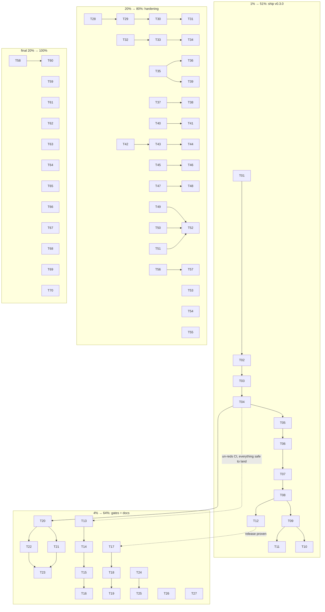

# Pareto execution plan — post-v0.3.0-sweep window (the superb sequencing)

**Date:** 2026-09-13 08:54 CEST · **Source:** full docs-health AUDIT (2026-09-13_08-49 report) + the open TODO_LIST surface (every open row triaged below — nothing dropped) + the 2026-09-13 cqrs/facade report residue.
**Method:** Pareto decomposition (1% → 51%, 4% → 64%, 20% → 80%, remaining 20% → 100%), then every task split to ≤12-minute micro-tasks. Sorted by impact ÷ effort, ties broken by customer value (external adopter > operator > agent hygiene).

**Verschlimmbesserung guards (read before executing anything):**
- The v0.3.0 tags are CUT but the release flow is TWO-PHASE (`release.sh --tag` done by the sweep's pre-cut, `--push` owner-run per docs/release/RELEASE.md). Never re-tag; never `git push --tags` blindly — push the v0.3.0 set EXPLICITLY and exactly once (published tags are immutable; the proxy does not forgive).
- Never lower a module `go` directive; never run bare `go mod tidy` in a leaf module (the documented red-master class, three occurrences this window).
- Every smoke/scratch run exports `TQ_DB=<scratch>`; the env DB is production.
- Docs stay manual-format; docs gates (status-index, doc-refs, features-roadmap, todo-list, ghost-archives) run after every docs task.
- Agents never push WITHOUT this plan's explicit owner authorization (given 2026-09-13 for the plan doc; the tag push stays its own confirmed step M1).

---

## 1. The Pareto cut

### 1% → 51% of the result

**Ship v0.3.0.** Push master + the pre-cut v0.3.0 tag set, run `release.sh --push`, verify proxy/pkg.go.dev/clean-room install, notify the waiting external consumer (Help Centre), flip the FEATURES facade row. This single thread un-reds the only red CI job, converts seven facade modules from dead weight to product, closes the original adoption blocker, and retires ~6 TODO rows in one motion. Everything else in this plan is worth less than this.

### 4% → 64% of the result

1. The full v0.3.0 release verification loop (M1–M3 below).
2. **FEATURES CI-freshness gate** — two of this week's three stale doc rows were CI-state prose; a `check-features-ci.sh` (gh run list vs the FEATURES CI rows) makes the doc-lie class mechanically impossible.
3. **cqrs-lint advisory CI gate** — the config exists and scans clean; an unwired gate is documentation. Wiring it is one ci-local step + ci.yml parity.
4. **Docs-health continuation:** annotate+archive the 2026-09-12 batch, regroup TODO_LIST, document the archive-annotation bar and the todo-gate marker list.

### 20% → 80% of the result

Adds: journal-drift audit spike (machine-checks the ADR-0001 invariant), hermetic fullcore smoke (incl. the postgres variant recipe), reviews smoke, `tq enqueue` production-DB guardrail, `tq doctor --hygiene`, `tq pool-health`, session-close smoke, and the small rate-limit/observability batch (row 236).

### Remaining 20% → 100%

The long tail: session triggers 1–3, prioritize pilot enablement (owner spend call), CI ergonomics (concurrency group, module-loop consolidation, version pin unification), the small webui/CLI polish ideas, and ONE consolidated owner-rulings package so the ~15 BLOCKED rows stop blocking by diffusion.

---

## 2. Macro plan (30–100 min tasks, ALL open TODOs routed)

| ID | Task (30–100 min) | Impact | Effort | Value | Covers (TODO/report rows) | Pareto |
|----|-------------------|--------|--------|-------|---------------------------|--------|
| M1 | **Push master + v0.3.0 tag set explicitly** (`git push origin master` + the 10 cut v0.3.0 tags, NEVER `--tags`), watch the release-gates smoke flip green | 🔥🔥🔥 | XS | External consumer unblocked | red run 34743045962; L279-supersede; f-row 1 | 1% |
| M2 | **Cut the release:** `scripts/release.sh v0.3.0 --push` path per RELEASE.md (gates already green post-M1), GitHub Release, `gh run watch` on the tag | 🔥🔥🔥 | S | Facades live on proxy | 06-31 §c1/f1–f5 | 1% |
| M3 | **Post-release verification + adopter loop:** clean-room `go get` of all 7 facades, pkg.go.dev render check, notify Help Centre (accept conformance offer), flip FEATURES facade row to FULLY_FUNCTIONAL, confirm sub-tag resolution | 🔥🔥 | S | External | 06-31 §c2/f2–f4, L134 pattern | 1% |
| M4 | **FEATURES CI-freshness gate:** `scripts/check-features-ci.sh` (parse FEATURES CI rows → assert vs `gh run list` latest master), wire into ci-local, red-probe | 🔥🔥 | M | Ops truth | 08-49 e1 | 4% |
| M5 | **cqrs-lint advisory gate:** ci-local step (non-blocking) + ci.yml parity job, provenance comment (cmd/cqrs-lint, local go-cqrs-lite), flip-later note | 🔥 | S | Quality | minted row (08-49); 08-00 §c1 | 4% |
| M6 | **Docs-health batch 2:** annotate+archive the 2026-09-12 fully-executed reports (15-43, 16-28, 08-32, 14-51, 03-21, 04-45 windows), per-report eligibility checks | 🔥 | M | Historian | L165; 08-49 b2 | 4% |
| M7 | **TODO_LIST regroup + index diet:** collapse zero-open sections, monthly-digest row for the status index, document the todo-gate marker list in the header, record the archive-note convention in AGENTS.md | 🔥 | M | Maintainer | L166; 08-49 e2/e4, §g1 | 4% |
| M8 | **Journal-drift audit spike:** read-only rebuild-from-facts diff vs tasks table (`tq audit --journal` shape), advisory output, conformance-test the ADR-0001 invariant claim | 🔥🔥 | L | Correctness | minted row (08-49); 08-01 §f5 | 20% |
| M9 | **Hermetic fullcore smoke:** `scripts/smoke/fullcore.sh` (sqlite + postgres variant, TQ_DB discipline), wire into ci-local | 🔥 | M | Regression guard | L136, L148; 04-15 §f | 20% |
| M10 | **Session-close hardening batch:** `scripts/smoke/session-close.sh`, `tq session list` + `close --dry-run`, gosec re-scan of internal/session, dead-export re-run | 🔥 | M | Feature completion | L258, L263, L270, L282 | 20% |
| M11 | **Reviews + enqueue ergonomics:** `scripts/smoke/reviews.sh` (stub reviewer), `tq enqueue` TQ_DB guardrail, `tq enqueue --wait [--timeout]` | 🔥 | M | Operator UX | L226–228 | 20% |
| M12 | **Doctor/hygiene batch:** `tq doctor --hygiene` (stale verify pins), `tq pool-health` one-shot, armed rate-limit surface already shipped → verify coverage | 🔥 | M | Ops | L229–230, L90, L298 | 20% |
| M13 | **Small rate-limit/observability batch** (row 236 decomposed): facts --commits, parked×MarkOrphaned pin, HTTP-date Retry-After fixture, stats parked JSON contract, postgres stale-fail parity, WithoutCloseout leak test, ratelimit-e2e into ci-local | ㅤ | M | Robustness | L236 | 20% |
| M14 | **CI ergonomics:** concurrency group, extract `scripts/for-each-module.sh` (4+ copies), unify golangci version pin, `golangci-lint config verify` step, master-red wording in check-ci | ㅤ | M | Cost/quality | L237, L186, L189, L224 | 20% |
| M15 | **Owner-rulings package v2:** consolidate ALL open BLOCKED rows (~15) into one dated decisions doc with recommendations + default-if-silence, link from TODO_LIST | 🔥 | S | Unblocking | L127–129, L194–196, L248–251, L279–281, L283, L299–301, f26 cluster | 20% |
| M16 | **Webui backlog slice:** priority provenance section, band-grouped board option, `--band` CLI flag, stop-request surfacing, `?since=` twin | ㅤ | L | UX | L274–276; ROADMAP webui | 80%+ |
| M17 | **Long tail:** rename-hygiene scanner, help-text smoke, secrets `--redact` pass, httpapi nosniff+lockout, executor usage `tokens` parsing, score-cache TTL, lint round-2 triage (goconst/mnd/paralleltest/testpackage) | ㅤ | L | Polish | L225, L182, L231–232, L277–278, L149 | 100% |

## 3. Micro plan (≤12 min each)

| ID | Task | ≤12 min | Parent | Depends |
|----|------|---------|--------|---------|
| T01 | List the exact v0.3.0 tag set (`git tag \| grep v0.3.0`) and diff against the 17 go.mod requires | 5 | M1 | — |
| T02 | `git push origin master` (plan doc rides this push) | 2 | M1 | T01 |
| T03 | Push the 10 v0.3.0 tags EXPLICITLY by name (never `--tags`) | 3 | M1 | T02 |
| T04 | `gh run watch` the new master run; confirm release-gates smoke green | 10 | M1 | T03 |
| T05 | Read RELEASE.md two-phase section; confirm `--push` preconditions | 8 | M2 | T04 |
| T06 | Run `scripts/release.sh v0.3.0 --push`; capture gate output to the report | 12 | M2 | T05 |
| T07 | Verify GitHub Release published + notes rendered | 5 | M2 | T06 |
| T08 | Clean-room `/tmp` module: `go get` all 7 facades @v0.3.0, build+run | 12 | M3 | T07 |
| T09 | `go list -m -versions` per module + pkg.go.dev spot-check | 8 | M3 | T08 |
| T10 | Notify Help Centre (github-voice skill, terse human register) | 10 | M3 | T09 |
| T11 | Flip FEATURES facade row → 🟢 + CHANGELOG note if release notes drifted | 5 | M3 | T09 |
| T12 | Run `go mod verify` across all modules post-release | 6 | M3 | T08 |
| T13 | Draft `check-features-ci.sh`: parse the 3 CI rows from FEATURES.md | 12 | M4 | — |
| T14 | Implement gh comparison + exit codes; gofmt/vet | 12 | M4 | T13 |
| T15 | Red-probe (doctor a row) → green restore; wire into ci-local.sh | 12 | M4 | T14 |
| T16 | ci.yml parity step for the new gate | 8 | M4 | T15 |
| T17 | Add ci-local advisory step `cqrs-lint \|\| true` + provenance comment | 6 | M5 | — |
| T18 | ci.yml advisory job parity | 8 | M5 | T17 |
| T19 | Document flip-to-hard criteria (soak window) in the step comment | 4 | M5 | T18 |
| T20 | Re-verify 15-43/16-28 residue vs TODO (per-report eligibility) | 12 | M6 | — |
| T21 | Annotate+archive the priority-window reports (15-43, 16-28) + index rows | 12 | M6 | T20 |
| T22 | Annotate+archive 08-32 DLQ window + 14-51 adapter window | 12 | M6 | T20 |
| T23 | Annotate+archive 03-21/04-45 + counter/index update, run doc gates | 12 | M6 | T22 |
| T24 | TODO_LIST: collapse `[x]`-only sections into digest lines | 12 | M7 | — |
| T25 | Status index README: monthly-digest row format decision + first digest | 12 | M7 | T24 |
| T26 | TODO_LIST header: document the 5 owner-gated markers | 5 | M7 | — |
| T27 | AGENTS.md: archive-note convention ruling (§g1 answer encoded) | 8 | M7 | — |
| T28 | Read `internal/queue` Store + journal facts surface; sketch rebuild-diff | 12 | M8 | — |
| T29 | Implement fact-replay projection (tasks map) in audit package | 12 | M8 | T28 |
| T30 | Diff vs store rows + divergence report formatting | 12 | M8 | T29 |
| T31 | Advisory CLI flag (`tq audit --journal`), tests, doc row | 12 | M8 | T30 |
| T32 | Write fullcore smoke skeleton (sqlite, scratch TQ_DB) | 12 | M9 | — |
| T33 | Add postgres variant (initdb throwaway recipe from 04-15) | 12 | M9 | T32 |
| T34 | Wire into ci-local (postgres leg env-gated) | 8 | M9 | T33 |
| T35 | session-close smoke: begin → footer commit → close → assertions | 12 | M10 | — |
| T36 | Replay-safe second-close assertion + ci-local wiring | 10 | M10 | T35 |
| T37 | `tq session list` (opened-without-closed query) | 12 | M10 | — |
| T38 | `tq session close --dry-run` preview | 10 | M10 | T37 |
| T39 | gosec re-scan internal/session + dead-export re-run; AGENTS.md note update | 12 | M10 | T35 |
| T40 | reviews.sh: stub reviewer approve path | 12 | M11 | — |
| T41 | reviews.sh: request_changes path + ci-local wiring | 12 | M11 | T40 |
| T42 | `tq enqueue` TQ_DB≠./tasks.db warning + test | 10 | M11 | — |
| T43 | `tq enqueue --wait` skeleton (facts streaming) | 12 | M11 | T42 |
| T44 | `--wait --timeout` + tests | 12 | M11 | T43 |
| T45 | `tq doctor --hygiene`: stale `.tq-verify` payload pin check | 12 | M12 | — |
| T46 | claim-time re-resolution option flag | 10 | M12 | T45 |
| T47 | `tq pool-health`: per-repo skip streaks + last harvest query | 12 | M12 | — |
| T48 | pool-health rendering + doctor cross-link | 10 | M12 | T47 |
| T49 | Row 236 batch A: `tq facts --commits` + parked×MarkOrphaned pin | 12 | M13 | — |
| T50 | Row 236 batch B: HTTP-date fixture + stats parked JSON contract test | 12 | M13 | — |
| T51 | Row 236 batch C: postgres stale-fail parity + WithoutCloseout leak test | 12 | M13 | — |
| T52 | ratelimit-e2e into ci-local smokes | 8 | M13 | T50 |
| T53 | ci.yml `concurrency:` group + check-ci wording | 8 | M14 | — |
| T54 | `scripts/for-each-module.sh` + replace 4 ci.yml copies + ci-local | 12 | M14 | — |
| T55 | Unify golangci version pin (single source) + `config verify` step | 12 | M14 | — |
| T56 | Rulings doc v2: enumerate every BLOCKED row w/ recommendation + default | 12 | M15 | — |
| T57 | Rulings doc v2: owner questions section + TODO_LIST link row | 10 | M15 | T56 |
| T58 | Webui priority provenance section (port buildPriorityProvenance) | 12 | M16 | — |
| T59 | `tq tasks --band` CLI flag riding Filter.PriorityMin/Max | 10 | M16 | — |
| T60 | Band-grouped board option (behind URL param) | 12 | M16 | T58 |
| T61 | Stop-request surfacing in the task table | 12 | M16 | — |
| T62 | `?since=` dashboard twin | 10 | M16 | — |
| T63 | Rename-hygiene scanner script (diff quoted-literal sweep) | 12 | M17 | — |
| T64 | Help-text smoke (`tq dlq -h` artifact assertions) | 10 | M17 | — |
| T65 | Secrets `--redact` pass scoping note | 10 | M17 | — |
| T66 | httpapi: nosniff header + failed-auth lockout decision note | 12 | M17 | — |
| T67 | Executor `tokens` usage parsing skeleton | 12 | M17 | — |
| T68 | Score-cache TTL/eviction design note | 12 | M17 | — |
| T69 | Lint round-2 triage: goconst + mnd slices | 12 | M17 | — |
| T70 | Lint round-2 triage: paralleltest + testpackage slices | 12 | M17 | — |

## 4. Execution graph

## 5. Routing proof — every open TODO row is covered

| Open surface | Rows | Routed to |
|---|---|---|
| Release/push/facade | L279(superseded), minted v0.3.0 push, 06-31 §c/f | M1–M3 |
| CI/tooling | L216, L217, L224, L186, L189, L237, L294 | M4, M5, M14, M9(=294) |
| Docs health | L165, L166, 08-49 residue, §g1 | M6, M7 |
| Queue correctness | journal-drift (minted), L257-class baseline checks | M8 |
| Smokes | L136, L148, L226, L258 | M9, M10, M11 |
| Session bridge | L258–270, L282 | M10 |
| Operator UX | L90, L227–230, L297–298 | M11, M12 |
| Rate-limit tail | L211, L236 | M13 |
| Webui | L251 rulings via M15, L274–276 | M15, M16 |
| Owner rulings | L100, L127–129, L139–143, L194–197, L248–251, L279–281, L283, L299–301, L170 | M15 |
| Long-tail polish | L149, L182, L225, L231–232, L240, L277–278, L289–292 | M17 |

*Rows that are pure owner decisions are routed to M15's package rather than worked — an agent cannot rule itself.*

## 6. What NOT to do (the Verschlimmbesserung list)

1. Do NOT `git push --tags` — explicit tag names only; a stray old tag on the proxy is forever.
2. Do NOT re-cut or move any v0.3.0 tag for any reason (include CI-red reasons — fix forward).
3. Do NOT "fix" the ~886-finding advisory lint baseline; only triage listed slices.
4. Do NOT add write endpoints, webui move interactions, or budget-policy changes without an ADR/owner ruling.
5. Do NOT rewrite historical reports — annotate inline or leave.
6. Do NOT hand-write go.mods (`scripts/new-module.sh` exists for that).
7. Do NOT run bare `tq` in shells (TQ_DB discipline) and never bare `go mod tidy` in leaf modules.
