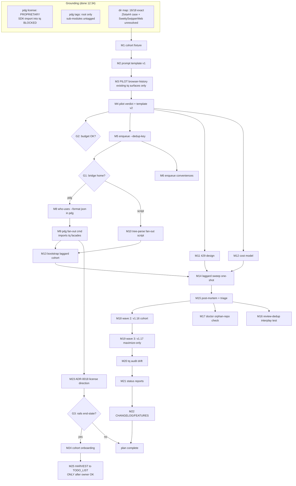

# templ-components Consumer Sweep — Execution Plan

**Plan minted**: 2026-09-14 12:34 (interactive session; parent design session
12:05–12:14, report `docs/status/2026-09-14_12-14_templ-components-consumer-sweep-fanout-design.md`)
**Goal**: Run the library-maximization prompt ("adopt latest
templ-components, use it superbly to the MAX") across every consumer repo
reported by `project-dependency-graph who-uses`, executed by go-taskqueue
agent tasks with verify gates, reviews, and budget control — WITHOUT
verschlimmbessering either system.

---

## 1. Verified grounding (facts this plan rests on)

Checked this session, replacing the design session's two unverified claims:

1. **pdg is PROPRIETARY** (`~/projects/project-dependency-graph/LICENSE`:
   "PROPRIETARY LICENSE … All rights reserved"). Importing its
   `discovery`/`graph` modules into tq-adjacent MIT tooling is
   license-POISON — the exact httputil precedent. Option B (tq-side bridge
   importing the pdg SDK) is **BLOCKED** as originally specced.
2. **pdg has NO sub-module tags** (repo tags: `v0.1.0`, `v0.2.0` only — no
   `discovery/vX.Y.Z`/`graph/vX.Y.Z`). Even license-aside, the SDK is not
   proxy-resolvable today.
3. **License-clean inversion exists**: tq's facades ARE tagged on the proxy
   (v0.3.0 family). MIT code may be consumed by proprietary code freely — so
   the bridge can live **inside pdg** (owner's own proprietary repo),
   importing `github.com/larsartmann/go-taskqueue/queue` + `queue/sqlite`
   facades. tq's dep tree stays untouched. This is the recommended home.
4. **Repo-dir mapping**: 18 consumer keys cross-checked against `~/projects`:
   16 exact; `zlota44` → dir `Zlota44` (case); `SwettySwipperWeb` → no dir
   found (unresolved — M1). Pool `--repos` resolution is name-based; the
   cohort fixture must carry resolved dir names.
5. **Cohort version spread** (who-uses 12:05 paste): v1.17.0 ×6
   (DiscordSync, bank-sync, dnsblockd, go-cqrs-lite, zlota44, +
   Rolls-Royce-mtuGoHelpCenter-golang), v1.16.0 ×10 (incl. go-taskqueue, CV,
   overview), v1.13.0 (nsfw-classifier), v1.11.0 (SwettySwipperWeb), v1.8.3
   (browser-history).
6. **tq surfaces needed exist today**: `tq enqueue --type agent --payload`,
   `agent-pool --repos --once --review --dlq-fix --daily-budget`, executor
   verify auto-detect is GOEXPERIMENT-self-contained (agent.go:784-837). The
   ONLY CLI gap for repeatability: `tq enqueue` cannot set `DedupKey`
   (cmd/tq/main.go:208-286).

## 2. Owner gates (block downstream waves, not the pilot)

| Gate | Question | Default if silent |
|------|----------|-------------------|
| **G1** | May the bridge live inside pdg (proprietary consumes MIT facades)? Alternative: relicense+tag pdg sub-modules, or zero-dep tree-parse script in tq's scripts/ | Tree-parse script (no foreign repo touched) |
| **G2** | Budget: pilot (1 repo) then laggards (3), then waves 2-3 — approve per wave? `--daily-budget` number? | Pilot only until told otherwise |
| **G3** | End-state: one-off sweep, or permanent TODO_LIST rails for the cohort (future sweeps ride harvest)? | One-off sweep |

## 3. Pareto breakdown

- **1% → 51%**: ONE pilot repo (browser-history @ v1.8.3) through EXISTING tq
  surfaces only — bootstrap, hand-written payload, one-shot pool with review.
  Proves prompt template, autonomy (.crushrc), templ-generate-in-verify,
  review minting. If this fails, everything downstream is moot.
- **4% → 64%**: prompt template hardened by pilot + `tq enqueue --dedup-key`
  + resolved cohort fixture (dir mapping). Makes minting repeatable and
  idempotent for a 3-repo laggard cohort.
- **20% → 80%**: the fan-out tool (G1 branch) + batch bootstrap + one
  429-staggered sweep-pool run over the laggard cohort + cost model +
  live monitoring. The laggards carry the most version delta (v1.8.3→v1.17.0).
- **Remaining 20% → 100%**: waves 2-3 (v1.16.0 cohort; v1.17.0
  maximize-only cohort), doctor orphan-repo check, review-namespace
  interplay test, post-sweep audits, status reports, CHANGELOG/FEATURES,
  ADR-0018, option-C rails decision.

## 4. Comprehensive plan — medium tasks (30–100 min)

Sorted by importance/impact (desc), then effort. Tier: P1=1%, P4=4%, P2=20%, R=remaining-20%.

| # | Task | Est | Tier | Impact |
|---|------|-----|------|--------|
| M3 | Pilot: bootstrap browser-history, hand-mint ONE agent task, one-shot pool `--review --dlq-fix`, observe to completion | 100 | P1 | Proves/kills the whole design |
| M4 | Pilot verdict: run report + review verdict read, verify-gate evidence checked, lessons folded into template v2 | 45 | P1 | Converts pilot into template truth |
| M2 | Prompt template v1: version-aware (repo, current pin, target), `templ generate` step, scope guard, library-deep-dive skill reference | 45 | P4 | Every mint reuses it |
| M1 | Cohort fixture: resolve `SwettySwipperWeb` dir + `Zlota44` case-map, write resolved 18-repo list with per-repo pin | 30 | P4 | Grounds every fan-out |
| M5 | `tq enqueue --dedup-key` flag (wire to `task.New.DedupKey`) + idempotency test + usage + CHANGELOG | 60 | P4 | Makes ALL sweeps re-runnable |
| M7 | Fan-out home decision record (reverse-dep into pdg vs tree-parse script vs relicense) — recommendation + G1 gate | 30 | P4 | Unblocks M8-M10 branch |
| M11 | 429/serialization design: account-wide caps vs per-repo gates analysis → `--agents` degree + delay ladder in runbook | 30 | P2 | Prevents burned attempts at scale |
| M12 | Cost model: per-run estimate from pilot telemetry × cohort → `--daily-budget` number (G2 input) | 30 | P2 | Spend control |
| M13 | Batch `tq bootstrap` laggard cohort (browser-history, nsfw-classifier, SwettySwipperWeb) + dirty-tree pre-check | 45 | P2 | Autonomy + gates per repo |
| M9 | (G1=pdg) pdg fan-out command: consumers → deduped `task.New` mints via tq facades, dry-run + `--db` + smoke vs scratch journal | 100 | P2 | The repeatable engine |
| M10 | (G1=script) zero-dep fan-out script: tree-parse (glyph-robust) → dedup-keyed enqueue loop, dry-run + smoke | 45 | P2 | Engine fallback, no foreign repo |
| M14 | Laggard cohort sweep: one-shot pool `--review --dlq-fix --daily-budget N`, live `tq top`/`facts` monitoring, 429 log | 100 | P2 | First real value delivered |
| M15 | Sweep post-mortem: DLQ triage, rescue/cancel calls, review-verdict harvest, retro section in this plan | 45 | P2 | Lessons before wave 2 |
| M6 | `tq enqueue` agent conveniences: `--repo --prompt-file --verify --timeout-minutes` sugar + tests | 90 | R | Ergonomics for humans |
| M8 | (G1=pdg) upstream: `who-uses --format json` + `graph.Consumer` JSON tags in pdg + fixture test | 60 | R | Machine-readable source of truth |
| M16 | Review-dedup interplay test: sweep-minted reviews vs session-close bridge namespaces (both ride `review:<id>`) | 45 | R | Prevents double-mint class |
| M17 | `tq doctor` orphan-repo check: tasks whose repo is in no pool's `--repos` (PENDING-forever class) | 90 | R | Safety net for all future sweeps |
| M18 | Wave 2 rollout: v1.16.0 cohort (~10 repos) — bootstrap, mint, sweep, triage | 100 | R | Bulk of the value |
| M19 | Wave 3 rollout: v1.17.0 cohort (6 repos, maximize-only prompts — no upgrade) | 100 | R | Completion |
| M20 | Post-sweep `tq audit` drift check over touched repos + reconcile | 30 | R | Integrity |
| M21 | Cohort status reports (`--status-every` wiring) + collect/index | 30 | R | Written record per project |
| M22 | CHANGELOG + FEATURES rows (dedup-key flag, conveniences, doctor check, sweep) | 30 | R | Housekeeping |
| M23 | ADR-0018: fan-out home verdict + license direction rationale (proprietary-pdg → MIT-tq facades) | 30 | R | Decision permanence |
| M24 | Option C rails end-state: pros/cons + cohort onboarding checklist (G3 gate) | 30 | R | Future sweeps ride harvest |
| M25 | Post-approval only: docs-health HARVEST this plan → TODO_LIST.md (POOL FOOD — never before owner OK) | 15 | R | Living-source sync |

**Total**: ~1,555 min ≈ 26 h across 25 tasks.

## 5. Fine breakdown — every task ≤ 12 min

Same sort. `→Mx` maps to parent. P = prerequisite.

| # | Task | Est | → | P |
|---|------|-----|---|---|
| F1.1 | Locate SwettySwipperWeb dir (`find ~/projects -maxdepth 3 -iname '*swetty*'` / go.mod grep) | 5 | M1 | – |
| F1.2 | Write cohort fixture file (18 repos: resolved dir, key, pin, wave#) | 12 | M1 | F1.1 |
| F1.3 | Fixture sanity: every dir exists + has go.mod (one-liner loop) | 6 | M1 | F1.2 |
| F2.1 | Template skeleton: {repo}, {current}, {target} substitution slots | 12 | M2 | F1.2 |
| F2.2 | Add templ-generate step + committed-generated-files clause | 12 | M2 | F2.1 |
| F2.3 | Add scope guard (adopt+leverage only, no unrelated rewrites) + deep-dive skill nudge | 10 | M2 | F2.2 |
| F2.4 | Render browser-history instance; JSON-validate payload | 8 | M2 | F2.3 |
| F3.1 | `tq bootstrap browser-history` (in that repo) | 10 | M3 | F2.4 |
| F3.2 | Inspect managed `.crushrc` block + `.tq-verify` env-self-containment | 8 | M3 | F3.1 |
| F3.3 | Dirty-tree check; write payload file | 5 | M3 | F3.2 |
| F3.4 | Enqueue `--type agent` against SCRATCH journal first (TQ_DB trap) | 5 | M3 | F3.3 |
| F3.5 | Launch one-shot pool: `--projects-dir ~/projects --repos browser-history --once --review --dlq-fix --task-timeout 45m` | 10 | M3 | F3.4 |
| F3.6 | Monitor: `tq show <id>` / `tq facts` until terminal state | 12 | M3 | F3.5 |
| F3.7 | Collect gate evidence: verify output, footer commit, review task minted | 10 | M3 | F3.6 |
| F4.1 | Read run output + review verdict; judge prompt quality honestly | 10 | M4 | F3.7 |
| F4.2 | Template v2 edits from lessons | 12 | M4 | F4.1 |
| F4.3 | Pilot retro section appended to this plan (annotate, never rewrite) | 10 | M4 | F4.2 |
| F5.1 | `--dedup-key` flag def; wire into `task.New` | 12 | M5 | – |
| F5.2 | Usage text + help test | 10 | M5 | F5.1 |
| F5.3 | Idempotency test: same key re-enqueue returns stored ID | 12 | M5 | F5.1 |
| F5.4 | CHANGELOG row + AGENTS.md command blurb touch-up | 8 | M5 | F5.3 |
| F6.1 | `--repo`/`--prompt-file` flags on enqueue | 12 | M6 | F5.4 |
| F6.2 | Payload assembly (AgentPayload JSON build) + validation errors | 12 | M6 | F6.1 |
| F6.3 | `--verify`/`--timeout-minutes`/`--yolo-task` passthrough | 12 | M6 | F6.2 |
| F6.4 | Table-driven tests + usage | 12 | M6 | F6.3 |
| F7.1 | Decision table: pdg-bridge vs script vs relicense (license, tags, maintenance) | 12 | M7 | – |
| F7.2 | Record recommendation + G1 gate row | 5 | M7 | F7.1 |
| F8.1 | (pdg) JSON tags on `graph.Consumer` | 12 | M8 | G1 |
| F8.2 | (pdg) `who-uses --format json` rendering path | 12 | M8 | F8.1 |
| F8.3 | (pdg) Fixture test (golden JSON) | 12 | M8 | F8.2 |
| F8.4 | (pdg) Commit in pdg repo (separate repo, own message) | 5 | M8 | F8.3 |
| F9.1 | (pdg) cmd skeleton; go.mod requires tq facades v0.3.x | 12 | M9 | G1, F8.3 |
| F9.2 | Consumer → `task.New` mapping; dedup key `libdive:templ-components:<key>@<target>` | 12 | M9 | F9.1 |
| F9.3 | `--dry-run` / `--db` / mint modes; project=repo key | 12 | M9 | F9.2 |
| F9.4 | Mint-time RequireClean/dirty pre-check (fail-fast report, no burned attempts) | 12 | M9 | F9.3 |
| F9.5 | Smoke vs scratch journal (TQ_DB pinned); verify dedup idempotency | 12 | M9 | F9.4 |
| F9.6 | Tests + README/FEATURES in pdg | 12 | M9 | F9.5 |
| F10.1 | (script) Tree-parse: glyph-robust consumer extraction (go-output/tree format pinned by test) | 12 | M10 | F7.2 |
| F10.2 | Cohort filter + dedup-key derive + `tq enqueue --dedup-key` loop | 12 | M10 | F10.1 |
| F10.3 | Dry-run + scratch-journal smoke | 10 | M10 | F10.2 |
| F11.1 | Analysis: account-wide provider caps vs per-repo gates; pick serialization | 12 | M11 | – |
| F11.2 | Encode choices in runbook section (agents=2, delay ladder, waves) | 8 | M11 | F11.1 |
| F12.1 | Per-run cost from pilot telemetry (tokens/time × close-out + review) | 12 | M12 | F4.3 |
| F12.2 | Budget formula → `--daily-budget` proposal (G2 input) | 8 | M12 | F12.1 |
| F13.1 | `tq bootstrap` nsfw-classifier + SwettySwipperWeb(-dir) | 12 | M13 | F4.3 |
| F13.2 | Verify `.crushrc`/`.tq-verify` per repo (env-self-contained) | 8 | M13 | F13.1 |
| F13.3 | Dirty-tree pre-check across cohort | 5 | M13 | F13.2 |
| F14.1 | Mint cohort tasks (bridge M9 or script M10; scratch-journal smoke first) | 10 | M14 | M9∨M10, M13 |
| F14.2 | Launch one-shot sweep pool with budget + review + dlq-fix | 5 | M14 | F14.1 |
| F14.3 | Monitor `tq top`/`facts`; capture 429 window behavior | 12 | M14 | F14.2 |
| F14.4 | Continue monitoring to drain | 12 | M14 | F14.3 |
| F14.5 | Drain check: no PENDING/leased residue; completion facts present | 10 | M14 | F14.4 |
| F15.1 | DLQ triage (`tq dlq`): read evidence tails | 10 | M15 | F14.5 |
| F15.2 | Rescue/cancel calls per verdict (rescue keeps original budget) | 12 | M15 | F15.1 |
| F15.3 | Review-verdict harvest; approve fix-task follow-ups | 12 | M15 | F15.2 |
| F15.4 | Sweep retro appended to this plan | 10 | M15 | F15.3 |
| F16.1 | Read both review dedup key derivations (sweep vs session-close) | 8 | M16 | – |
| F16.2 | Regression test: same completion cannot double-mint | 12 | M16 | F16.1 |
| F17.1 | Design doctor check semantics (journal scan vs pool config sources) | 10 | M17 | – |
| F17.2 | Implement doctor section | 12 | M17 | F17.1 |
| F17.3 | Test with fixture journal (orphan + covered cases) | 12 | M17 | F17.2 |
| F17.4 | Usage + doctor report wording | 8 | M17 | F17.3 |
| F18.1 | Wave-2 bootstrap + dirty pre-check (~10 repos) | 12 | M18 | M15, G2 |
| F18.2 | Wave-2 mint (dry-run review, then real) | 10 | M18 | F18.1 |
| F18.3 | Wave-2 pool run + monitor | 12 | M18 | F18.2 |
| F18.4 | Wave-2 monitor cont. / stagger adjustments | 12 | M18 | F18.3 |
| F18.5 | Wave-2 triage + retro | 12 | M18 | F18.4 |
| F19.1 | Wave-3 (v1.17.0, maximize-only prompts) bootstrap check | 10 | M19 | M18, G2 |
| F19.2 | Wave-3 mint + pool run | 12 | M19 | F19.1 |
| F19.3 | Wave-3 monitor + triage | 12 | M19 | F19.2 |
| F19.4 | Wave-3 retro; cohort completion table | 10 | M19 | F19.3 |
| F20.1 | `tq audit` per touched repo; collect drift | 12 | M20 | M18∨M19 |
| F20.2 | Reconcile drift (harvest provenance rules) | 12 | M20 | F20.1 |
| F21.1 | Wire `--status-every` for cohort pools | 8 | M21 | F20.2 |
| F21.2 | Collect + index status reports | 12 | M21 | F21.1 |
| F22.1 | CHANGELOG entries (flag, conveniences, doctor, sweep) | 8 | M22 | F17.4 |
| F22.2 | FEATURES rows + adoption-table guard check | 12 | M22 | F22.1 |
| F23.1 | Write ADR-0018 (home verdict + license direction) | 12 | M23 | F7.2 |
| F23.2 | Link from AGENTS.md "Relation to other projects" | 8 | M23 | F23.1 |
| F24.1 | Option-C onboarding checklist (TODO_LIST rails per cohort repo) | 12 | M24 | G3 |
| F24.2 | G3 gate row updated with owner verdict | 5 | M24 | F24.1 |
| F25.1 | docs-health HARVEST plan → TODO_LIST (ONLY after G3/owner OK) | 12 | M25 | F24.2 |
| F25.2 | `check-todo-list.sh` green after harvest | 8 | M25 | F25.1 |

**Total**: 78 fine tasks, ≈ 13.5 h of leaf work (rest of M-estimates = coordination/monitoring overhead).

## 6. Execution graph (mermaid)

## 7. Anti-verschlimmbesser rules (hard)

1. **Never add sweep items to `TODO_LIST.md` before owner OK (G3)** —
   unchecked items are LIVE production-pool food; a premature harvest
   unleashes spend.
2. **Never import pdg code into this repo** (license) and **never edit pdg
   without G1**. Default branch (M10) touches no foreign repo.
3. **Scratch journals first**: every mint smoke pins `TQ_DB=<scratch>` — bare
   `tq` in session shells hits the PRODUCTION dogfood journal.
4. **Concurrent-agent respect**: current tree carries another agent's
   uncommitted work (FEATURES.md, cmd/tq/go.mod/go.sum, gitscan.go) — never
   stage, revert, or "fix" them.
5. **Generated `*_templ.go`** in consumer repos: prompt must say regenerate +
   commit; never hand-edit generated files.
6. **Prompts pin concrete versions** (`v1.8.3 → v1.17.0`), never "latest".
7. **Wave gating**: no wave starts without the previous wave's post-mortem
   (M15) and G2 budget approval.
