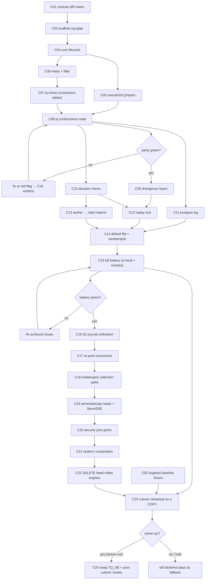

# go-cqrs-lite Platform Migration — Comprehensive Pareto Plan

Date: 2026-09-22 23:49 · Status: ACTIVE · Owner ruling: 2026-09-22 (ADR-0019)

> Point-in-time snapshot. The living source is `TODO_LIST.md` (section
> "go-cqrs-lite platform adoption"). Bring current via docs-health → ANNOTATE,
> never by rewriting this file.

## Mission

go-taskqueue stops being a hand-rolled queue that merely resembles
go-cqrs-lite and becomes its first-class consumer: **queue/v4 as the task
store (S1), one unified journal (S2), metaengine read models (S3), system/
composition (S4)** — without breaking the production dogfood pool, the CI
gates, or the ADR-0016 facade contract.

## Ground truth (all verified 2026-09-22, this session)

| Fact                                                                                 | Evidence                                                                                                                                                                                        |
| ------------------------------------------------------------------------------------ | ----------------------------------------------------------------------------------------------------------------------------------------------------------------------------------------------- |
| Upstream queue family shipped AND pushed                                             | `git ls-remote --tags origin`: `queue/v4.0.0`, `queue/{sqlite,postgres,mysql}/v4.0.0`, `claiming/v4.0.0`                                                                                        |
| Modules resolve via proxy                                                            | `go list -m …/queue/v4@v4.0.0 …/queue/sqlite/v4@v4.0.0 …/metaengine/v4@v4.11.0` → all found                                                                                                     |
| Upstream `Store[T]` is tq's contract transcribed                                     | `queue/README.md` names tq the spec donor; Enqueue/ClaimDue/Heartbeat/Fail/FailPermanent/Requeue/Cancel*/MarkOrphaned/RescueDead/DismissDead/UpdatePendingPriority/Facts/Watermarks all present |
| Upstream is STRICTER where it counts                                                 | Claim mints unguessable `Token`; finalizes token-fenced (ADR-0134) — tq's owner-string finalizes cannot detect theft                                                                            |
| DAG deps gate at CLAIM upstream; dangling refs refused at ENQUEUE (`ErrDanglingDep`) | `queue/store.go:38-41`                                                                                                                                                                          |
| `task.New` near-identical                                                            | Project/Type/Payload(jsontext.Value)/Deps/Priority/MaxAttempts/NotBefore/DedupKey                                                                                                               |
| Upstream `Filter` is a SUPERSET                                                      | adds Query LIKE-pushdown, Parked, Since, PriorityMin/Max, Offset                                                                                                                                |
| Worker finalize blast radius is TINY                                                 | 2 production call sites in `internal/worker/worker.go` (+2 test refs)                                                                                                                           |
| tq extras with NO upstream surface                                                   | `RecordAnswer`/questions, `PriorityScores` CRUD, `CountFacts(ftype,since)`, `FactsSince`, `LastFacts`, `ProjectCounts`                                                                          |
| Hand-rolled mirrors are the biggest clone mass                                       | art-dupl 2026-09-22: 7 of 9 groups are sqlite↔postgres mirror pairs                                                                                                                             |
| v5 direction                                                                         | upstream ADR-0123: metaengine Store + system/ are the blessed surface; v1 tiers + stack/ die in v5                                                                                              |

## Non-negotiables (Verschlimmbesser guards)

1. **Never touch the live journal** `/mnt/pool/services/tq/tq.db` — every
   rehearsal runs on a COPY under /tmp; the real cutover is owner-run (C24).
2. **Conformance parity is the bar** — tq's sqlite/postgres suites must pass
   against the adapter, or every divergence is cited in a status report.
3. **Facts in the same tx** — becomes engine-enforced after S2; until then the
   adapter must not weaken it.
4. **Facades (ADR-0016)** — go-cqrs-lite requires enter ONLY backend/adapter
   modules; `internal/task`/`internal/journal` stay pure; every internal module
   in a facade graph needs require + relative replace.
5. **vendorHash + `check-go-mods.sh`** after every go.mod change; root builds
   need `go mod vendor` after internal changes.
6. **Deletion happens once, at S4, and only after dogfood proof** — until then
   the old backend stays compilable as the rollback path.
7. **Agents never edit their own gate** (`.tq-verify`, pool prompts) and never
   push without explicit owner authorization (given 2026-09-22 for this work).
8. **Every stage ships green on its own** — a red master blocks the next stage,
   not vice versa.

## Pareto breakdown

| Tier           | Share of result                              | Tasks                     | Why                                                                                                                                                                                                                                                                               |
| -------------- | -------------------------------------------- | ------------------------- | --------------------------------------------------------------------------------------------------------------------------------------------------------------------------------------------------------------------------------------------------------------------------------- |
| **1% → 51%**   | Contract parity PROVEN on one engine         | C03–C08 (S1 sqlite spike) | Every downstream decision (worker tokens, journal path, extras home, replay design) hangs on whether tq's suite passes over `queue/sqlite/v4`. This single spike converts the migration from belief to engineering. If it fails, we learn it for ~6h of effort, not after a flip. |
| **4% → 64%**   | + architecture LOCKED                        | + C01, C09, C10, C11      | The contract-diff matrix and the decision memo fix every open design question (extras home, fact append path, replay semantics) before anything flips; postgres leg proves the second engine for free-ish.                                                                        |
| **20% → 80%**  | + the project genuinely RUNS on go-cqrs-lite | + C12–C15                 | Replay tool + worker token migration + default flip + full battery = founding intent materially satisfied; hand-rolled backends demoted to fallback.                                                                                                                              |
| **80% → 100%** | + v5-ready surface, clone mass deleted       | + C02, C16–C24            | Journal unification, metaengine reads, system/ composition, deletion of the mirrors, owner cutover.                                                                                                                                                                               |

## Comprehensive plan (30–100 min tasks, ALL todos, sorted tier → dependency → impact/effort)

| #   | Task                                                                                                                                                                                                      | Tier | Impact | Effort | Value                          | Depends             |
| --- | --------------------------------------------------------------------------------------------------------------------------------------------------------------------------------------------------------- | ---- | ------ | ------ | ------------------------------ | ------------------- |
| C01 | Contract-diff matrix: all 34 tq `Store` methods + `Filter` fields + fact vocabulary vs `queue/v4` `Store[T]` — each EXACT / ADAPT / MISSING, with token-vs-owner finalize notes (`docs/planning/` output) | 4%   | H      | 60m    | Unblocks + de-risks everything | —                   |
| C02 | Dogfood baseline snapshot (read-only): schema dump, row counts, StatusCounts/DLQ/watermark exports → the equality fixture for C12/C23                                                                     | rest | M      | 45m    | Cutover safety                 | —                   |
| C03 | Scaffold `internal/queue/cqrsqlite` via `scripts/new-module.sh` (deps: `queue/v4`, `queue/sqlite/v4`); module builds green                                                                                | 1%   | H      | 30m    | Spike exists                   | C01                 |
| C04 | Core lifecycle over upstream engine: Enqueue/ClaimDue/Complete/Fail/FailPermanent/Requeue/Heartbeat + tq fact mapping                                                                                     | 1%   | H      | 90m    | 51% of the outcome             | C03                 |
| C05 | Lifecycle rest: Cancel/CancelRunning/CancelRequested/CancelOwned/MarkOrphaned/RescueDead/DismissDead/UpdatePendingPriority                                                                                | 1%   | H      | 60m    | Full lifecycle                 | C04                 |
| C06 | Reads: Get/List/CountTasks/StatusCounts/Facts/FactsForTask/HeadSeq/Watermark(s)/SaveWatermark + Filter translation (tq↔upstream)                                                                          | 1%   | H      | 60m    | UI/CLI works                   | C04                 |
| C07 | tq extras on same-DB companion tables: RecordAnswer/questions, PriorityScores CRUD, CountFacts/FactsSince/LastFacts, ProjectCounts                                                                        | 1%   | H      | 90m    | No feature regressions         | C06                 |
| C08 | Point tq's sqlite conformance suite at the new store; drive green or document every divergence                                                                                                            | 1%   | H      | 90m    | **THE proof**                  | C05,C06,C07         |
| C09 | Divergence report (status report, citations per claim): EXACT/ADAPT/MISSING verdicts + token-fencing impact on worker                                                                                     | 4%   | H      | 45m    | Architecture lock              | C08                 |
| C10 | Decision memo: per-extra upstream-grow vs companion-table; tq-fact append path; replay design (full transition replay vs live-tasks + facts-as-history)                                                   | 4%   | H      | 45m    | No re-litigating               | C08                 |
| C11 | Postgres parity leg: same contract over `queue/postgres/v4`, judged by TQ_TEST_POSTGRES suite                                                                                                             | 4%   | M      | 90m    | Second engine cheap            | C08                 |
| C12 | Replay tool: fact journal → fresh store + projection-equality verifier (StatusCounts, per-task tails, DLQ, watermarks)                                                                                    | 20%  | H      | 90m    | Migration exists               | C10                 |
| C13 | Worker claim-token migration: thread `Claim.Token` through the 2 production finalize sites + tests; CancelRequested observation wired                                                                     | 20%  | H      | 60m    | Theft detection                | C10                 |
| C14 | Default flip: root + facade go.mods require/replace the new adapter; `go mod vendor`; vendorHash fast gate; `check-go-mods.sh`                                                                            | 20%  | H      | 90m    | tq RUNS on it                  | C11,C12,C13         |
| C15 | Full battery on the new backend: ci-local + smokes (fullcore, multi-repo, status-loop, reviews…) green                                                                                                    | 20%  | H      | 90m    | Shippable                      | C14                 |
| C16 | S2 fact unification: tq-specific fact types as tq constants over upstream `facts.Fact`; companion journal merged into one                                                                                 | rest | M      | 90m    | One journal                    | C15                 |
| C17 | Re-point consumers: `journal/cqrs` adapter, webui tailer, sweepers, bridges, budget projections; update drift pins                                                                                        | rest | M      | 90m    | No ghost paths                 | C16                 |
| C18 | metaengine spike: tasks read-model collection via `BuildLayoutPlanFromType`/`LayoutPlanApplier`, fed from the journal                                                                                     | rest | M      | 90m    | v5 surface                     | C17                 |
| C19 | `tq serve`/`tq stats`/httpapi reads onto collections; `Watcher`/`ServeSSE` live fragments replace hand tailer fan-out                                                                                     | rest | M      | 90m    | Live UI on it                  | C18                 |
| C20 | Security pins green: `TestRoutesAreReadOnly`, health-CSP, nosniff, bearer lockout — zero behavior drift                                                                                                   | rest | H      | 45m    | Trust                          | C19                 |
| C21 | S4: runtime composition (store, executors, sweepers, bridges) as `system/` DomainConfig for agent-pool + serve                                                                                            | rest | M      | 90m    | Founding intent, full          | C20                 |
| C22 | DELETE hand-rolled `internal/queue/{sqlite,postgres}` + mirrored suites; re-run art-dupl (mirror clones gone); docs (ADR appendix, FEATURES, CHANGELOG)                                                   | rest | M      | 60m    | Debt gone                      | C21 + dogfood proof |
| C23 | Pre-cutover rehearsal: replay a COPY of the production journal into the new engine; equality report vs C02 fixture                                                                                        | rest | H      | 60m    | Cutover de-risked              | C15,C12,C02         |
| C24 | **OWNER-ONLY** cutover: swap `TQ_DB` in systemd units, restart pool+serve, post-cutover smoke                                                                                                             | rest | H      | 30m    | Done                           | C23 + owner go      |

## Micro plan (≤12 min steps, ALL todos, sorted tier → dependency)

| ID   | Parent | Step                                                                                                                                                           | Min | Tier |
| ---- | ------ | -------------------------------------------------------------------------------------------------------------------------------------------------------------- | --- | ---- |
| M001 | C01    | Extract tq `Store` method list: `grep -n "^	[A-Z]" internal/queue/queue.go` into scratch matrix                                                                 | 5   | 4%   |
| M002 | C01    | Extract upstream surface: `queue/store.go` + `task.New` + `Claim[T]` fields into same matrix                                                                   | 8   | 4%   |
| M003 | C01    | Diff lifecycle methods one-by-one; mark EXACT/ADAPT/MISSING (args: owner vs token, jsontext vs Codec[T])                                                       | 12  | 4%   |
| M004 | C01    | Diff `Filter` fields (upstream superset: Query/Parked/Since/PriorityMin/Max — decide pass-through vs drop)                                                     | 10  | 4%   |
| M005 | C01    | Diff fact vocabulary: tq `journal.FactType` set vs upstream `facts` constants; list tq-only types (session._, question-_, budget)                              | 10  | 4%   |
| M006 | C01    | Diff DAG-dep semantics (upstream at-enqueue `ErrDanglingDep` + at-claim gating vs tq `BumpUnblocked` facade)                                                   | 8   | 4%   |
| M007 | C01    | Write matrix to `docs/planning/2026-09-22_contract-diff-tq-vs-queuev4.md`; cite file:line per row                                                              | 7   | 4%   |
| M008 | C02    | `sqlite3 /mnt/pool/services/tq/tq.db '.schema' > /tmp/tq-baseline-schema.sql` (READ-ONLY open)                                                                 | 3   | rest |
| M009 | C02    | Export row counts per table + `tq stats` JSON + DLQ list + `tq watermarks show` to /tmp fixture dir                                                            | 10  | rest |
| M010 | C02    | Commit fixture script (not the data) as `scripts/migrate/baseline-snapshot.sh` skeleton                                                                        | 10  | rest |
| M011 | C03    | Read `scripts/new-module.sh` usage; run: `scripts/new-module.sh internal/queue/cqrsqlite internal/queue`                                                       | 5   | 1%   |
| M012 | C03    | Add requires `github.com/larsartmann/go-cqrs-lite/queue/v4 v4.0.0` + `queue/sqlite/v4 v4.0.0` (+ relative replaces per ADR-0016 rules)                         | 8   | 1%   |
| M013 | C03    | Stub `type Store struct` implementing tq `queue.Store` (compile-error-driven method set); `go build` green                                                     | 10  | 1%   |
| M014 | C03    | `GOWORK=off go vet ./...` in the new module; wire module into `scripts/check-go-mods.sh` expectations                                                          | 8   | 1%   |
| M015 | C04    | Choose payload type: `Store[jsontext.Value]` + default `JSONCodec` vs custom Codec; record 3-line rationale in code-free memo                                  | 8   | 1%   |
| M016 | C04    | Implement `Open(path)` wrapping `queuesqlite.Open[jsontext.Value]`; same-DB companion-table migration hook                                                     | 12  | 1%   |
| M017 | C04    | Implement `Enqueue`: tq `task.New` → upstream `task.New[T]`; map dedup-key convergence + `ErrEmptyType` sentinels                                              | 12  | 1%   |
| M018 | C04    | Implement `ClaimDue` → upstream `Claim[T]`; adapt return to tq's `(task.Task, error)`; keep token internal for now                                             | 10  | 1%   |
| M019 | C04    | Implement `Complete`/`Fail`/`FailPermanent`/`Requeue` with owner→token bridge (adapter-held map or single-claim invariant)                                     | 12  | 1%   |
| M020 | C04    | Implement `Heartbeat` (owner→token); verify NotBefore/backoff semantics match tq's ladder                                                                      | 10  | 1%   |
| M021 | C04    | Map upstream facts → tq `journal.Fact` on read paths (Type strings + Detail bytes); unit-test round-trip                                                       | 12  | 1%   |
| M022 | C05    | Implement `Cancel`/`CancelRunning`/`CancelRequested`/`CancelOwned` (token-fenced variant of tq's owner form)                                                   | 12  | 1%   |
| M023 | C05    | Implement `MarkOrphaned`, `RescueDead`, `DismissDead` (verify tq's dismissal reason + `dismissed_by` Detail keys ride `Detail`)                                | 10  | 1%   |
| M024 | C05    | Implement `UpdatePendingPriority` (same-value no-op, `ErrInvalidTransition`) + aging constants cross-check vs `internal/queue`                                 | 10  | 1%   |
| M025 | C05    | Per-module gate: `GOWORK=off go test ./... -count=1` in cqrsqlite; fix what surfaced                                                                           | 10  | 1%   |
| M026 | C06    | Implement `Get`/`List`/`CountTasks`/`StatusCounts` with Filter translation (pointer-field juggling)                                                            | 12  | 1%   |
| M027 | C06    | Implement `Facts`/`FactsForTask`/`HeadSeq` (Seq ordering + limit semantics identical to tq)                                                                    | 10  | 1%   |
| M028 | C06    | Implement `Watermark`/`Watermarks`/`SaveWatermark` (monotonic upsert preserved)                                                                                | 8   | 1%   |
| M029 | C06    | Translate tq Filter fields with NO upstream twin (owner filter? dedup-key filter?) → post-filter or upstream Query pushdown; document choice in code-free memo | 12  | 1%   |
| M030 | C06    | Gate: build + vet + existing unit tests green                                                                                                                  | 5   | 1%   |
| M031 | C07    | Design companion tables DDL (answers, priority_scores + any tq fact spill) in the SAME sqlite file; write `migrate()`                                          | 12  | 1%   |
| M032 | C07    | Implement `RecordAnswer` + `ErrEmptyAnswerRef`/`ErrEmptyAnswer` sentinels + question Detail types parity                                                       | 12  | 1%   |
| M033 | C07    | Implement `SavePriorityScore`/`PriorityScore`/`PriorityScores`/`DeletePriorityScores`                                                                          | 10  | 1%   |
| M034 | C07    | Implement `CountFacts(ftype,since)`/`FactsSince`/`LastFacts` over upstream facts + companion spill (health probes + budget depend on it)                       | 12  | 1%   |
| M035 | C07    | Implement `ProjectCounts` (GROUP BY project × status — upstream has StatusCounts only)                                                                         | 8   | 1%   |
| M036 | C07    | Gate: full module test run green                                                                                                                               | 5   | 1%   |
| M037 | C08    | Locate tq's sqlite suite entrypoint; add a test hook instantiating cqrsqlite as the store-under-test                                                           | 10  | 1%   |
| M038 | C08    | First suite run; capture failure list to file (`cmd >/tmp/x.log 2>&1; rc=$?` — PIPESTATUS trap)                                                                | 10  | 1%   |
| M039 | C08    | Fix divergence batch 1 (sentinel errors, fact Detail shapes)                                                                                                   | 12  | 1%   |
| M040 | C08    | Fix divergence batch 2 (ordering, aging, lease arithmetic)                                                                                                     | 12  | 1%   |
| M041 | C08    | Fix divergence batch 3 (filter semantics, pagination)                                                                                                          | 12  | 1%   |
| M042 | C08    | Anything unfixable → red-flag list for C10 with reproduction test each                                                                                         | 10  | 1%   |
| M043 | C08    | Suite green run at `-race -count=2`; record numbers in scratch notes                                                                                           | 12  | 1%   |
| M044 | C09    | Write divergence report `docs/status/2026-09-2X_<ts>_cqrsqlite-spike.md` — every verdict cites file:line or the pinning test                                   | 12  | 4%   |
| M045 | C09    | Worker impact section: enumerate the 2 production finalize sites + the token threading design (worker.go, executors untouched?)                                | 10  | 4%   |
| M046 | C09    | Extras verdicts section: upstream-grow candidates vs companion-permanent; note upstream ratification pipeline as the channel                                   | 8   | 4%   |
| M047 | C09    | Run check-doc-refs + status-index conventions; commit report                                                                                                   | 5   | 4%   |
| M048 | C10    | Decide per-extra: upstream-grow vs companion (prefer upstream) — one paragraph each                                                                            | 12  | 4%   |
| M049 | C10    | Decide fact append path: upstream escape vs companion journal; note tq's `AppendFact` single-writer rule                                                       | 10  | 4%   |
| M050 | C10    | Decide replay design: full transition replay vs live-tasks-replay + facts-as-history (terminal tasks) — spell out dedup/ID implications                        | 12  | 4%   |
| M051 | C10    | Append verdicts to ADR-0019 appendix or `docs/planning/` memo; link from TODO_LIST rows                                                                        | 8   | 4%   |
| M052 | C11    | Scaffold/extend cqrspostgres (module + requires `queue/postgres/v4`); reuse sqlite adapter structure                                                           | 12  | 4%   |
| M053 | C11    | Implement store over pgx-backed upstream engine; DSN/env plumbing like `TQ_TEST_POSTGRES`                                                                      | 10  | 4%   |
| M054 | C11    | Run TQ_TEST_POSTGRES leg; capture failures                                                                                                                     | 12  | 4%   |
| M055 | C11    | Fix to green; SKIP-hygiene: plain (non-env) runs must skip cleanly                                                                                             | 10  | 4%   |
| M056 | C12    | Sketch replay architecture: fact stream → transition applier → fresh store; write `scripts/migrate/replay/` skeleton (new module or cmd?)                      | 12  | 20%  |
| M057 | C12    | Implement Enqueued/Claimed/Completed/Failed/DeadLettered/Requeued/Cancelled appliers (idempotent, order-safe)                                                  | 12  | 20%  |
| M058 | C12    | Implement remaining fact types per C10 verdict (tq-only types → companion tables or skip-with-log)                                                             | 10  | 20%  |
| M059 | C12    | Implement equality verifier: StatusCounts, per-task fact tails, DLQ contents, watermark positions                                                              | 12  | 20%  |
| M060 | C12    | End-to-end replay test on a synthetic seeded journal (build fixture under /tmp, trash after)                                                                   | 12  | 20%  |
| M061 | C13    | Read the 2 production finalize sites in `internal/worker/worker.go`; map owner-strings → token source                                                          | 8   | 20%  |
| M062 | C13    | Change worker claim path to carry `Claim.Token` through execution context (bounded, per-task)                                                                  | 12  | 20%  |
| M063 | C13    | Finalize calls: Complete/Fail/Requeue/Heartbeat/CancelOwned take token; drop owner-string form                                                                 | 10  | 20%  |
| M064 | C13    | Wire `CancelRequested` observation into the heartbeat loop (cooperative cancel parity with today)                                                              | 10  | 20%  |
| M065 | C13    | Worker suite green (`go test ./internal/worker/... -race` in-module)                                                                                           | 8   | 20%  |
| M066 | C14    | Root go.mod: require cqrsqlite (+ replace); facades per ADR-0016 containment rules (require + relative replace each)                                           | 12  | 20%  |
| M067 | C14    | `scripts/new-module.sh`-style pin check: all requires point at real tags; run `scripts/check-go-mods.sh`                                                       | 10  | 20%  |
| M068 | C14    | `go mod vendor`; root `go build ./...` green under GOEXPERIMENT=jsonv2 + GOTOOLCHAIN=auto                                                                      | 8   | 20%  |
| M069 | C14    | `nix build .#checks.x86_64-linux.vendor-hash`; copy `got:` into flake.nix vendorHash                                                                           | 10  | 20%  |
| M070 | C14    | Flip default store wiring: cmd/tq store selection → cqrsqlite (flag/env fallback kept for rollback)                                                            | 12  | 20%  |
| M071 | C14    | Facade parity gate: `scripts/check-facade-parity.sh` green                                                                                                     | 5   | 20%  |
| M072 | C15    | `./scripts/ci-local.sh` full run; capture log                                                                                                                  | 12  | 20%  |
| M073 | C15    | Smokes triage batch 1: fullcore (sqlite + deadline path)                                                                                                       | 10  | 20%  |
| M074 | C15    | Smokes triage batch 2: multi-repo + status-loop (exclusivity/dedup semantics)                                                                                  | 10  | 20%  |
| M075 | C15    | Smokes triage batch 3: reviews + session-close + webui                                                                                                         | 12  | 20%  |
| M076 | C15    | Fix surfaced issues or file them with reproduction; battery green                                                                                              | 12  | 20%  |
| M077 | C16    | Final fact-vocab table: which tq FactTypes become upstream constants vs tq-side constants over `facts.Fact`                                                    | 10  | rest |
| M078 | C16    | Move companion-journal facts into the engine's fact table (via C10 append path); drop companion spill                                                          | 12  | rest |
| M079 | C16    | Extend `journal.Fact` construction sites to unified shape; delete dual-write code                                                                              | 12  | rest |
| M080 | C16    | Facts-in-same-tx now engine-enforced: delete adapter-level tx bridging; note in ADR appendix                                                                   | 8   | rest |
| M081 | C17    | Re-point `internal/journal/cqrs` adapter at unified journal; `TestPayloadDecodesThroughLibraryAPI` green                                                       | 10  | rest |
| M082 | C17    | Re-point webui tailer + fact feed (Seq/type rendering unchanged visually)                                                                                      | 12  | rest |
| M083 | C17    | Re-point sweepers (review/dlqfix/status/prioritize) + watermarks reads                                                                                         | 10  | rest |
| M084 | C17    | Re-point budget projections + papdashboard bridge (fact-type filters)                                                                                          | 10  | rest |
| M085 | C17    | Update drift pins (budget usage keys, retry-trail dead-letter count tests)                                                                                     | 12  | rest |
| M086 | C17    | Root battery: build+vet+race green                                                                                                                             | 12  | rest |
| M087 | C18    | Pick first collection: task-list row type; define Go struct for `BuildLayoutPlanFromType`                                                                      | 10  | rest |
| M088 | C18    | metaengine Store open (sqlite engine) beside the queue DB (same file? separate? — one-paragraph decision)                                                      | 12  | rest |
| M089 | C18    | Projection: journal facts → collection folds (upsert/delete per status)                                                                                        | 12  | rest |
| M090 | C18    | Query: list/status-counts via planned tables; parity-test against store queries                                                                                | 12  | rest |
| M091 | C18    | Catch-up: bootstrap collection from existing rows (backfill path), watermark-guarded                                                                           | 12  | rest |
| M092 | C19    | `tq serve` task table + board render from collection queries behind a flag                                                                                     | 12  | rest |
| M093 | C19    | `tq stats` + nowband counters from collections                                                                                                                 | 8   | rest |
| M094 | C19    | httpapi read routes from collections (response shapes byte-stable — statsPayload pins)                                                                         | 10  | rest |
| M095 | C19    | `Watcher`/`ServeSSE` fragment for the fact feed/board; replace tailer→hub fan-out                                                                              | 12  | rest |
| M096 | C19    | Delete-or-gate the old tailer path; SSE reconnect semantics preserved (Last-Event-ID)                                                                          | 10  | rest |
| M097 | C20    | `TestRoutesAreReadOnly` + health-CSP pins green                                                                                                                | 8   | rest |
| M098 | C20    | nosniff + bearer lockout behavior tests green on new read paths                                                                                                | 8   | rest |
| M099 | C20    | Webui smoke against metaengine-backed serve; SSE assertions pass                                                                                               | 10  | rest |
| M100 | C21    | Map runtime components → `system/` DomainConfig (store, executors, sweepers, bridges, consumers) — composition table                                           | 12  | rest |
| M101 | C21    | agent-pool boot via system/ runtime (flag-gated); LIFO shutdown + InterruptOn parity                                                                           | 12  | rest |
| M102 | C21    | `tq serve` boot via system/ (flag-gated); auth/CSP middleware order unchanged                                                                                  | 10  | rest |
| M103 | C21    | Parity soak: run pool under system/ boot against stub agents (smoke scale)                                                                                     | 12  | rest |
| M104 | C21    | Default-flip boot path; keep legacy boot as `--legacy-runtime` for one window                                                                                  | 10  | rest |
| M105 | C22    | `git mv` hand-rolled sqlite/postgres engines + mirrored suites out (one commit, no code edits mixed)                                                           | 10  | rest |
| M106 | C22    | Remove their go.mods from gates: ci-local module loop, check-go-mods, lint baseline, gosec enumeration canaries                                                | 12  | rest |
| M107 | C22    | Facade re-point: `queue/sqlite`/`queue/postgres` facades alias the adapter types; parity gate green                                                            | 12  | rest |
| M108 | C22    | Re-run art-dupl; capture clone-mass delta (expect 7 of 9 groups gone) into the report                                                                          | 8   | rest |
| M109 | C22    | Docs: ADR-0019 appendix (stages done + deltas), FEATURES/CHANGELOG rows, AGENTS.md store section                                                               | 10  | rest |
| M110 | C23    | Copy production journal to /tmp (`cp --reflinks=auto`); verify no writer via `lsof` + read-only checks                                                         | 8   | rest |
| M111 | C23    | Run replay tool over the copy into a fresh engine store                                                                                                        | 10  | rest |
| M112 | C23    | Run equality verifier vs C02 fixture; write the rehearsal report (numbers, not vibes)                                                                          | 12  | rest |
| M113 | C23    | Dry-run cutover steps (systemd unit diff, TQ_DB swap, restart order) as a script the owner runs                                                                | 10  | rest |
| M114 | C24    | OWNER: stop pool+serve, swap TQ_DB to replayed store, restart                                                                                                  | 8   | rest |
| M115 | C24    | OWNER: post-cutover smoke (webui, one stub dispatch, `tq doctor`, Gatus checks green)                                                                          | 12  | rest |
| M116 | C24    | OWNER: keep old journal file as rollback artifact for one week; then archive                                                                                   | 5   | rest |
| M117 | C15    | nix build + `nix run .#test` full multi-module suite green                                                                                                     | 12  | 20%  |
| M118 | C14    | Update AGENTS.md Known Issues (vendor arc) if the flip changes vendor posture; else skip                                                                       | 5   | 20%  |
| M119 | C08    | Commit spike state (detailed message) even if divergences remain — checkpoint                                                                                  | 5   | 1%   |
| M120 | C10    | Link decision memo from TODO_LIST S1 rows; mark spike rows done → CHANGELOG                                                                                    | 5   | 4%   |

Micro total: 120 steps ≈ 21.5h focused work; comprehensive total ≈ 24 tasks.

## Execution graph

## Verification battery per phase

| Phase        | Gate                                                                                                                                 |
| ------------ | ------------------------------------------------------------------------------------------------------------------------------------ |
| every commit | `gofmt`-clean, module `go build ./... && go vet ./... && go test ./... -count=1` (GOWORK=off, GOEXPERIMENT=jsonv2, GOTOOLCHAIN=auto) |
| C03–C11      | tq sqlite suite at `-race -count=2` (M043); TQ_TEST_POSTGRES leg (M054–M055)                                                         |
| C14          | `check-go-mods.sh`, `check-facade-parity.sh`, vendorHash fast gate, root build via vendor/                                           |
| C15          | `./scripts/ci-local.sh` (the pre-push gate) + full smokes list                                                                       |
| C16–C17      | budget/retry-trail drift pins, `TestPayloadDecodesThroughLibraryAPI`, webui smoke                                                    |
| C19–C20      | `TestRoutesAreReadOnly`, health-CSP pins, webui SSE smoke                                                                            |
| C22          | ci-local AFTER gate loop removals; art-dupl delta report                                                                             |
| C23–C24      | equality verifier report + owner-run post-cutover smoke                                                                              |

## Rollback

Until C22 the hand-rolled backends remain compiled and selectable
(store flag/env fallback from M070; legacy runtime flag from M104). A bad
post-cutover state rolls back by pointing `TQ_DB` at the archived original
file (kept ≥1 week, M116). No pushed-history rewrites anywhere in this plan.

## New tasks surfaced (already mirrored into TODO_LIST on 2026-09-22)

The TODO_LIST section "go-cqrs-lite platform adoption (ADR-0019)" carries the
stage-level rows (S1 spikes, memo, replay tool, flip, S2–S4, cutover BLOCKED
owner-run). This plan is the fine-grained expansion of exactly those rows —
no orphan tasks.
