# SUPERB — Queue Health Restoration Plan

**Date:** 2026-10-01 04:27 CEST · **Commission:** owner SUPERB planning prompt
· **Input:** `docs/status/2026-10-01_04-17_tq-production-pathology-diagnosis.md`
(read-only 72h diagnosis; commit `3ca8cd19`)
· **Repo:** go-taskqueue @ `3ca8cd19`, tree clean.

## Situation (from the diagnosis, numbers re-verified 04:14–04:17)

| #  | Pathology                                                                                                                                                                                                                | Evidence                                                                                                                                          | Live cost                                                                                             |
| -- | ------------------------------------------------------------------------------------------------------------------------------------------------------------------------------------------------------------------------ | ------------------------------------------------------------------------------------------------------------------------------------------------- | ----------------------------------------------------------------------------------------------------- |
| P1 | **Environmental-requeue loop, no circuit breaker** — verify-gate failures classified pre-existing/environmental requeue WITHOUT burning an attempt, ~100–130 s jittered backoff, no cap; 429 fallback (15 m) interleaves | CV task `000001a0eebb…`: 164 claims, 09-29 21:54 → still churning 04:14 (`pending att2/3`); ~79 of 125 CV crush sessions in 72h are this one task | ~1 paid agent session per ~8 min; budget cap 30/day being drained; 100s of churn commits in CV        |
| P2 | **vendor-gofmt environmental kill** — pool gate stage `test -z "$(gofmt -l .)"` fails on gitignored `vendor/` (44 files reproduced locally)                                                                              | 6 `att1/1` deaths in 2h (00:09→01:40); project 176 dead vs 93 completed; prune task died `att3/3` 04:04 (class unconfirmed)                       | Every dispatched go-taskqueue task dies after doing real work; work still lands but tasks land in DLQ |
| P3 | **DLQ repair loop absent** — pool config lacks `dlq-fix`                                                                                                                                                                 | 0 `dlqfix:` autopsies EVER (676 tasks); 317 dead letters; the auto-dismiss path designed for exactly the P2 class never runs                      | Dead letters landfill; no autopsies, no auto-dismiss, no owner visibility                             |
| P4 | **No anomaly alerting** — 155+ claims on one task raised no signal; PapDashboard (`http://127.0.0.1:8088`) path unverified                                                                                               | —                                                                                                                                                 | Two-day burn invisible until manual audit                                                             |
| P5 | Minor: every session spams `go-cqrs-lite/SKILL.md description exceeds 1024 chars` validation warnings                                                                                                                    | —                                                                                                                                                 | Noise in all 429/env error tails                                                                      |

**Standing hazards honored:** agent shells inherit `TQ_DB` (production journal) —
all journal writes go through `tq` CLI, never raw SQL; never hand-roll executor
seams; root builds auto-use `vendor/` (hence P2 fix ordering); concurrent agents

- auto-commit daemon active — commit doc edits immediately.

## Owner rulings this plan depends on (§g of the diagnosis)

> **RESOLVED 2026-10-01 ~05:02 CEST** — owner order: "execute the whole
> list, do not stop until verified." Recorded rulings: **R1 = park** (default;
> `tq ask`), **R2 = granted** (this interactive session may apply production
> remediations via the `tq` CLI with parallel agents mid-flight), **R3 = (a)**
> burn attempt after N=3 consecutive environmental requeues + exponential
> NotBefore escalation + alert fact.

- **R1 — loop-task disposition:** park indefinitely (`tq ask --task <id>`, host-return TRIGGER already in item text) vs cancel + strike CV TODO row.
- **R2 — production-change authority:** may an interactive session apply P0 remediations, or must they ride dispatched tasks / owner hands (parallel agents mid-flight)?
- **R3 — circuit-breaker design:** (a) burn attempt after N consecutive environmental requeues, (b) auto-park via `tq ask`, (c) no-burn with hour-capped backoff. **Working default (used below, overridable): (a) with N=3 + exponential NotBefore escalation + alert fact** — smallest change that bounds the class without new parking semantics.

**Chicken-and-egg guard (no verschlimmbessern):** TODO_LIST rows for the code
fixes are harvested by the pool into dispatches — which currently die on P2.
Therefore **TODO harvest (M19) is sequenced AFTER M2** (vendor/ rescued), not
before. Adding rows earlier would feed the grinder.

## Pareto Breakdown

- **1% → 51%:** M1 park/cancel the loop task + M2 `trash vendor/` + `tq dlq --rescue`. Two commands + one decision. Stops the paid-session burn (P1 symptom) and the per-dispatch death class (P2 symptom) immediately.
- **4% → 64%:** + M3 `dlq-fix = true` + pool restart (repair loop live) + M4 skill-trim (noise gone) + M5 classify the 04:04 death. All four ≈ one morning.
- **20% → 80%:** + the two root-cause code fixes M6 gitignore-aware gofmt gate + M8 environmental circuit breaker (kills P1/P2 as CLASSES, not instances), M10 claims-per-task anomaly alerting, M13 alert-path verification, M17 CV cross-post (CV's own gate is red; that half of the loop is theirs).
- **Remaining 20% → 100%:** diagnostics & payback (M15 census, M16 budget model, M20 park→resume e2e), hardening (M9 requeue_class facts, M11 doctor probe, M12 dlqfix default-on guard, M14 loop smoke), process closeout (M18 archive + report, M19 sequenced harvest, M21 AGENTS.md lessons).

## Medium Plan — tasks of 30–100 min (sorted: importance ▼, impact ▼, effort ▲)

| #   | Task                                                                  | Tier | Impact                  | Effort | Depends           | Done means                                                 |
| --- | --------------------------------------------------------------------- | ---- | ----------------------- | ------ | ----------------- | ---------------------------------------------------------- |
| M1  | Park/cancel CV loop task per R1; watch 30 min                         | 1%   | Stops $-burn now        | 45m    | R1, R2            | no new claims on `000001a0eebb…` for 30m (`tq stats`)      |
| M2  | `trash vendor/` + `tq dlq --rescue`; green-dispatch probe             | 1%   | Ends P2 death class     | 40m    | R2                | probe dispatch completes verify gate                       |
| M3  | `dlq-fix = true` in pool conf + restart; autopsy mint check           | 4%   | Repair loop live        | 45m    | M2                | first `dlqfix:` task appears in journal                    |
| M4  | Trim go-cqrs-lite SKILL.md description ≤1024 chars                    | 4%   | Kills P5 noise          | 30m    | —                 | fan-out guard green, no WARN in next dispatch              |
| M5  | Classify 04:04 prune-death (full error + gate rerun)                  | 4%   | Closes §b; feeds M6/M8  | 30m    | —                 | vendor-gofmt vs real-red ruled, cited                      |
| M6  | Gitignore-aware gofmt stage in pool verify gate + tests               | 20%  | Kills P2 at root        | 90m    | M5                | new dispatch passes gate WITH vendor/ present              |
| M7  | Circuit-breaker design memo (R3; default (a) N=3)                     | 20%  | Unblocks M8             | 45m    | R3, M5            | memo in docs/planning, ruling recorded                     |
| M8  | Implement env-requeue circuit breaker + worker/conform tests          | 20%  | Kills P1 as a class     | 100m   | M7                | N consecutive env requeues burn attempt + escalate + alert |
| M9  | Structured `requeue_class` fact field + journal test                  | 20%  | Observability           | 60m    | M8                | facts distinguish environmental/429/closeout/gate          |
| M10 | Claims-per-task anomaly in `tq stats` + webui badge                   | 20%  | P4 detection            | 90m    | —                 | >20-claims task flagged in stats output                    |
| M11 | `tq doctor` gitignored-gofmt env probe                                | 20%  | P2 detector             | 60m    | M6                | doctor flags poisoned vendor/ pre-emptively                |
| M12 | dlqfix default-on decision memo + guard test                          | 20%  | P3 can't recur silently | 45m    | M3                | enabled ⇒ autopsies mint (test-pinned)                     |
| M13 | PapDashboard alert-path verification (176 dead → fired?)              | 20%  | Alert trust             | 40m    | —                 | fired/never-fired ruled; defect filed if silent            |
| M14 | Loop-detector smoke `scripts/smoke/loop-detector.sh`                  | rest | Regression guard        | 60m    | M10               | smoke red on churn fixture, green on healthy               |
| M15 | CV dead-letter census (106) + review-task churn audit (156)           | rest | Payback map             | 80m    | —                 | census table in close-out report                           |
| M16 | Budget-burn model: loop paid-turns vs cap 30                          | rest | P1 $-visibility         | 50m    | —                 | measured $/day of the loop family                          |
| M17 | Cross-post findings to CV docs + CV-gate fix task                     | rest | Other half of P1        | 40m    | —                 | CV TODO row for its red gate                               |
| M18 | Archive diagnosis evidence (`archive-evidence.sh`) + close-out report | rest | Durability              | 45m    | M1–M14            | evidence archived, report indexed                          |
| M19 | TODO_LIST harvest of code-fix rows (post-rescue ONLY)                 | rest | Pipeline restored       | 30m    | M2, M6–M14 scoped | rows pass `check-todo-list.sh`                             |
| M20 | AnswerPoller `tq ask` park→resume e2e verify                          | rest | R1(b) viability         | 60m    | M1                | parked task resumes on predicate truth                     |
| M21 | AGENTS.md lessons (env-requeue class, gate hygiene)                   | rest | Memory                  | 30m    | M8                | ≤15,000 B budget respected                                 |

## Fine Plan — ALL tasks ≤ 12 min (sorted: importance ▼, impact ▼, effort ▲)

| #   | Micro-task                                                            | Parent | Est | Verification                               |
| --- | --------------------------------------------------------------------- | ------ | --- | ------------------------------------------ |
| F1  | Get R1+R2 ruling from owner (this session may proceed on defaults)    | M1     | 3m  | ruling recorded here                       |
| F2  | `tq ask --task 000001a0eebb…` (park) — or cancel+strike per R1        | M1     | 5m  | task status parked/cancelled in `tq stats` |
| F3  | Watch loop task 30 min: no new claims                                 | M1     | 12m | claims count unchanged                     |
| F4  | Record disposition + timestamp in diagnosis report §b                 | M1     | 6m  | committed annotation                       |
| F5  | `trash vendor/` (go-taskqueue root)                                   | M2     | 2m  | vendor/ absent                             |
| F6  | `go mod vendor` NOT run; root build still green (auto-vendor off?)    | M2     | 8m  | `go build ./...` rc=0                      |
| F7  | `tq dlq --rescue` (rescue dead go-taskqueue letters)                  | M2     | 8m  | dead count drops in `tq stats`             |
| F8  | Enqueue throwaway `sh` probe task; confirm verify passes              | M2     | 10m | probe completed                            |
| F9  | Copy pool conf from nix store → editable source; add `dlq-fix = true` | M3     | 10m | diff shows the line                        |
| F10 | Restart pool service (`systemctl --user restart tq*` per unit name)   | M3     | 6m  | `tq agent-pool` pid renewed                |
| F11 | Watch 15 min for first `dlqfix:` autopsy mint                         | M3     | 12m | journal shows dlqfix task                  |
| F12 | Locate go-cqrs-lite owning repo (fan-out `readlink`)                  | M4     | 6m  | repo path known                            |
| F13 | Trim SKILL.md description to ≤1024 chars (keep triggers)              | M4     | 10m | `wc -c` ≤1024                              |
| F14 | Commit trim + run fan-out guard script                                | M4     | 6m  | guard green                                |
| F15 | Pull FULL `last_error` + fact tail for 04:04 death                    | M5     | 8m  | text captured to /tmp                      |
| F16 | Rerun the dead task's gate at its final rev (worktree /tmp clone)     | M5     | 12m | rc + failing stage named                   |
| F17 | Rule vendor-gofmt vs real-red; note in diagnosis §b                   | M5     | 6m  | ruling committed                           |
| F18 | Read `internal/executor` gate-stage construction; cite file:line      | M6     | 12m | citation in plan                           |
| F19 | Design gitignore-aware gofmt (tracked-files scope vs -r filter)       | M6     | 12m | decision note                              |
| F20 | Implement gate-stage change (executor module)                         | M6     | 12m | builds                                     |
| F21 | Unit test: gate green with gitignored unformatted files present       | M6     | 12m | test PASS                                  |
| F22 | Module gate: `cd internal/executor && GOWORK=off go test ./...`       | M6     | 12m | rc=0                                       |
| F23 | Root: `go mod vendor` + build/vet/test -race                          | M6     | 12m | rc=0                                       |
| F24 | Commit M6 via `scripts/commit-task.sh` (task-ridden)                  | M6     | 6m  | footer commit                              |
| F25 | Write circuit-breaker memo (default (a): N=3, escalate, alert)        | M7     | 12m | memo committed                             |
| F26 | Map requeue path call sites (worker/executor) w/ citations            | M7     | 12m | file:line list                             |
| F27 | Define counter persistence (in-memory vs fact-derived)                | M7     | 12m | decision in memo                           |
| F28 | Implement consecutive-env-requeue counter + attempt burn              | M8     | 12m | builds                                     |
| F29 | Implement NotBefore exponential escalation on env streak              | M8     | 12m | builds                                     |
| F30 | Emit alert fact / PapDashboard notify on streak ≥ N                   | M8     | 12m | fact observable                            |
| F31 | Worker test: 3 env requeues → attempt burned                          | M8     | 12m | test PASS                                  |
| F32 | Conform-suite pin: env class never loops > N                          | M8     | 12m | conform PASS                               |
| F33 | Root -race battery + cmd/tq shim gate                                 | M8     | 12m | rc=0                                       |
| F34 | Commit M8 mechanically with footer                                    | M8     | 6m  | footer commit                              |
| F35 | Add `requeue_class` to requeue fact detail schema                     | M9     | 12m | builds                                     |
| F36 | Journal/sqlite round-trip test for the new field                      | M9     | 12m | test PASS                                  |
| F37 | Backfill note: legacy facts classed `unknown`                         | M9     | 8m  | note in memo                               |
| F38 | Commit M9                                                             | M9     | 4m  | footer commit                              |
| F39 | `tq stats`: claims-per-task column + threshold flag                   | M10    | 12m | output shows flag                          |
| F40 | webui badge for anomalous claim counts                                | M10    | 12m | templ + css regen committed                |
| F41 | Stats/webui tests                                                     | M10    | 12m | PASS                                       |
| F42 | Commit M10                                                            | M10    | 4m  | footer commit                              |
| F43 | `tq doctor`: probe `git ls-files -o` ∩ `gofmt -l` ≠ ∅                 | M11    | 12m | flags fixture                              |
| F44 | Doctor hermetic test (POSIX `//go:build unix`)                        | M11    | 12m | PASS                                       |
| F45 | Commit M11                                                            | M11    | 4m  | footer commit                              |
| F46 | dlqfix default-on memo (pros/cons vs opt-in)                          | M12    | 10m | memo committed                             |
| F47 | Guard test: dlq-fix on ⇒ autopsy minted (journal fixture)             | M12    | 12m | PASS                                       |
| F48 | Commit M12                                                            | M12    | 4m  | footer commit                              |
| F49 | Query PapDashboard API for recent alert.triggered                     | M13    | 10m | list captured                              |
| F50 | Rule fired/silent for the 176-dead window; file defect if silent      | M13    | 10m | ruling committed                           |
| F51 | Smoke: fixture journal with 30-claim task → detector red              | M14    | 12m | smoke rc=1                                 |
| F52 | Healthy fixture → green                                               | M14    | 8m  | smoke rc=0                                 |
| F53 | Wire into ci-local smoke list                                         | M14    | 6m  | listed                                     |
| F54 | Commit M14                                                            | M14    | 4m  | footer commit                              |
| F55 | Census query: CV dead by last_error class (read-only)                 | M15    | 12m | table to /tmp                              |
| F56 | Review-task churn signature check (156)                               | M15    | 12m | table to /tmp                              |
| F57 | Write census into close-out report                                    | M15    | 10m | committed                                  |
| F58 | Derive loop-family paid-turn total from CV crush.db                   | M16    | 12m | number cited                               |
| F59 | Compare vs cap 30; write §-note                                       | M16    | 8m  | committed                                  |
| F60 | Draft CV cross-post status report (their docs/status)                 | M17    | 12m | draft                                      |
| F61 | Add CV TODO row: fix red build/test gate at HEAD                      | M17    | 8m  | passes their checker                       |
| F62 | `git check-ignore -v` then archive evidence via script                | M18    | 10m | archived                                   |
| F63 | Write close-out report (a–g skeleton) + index row                     | M18    | 12m | check-status-index green                   |
| F64 | Harvest code-fix rows into TODO_LIST (M6–M14 scope)                   | M19    | 10m | check-todo-list green                      |
| F65 | Verify harvest → dispatch → first task survives gate                  | M19    | 12m | task completed                             |
| F66 | e2e: park a fixture task via ask; answer; assert resume               | M20    | 12m | resumed                                    |
| F67 | e2e: predicate-truth re-dispatch path (CV TRIGGER pattern)            | M20    | 12m | dispatched                                 |
| F68 | AGENTS.md: env-requeue class + gate-hygiene bullets (≤ budget)        | M21    | 10m | size guard green                           |
| F69 | Commit M21                                                            | M21    | 4m  | footer commit                              |
| F70 | Final `scripts/ci-local.sh` full battery                              | all    | 12m | rc=0                                       |

## Execution Graph

```mermaid
flowchart TD
    subgraph P0["PHASE 0 — stop the bleeding (owner-gated R1/R2)"]
        R1{{"R1: park vs cancel?"}} --> M1
        R2{{"R2: session may touch prod?"}} --> M1
        M1[M1 park/cancel loop task] --> M1v[/30-min no-claim watch/]
        M2[M2 trash vendor/ + dlq --rescue] --> M2v[/probe dispatch passes gate/]
        M3[M3 dlq-fix=true + pool restart] --> M3v[/first autopsy mints/]
        M4[M4 skill description trim]
        M5[M5 classify 04-04 death]
    end
    subgraph P1["PHASE 1 — kill the classes (root cause)"]
        M6[M6 gitignore-aware gofmt gate]
        M7[M7 breaker design memo] --> M8[M8 env-requeue circuit breaker]
        M8 --> M9[M9 requeue_class facts]
    end
    subgraph P2["PHASE 2 — see it coming"]
        M10[M10 claims-per-task anomaly]
        M11[M11 doctor env probe]
        M12[M12 dlqfix default-on guard]
        M13[M13 alert-path verify]
        M14[M14 loop smoke]
    end
    subgraph P3["PHASE 3 — payback + durability"]
        M15[M15 dead census]
        M16[M16 budget model]
        M17[M17 CV cross-post]
        M20[M20 ask park/resume e2e]
        M18[M18 archive + close-out]
        M21[M21 AGENTS lessons]
    end
    M2 --> M6
    M2 --> M19[M19 TODO harvest — AFTER rescue]
    M5 --> M6
    M5 --> M7
    M3 --> M12
    M6 --> M11
    M8 --> M14
    M10 --> M14
    M1 --> M17
    M6 --> M19
    M8 --> M19
    M19 --> M65[/first harvested task survives gate/]
    P0 --> P1 --> P2 --> P3
```

## Success criteria

1. Loop task: 0 new claims for 24h. 2. Dispatched go-taskqueue tasks complete
   (≥3 consecutive green dispatches with `vendor/` present). 3. dlqfix autopsies
   minting; vendor-gofmt class auto-dismisses. 4. Synthetic env-failure task
   cannot loop > N. 5. `tq stats` flags a 30-claim fixture. 6. ci-local green.
2. Nothing else regressed (no verschlimmbessern: every change behind a test
   or a revertible one-liner).

## Explicitly out of scope / deferred

- Executing any production remediation before R1/R2 rulings (defaults staged above).
- TODO_LIST harvest before M2 (grinder guard).
- CV repo's own gate fix (their backlog; coordinated via M17 only).
- History edits, force pushes, re-litigating pinned REJECTED decisions.
