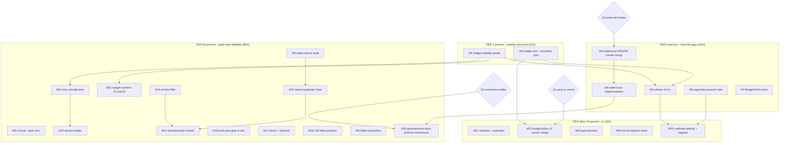

# Pareto Execution Plan — Paperclip Aftermath: Budget-Gate Visibility & Wake-Trace

**Planned:** 2026-10-04 23:59 (CLI `date`)
**Scope:** everything the paperclip-research window left open — the 50-item §f brainstorm + §g owner questions from `docs/status/2026-10-04_03-11_paperclip-lessons-budget-gate-window.md`, plus that report's self-critique omissions. This plan ranks and sizes it; it does not execute it.
**Customer:** (1) Lars operating autonomous agent pools — money safety, observability, trust; (2) library consumers of the public facades — correct, released behavior.
**Hard rules:** no verschlimmbessern (every change leaves the repo verifiably no worse); concurrent agents commit constantly (re-read before judging, never revert foreign work); every code task ends at its module gate + root battery per AGENTS.md; owner-blocked questions gate their downstream tasks, not the whole plan.

**Ground truth this plan builds on (verified 2026-10-04 03:11 window):**
- SHIPPED: claim-time budget gate (`worker.Config.Budget` hook, `RequeueClassBudget` + facade alias, `budgetClaimGate` in cmdAgentPool, `TestBudgetGateBlocksPaidTurn` green 3× `-race`); all gates green at HEAD.
- The gate is INVISIBLE: no journalaudit hint, no webui rendering, no PapDashboard alert for budget-BLOCKED claims (only enqueue-refusal alerts exist).
- The money lesson is only unit-pinned: no e2e proves "enqueued before cap → must not run after cap".
- Wake coalescing exists as pacing (one live task per repo); suppressed triggers leave NO journal trace — the one genuine paperclip gap, already rowed in TODO_LIST (fact-shape-first).
- `task.dead-lettered` already covers retry-exhaustion journaling (adjudicated, done).

---

## 1. Pareto Breakdown

### The 1% that delivers 51%
**Make the shipped budget gate visible and provable.** A money-safety gate nobody can see is half a gate: when the cap bites, the pool LOOKS idle → false dead-pool/starvation signals → operator distrust → gate gets disabled. Four small artifacts close it: journalaudit `budget` hint, webui `parked: budget` rendering, PapDashboard budget-blocked alert class, and the before/after-cap e2e. All ride existing seams (fact detail already carries class `budget`).

### The 4% that delivers 64% (= the 1% plus)
- **Wake-trace durable evidence** — the last genuine gap vs paperclip: fact-shape-first design (new `task.wake` fact vs evidence key), then ship through harvest + the three consumers (journalaudit, webui, readmodel).
- **`docs/research/paperclip-lessons.md`** — the comparison currently lives only in chat; source-verify 2-3 cited paperclip paths while writing it.
- **Release v0.3.x** — the gate reaches customers only via a tag (queue + worker module tags, proxy checks, pkg.go.dev verify, docs/release rc capture).
- **Gate robustness tail**: BudgetCmd short-TTL cache (stop `sh -c` per claim), DST midnight pin, budget-vs-question precedence test.

### The 20% that delivers 80% (= the 4% plus)
- Observability polish: `tq top`/`tq tasks` budget chip, journalaudit `--json` budget counts, readmodel projection.
- Webui adoption of paperclip's operator stance: what-is-happening / does-it-need-me / what-do-I-do audit; one status vocabulary; monospace machine values; contextual-feedback rules (stale errors hide, late terminal outcomes refresh silently).
- Reliability: retry failure-classification taxonomy (provider `retryNotBefore` from body), session-escalation ladder, stranded-work human notices, zombie-run filter.
- Ops debt: full `ci-local.sh` run (owed), root-gate retry-once wrapper, `tq work --agents` gate-or-document, doctor budget self-check, devmod clear error, flake quarantine, LSP false-positive suppression.

### The other 20% (to 100%)
Long tail, mostly ROADMAP fuel: routines/cron with concurrency+catch-up policies, goal-ancestry in prompts, secret-injection seam (successor to redaction), responsible-user attribution, per-project caps + hysteresis + working-set accounting, guard/protocol documentation (size-guard reset protocol, facade-parity pre-commit ordering, DOMAIN_LANGUAGE vocab, CAS invariant), Windows matrix + example hook, archive sweep of predecessor reports, changelog cross-links.

### Owner-blocked (gates, not tasks — §g of the 03-11 report)
1. Park-until-midnight vs cancel/dead-letter on over-cap days (decides M22 hysteresis shape).
2. Wake-trace: new fact type vs evidence key (decides M3/M4).
3. Concurrent module restructure: hold cross-module doc claims until `internal/composition` settles (affects M20 wording, M6 release notes).

---

## 2. Comprehensive Plan — medium tasks (30–100 min each)

Sorted by importance → impact → customer-value → effort (S<45, M 45–75, L>75 min).
`src` = §f item numbers of the 03-11 report (completeness audit).

| # | Task | Tier | Impact | Effort | Est | Customer value | src |
|---|------|------|--------|--------|-----|----------------|-----|
| M1 | Budget-gate visibility bundle: journalaudit `budget` hint block + webui `parked: budget` task-card badge + PapDashboard budget-BLOCKED alert class (distinct from enqueue-refusal) | 1% | H | M | 90m | Operator sees WHY the pool is idle; no false dead-pool distrust | 2,3,4 |
| M2 | Budget e2e + boundary pins: internal/e2e "enqueued-before-cap must not run after cap" + DST midnight table test + budget-vs-question precedence probe | 1% | H | S | 60m | The money lesson proven end-to-end, not unit-only | 6,8,42 |
| M3 | Wake-trace DESIGN: fact shape first (new `task.wake` vs RequeueEvidence-pattern key), consumer ripple inventory (journalaudit/webui/readmodel + pinned tests), ADR-style note; needs §g-2 ruling | 4% | H | M | 60m | The one genuine paperclip gap, scoped before code | 1 |
| M4 | Wake-trace IMPLEMENTATION: harvest skip-path wiring + journalaudit surface + webui count/badge + readmodel event; conform suites if Store surface changes | 4% | H | L | 100m | Durable trace of suppressed triggers; drift forensics | 1,32 |
| M5 | `docs/research/paperclip-lessons.md`: full comparison (wake model, 3-point budget, retry taxonomy, webui stance) + source-verify 2-3 cited paperclip paths | 4% | M | S | 45m | Session knowledge becomes durable repo knowledge | 22,39 |
| M6 | Release v0.3.x: CHANGELOG cut, queue+worker module tags, docs/release rc capture, proxy checks, pkg.go.dev verify | 4% | H | M | 90m | Library customers actually receive the gate | 31,48 |
| M7 | BudgetCmd short-TTL cache (stop `sh -c` per claim) + cache-invalidation note | 4% | M | S | 45m | Claim-path cost bounded on cmd-gated pools | 7 |
| M8 | Verification debt: full `scripts/ci-local.sh` run on green tree + root-gate retry-once wrapper script | 20% | M | S | 30m | Cheaper green signals; stops per-window flake re-adjudication | 44,45 |
| M9 | Webui operator-stance audit: screen-by-screen "what is happening / does it need me / what do I do" assessment of `tq serve`, findings table only | 20% | M | M | 60m | UI trust foundation for every later webui fix | 23 |
| M10 | Webui systematic fixes: one status vocabulary sweep + monospace machine-value helpers + contextual-feedback rules (stale execution errors hide when superseded; late terminal outcomes refresh silently; expected cancel neutral) | 20% | M | L | 100m | Operator learns the vocabulary once | 24,25,26 |
| M11 | Budget surfaces: `tq top`/`tq tasks` budget-parked chip + journalaudit `--json` budget counts + readmodel projection | 20% | M | M | 45m | CLI/JSON parity with the webui badge | 5,35,36 |
| M12 | Retry failure-classification layer: transient vs non-transient taxonomy + provider `retryNotBefore` parsed from response BODY (header already honored) + classification on requeue facts | 20% | M | L | 100m | Fewer wasted retries; smarter DLQ autopsies | 13 |
| M13 | Session-escalation ladder on agent retries (same_session → fresh_session → safer invocation), paperclip-style | 20% | L | M | 60m | Better recovery odds on sick sessions | 14 |
| M14 | Stranded-work escalation: human-visible notice for blocked-but-alive states (dep-blocked, uninvokable target); never auto-recover human-assigned work | 20% | M | L | 90m | No silent stuck-middle states | 15 |
| M15 | Zombie-run filter: exclude in-process-dead runs as resume/coalesce targets in claims | 20% | M | S | 45m | Correctness of the park→resume contract | 16 |
| M16 | `tq work --agents` budget decision: add budget flags + gate wiring OR document deliberate ungatedness in AGENTS.md | 20% | M | S | 30m | No surprise ungated paid path | 11 |
| M17 | Ops hardening pair: doctor budget-gate wiring self-check (extend `doctorBudget`) + devmod clear-error when `cmd/tq/go.mod` loses its module line | 20% | L | S | 45m | Faster ops diagnosis | 12,34 |
| M18 | LSP false positives: root-cause or crisply suppress the cmd/tq gopls diagnostics (48 errors noise) | 20% | L | M | 60m | Signal in the editor again | 27 |
| M19 | Flake quarantine: robustify or tag `TestExactlyOnceUnderConcurrency` + document re-run protocol | 20% | M | S | 30m | Green means green | 28 |
| M20 | Guard/protocol docs bundle: size-guard reset protocol (stop ad-hoc 15.2k→15.4k churn), facade-parity pre-commit ordering, DOMAIN_LANGUAGE budget+wake vocab, CAS/RowsAffected invariant as explicit store invariant, claim-gate cheap-first ordering note; HOLD until §g-3 restructure settles | 20% | L | M | 60m | Next agent stops re-learning these | 17,29,30,32,33,38 |
| M21 | Test matrix + DX: confirm Windows CI for the new worker test + `Config.Budget` example in `example_test.go` + examples/embed sweep | tail | L | S | 45m | Library-consumer onboarding | 37,43,47 |
| M22 | Budget policy v2: per-project daily caps + hysteresis (block at cap, release below cap−1) + working-set accounting for parked tasks; NEEDS §g-1 ruling | tail | M | L | 100m | Fairness across repos; no midnight thrash | 9,10,41 |
| M23 | Goal-ancestry injection in harvest payloads (item → section → repo purpose) | tail | L | L | 90m | Agents know why work matters | 18 |
| M24 | Secret-injection seam: minted per-run env + forbidden-key stripping + managed HOME allowlist — design note + prototype (successor to output redaction) | tail | H* | L | 100m | *long-term security posture | 19,20 |
| M25 | Parking + hygiene: ROADMAP rows (routines/cron w/ concurrency+catch-up, org-scale, attribution), archive-sweep predecessor 02-36/02-38 §f triage, CHANGELOG link to research note | tail | L | S | 60m | Nothing entombed | 21,40,49,50 |

Totals: 25 medium tasks, ~21.6h estimated. ALL 50 §f items mapped (1,2,3,4,5,6,7,8,9,10,11,12,13,14,15,16,17,18,19,20,21,22,23,24,25,26,27,28,29,30,31,32,33,34,35,36,37,38,39,40,41,42,43,44,45,46†,47,48,49,50). †46 (cheap-first `loadGateFacts` pattern note) folded into M20.

---

## 3. Fine Breakdown — micro tasks (≤12 min each)

Sorted by importance within their medium task; IDs `M#.#`. Effort column in minutes.

| ID | Micro-task | min | Gate when done |
|----|-----------|-----|----------------|
| M1.1 | Read `cmd/tq/journalaudit.go` requeue-summary block; add `budget` case mirroring the rate-limit hint (text + json) | 12 | test-cmd-tq |
| M1.2 | journalaudit fixture row: budget-class fact → hint rendered (table test) | 10 | test-cmd-tq |
| M1.3 | webui: locate task-card requeue/reason render; add `parked: budget` badge from fact class | 12 | webui module |
| M1.4 | webui test: budget-class fact renders the badge (snapshot-style pin like lease cards) | 10 | webui module |
| M1.5 | papdashboard: add `budget-blocked` alert class distinct from `daily budget exhausted` enqueue alert | 12 | papdashboard module |
| M1.6 | papdashboard test: budget-class requeue fact raises + resolves the new alert | 12 | papdashboard module |
| M1.7 | AGENTS.md: extend the claim-time budget bullet with "alert + audit hint + badge" one clause; size-guard check | 8 | test-cmd-tq |
| M2.1 | internal/e2e: scratch TQ_DB, cap=1, enqueue 2 tasks, run pool; assert task2 never runs, no failed fact, requeue class budget | 12 | e2e pkg |
| M2.2 | e2e: flip past midnight via Guard.Now seam if exposed; else assert NotBefore > now+1h on the budget requeue | 10 | e2e pkg |
| M2.3 | DST pin: table test for midnight computation across a 23h/25h local day (fixed zones) | 10 | root go test |
| M2.4 | Precedence probe: task with pending question + budget block → question requeue wins or documented order; pin test | 12 | worker module |
| M3.1 | Ruling §g-2 input memo: fact-type vs evidence-key tradeoffs, consumer ripple table, recommendation | 12 | none (doc) |
| M3.2 | Draft fact shape + evidence struct (mirroring RequeueEvidence pattern) behind the chosen option | 12 | none (design) |
| M3.3 | Inventory pinned tests that enumerate fact types (readmodel parity, webui, journalaudit) → checklist | 10 | none (design) |
| M3.4 | Write the design note (docs/planning or docs/research) + TODO row update | 10 | doc-refs |
| M4.1 | journal: add fact type const + doc comment | 6 | journal module |
| M4.2 | harvest: append wake evidence on the occupied-skip path (deduped, seq-derived key) | 12 | harvest pkg |
| M4.3 | harvest test: changed-item-while-occupied leaves exactly one wake trace per tick | 12 | harvest pkg |
| M4.4 | journalaudit: wake count line in the requeues/budget block | 10 | test-cmd-tq |
| M4.5 | webui: wake count on task card (badge) + test | 12 | webui module |
| M4.6 | readmodel: event case + projection column + parity test | 12 | readmodel module |
| M4.7 | DOMAIN_LANGUAGE.md: "wake" entry; AGENTS.md one clause if contract-level | 8 | doc gates |
| M5.1 | Fetch + read 2-3 cited paperclip sources (wake-queue use-cases.ts, routines.ts, provider-failure-classification.ts) | 12 | none |
| M5.2 | Write docs/research/paperclip-lessons.md (comparison table + adopted/rejected/parked) | 12 | doc-refs |
| M5.3 | Cross-link: CHANGELOG budget entry → research note; status report annotation pointer | 6 | doc-refs |
| M6.1 | Verify tree green (root battery + per-module gates) at release candidate commit | 12 | full |
| M6.2 | CHANGELOG: cut Unreleased → v0.3.x section; date; verify append-only | 10 | none |
| M6.3 | Tag root v0.3.x + queue/worker module tags (annotated); NO push yet (owner gate) | 10 | tags |
| M6.4 | Proxy checks: `go list -m -versions` per tag + /tmp sentinel probe per docs/release flow | 12 | release gate |
| M6.5 | pkg.go.dev render check for changed facades; record rc in docs/release/ | 10 | release gate |
| M7.1 | budget: add TTL cache around BudgetCmd exec (Guard field + clock seam) | 12 | root |
| M7.2 | budget test: cmd invoked once per TTL window; refusal cached; expiry re-runs | 12 | root |
| M7.3 | cmdAgentPool: wire cached guard into budgetClaimGate (no signature change) | 6 | test-cmd-tq |
| M8.1 | Run `scripts/ci-local.sh` on the green tree; triage any foreign break per retry protocol | 12 | ci-local |
| M8.2 | scripts/root-gate.sh: build+vet+test -race with ONE retry on known-flaky signatures | 12 | script self-run |
| M8.3 | Wire root-gate.sh into AGENTS.md commands block (one line, size-guard aware) | 8 | test-cmd-tq |
| M9.1 | Screenshot/walk `tq serve` screens; per-screen three-question verdict table | 12 | none |
| M9.2 | File findings as rows (webui section TODO or M10 input); no code this task | 8 | check-todo |
| M10.1 | Vocabulary sweep: list all status strings across badges/rows/charts; drift table | 12 | none |
| M10.2 | Map each to the semantic status token set; fix renames in one pass | 12 | webui module |
| M10.3 | Monospace helpers for IDs/cost/tokens/timestamps; replace ad-hoc formats | 12 | webui module |
| M10.4 | Contextual rule: execution notices hide when task terminal or superseded | 12 | webui module |
| M10.5 | Contextual rule: terminal outcome >5min late → silent refresh, no toast | 12 | webui module |
| M10.6 | Contextual rule: expected cancellation renders neutral, not error | 10 | webui module |
| M10.7 | Tests for 10.4-10.6 (reuse existing webui_test harness) | 12 | webui module |
| M11.1 | `tq top`: budget-parked chip off requeue class (mirror existing chips) | 12 | test-cmd-tq |
| M11.2 | `tq tasks` filter: `--parked budget` or status-scope equivalent | 12 | test-cmd-tq |
| M11.3 | journalaudit --json: budgetCounts field + test | 10 | test-cmd-tq |
| M11.4 | readmodel: budget-parked projection column + parity test | 12 | readmodel module |
| M12.1 | executor: define FailureClass taxonomy (transient/permanent/provider-window/env) as typed values | 12 | executor module |
| M12.2 | Parse provider `retryNotBefore`/reset from response BODY (ratelimit.go seam) + test | 12 | executor module |
| M12.3 | Worker: stamp class on requeue evidence (extends RequeueClass set? design-min: reason prefix) | 12 | worker+queue |
| M12.4 | Conform suite: new evidence key pinned across backends | 12 | conform |
| M12.5 | dlqfix: autopsy uses class (skip re-derivation from tails) | 12 | dlqfix |
| M13.1 | agent executor: session-mode resolver by attempt count (paperclip ladder) | 12 | executor module |
| M13.2 | Test: attempt 1 same_session, 3+ fresh_session escalation; verify pins | 12 | executor module |
| M14.1 | Define stranded states (dep-blocked, uninvokable, monitor-held) + notice fact shape | 12 | design |
| M14.2 | Worker/sweeper: emit stranded notice instead of silent requeue loop | 12 | worker module |
| M14.3 | papdashboard: stranded alert class + resolve path | 12 | papdashboard |
| M14.4 | Tests: stranded raised once, never for human-assigned | 12 | worker |
| M15.1 | Worker: liveness check before resume/coalesce target use (inFlight set) | 12 | worker module |
| M15.2 | Test: dead in-process run excluded from resume targets | 12 | worker module |
| M16.1 | Decide + implement: flags + gate on `tq work` OR AGENTS.md "deliberately ungated" clause | 10 | test-cmd-tq |
| M17.1 | doctor: `doctorBudget` reports claim-gate wiring (flags present → gate armed) | 12 | doctor tests |
| M17.2 | build-tq.sh: preflight module-decl check with clear error message | 8 | script smoke |
| M18.1 | Reproduce gopls confusion scope; try gowork-or-ignore config; else document suppress recipe | 12 | none |
| M19.1 | Try robustness (longer deadline under -race) else quarantine tag + skip -race note | 12 | worker module |
| M20.1 | size-guard protocol: agentsDocMaxBytes reset rules into scripts/check-agents-size.sh header + AGENTS.md one clause | 10 | gates |
| M20.2 | Facade parity: add pre-commit ordering note (run before staging) to AGENTS.md conventions | 8 | test-cmd-tq |
| M20.3 | DOMAIN_LANGUAGE: budget terms (cap/guard/gate/blocked vs refused) | 10 | doc-refs |
| M20.4 | AGENTS.md store-invariants: CAS/RowsAffected bullet (one line) | 8 | test-cmd-tq |
| M20.5 | AGENTS.md: claim-gate cheap-first ordering note (one line) | 8 | test-cmd-tq |
| M21.1 | Confirm windows-latest runs worker package; add build-tag-free canary if missing | 12 | CI check |
| M21.2 | example_test.go: Config.Budget runnable example | 12 | worker module |
| M21.3 | examples/{embed,fullcore}: Budget hook mention in doc comments | 8 | build |
| M22.1 | Post-§g-1: per-project cap schema (payload project → per-day counter) design memo | 12 | design |
| M22.2 | Implement per-project gate in budgetClaimGate + Guard projection | 12 | root |
| M22.3 | Hysteresis: release threshold cap−1; test block/release boundary | 12 | root |
| M22.4 | Working-set: parked tasks vs --max-pending accounting; pin intended semantics + test | 12 | harvest+cmd |
| M23.1 | Harvest payload: include section heading + repo purpose block (prompt template v2) | 12 | harvest |
| M23.2 | Test: rendered prompt carries ancestry; agent executor pin | 12 | executor |
| M24.1 | Design note: minted per-run env, forbidden-key strip list, managed HOME allowlist | 12 | design |
| M24.2 | Prototype forbidden-key stripping in agent executor env build + test | 12 | executor |
| M24.3 | SECURITY.md: injection-vs-redaction posture paragraph | 10 | doc-refs |
| M25.1 | ROADMAP: routines/cron (concurrency policies, capped catch-up), org-scale, attribution rows | 10 | none |
| M25.2 | Archive sweep: triage 02-36/02-38 §f items vs this plan; fold survivors into TODO_LIST | 12 | check-todo |
| M25.3 | CHANGELOG: link budget entry ↔ research note (M5.3 dependency) | 6 | doc-refs |

Totals: 97 micro tasks, ~16.6h. Every medium task decomposed; nothing unassigned.

---

## 4. Execution Graph (mermaid)

## 5. Verification contract (applies to every task)

- Module-local gate first (`GOWORK=off go build/vet/test -count=1` in the module), then the touched-gate script, then root battery for root-module changes; `go mod vendor` after any internal/ change; facade parity after any internal/queue export; re-run before declaring success (daemon sweeps <60s).
- No new Store surface without conform-suite additions in BOTH backends + cqrsqlite divergence note.
- Doc changes: size-guard aware (single-line bullets), check-doc-refs, check-todo-list for TODO rows.
- Do not start M4 before M3's ruling; do not tag before M6.1's green battery; M20 waits on Q3.
