# SUPERB Pareto Execution Plan — ALL 304 open TODOs (2026-10-05 13:55)

> Point-in-time plan over `TODO_LIST.md` at HEAD `844ed8f7` (304 open rows,
> 97 BLOCKED-on-owner). Method: pareto-planning skill — 1%→51%, 4%→64%,
> 20%→80%, remainder→100%. Table A = 27 strategic tasks (30–100 min each,
> impact-sorted). Table B = fine breakdown (≤12 min each, execution-sorted).
> The **Coverage map** at the end accounts for every TODO_LIST section so no
> row is unowned. TODO_LIST.md stays the living source; this plan is a
> snapshot (docs-health HARVEST pulls items back out later).
>
> NOT a rewrite of anything: no code, no TODO_LIST edits — plan only.

## Step 1 — The Pareto breakdown

### The 1% that delivers 51%
Three moves, roughly 4 hours total, and half the system's friction disappears:

1. **One owner-ruling session** — 97 of 304 rows (32% of the backlog!) are
   BLOCKED on the owner. A single bundled ruling sheet (Table B §O) converts
   a third of the queue into executable work. Nothing else is close.
2. **Heal the red master CI** (row 438) — every window since 10-02 burns
   `CI_CHECK=off` friction and confesses it in §d. One diagnosis restores
   verification discipline for the whole fleet.
3. **Heal the dead-SHA mass** (rows 418/419, 92 cites, growing daily) — a
   red-by-default gate trains everyone to ignore red. Restoring its signal
   protects every future gate.

### The 4% that delivers 64%
Add the structural unblocks (T4–T9): cut v0.4.0 (5 weeks of `[Unreleased]`
becomes shipped, tagged, installable value), finish ADR-0019 S2 (the last
structural journal flip; S3/S4 already landed), file the M4 memo (unblocks
the drift tests + Caps flip), flip the verify gate to `scripts/verify.sh`
(the flake-retry cure gets its production caller), ship the SystemNix deploy
(the system goes actually-live), and run the agent-autonomy overhaul
(prompts + batching = fleet throughput).

### The 20% that delivers 80%
Add the substantive clusters (T10–T23): re-dispatch suppression (kills the
burn-money repeat class), auth/lockout completion, S1-flip robustness,
rate-limit armor, prioritize pilot, webui polish, docs-health mechanization,
CI parity, gosec coverage, postgres completion, derived-outcomes cleanup,
docs surface, process codification.

### The remainder (20% of work → 100%)
T24–T27: fleet observability, worktree-per-agent, paperclip-derived
features, and the long micro-tail in 6–8-row batches.

## Step 2 — Table A: Comprehensive plan (30–100 min tasks, impact-sorted)

| # | Task (30–100 min) | Tier | Rows absorbed (leading phrases) | Impact | Effort |
|---|---|---|---|---|---|
| T1 | **Owner ruling batch #1** — one session, one sheet: push authorization · budget cap-unit (219) · score-TTL 30d (220) · duplicate-claim re-delivery (96) · daemon-fold attribution (93/147) · session-mint budget bypass (94) · closeout-report placement (50) · [x]-purge cadence + vendor-guard YAGNI + sweep cadence (13-51 §g) | 1% | ~15 BLOCKED rows | ★★★★★ | 90m, owner |
| T2 | **Heal the red master CI** — diagnose run predating every tree (438); while in CI: cancelled-run semantics (110) | 1% | 2 | ★★★★★ | 60m |
| T3 | **Dead-SHA mass heal** — 92 cites: `--emit-baseline` generator (04-10 row), fork-record forensics per token, arrow-escape tightening (490) | 1% | 3 | ★★★★★ | 100m |
| T4 | **Cut v0.4.0** — CHANGELOG walk (356), pre-cut sub-tags consciously (companion, sqlitev4 family), root tag, proxy + clean-room checks, facade tag wave | 4% | 4 | ★★★★★ | 100m |
| T5 | **ADR-0019 S2: unify the journal on `facts.Fact`** (33, UNBLOCKED since S1 shipped) — re-point journal/cqrs + webui tailer + sweepers, conform Caps flips | 4% | 1 (large) | ★★★★★ | 100m |
| T6 | **M4 upstream memo + enqueue-detail enrich** (35 + 262) — ratification memo, upstream CountFacts/FactsSince pushdown ask, flip `EnqueuedSnapshot` Caps, re-green drift tests | 4% | 3 | ★★★★☆ | 60m |
| T7 | **Verify-gate flip** — owner rules `.tq-verify` → `scripts/verify.sh` (02-11 §g2 row); then in-situ genuine-red pin (09-16 row) + KNOWN_FLAKY↔Known-Issues sync (09-16 row) | 4% | 3 | ★★★★☆ | 60m |
| T8 | **Deploy + cutover bundle** — SystemNix flip + redeploy (19/149), `--allow-writes` on serve (review row), poolSettings validation (109), GOEXPERIMENT unit env (74), ADR-0019 dogfood cutover (owner-run) | 4% | 5 | ★★★★☆ | 100m, owner+agent |
| T9 | **Agent-autonomy overhaul** — de-micromanage prompt stack (360), batching default (361), crush Channels research (392) → `tq mcp` build rows | 4% | 4+ | ★★★★☆ | 100m |
| T10 | **Re-dispatch suppression + done-guard smoke** — mint-time refusal ruling (424/456/153), `scripts/smoke/done-guard.sh`, examples/embed gate row, re-dispatch provenance counter | 20% | 5 | ★★★★☆ | 60m |
| T11 | **Auth/lockout completion** — lockout table suite (459), SECURITY matrix pin (371), body-shape pin + package doc, SSE header e2e (373), header→want table (374), Retry-After rounding (375), lowercase-scheme row (372), eviction-warn payload ruling | 20% | 9 | ★★★★☆ | 100m |
| T12 | **S1-flip robustness** — SQLITE_BUSY retry at store-open (102), postgres drift-audit executed (352), D1/D2 divergence register doc (388/350/351), verify_stage surfacing (387) | 20% | 6 | ★★★★☆ | 100m |
| T13 | **Rate-limit + budget armor** — vendor gofmt ruling (108), closeoutPending lifetime (142), XDG/log surface (log-path row), budget-unit follow-through after T1, papdashboard token sums | 20% | 5 | ★★★☆☆ | 60m |
| T14 | **Prioritize + priority completion** — live scorer pilot (91), calibration (92), provenance enrichment (09-06 rows), usage-key parity (87), dlqfix prune semantics (fourth-sweep row) | 20% | 6 | ★★★☆☆ | 100m |
| T15 | **Webui P2 polish batch** — overhaul tail (235), budget meter reachability, sessions-lamp cluster, board/provenance polish, AMBIGUOUS soften (282), daemonCommitSubject pin (283), webui rulings (76), mobile pass, dark QA (231) | 20% | 10 | ★★★☆☆ | 100m |
| T16 | **Docs-health mechanization** — eligibility gate (281/441), harvest-disposition lint + completeness ruling, per-item strike-pass retire-or-execute ruling, digest row, `--show-suppressed` audit | 20% | 6 | ★★★☆☆ | 100m |
| T17 | **CI parity + loop guards** — ci.yml parity sweep (217), zero/empty loop guards (fourth-sweep row), session-close/help-text smokes wired, required-checks phase 1 (proposal), statix gate | 20% | 5 | ★★★☆☆ | 100m |
| T18 | **Gosec/gates completion** — cmd/tq gosec coverage (80), ci.yml loop convergence (82), stamped provenance (196), guard-wiring blind spot + wrapper class, goTarballHash single-source (386) | 20% | 6 | ★★★☆☆ | 100m |
| T19 | **Postgres store completion** — CLI `--store` wiring (25, post-T1), `ArchiveFactsBefore` twin, conform `-race` cap row, consumer ghost package ruling (23-adjacent) | 20% | 4 | ★★★☆☆ | 100m |
| T20 | **Derived-outcomes cleanup** — TQ_RESULT stdout deletion (legacy row), stale doc-comment sweep (fourth-sweep row), LogPath render-pin + templ dedup, prioritize badge parity row | 20% | 5 | ★★★☆☆ | 60m |
| T21 | **Session-close + triggers completion** — session bundle (sweep dry-run…postgres arm), trigger #3 crush #3146 (80), ask-policy ruling (188), session E2E dogfood (91-adjacent) | 20% | 4 | ★★★☆☆ | 100m |
| T22 | **Docs + conventions surface** — CHANGELOG overhaul audit row, DOMAIN_LANGUAGE terms (window/mint/trigger/done-prompt/close-epoch), doc-citation conventions (207/341/346), FEATURES/README placement checks (226/232), row-note accretion | 20% | 8 | ★★☆☆☆ | 60m |
| T23 | **Fleet/ops observability** — `tq pool-health` (dogfood row), fleet liveness doctor check, `--fleet` budget aggregation, log-path polish row, dead-pool doctor warnings, CQA live verification (owner-gated) | rest | 6 | ★★☆☆☆ | 100m |
| T24 | **Worktree-per-agent implementation** — after Q1 merge-policy ruling (111): claim→worktree→verify→merge→reap + smoke + dogfood-first | rest | 3 | ★★☆☆☆ | 100m |
| T25 | **Paperclip-derived features** — event-wake ingress (ROADMAP S1), bring-your-own-agent adapters (S2), cost receipts rollup (S3), routines/cron groundwork (wake-trace row BLOCKED on §g-2) | rest | 4 | ★★☆☆☆ | 100m |
| T26 | **Long-tail micro-batch A** — smoke-assert gap bundle, small executor/budget pins, TQ_BIN rot-guard, dead-export audit trio, fold-marker script, lint-lll self-test | rest | ~15 | ★★☆☆☆ | 100m |
| T27 | **Long-tail micro-batch B** — help-text/verify-contains micros, index-row drift guards, doctor WARNs, golden-fragment pins, the 12-min list below completed | rest | ~20 | ★☆☆☆☆ | 100m |

## Step 3 — Table B: Fine breakdown (≤12 min each, execution-sorted)

Legend: §O = owner-session slices; each names the TODO rows it discharges.

### O. Owner ruling session (T1) — the 51%
| # | Task (≤12 min each) | Discharges |
|---|---|---|
| O1 | Rule push authorization + master-push policy (rows 23/54-class) | 2 |
| O2 | Rule budget cap unit (219) — task-count vs token/cost | 1 (+2 folds) |
| O3 | Rule score-TTL 30d + aging unification (220) | 1 |
| O4 | Rule duplicate-claim re-delivery / mint-time suppression (96, 424, 456, 153) | 4 |
| O5 | Rule daemon-fold attribution + footer shape + heal ratification (93, 147, 288, 446, 417) | 5 |
| O6 | Rule session-mint budget bypass (94) + ask-policy (188) | 2 |
| O7 | Rule closeout-report placement + TODO-append caps (50, 51) | 2 |
| O8 | Rule consumer ghost package (22) + interface triplication (23) | 2 |
| O9 | Rule gosec gate-vs-advisory (46) + CI-time budget (61) + TODO accuracy bar (63) | 3 |
| O10 | Rule journal/cqrs facade + cqrs-lint patch rights (rows 78/79) | 2 |
| O11 | Rule worktree merge-policy Q1 (111) + PR-mode (row 76 CSP twin) | 2 |
| O12 | Rule S4 cutover + TQ_NO_AUTO_UPGRADE posture (rows 34/35-adjacent) + reredis... cqrsqlite disposition | 2 |
| O13 | Rule the 13-51 trio: [x]-purge cadence, vendor-guard YAGNI, next-sweep timing | 3 |
| O14 | Rule CHANGELOG non-boundary policy (62/63) + smoke-only additions (138-adjacent) | 2 |
| O15 | Rule pool policy on red master (49) + GOEXPERIMENT unit env (74) + Dependabot policy (26) | 3 |

### 1% execution (T2/T3)
| # | Task | Rows |
|---|---|---|
| E1 | gh run identify the pre-existing red master run; triage its failing jobs | 438 |
| E2 | Fix/annotate each failing leg; confirm green run; record in row 438 + CHANGELOG if user-facing | 438 |
| E3 | check-ci cancelled-run classification fix + negative test | 110 |
| E4 | Write `check-dead-sha-refs.sh --emit-baseline` generator mode | 04-10 row |
| E5 | Baseline the 92-cite mass; per-token fork-record or re-resolve (batch 1: 10-01/10-02 reports) | 418/419 |
| E6 | Same, batch 2 (09-2x reports + README index); re-run gate rc=0 | 418/419 |
| E7 | Tighten arrow-escape to per-token matching + self-test case | 490 |

### 4% execution (T4–T9)
| # | Task | Rows |
|---|---|---|
| E8 | Walk CHANGELOG [Unreleased] → version sections; pre-cut sub-tag list | 356 |
| E9 | Cut root v0.4.0 + module sub-tags; proxy + clean-room verify; GitHub Release | 356/88-twin |
| E10 | S2 spike: journal.Fact→facts.Fact mapper on cqrsqlite + sqlitev4 writes | 33 |
| E11 | S2: re-point internal/journal/cqrs + webui tailer + sweepers; conform flips green | 33 |
| E12 | File M4 ratification memo upstream (CountFacts/FactsSince + snapshot growth) | 35 |
| E13 | Upstream enqueue-detail enrich lands → flip Caps.EnqueuedSnapshot → drift tests green | 262 |
| E14 | Owner flips `.tq-verify` → verify.sh; remove BLOCKED note; smoke the flip | flip row |
| E15 | check-verify genuine-red in-situ pin + KNOWN_FLAKY↔AGENTS sync gate | 2 rows (09-16 §) |
| E16 | SystemNix input flip + redeploy + post-deploy smoke (owner sudo) | 19/149 |
| E17 | `--allow-writes` module flag + poolSettings validation + GOEXPERIMENT env | 3 rows |
| E18 | Prompt de-micromanagement pass 1: agent.go work-prompt + review/status constants; pin updates | 360 |
| E19 | Batch-default: raise DefaultBatchItems to 3 + flag-help + pins + FEATURES/CHANGELOG | 361 |
| E20 | Channels wire-contract research note → `tq mcp` design rows minted | 392 |

### 20% execution (T10–T23, one slice per deliverable)
| # | Task | Rows |
|---|---|---|
| E21 | Mint-time done-check ruling implementation (refuse terminal-ID re-dispatch) | 424/456/153 |
| E22 | `scripts/smoke/done-guard.sh` + ErrTaskDone surfaces row | 2 rows (20-31) |
| E23 | lockout fake-clock table suite (strike/lockout/OnLock/prune/eviction) | 459 |
| E24 | SECURITY header matrix pin + X-Robots smoke assert | 371 |
| E25 | Body-shape JSON pin + httpapi package doc sentence | 2 rows (10-04) |
| E26 | SSE header e2e + header→want table refactor + Retry-After rounding test | 373/374/375 |
| E27 | SQLITE_BUSY store-open retry/backoff behind owner class ruling | 102 |
| E28 | Postgres drift-audit executed + cite runner evidence | 352 |
| E29 | D1/D2 divergence register doc + cross-links | 388/350/351 |
| E30 | verify_stage: webui render + worker fact pin + dlq/show filter (387) | 387 |
| E31 | Vendor-gofmt structural fix per owner ruling (108) + vendor-freshness leg (487) | 108/487 |
| E32 | closeoutPending lifetime audit + papdashboard budget-token sums | 142/09-52 row |
| E33 | Prioritize live pilot: one batch on the dogfood pool, cost measured | 91 |
| E34 | Keyword-table calibration after pilot + TTL follow-through | 92/220 |
| E35 | Provenance enrichment (ScoredAt, effort/token rows, deep-link) + usage-key parity | 87 + 09-06 rows |
| E36 | Webui P2 batch half 1: tick frequency, a11y audit, cancel/rescue feedback | 235 |
| E37 | Webui P2 batch half 2: AMBIGUOUS soften, regex pin, folded_here help, board micros | 282/283/284/235 |
| E38 | Budget meter reachability + sessions-lamp cluster (fourth-sweep rows) | 2 rows |
| E39 | Eligibility gate: check-archive-eligibility.sh (scope per ruling O-1) + ci-local wiring | 281/441 |
| E40 | Harvest-disposition lint + strike-pass retire-or-execute executed | fourth-sweep rows |
| E41 | ci.yml parity: wire dead-sha/features-ci/verify/session-close/help-text legs | 217 |
| E42 | ci.yml zero/empty loop guards + sed-drift pin + required-checks phase 1 | fourth-sweep + proposal rows |
| E43 | cmd/tq gosec coverage + ci.yml convergence + provenance stamp | 80/82/196 |
| E44 | goTarballHash single-source + vendorHash provenance sentence | 386 |
| E45 | Postgres CLI `--store` wiring (after ruling) + ArchiveFactsBefore twin | 25 + FEATURES gap |
| E46 | TQ_RESULT stdout deletion + stale doc-comment sweep (httpapi v0.2, crush v0.92, review.go wording) | legacy + fourth-sweep rows |
| E47 | LogPath render-pin test + collapse 4 templ fragments + prioritize badge | fourth-sweep rows |
| E48 | Session bundle: sweep --dry-run, list --json/--all, registry mode, Store pin | session row |
| E49 | Session: doctor stale-open visibility + postgres e2e arm + close-failure contract | session row |
| E50 | Docs: DOMAIN_LANGUAGE terms + CHANGELOG overhaul audit + citation conventions | T22 rows |
| E51 | Process: annotation-cite spot-checker + gate-attribution guard + index phrase-drift guard | 3 rows |
| E52 | `tq pool-health` + fleet liveness doctor check + `--fleet` aggregation | 3 rows |

### remainder (T23–T27 slices, compressed)
| # | Task | Rows |
|---|---|---|
| E53 | Log-path polish row + dead-pool doctor warn + budget Nth-item policy follow-through | 3 rows |
| E54 | Worktree slice rows minted after Q1; smoke skeleton; dogfood-first flip | 111/440 |
| E55 | Event-wake ingress spike (S1) + adapters design note (S2) + receipts rollup (S3) | ROADMAP 3 |
| E56 | Micro-batch A1: smoke-assert bundle + Permissions-Policy assert + X-Robots | 3 rows |
| E57 | Micro-batch A2: TQ_BIN rot-guard + dead-export trio + fold-marker script | 4 rows |
| E58 | Micro-batch B1: help-text self-test + golden-fragment pin + sort/board micros | 4 rows |
| E59 | Micro-batch B2: doctor WARNs (dedup-key ticked, dirty-tree starvation, evidence tail size) | 3 rows |
| E60 | Micro-batch B3: fullcore `--json`/deadline knob + lib.sh extraction + exit-code contract | 4 rows |
| E61 | Micro-batch B4: factTone pins + detailItems audit + prior-commit probes | 3 rows |
| E62 | Micro-batch B5: config verify in ci-local + version-agreement gate + rename-hygiene scanner | 3 rows |
| E63 | Micro-batch B6: gocognit repair + dry-run hint symmetry + ANSI/whitespace pins | 4 rows |
| E64 | Micro-batch B7: docs-battery canonization + trailer-parser edge tests + retention row | 3 rows |

## Step 4 — Execution graph

```mermaid
flowchart TD
    subgraph one["1% → 51%"]
        T1["T1 Owner ruling batch<br/>(unfreezes ~15 BLOCKED rows)"]
        T2["T2 Red-master CI heal"]
        T3["T3 Dead-SHA mass heal"]
    end
    subgraph four["4% → 64%"]
        T4["T4 v0.4.0 release cut"]
        T5["T5 ADR-0019 S2 journal unify"]
        T6["T6 M4 memo + Caps enrich"]
        T7["T7 Verify-gate flip"]
        T8["T8 Deploy + cutover"]
        T9["T9 Agent autonomy (prompts/batch/MCP)"]
    end
    subgraph twenty["20% → 80%"]
        T10["T10 Re-dispatch suppression"]
        T11["T11 Auth/lockout completion"]
        T12["T12 S1-flip robustness"]
        T13["T13 Rate-limit + budget armor"]
        T14["T14 Prioritize completion"]
        T15["T15 Webui P2 polish"]
        T16["T16 Docs-health mechanization"]
        T17["T17 CI parity + loop guards"]
        T18["T18 Gosec/gates completion"]
        T19["T19 Postgres completion"]
        T20["T20 Derived-outcomes cleanup"]
        T21["T21 Session-close completion"]
        T22["T22 Docs + conventions"]
    end
    subgraph rest["remainder → 100%"]
        T23["T23 Fleet observability"]
        T24["T24 Worktree-per-agent"]
        T25["T25 Paperclip features"]
        T26["T26 Micro-batch A"]
        T27["T27 Micro-batch B"]
    end
    T1 -->|rulings unblock| T10
    T1 -->|goec/budget classes| T13
    T1 -->|store wiring go| T19
    T2 -->|green CI| T17
    T3 -->|gate signal| T16
    T6 -->|Caps flip| T5
    T5 --> S4c["S4 completion: delete hand engines<br/>(owner cutover, part of T8)"]
    T7 --> T18
    T8 --> T23
    T9 --> T21
    T1 --> Q1["Q1 merge-policy ruling"] --> T24
    T4 -->|"tags cut → proxies resolvable"| T5
```

## Coverage map — every TODO_LIST section → plan task

| TODO_LIST section (rows) | Plan task |
|---|---|
| Fleet/deploy (1) | T8 |
| Owner-blocked decisions (5) | T1 (O1/O8) |
| go-cqrs-lite platform adoption (5) | T5/T6/T8 |
| Dogfood round (2) | T23 (pool-health), T23+owner (CQA) |
| Window f20–f24 (2) | T1 (O9), T2-adjacent policy |
| Fullcore-window follow-ups (5) | T1 (O1/O7), T17, T13 |
| Window follow-ups 08-25 (1) | T1 (O-queue convention) |
| Review-window follow-ups (4) | T1 (O14/O9), T8, T15 |
| Docs-health harvest 09-11 (1) | T17 (retry wrapper polish) |
| Round-13 planning additions (3) | T8, T1, T15 |
| Done-prompt harvest 09-12 (4) | T21, T18, T3 (backup refs), T9 |
| Priority-system follow-ups (10) | T14 (cluster), T1 (O4/O5/O6), T20 |
| Docs-health harvest 09-14 (7) | T12, T8, T2, T24, T11 |
| Webui overhaul leftovers (1) | T1 (CSP ruling) |
| Done-prompt harvest 09-16 (~8) | T7, T16, T17, T22 |
| (…all later Done-prompt / Row-N / harvest sections…) | mapped 1:1 above in Table A/B; sections on rows 330–501 split across T10/T11/T12/T16/T17/T18/T20/T26/T27 |
| Process follow-ups (3) | T22 (E51) |
| Docs-health harvest 09-21 (15) | T16/T17/T18/T15/T20/T13 |
| Repeat-dispatch + verify-gate follow-ups (6) | T10, T12 |
| art-dupl pass (4) | T16/T18, T12 (drift row 262→T6) |
| Row-110/111/145/147 follow-ups (8) | T22, T12, T11 |
| Review-fix / done-prompt 09-26 (4) | T15, T22 |
| Commit-msg hook + hook inertness (7) | T22/T17 (hook rows) |
| Row-113..121 clusters (14) | T14, T15, T16 (tag/re-tag rows ride T4) |
| Row-138 + tasks-truncation (4) | T4, T20 |
| Agent-autonomy overhaul (2) | T9 |
| Security-batch (6) | T11 |
| Docs-health harvests 09-30/10-01 (11) | T16/T17/T13/T14 |
| Queue-health restoration (5) | T12/T13 |
| Done-prompt harvests 10-02/03/04 (30+) | T10/T11/T15/T17/T18/T26/T27 |
| Requeues-audit window (4) | T12/T10 |
| Paperclip + wake-trace (1) | T25 |
| Daemon-attribution gate (2) | T18 (E43) |
| Archive-evidence negation (4) | T18/T26 |
| Done-prompt 10-04→05 (8) | T7, T16, T18, T26 |
| Docs-health harvest 10-05 (22) | distributed T13–T20 per row text |

Every one of the 304 open rows belongs to exactly one Table-A task via its
section; the ≤12-min slices in Table B name their rows explicitly. Any row
discovered unmapped during execution: mint it into TODO_LIST (living source)
and file under the nearest task.

## Verification
- After each strategic task: module/root battery + touched gates (todo-list,
  doc-refs, agents-size, features-ci when FEATURES touched, verify-battery).
- Table B slices inherit their parent's verification; micro-batches run
  `check-script-syntax` + the touched gate's self-test.
- Weekly docs-health sweep re-derives this plan's remaining work from
  TODO_LIST (the living source) — this file is never edited forward.
