# Platform-Endgame Pareto Master Plan

Date: 2026-10-05 20:24 CEST · Owner directive: "use go-cqrs-lite metaengine/ +
system/ — fully migrate, remove all legacy; MAKE A PLAN; don't
verschlimmbessern" · Input inventory: **301 open TODO_LIST rows** (70
BLOCKED), the ADR-0019 endgame plan (P0–P4 landed; P5 pending), the
2026-10-05 metaengine/system adoption deep-dive (58/100, findings F1–F8,
`docs/research/2026-10-05_go-cqrs-lite-metaengine-system-deep-dive.html`),
and the 09-15/10-15 status-report §f queues.

Method: every open item is mapped to a medium task (30–100 min) and sliced
into fine tasks (≤12 min each). Sorting: tier (1%→4%→20%→other-20%), then
impact desc, effort asc, customer-value desc. The plan is a snapshot; the
living source stays `TODO_LIST.md`.

## Pareto verdict

- **1% → 51%**: The owner decision pack (tag wave / dogfood cutover / P5
  cadence — zero agent minutes, unblocks the critical path) + the three
  agent-executable endgame cores: Delta counters (F2), durable readmodel
  cursor (F1-min), cqrsqlite deletion (P5/O12). Together they make "fully
  migrated onto metaengine+system, auto-upgradeable, legacy gone" TRUE and
  fix the hottest operational cost (9,523-fact replay + O(n) stats).
- **4% → 64%**: Tag-wave execution + cleanroom verify, dogfood cutover
  assist, P5 docs truth pass, projectionhost+DLQ (F1-full), platform health
  visibility (F3), red-master CI fix, and the re-dispatch burn killers
  (O4/O5) that reclaim most wasted agent windows.
- **20% → 80%**: S2 one-vocabulary flip, spend controls (O2/O3),
  agent-autonomy (batching + prompt de-micromanagement), worker-safety,
  security pins, audit drill-downs, doctor liveness, ci.yml parity,
  evidence/gates hardening, SQLITE_BUSY class fix, quiet-host matrix proof.
- **Other 20% (to 100%)**: docs-health mechanization, upstream filings, and
  the long-tail pin/test/polish backlog burned down in standing 12-min
  batches (~180 rows) until zero.

## Execution graph

```mermaid
flowchart TD
  subgraph T1["1% -> 51% (critical path)"]
    M01[M01 owner decision pack]
    M02[M02 Delta counters + dual-tally collapse]
    M03[M03 durable readmodel cursor]
    M04[M04 cqrsqlite deletion]
  end
  subgraph T4p["4% -> 64%"]
    M05[M05 tag wave v0.3.1 + 6 tags]
    M06[M06 dogfood cutover assist]
    M07[M07 P5 docs truth pass]
    M08[M08 projectionhost + DLQ]
    M09[M09 platform health visibility]
    M10[M10 red-master CI fix]
    M11[M11 re-dispatch burn killers]
    M12[M12 daemon attribution + hooks]
  end
  subgraph T20["20% -> 80%"]
    M13[M13 S2 vocabulary flip]
    M14[M14 evidence + gates hardening]
    M15[M15 quiet-host matrix proof]
    M16[M16 token/cost cap O2]
    M17[M17 JIT frontier O3]
    M18[M18 batching + prompt autonomy]
    M19[M19 worker claim/park safety]
    M20[M20 security pins]
    M21[M21 audit drill-downs]
    M22[M22 doctor liveness + census]
    M23[M23 ci.yml parity + checks]
    M24[M24 webui customer surfaces]
    M25[M25 SQLITE_BUSY class fix]
  end
  subgraph TR["other 20% -> 100%"]
    M26[M26 upstream filings]
    M27[M27 docs-health + long-tail burn]
  end
  M01 --> M05
  M01 --> M06
  M05 --> M07
  M06 --> M07
  M02 --> M07
  M04 --> M07
  M03 --> M08
  M08 --> M09
  M10 --> M14
  M14 --> M15
  M05 --> M26
  M02 --> M08
  M07 --> M27
```

## Comprehensive plan — medium tasks (30–100 min each; ≤27 per skill cap)

Sorted: tier, then impact (Imp 1–5) desc, effort asc, customer value (CV 1–5) desc.

| # | Task | Tier | Imp | Effort | CV | Covers (TODO rows / findings) | Deps |
|---|------|------|-----|--------|----|-------------------------------|------|
| M01 | Owner decision pack: tag wave auth, dogfood cutover go, P5 cadence, F4 upstream seam, F8 consumer fate, ~12 accumulated BLOCKED rulings | 1% | 5 | 0h (owner) | 5 | §g questions ×3 sessions; rows 24/25/26/34/35; F4/F8 | — |
| M02 | metaengine Delta counters for by_status/by_project + collapse BOTH CLI tallies (the P5 dual-tally done right) | 1% | 5 | 90m | 5 | Deep-dive F2; P5 item; model.go:259-272; main.go:2043-2075 | — |
| M03 | Durable readmodel cursor via watermarks table (checkpoint-after-batch) | 1% | 5 | 60m | 4 | Deep-dive F1-min; plan-P4 unfinished half | — |
| M04 | DELETE internal/queue/cqrsqlite + conform wiring + module loop green | 1% | 4 | 60m | 4 | Row 353 (O12); P5 item 1 | — |
| M05 | Tag wave: root v0.3.1 + six internal tags; delete check-go-mods pending block; facade-parity re-pin; cleanroom + consumer-install verify | 4% | 5 | 90m | 5 | §g1; docs/release flow | M01 |
| M06 | Dogfood cutover assist: checklist + fallback runbook; post-restart tq doctor verify + report | 4% | 5 | 30m | 5 | Row 35 (O12 ruled IN); §g2 | M01 |
| M07 | P5 docs truth pass: ADR-0019 addendum (S2/S3/S4+auto-upgrade+absent-table), FEATURES rows, CHANGELOG [Unreleased] endgame wave, TODO ADR-0019 closures, LOC/art-dupl delta, AGENTS platform rewrite | 4% | 4 | 100m | 4 | Plan P5; rows 314 (heal stale docs), 352 (D-register), 473 (CHANGELOG audit) | M02, M04, M05, M06 |
| M08 | projectionhost adoption: FactJournal→host, durable checkpoints, DLQ, restart budget, lag; pump shrinks to Handle | 4% | 4 | 100m | 4 | Deep-dive F1-full; rows 24/250/251 kin | M03 |
| M09 | Platform health visibility: tq doctor projection section (engine stats, cursor lag) + HealthCheckDetailed into /health | 4% | 4 | 60m | 4 | Deep-dive F3; row 371 (sweeper half) | M08 |
| M10 | Diagnose + fix the pre-existing red master CI run (unblocks ci-local for every agent window) | 4% | 4 | 45m | 4 | Row 395 | — |
| M11 | Re-dispatch burn killers: mint-time done-check (O4) + --force-redispatch escape + gate-slow report-exists check + harvest anti-race re-read + mechanized first-batch recipe | 4% | 4 | 90m | 4 | Rows 119, 149, 168, 344, 447; O4 | — |
| M12 | Daemon attribution + hook inertness: fold-marker.sh, heal task-less mode (O5), footer-attach heal script, install-pre-commit hooksPath fix + inert detection + session-start probe | 4% | 3 | 75m | 3 | Rows 169 (O5), 210, 264/265/267, 329, 340 | — |
| M13 | S2 one-vocabulary flip: Fact=facts.Fact alias, Detail []byte sweep (79 sites), companion scanFacts direct, memory journal, facade parity | 20% | 4 | 100m | 3 | Row 31 (UNBLOCKED); plan P3 | M04 |
| M14 | Evidence + gates hardening: repo .gates/ convention + AGENTS line, nix flake check into ci-local, load-aware skips (multi-repo/exactly-once), devmod per-invocation suffix, per-user golangci cache | 20% | 3 | 90m | 3 | 10-15 report e2/e3/e4/e5/e13, f12/f13; row 470 | M10 |
| M15 | Quiet-host full ci-local capture: ONE continuous green log, archived as evidence (uptime-gated) | 20% | 3 | 45m | 3 | 09-15 §b10; 10-15 §b1, f1 | M14 |
| M16 | Token/cost-denominated daily cap (O2): real-spend semantics, UsageToday fail-open settlement, cap-unit ADR | 20% | 4 | 75m | 4 | Row 183 (O2) | — |
| M17 | JIT frontier scoring (O3): next-K claimable scoring, rolling cache, retire DefaultScoreTTL + aging consts | 20% | 3 | 75m | 3 | Row 184 (O3) | — |
| M18 | Agent autonomy: raise DefaultBatchItems to 3 (+help/pins) + prompt de-micromanagement rewrite to outcome contracts (+pin updates, char counts) | 20% | 4 | 2×100m | 4 | Rows 324, 325; 2026-09-29 directive | — |
| M19 | Worker claim/park safety: claim-time executor-type filter (no agent-dead-letter on bare workers), tq park verb, closeoutPending leak audit, per-key map bound sweep | 20% | 3 | 90m | 3 | Rows 109, 110, 367, 368 | — |
| M20 | Security pin bundle: SECURITY.md header-matrix pin, auth-plane {error,fix} body pin + doc line, SSE header e2e, lockout fake-clock suite, header→want table, lowercase-scheme pin | 20% | 3 | 100m | 3 | Rows 335–339, 421, 422 | — |
| M21 | Audit/forensics drill-downs: --requeues, --task-id, --dedup filters, evidence-stage surface (+webui/fact pins), rescues + env-streak lines, parked-consistency shared fixture, hit-count→locations rename | 20% | 3 | 90m | 3 | Rows 135, 387–390, 454; row 351 dupes | — |
| M22 | Doctor liveness + census: consumer-liveness check, derivation-blind commit census (live + historical one-shot), .crushrc shadow WARN | 20% | 3 | 90m | 3 | Rows 330, 331, 355, 371 | — |
| M23 | ci.yml parity + required-checks P1 + toolchain pins: wire ci-local-only gates, release-gates standalone job, pin golangci/actionlint in flake, zero-target loop guards, check-statix build | 20% | 3 | 100m | 3 | Rows 151, 181, 462, 463, 469; row 151 (goTarballHash twin) | M10 |
| M24 | Webui customer surfaces: budget meter reachability flag + a11y, dlqfix/LogPath result surfaces, 4×fragment collapse + render pins, badges + smoke assertions, sort/filter pins | 20% | 3 | 90m | 3 | Rows 298–301, 414, 453, 458, 459 | — |
| M25 | SQLITE_BUSY class fix: repro-harness counts, bounded open-path retry/backoff, multi-repo smoke retry-on-open | 20% | 3 | 60m | 3 | Rows 89 (open half), 399; 09-15 §f18 | — |
| M26 | Upstream filings: go-nix-helpers mkDefault footgun (verify-first), art-dupl templ suppression issue, M4 ratification memo (post-auth), cqrs-lint A014/D013/V006 branch | other | 3 | 75m | 3 | 09-15 §f5; rows 34, 81, 487 | M01, M05 |
| M27 | Docs-health mechanization + long-tail burn-down: archive-eligibility gate, per-item strike pass, index digest row + bloat sweep, stale doc sweep, dead-sha self-tests, then standing batches over the ~180-row tail until zero | other | 2 | 100m ×~10 | 2 | Rows 192/362/363/397/400/491 + tail sections (process/docs/pins/UX) | M07 |

Total medium effort ≈ 34–36 focused hours (agent) + 1 owner session.
Green-daily order: M01→M02→M03→M04 (any agent can start M02/M03/M04 TODAY,
unblocked); then M05–M12 as auths land; M13–M25 parallelizable; M26–M27
continuous.

## Fine breakdown — all tasks ≤12 min (≤150 per skill cap)

Numbering F01–F150. "×N" = repeated identical slice until the named set is
empty. Every slice ends with its owning gate + commit (house rules: commit
after the owning module's gate; rc to a file; never a verdict before the rc
exists).

| # | Fine task (≤12m) | Parent | Tier |
|---|------------------|--------|------|
| F001 | Compile the owner decision pack: §g1-3 + F4 seam + F8 consumer fate + 12 BLOCKED rulings, one-pager with options + recommendations | M01 | 1% |
| F002 | Declare statusCounts Delta query (On-fold over evt* structs) in readmodel | M02 | 1% |
| F003 | Declare projectCounts Delta query (keyed project\|status) | M02 | 1% |
| F004 | Wire ApplyRecord dispatch to feed both counter collections | M02 | 1% |
| F005 | Model API: StatusCounts/ProjectCounts via ExecuteTyped | M02 | 1% |
| F006 | Swap cmd/tq stats + /api/stats onto the counter reads | M02 | 1% |
| F007 | Delete tallyStats + tallyModelRows (+test refs) | M02 | 1% |
| F008 | Parity test vs store scan on a seeded scratch journal | M02 | 1% |
| F009 | readmodel module gate + root -race + commit | M02 | 1% |
| F010 | Watermark consumer name + Source seam in readmodel | M03 | 1% |
| F011 | Checkpoint-after-batch in the pump (save watermark post-apply) | M03 | 1% |
| F012 | Open path: load saved cursor before CatchUp | M03 | 1% |
| F013 | Restart-skip test (reopen folds 0 facts on unchanged journal) | M03 | 1% |
| F014 | CLI one-shot paths (stats/api) verify no full replay; gates + commit | M03 | 1% |
| F015 | Trash cqrsqlite module dir (git rm; verify no importers) | M04 | 1% |
| F016 | Remove conform-suite cqrsqlite wiring | M04 | 1% |
| F017 | Root + nested go.mod sweep; vendor sync | M04 | 1% |
| F018 | Module loop green + LOC delta note + commit | M04 | 1% |
| F019 | Walk docs/release VERSION-SURFACES; confirm tag list (root + six) | M05 | 4% |
| F020 | Tag root v0.3.1 (annotated, per release flow) | M05 | 4% |
| F021 | Tag the six internal modules | M05 | 4% |
| F022 | Delete the self-deleting pending-tag block in check-go-mods.sh; gate green | M05 | 4% |
| F023 | Re-pin check-facade-parity.sh against real tags | M05 | 4% |
| F024 | Cleanroom consumer-install verify (go install from proxy) | M05 | 4% |
| F025 | Proxy propagation check (go list -m -versions ×7) | M05 | 4% |
| F026 | Release docs update + commit | M05 | 4% |
| F027 | Cutover checklist + rollback runbook (backup diff, TQ_NO_AUTO_UPGRADE fallback, replay path) | M06 | 4% |
| F028 | Post-restart verification: tq doctor, stats parity, single .bak, journal head; report | M06 | 4% |
| F029 | ADR-0019 endgame addendum (S2/S3/S4 + auto-upgrade + absent-table tolerance) | M07 | 4% |
| F030 | FEATURES.md rows (auto-upgrade, readmodel-default, composition root, counters) | M07 | 4% |
| F031 | CHANGELOG [Unreleased]: endgame wave incl. absent-table hardening bullet | M07 | 4% |
| F032 | TODO_LIST ADR-0019 row closures (32/33 residue, 31 after M13) | M07 | 4% |
| F033 | LOC + art-dupl delta report | M07 | 4% |
| F034 | AGENTS.md platform-section rewrite (size-guarded ≤15,400) | M07 | 4% |
| F035 | projectionhost wiring skeleton (New + options) over FactJournal | M08 | 4% |
| F036 | Checkpoint store adapter (watermarks-backed event.CheckpointStore) | M08 | 4% |
| F037 | DLQ + restart budget + checkpoint-every options | M08 | 4% |
| F038 | Shrink pump Run/CatchUp to projection Handle | M08 | 4% |
| F039 | Poison-fact DLQ test (malformed enqueue/repri detail advances, not wedges) | M08 | 4% |
| F040 | Lag gauge surface + gates + commit | M08 | 4% |
| F041 | tq doctor projection section (engine stats, cursor lag, checkpoints) | M09 | 4% |
| F042 | HealthCheckDetailed → token-gated /health rollup | M09 | 4% |
| F043 | Health tests + gates + commit | M09 | 4% |
| F044 | Diagnose red run: gh run view logs, classify the failing job | M10 | 4% |
| F045 | Fix the class; push; verify green; note in report | M10 | 4% |
| F046 | Mint-time done-check: refuse when task ID has terminal fact/indexed close-out | M11 | 4% |
| F047 | --force-redispatch escape hatch + help | M11 | 4% |
| F048 | Gate-slow re-dispatch guard: existing report ⇒ verify-only close-out | M11 | 4% |
| F049 | Harvest anti-race: re-read checkbox at claim/dispatch; skip ticked | M11 | 4% |
| F050 | Mechanized first batch: tq show + newest-report ls + git log wrapper | M11 | 4% |
| F051 | Tests + module gates + commit | M11 | 4% |
| F052 | scripts/fold-marker.sh (empty footered marker boilerplate) | M12 | 4% |
| F053 | heal-daemon-sweep task-less attribution mode + self-test | M12 | 4% |
| F054 | Daemon footer-attach heal script (files-mine + unpushed, verify-first) | M12 | 4% |
| F055 | install-pre-commit.sh honors core.hooksPath + hard-fail on missing dir | M12 | 4% |
| F056 | Inert-hooks detection (scratch-repo round-trip) + session-start probe line | M12 | 4% |
| F057 | Gates (script-syntax, hook pin) + commit | M12 | 4% |
| F058 | journal: Fact/FactType alias to facts.Fact; tq constants on open type | M13 | 20% |
| F059 | Detail jsontext→[]byte sweep, sites 1–40 | M13 | 20% |
| F060 | Detail sweep, sites 41–79 | M13 | 20% |
| F061 | companion scanFacts: row scan → facts.Fact directly (drop translation) | M13 | 20% |
| F062 | Memory journal + journal/cqrs re-point (ADR-0014) | M13 | 20% |
| F063 | Facade parity + check-go-mods gates | M13 | 20% |
| F064 | Root build/vet/-race + cmd/tq gate + commit | M13 | 20% |
| F065 | .gates/ dir convention (gitignored) + AGENTS line (size-guarded) | M14 | 20% |
| F066 | Wire nix flake check into ci-local (after webui-css step) | M14 | 20% |
| F067 | Load-aware skip: multi-repo + exactly-once on load average > threshold | M14 | 20% |
| F068 | devmod shim per-invocation dev.mod suffix | M14 | 20% |
| F069 | Per-user golangci cache dir (ends /mnt/buildcache races) | M14 | 20% |
| F070 | Quiet-host matrix run (uptime-gated) + rc capture | M15 | 20% |
| F071 | Archive the continuous-green log as evidence + report row | M15 | 20% |
| F072 | Cap semantics on real token/cost spend (budget.go) | M16 | 20% |
| F073 | Settle UsageToday fail-open vs error (budget.go:138) | M16 | 20% |
| F074 | Cap-unit ADR + tests + gates | M16 | 20% |
| F075 | Frontier-K scoring loop in prioritize sweep | M17 | 20% |
| F076 | Rolling cache + re-score on item-edit/requeue facts | M17 | 20% |
| F077 | Retire DefaultScoreTTL + aging constants; tests + gates | M17 | 20% |
| F078 | DefaultBatchItems=3 + timeout interaction help + AGENTS | M18 | 20% |
| F079 | batch_test guardrail pin updates | M18 | 20% |
| F080 | Prompt audit+rewrite 1/2: work + review templates → outcome contracts | M18 | 20% |
| F081 | Prompt audit+rewrite 2/2: status/dlqfix/prioritize | M18 | 20% |
| F082 | Prompt-content pins updated + before/after char counts in report | M18 | 20% |
| F083 | Claim-time executor-type filter (registry-aware refusal) | M19 | 20% |
| F084 | tq park verb (operator park fact, no attempt burn) | M19 | 20% |
| F085 | closeoutPending leak audit + fix/pin | M19 | 20% |
| F086 | Per-key map bound sweep (webui+executor) | M19 | 20% |
| F087 | SECURITY.md header-matrix pin test | M20 | 20% |
| F088 | Auth-plane {error,fix} JSON body pin + package doc line | M20 | 20% |
| F089 | SSE header e2e (CSP+nosniff on /api/events, resume) | M20 | 20% |
| F090 | lockout fake-clock suite + lowercase-scheme matrix row | M20 | 20% |
| F091 | TestSecurityHeaders table refactor + gates + commit | M20 | 20% |
| F092 | audit --requeues drill-down (seq+class+reason per fact) | M21 | 20% |
| F093 | audit --task-id + tasks --dedup filters | M21 | 20% |
| F094 | FailureEvidence.Stage surface: dlq --evidence-stage + show render (+webui/fact pins) | M21 | 20% |
| F095 | Rescues line + env-streak classification in audit | M21 | 20% |
| F096 | Parked consistency shared-fixture pin (stats=audit=webui) | M21 | 20% |
| F097 | hit-count→locations rename sweep (audit+docs) | M21 | 20% |
| F098 | Doctor consumer-liveness (watermark-stale-while-journal-advances) | M22 | 20% |
| F099 | Derivation-blind commit census (live surface in doctor/audit) | M22 | 20% |
| F100 | Historical census one-shot since v0.1.0 + damage map | M22 | 20% |
| F101 | .crushrc shadow WARN in doctor | M22 | 20% |
| F102 | ci.yml parity: pick + wire 3 gates (dead-sha, guard-wiring, journal-drift) | M23 | 20% |
| F103 | Required-checks phase 1: release-gates job + require on master + sanity audit | M23 | 20% |
| F104 | Pin golangci-lint + actionlint/shellcheck via flake inputs | M23 | 20% |
| F105 | ci.yml zero-target loop guards + sed-drift pin + goTarballHash single-source | M23 | 20% |
| F106 | Budget meter: serve --daily-budget flag + role=meter a11y | M24 | 20% |
| F107 | dlqfix/LogPath result-card surface + tq show LogPath decision | M24 | 20% |
| F108 | Collapse 4× full-output fragments + render-pin test | M24 | 20% |
| F109 | Badge assertions (commits chip, %d verdicts) + smoke | M24 | 20% |
| F110 | Sort/filter pins (board chip, aria-sort, FilterBar golden) | M24 | 20% |
| F111 | SQLITE_BUSY repro harness run + counts (scratch TQ_DB) | M25 | 20% |
| F112 | Bounded jittered retry at sqlite open path (decision-informed) | M25 | 20% |
| F113 | multi-repo smoke retry-on-open under BUSY | M25 | 20% |
| F114 | go-nix-helpers issue: verify against HEAD, then file | M26 | other |
| F115 | art-dupl templ-suppression upstream issue | M26 | other |
| F116 | M4 ratification memo to go-cqrs-lite (post-auth) | M26 | other |
| F117 | cqrs-lint A014/D013/V006 fixes branch + PR | M26 | other |
| F118 | check-archive-eligibility.sh build + ci-local wiring | M27 | other |
| F119 | Index digest row + placement convention + bloat sweep pass 1 | M27 | other |
| F120 | Stale doc-comment sweep (httpapi/agent_test/review.go lies) | M27 | other |
| F121 | check-dead-sha-refs self-test hardening (6 cases) | M27 | other |
| F122 | Per-item strike pass, bucket 2026-09-08..09-14 | M27 | other |
| F123 | Per-item strike pass, bucket 2026-09-15..09-21 | M27 | other |
| F124 | Per-item strike pass, bucket 2026-09-22..09-28 | M27 | other |
| F125 | Per-item strike pass, bucket 2026-09-29..10-05 | M27 | other |
| F126 | Long-tail burn batch: redaction/secrets pins (rows 129–132) | M27 | other |
| F127 | Long-tail burn batch: verify-battery/hook pins (rows 103/104/125/230) | M27 | other |
| F128 | Long-tail burn batch: webui polish rows (191/195/196/199) | M27 | other |
| F129 | Long-tail burn batch: executor/status pins (133/196/483) | M27 | other |
| F130 | Long-tail burn batch: smoke lib extraction + keep-on-fail (375/376/377) | M27 | other |
| F131 | Long-tail burn batch: session-close polish slice 1 (456) | M27 | other |
| F132 | Long-tail burn batch: session-close polish slice 2 (456) | M27 | other |
| F133 | Long-tail burn batch: questions-loop surface slice 1 (187) | M27 | other |
| F134 | Long-tail burn batch: questions-loop surface slice 2 (187) | M27 | other |
| F135 | Long-tail burn batch: review-anchor residue (188) | M27 | other |
| F136 | Long-tail burn batch: status/report surfacing (189) | M27 | other |
| F137 | Long-tail burn batch: round-10/11 micro-residue (190) | M27 | other |
| F138 | Long-tail burn batch: daemons/baseline shrink + fixtures (434/435/445/446) | M27 | other |
| F139 | Long-tail burn batch: heal-script honesty bundle slice 1 (413/423/433) | M27 | other |
| F140 | Long-tail burn batch: heal-script honesty bundle slice 2 (413/423/433) | M27 | other |
| F141 | Long-tail burn batch: CHANGELOG/version rows (320/448/473→M07 carried) | M27 | other |
| F142 | Long-tail burn batch: depbump/depsweep e2e + first live run (186) | M27 | other |
| F143 | Long-tail burn batch: TQ_BIN rot-guard + readme-install assert (193/379) | M27 | other |
| F144 | Long-tail burn batch: dead-export audit trio (203–205) | M27 | other |
| F145 | Long-tail burn batch: pool starvation + failure-evidence tail (214/215) | M27 | other |
| F146 | Long-tail burn batch: LIKE-case parity + payload filter (284/285) | M27 | other |
| F147 | Long-tail burn batch: lockout knob split-brain + Retry-After boundary (339/346) | M27 | other |
| F148 | Long-tail burn batch: MCP channel research + wake-trace (post-ruling) (356/429) | M27 | other |
| F149 | Long-tail burn batch: remaining UX/pin rows by section (as harvested; ×N until grep-clean) | M27 | other |
| F150 | Final sweep: re-grep TODO_LIST for unchecked rows; verify plan-vs-list coverage = 100%; close plan with completion report | M27 | other |

## The other 20% (explicit)

Everything not in the 1/4/20% tiers, to reach 100%: the ~180-row long-tail
(process pins, docs-health sweeps, webui polish, upstream filings, UX
rulings that unblock pins, per-window harvested one-liners) — covered by
M26/M27 and F114–F150 as standing 12-min batches, plus the ~12 owner
rulings that gate their dependent rows (each ruling unblocks a named batch;
none are agent-executable). BLOCKED rows are listed in the plan but
executed only after their M01 ruling.

## Invariants (anti-verschlimmbesserung contract)

- Every change rides an existing TODO row or plan item — no speculative
  rewrites; if a slice would make the repo worse, STOP and report instead.
- House discipline inside every slice: read before edit; commit after the
  owning module's gate; rc to a file; no verdict before the rc exists;
  never revert foreign work; never touch the production journal without
  the owner gate; facade modules never gain low-level requires.
- P5 deletions only AFTER the dogfood serves green on the projection
  (M06), with --read-model=false as the documented escape hatch.
- The plan is a snapshot: TODO_LIST.md stays the living source; rows close
  there (deleted per house convention), never only here.

## Completion criteria

1. 0 unchecked unblocked rows in TODO_LIST.md (BLOCKED rows ruled + closed
   via M01 outcomes). 2. Endgame ADR truth-pass landed. 3. One continuous
   green ci-local log archived. 4. Dogfood serving on the projection with
   durable cursor + counters. 5. This plan closed with a completion report
   row in docs/status/.
