# Pareto Execution Plan — Trunk Green → Production Alive (2026-10-07 03:34)

**Scope:** ALL open work: 316 unchecked `TODO_LIST.md` rows (73 owner-BLOCKED),
the 2026-10-07 IO-efficiency pass follow-ups (status report
`2026-10-07_03-29_io-efficiency-pass.md` §f), and the two live reds (tree:
`internal/journal/cqrs`; remote: master CI on the dep-bump lineage).
**Method:** pareto-planning skill — 1%/51% → 4%/64% → 20%/80% → remaining 20%;
26 medium tasks (30–100 min), 150 fine tasks (≤12 min each).

**Hard rule (owner):** no verschlimmbessern — every change leaves the repo
verifiably no worse. Verify-before-plan: rows 490–493 (readmodel cursor /
projectionhost) look SHIPPED (M08 adoption) — plan says VERIFY-and-close, not
re-implement.

## Context: why these tiers

- The dogfood pool is DEAD in production (row 19: fixes on master, deploy
  flip is owner-run). Every shipped hardening/IO/UX feature since 2026-09-10
  is unreachable by the only user this system has. Until the trunk is green
  AND the binary is deployed, the aggregate value of the other 300 rows is
  ~0% realized.
- The loop's recurring money burn is re-dispatch/dedup failure (flagged by
  3+ reports as the loudest recurrence; row 115/442 + gate-slow guard +
  harvest race) — each failure burns a full paid agent window.
- Two multi-hour red windows this window-family trace to footer-less daemon
  sweeps and the unguarded dep-bump-without-vendor class (both hit TODAY).
- 59% of footer commits are invisible to `GitLogScanner` (row: %(trailers)
  parses only the final paragraph) — the derived-outcome foundation (commits
  → usage → done-preflight) is measuring half the truth.

## Tier 1 — the 1% that delivers 51%

| # | Item | Why 51% |
| --- | --- | --- |
| 1 | **Green trunk**: heal `journal/cqrs` StreamMarker fallout (M1) | Every window, agent, and gate pays the red-trunk tax; nothing merges clean until it is green |
| 2 | **Production alive**: SystemNix input flip + deploy bundle (M2) | Unlocks 100% of shipped value: IO pass, redaction, hardening, done-preflight, budget gate — the pool literally runs again |

## Tier 2 — the 4% (+13% → 64%)

| # | Item | Why |
| --- | --- | --- |
| 3 | Re-dispatch/dedup loop kill (M5) | Stops the loudest recurring paid-window burn |
| 4 | Daemon-sweep + dep-bump gates (M3, M4) | Ends the repeated multi-hour red windows (two incidents today alone) |
| 5 | Status-index archive sweep (M6) | 237 live rows vs 100 threshold — the discovery surface degrades on every dispatch |
| 6 | Notify-after-commit wake (M7, slice 1) | Structural endgame of polling (IO pass 2026-10-07 was the stopgap) |

## Tier 3 — the 20% (+16% → 80%)

M8 attribution fix · M9 worktree-per-agent slice 1 · M10 token/cost budget
(O2) · M11 JIT scoring (O3) · M12 ADR-0019 S2 unification · M13 questions
surface · M14 v0.4.0 cut + release-flow repairs · M15 postgres CLI wiring ·
M16 readmodel verify+polish · M17 CI parity · M18 secrets pins · M19 verify
conventions · M20 forensics/audit.

## Tier 4 — the other 20% (to 100%)

M21 webui polish · M22 smoke/guard polish · M23 hooks/lint governance · M24
docs-health verify (stale-row closure) · M25 upstream filings · M26 long-tail
parking lot (73 BLOCKED owner rows inventoried, not planned around).

## Medium plan — 26 tasks, 30–100 min, sorted by importance / impact / effort / value

| ID | Task | Rows covered (TODO_LIST / report §) | Imp | Eff | Cust value | Min |
| --- | --- | --- | --- | --- | --- | --- |
| M1 | Heal journal/cqrs StreamMarker String() fallout; tree green | live red; dep-bump lineage | H | S | Trunk unblocked for all | 60 |
| M2 | SystemNix deploy-flip bundle (checklist doc, flags matrix, post-deploy smokes, liveness probe, owner-run request) | 19, 56, 64, 89, 109, 111 | H | S | Pool alive = all features live | 60 |
| M3 | Dep-bump vendor+tidy gate (check-gomod-vendor-sync.sh + tidy drift probe, ci-local wiring) | IO-pass §d2, 512 class | H | S | No more red CI on dep bumps | 45 |
| M4 | Daemon post-sweep doc gate + footer-fold tooling (fold-marker.sh, commit-task.sh heal-on-empty) | 515, 519, fold rows, 508 | H | M | Ends multi-hour red windows | 60 |
| M5 | Re-dispatch/dedup loop: mint-time done-check + --force-redispatch, dispatch footer-join dedup, gate-slow guard, harvest anti-race, `--redispatch` audit | 115, 442, gate-slow row, anti-race row, audit row, 3×-flagged dedup | H | M | Stops recurring $ window burn | 100 |
| M6 | Status-index archive sweep + digest row + placement/index conventions | 509, 102, 441, 509-class, two-write-points row, row-note accretion | M | M | Discovery surface sane again | 90 |
| M7 | Notify-after-commit wake slice 1 (Store seam, worker select, dispatcher wake+fallback, latency pin, wake-trace memo reconcile) | 531 (new), ADR-0009 D4, wake-trace design memo | H | L | ms claim latency, zero idle IO | 100 |
| M8 | Attribution fix: GitLogScanner trailer-paragraph gap + e2e pin + AMBIGUOUS soften + folded_here files + historical census + doctor WARN | 59%-invisible row, scanner e2e row, AMBIGUOUS rows, census rows | H | M | Derived outcomes measure truth | 90 |
| M9 | Worktree-per-agent slice 1 (flag, preflight, AgentResult fields, closeout path, merge-on-approve hook point) | 90, 01-43 §f11–20 mint rows | H | L | Biggest throughput lever | 100 |
| M10 | Budget O2: token/cost cap + fail-open ruling + meter reachability (serve flag, SystemNix, a11y) + doctor visibility | O2 row, 448, UsageToday row | H | M | Real spend control | 100 |
| M11 | JIT frontier scoring O3 + live cost measurement (owner-gated) + ladder calibration + G1 re-size + usage-key parity pins | 78, 79, 76 | H | M | Priority stops costing tokens | 90 |
| M12 | ADR-0019 S2: unify journal on upstream facts vocabulary; re-point cqrs/tailer/sweepers; D2 snapshot decision | 30, 31 (blocked half rides) | H | L | Platform convergence | 100 |
| M13 | Questions surface: TQ_TASK_ID env, expiry fact, badge, detail section, closeout-free pin, `tq park`, SECURITY note, 72h ruling artifact | question rows (7), park row | M | M | Operator UX for the ask loop | 90 |
| M14 | v0.4.0 cut prep: CHANGELOG audit, proxy-surface gate, consumer-path proof in release.sh, per-tag gate, VERSION-SURFACES doc, check-pkg-proxy modes | 499, 511, 523, 524, changelog-audit rows, cut-planning row | H | M | Trustworthy releases | 90 |
| M15 | Postgres CLI wiring: --store flag, pgx re-add, conform+drift parity, LIKE case parity, TQ_TEST_POSTGRES arm, smokes | 25, LIKE row, drift row, e2e arm row | M | L | Second engine consumable | 100 |
| M16 | Readmodel verify-first (rows 490–493 likely shipped) + cursor pagination + doctor/health projection + Delta counters + band fixture | 490–494, 461(half), 477 | M | M | Dashboards scale + honest rows | 80 |
| M17 | CI parity: check-ci position, parity table, wire doc-gates into ci.yml, gosec cmd/tq + loop convergence, required-checks ph1, zero-target guards | 70, 71, 457, 464, IO-pass §e, 510(half) | M | M | CI = ci-local truthfully | 90 |
| M18 | Secrets pin bundle: overlap-pair pin, N-token property, one-marker output, tail-helper delegation guard, CHANGELOG identity row, audit label rename | 125–128, 443, 131 | M | S | Redaction stays provable | 60 |
| M19 | Verify conventions: receipt rule, check-verify summary re-prefix, walk-away gate, subtest-path recipe, nested-module battery, gate-attribution guard | 503, 504, 525, recipe rows | M | S | Receipts stop lying | 60 |
| M20 | Forensics: --task-id/--dedup filters, --requeues, env-streak line, rescues line, ClaimCount pushdown, parked-consistency pin, provider tag | 449, requeue rows, count rows, 137, 138 | M | M | Ops answers in one glance | 90 |
| M21 | Webui batch 1: LEASE column, payload filter, anchor card, status links, dlqfix surface, review tokens, LogPath pin+collapse, sessions lamp | lease/payload/anchor/status/dlqfix/lamp rows, 453, 466 | M | M | Dashboard parity | 90 |
| M22 | Smoke/guard polish: lib.sh, keep-logs, TQ_BIN guard, archive self-verify, frozen dates, ratelimit-e2e notes, readme-install pin | smoke rows, 133, 134, 136, readme row | M | M | Smokes stop rotting | 80 |
| M23 | Hooks/lint governance: hooksPath detection, inert-hooks probe, hook round-trip self-test, golangci pin, modernize artifact, baseline poison refusal, KNOWN_FLAKY pin | hook rows, 99(class), 146, 147, baseline rows | M | S | Gates stop drift-killing | 70 |
| M24 | Docs-health VERIFY: stale-row closure sweep, row-89 split, enqueue-snapshot doc heal, S1 divergence consolidation, FEATURES placement | sweep rows, 120, D2 doc row, S1-register row, FEATURES row | M | S | Honest backlog | 60 |
| M25 | Upstream filings: cqrs memo (blocked-send prep), art-dupl templ issue + config pin, channels research, statix decision artifact | 31, 482, 483, 484–486, channels row, 458(prep) | L | S | Platform debts filed | 60 |
| M26 | Long-tail parking lot: BLOCKED-rows inventory by owner-decision type, top-10 rulings doc, park batch | 73 BLOCKED rows + unowned tail | L | S | Owner decides fast | 30 |

**Sum: 2,005 min ≈ 33.4 h.**

## Fine plan — 150 tasks, ≤12 min each (grouped by workstream; sorted inside each by execution order, workstreams by priority)

| W | # | Fine task | Min |
| --- | --- | --- | --- |
| M1 | 1 | Reproduce + read upstream `id.StreamMarker` String() change (vendor diff) | 10 |
| M1 | 2 | Decide raw-vs-prefixed comparison; patch TestReadAllMapsFactsInSeqOrder | 10 |
| M1 | 3 | Patch session-stream test + any StreamMarker Sprintf sites | 10 |
| M1 | 4 | Module gate ×3 + root build+vet | 10 |
| M1 | 5 | readmodel parity pins (TestSeqIDCodecParity) unaffected check | 10 |
| M1 | 6 | lint-baseline impact + CHANGELOG line | 10 |
| M2 | 7 | Deploy checklist doc (flags matrix: --hygiene/--reresolve-verify/--redact/allow-writes/IO-pass defaults) | 12 |
| M2 | 8 | Verify SystemNix flip instructions vs master HEAD sha | 10 |
| M2 | 9 | GOEXPERIMENT=jsonv2 unit env note (row 64 rides the flip) | 8 |
| M2 | 10 | Post-deploy smoke selection (which scripts/smoke prove liveness) | 10 |
| M2 | 11 | Gatus journal-head liveness probe spec | 12 |
| M2 | 12 | Owner-run request with exact commands | 8 |
| M3 | 13 | check-gomod-vendor-sync.sh (go.mod newer than vendor/modules.txt → fail) | 12 |
| M3 | 14 | Per-module tidy-drift probe | 12 |
| M3 | 15 | Wire into ci-local cheap gates + self-test + baseline | 12 |
| M3 | 16 | CHANGELOG + AGENTS note | 6 |
| M3 | 17 | Verify against today's incident replay (fixture) | 8 |
| M4 | 18 | check-daemon-sweep-docs.sh draft (post-sweep doc-refs+todo+status-index) | 12 |
| M4 | 19 | Wiring ruling artifact (cron vs hook) + wire ci-local | 10 |
| M4 | 20 | Self-test fixtures (footer-less sweep simulation) | 12 |
| M4 | 21 | scripts/fold-marker.sh (empty footer commit for folds) | 12 |
| M4 | 22 | commit-task.sh heal-on-nothing-to-commit (same-path daemon commit) | 12 |
| M4 | 23 | heal-daemon-sweep post-heal citation check | 12 |
| M5 | 24 | Mint-time done-check: terminal-fact / indexed-closeout refusal | 12 |
| M5 | 25 | --force-redispatch escape hatch | 10 |
| M5 | 26 | Dispatch footer-join dedup | 12 |
| M5 | 27 | Gate-slow re-dispatch guard (existing-report check) | 12 |
| M5 | 28 | Harvest anti-race guard (row check-off race) | 12 |
| M5 | 29 | `tq audit --redispatch` surface | 12 |
| M5 | 30 | Table-driven refusal tests + battery + docs | 12 |
| M6 | 31 | docs-health ANNOTATE pre-October reports batch 1 | 12 |
| M6 | 32 | git-mv archive batch 2 (09-16..09-20) | 12 |
| M6 | 33 | git-mv archive batch 3 (09-21..09-25) | 12 |
| M6 | 34 | Digest row + check-status-index green under threshold | 12 |
| M6 | 35 | Spot-verify 10% ARCHIVE-DONE verdicts | 12 |
| M6 | 36 | dead-sha-refs re-run post-heal | 8 |
| M6 | 37 | Index two-write-points → one convention fix | 12 |
| M6 | 38 | DONE-row note collapse pass | 12 |
| M7 | 39 | Design review: ADR-0009 D4 (outside-tx notify) + Store seam shape | 12 |
| M7 | 40 | Reconcile wake-trace design memo (task.wake fact vs channel) | 12 |
| M7 | 41 | Store.Notify hook (buffered-1 chan, non-blocking send) | 12 |
| M7 | 42 | Fire after commit at engine-backed write sites | 12 |
| M7 | 43 | Worker loop: select wake vs tick (backoff reset on wake) | 12 |
| M7 | 44 | Wake latency pin (<50ms claim after enqueue) + fallback test | 12 |
| M7 | 45 | Bench idle IO before/after + ADR note | 12 |
| M7 | 46 | Dispatcher wake-driven drain (poll as degraded fallback) | 12 |
| M7 | 47 | Battery + CHANGELOG | 10 |
| M7 | 48 | Multi-process wake semantics check (same-DB pools) | 12 |
| M8 | 49 | Reproduce %(trailers) final-paragraph gap | 12 |
| M8 | 50 | Fix GitLogScanner scan loop + unit table | 12 |
| M8 | 51 | E2E harness-shaped commit fixture pin | 12 |
| M8 | 52 | AMBIGUOUS verdict soften/split | 10 |
| M8 | 53 | folded_here changed-file render | 12 |
| M8 | 54 | Historical derivation-blind census one-shot | 12 |
| M8 | 55 | doctor census WARN + battery + docs | 12 |
| M9 | 56 | Mint slice rows from 01-43 §f11–20 | 8 |
| M9 | 57 | Pool flag + config plumbing | 12 |
| M9 | 58 | Worktree-create preflight | 12 |
| M9 | 59 | AgentResult worktree fields + closeout path | 12 |
| M9 | 60 | Merge-on-approve hook point + verify-green precondition | 12 |
| M9 | 61 | Slice-1 e2e on scratch repo | 12 |
| M9 | 62 | Battery + docs | 12 |
| M9 | 63 | Dirty-tree starvation guard (000001a0c698 class) | 12 |
| M10 | 64 | UsageToday fail-open/closed ruling artifact | 10 |
| M10 | 65 | Token/cost cap core gate | 12 |
| M10 | 66 | budget-cmd interplay tests | 12 |
| M10 | 67 | `tq serve --daily-budget` flag + meter reachability | 12 |
| M10 | 68 | Meter a11y attributes | 8 |
| M10 | 69 | Cap-refusal no-burn requeue test | 12 |
| M10 | 70 | doctor budget visibility + battery + docs | 12 |
| M10 | 71 | Audit spend lines | 10 |
| M10 | 72 | Session sweep automation (systemd timer option note) | 12 |
| M11 | 73 | One-batch live cost measurement (owner-gated spend, scratch journal) | 12 |
| M11 | 74 | Frontier-K cache design note | 10 |
| M11 | 75 | Scorer slice implementation | 12 |
| M11 | 76 | Keyword/marker ladder calibration from real claim order | 12 |
| M11 | 77 | G1 re-size check vs observed drain | 10 |
| M11 | 78 | Enable --prioritize on dogfood pool | 8 |
| M11 | 79 | Usage-key parity pins (ReviewResult/StatusResult) | 12 |
| M11 | 80 | Battery + CHANGELOG | 10 |
| M12 | 81 | S2 implementation plan from ADR-0019 | 10 |
| M12 | 82 | Unify FactType on upstream facts vocabulary | 12 |
| M12 | 83 | Re-point internal/journal/cqrs | 12 |
| M12 | 84 | Re-point webui tailer + sweepers | 12 |
| M12 | 85 | Facts-in-same-tx engine enforcement check | 12 |
| M12 | 86 | D2 enqueued-snapshot decision + memo §6 | 12 |
| M12 | 87 | Conform suite green | 10 |
| M12 | 88 | Battery + ADR close note | 10 |
| M13 | 89 | TQ_TASK_ID env export | 10 |
| M13 | 90 | Expiry re-entry fact | 10 |
| M13 | 91 | Parked-on-question badge | 12 |
| M13 | 92 | Questions section in task detail | 12 |
| M13 | 93 | Closeout-free question-channel pin | 10 |
| M13 | 94 | `tq park` operator verb | 12 |
| M13 | 95 | SECURITY.md trust note + 72h ruling artifact | 8 |
| M13 | 96 | Battery + docs | 10 |
| M13 | 97 | `tq ask --task` sed-hack removal check | 10 |
| M14 | 98 | Unreleased completeness audit | 12 |
| M14 | 99 | check-proxy-surface.sh per-facade | 12 |
| M14 | 100 | Consumer-path proof in release.sh --push | 12 |
| M14 | 101 | Per-tag CHANGELOG↔proxy gate | 10 |
| M14 | 102 | VERSION-SURFACES divergence doc | 10 |
| M14 | 103 | check-pkg-proxy per-module mode | 12 |
| M14 | 104 | Release dry-run + rc capture | 12 |
| M14 | 105 | v0.2.0 retract/re-tag ruling artifact | 10 |
| M15 | 106 | --store flag plumbing | 12 |
| M15 | 107 | pgx re-add root + open path | 12 |
| M15 | 108 | Conform run + fixes | 12 |
| M15 | 109 | Seeded-drift audit variant | 12 |
| M15 | 110 | LIKE case-normalization parity | 12 |
| M15 | 111 | TQ_TEST_POSTGRES e2e arm + smokes | 12 |
| M15 | 112 | Battery + FEATURES | 10 |
| M16 | 113 | VERIFY rows 490–493 shipped-stale (durable cursor, projectionhost M08) | 12 |
| M16 | 114 | Close satisfied rows w/ DONE notes | 8 |
| M16 | 115 | Cursor pagination round-trip | 12 |
| M16 | 116 | Doctor projection section + /health detailed | 12 |
| M16 | 117 | Delta counters by_status/by_project | 12 |
| M16 | 118 | Metaengine contract cite (events.go) | 8 |
| M16 | 119 | Board band-grouped fixture smoke + battery | 12 |
| M17 | 120 | Move check-ci late / non-fatal foreign-red | 10 |
| M17 | 121 | ci.yml parity table draft | 12 |
| M17 | 122 | Wire doc-gates into ci.yml | 12 |
| M17 | 123 | gosec: cover cmd/tq + converge ci.yml loop | 12 |
| M17 | 124 | Required-checks phase 1 | 12 |
| M17 | 125 | for-each-module zero-target guards | 12 |
| M17 | 126 | CI verify run | 10 |
| M17 | 127 | Gosec stamped-binary install ask (owner) | 6 |
| M18 | 128 | Overlapping-pair table pin | 12 |
| M18 | 129 | N-token property test | 12 |
| M18 | 130 | One-marker output pin + tail-helper guard | 12 |
| M18 | 131 | CHANGELOG identity-pin row | 6 |
| M18 | 132 | Audit label rename (hit-count→locations) + sweep | 12 |
| M18 | 133 | Pre-fix report annotations (caveat) | 6 |
| M19 | 134 | Receipt rule in AGENTS | 10 |
| M19 | 135 | check-verify summary re-prefix + root-gate audit | 10 |
| M19 | 136 | Walk-away gate AGENTS fold | 12 |
| M19 | 137 | Subtest-path recipe + nested-module battery extension | 12 |
| M19 | 138 | Gate-attribution guard | 10 |
| M19 | 139 | Counts-not-tail convention line | 6 |
| M20 | 140 | --task-id / --dedup filters | 12 |
| M20 | 141 | --requeues drill-down + env-streak line | 12 |
| M20 | 142 | Rescues line | 8 |
| M20 | 143 | ClaimCount GROUP BY pushdown | 12 |
| M20 | 144 | Parked consistency pin | 12 |
| M20 | 145 | Provider tag in parked surface | 8 |
| M20 | 146 | Battery + docs | 10 |
| M21 | 147 | LEASE column + payload filter input | 12 |
| M21 | 148 | Anchor card + status links + review tokens | 12 |
| M21 | 149 | dlqfix surface + LogPath pin + fragment collapse | 12 |
| M21 | 150 | Sessions lamp CSS + smoke + battery | 12 |

(M22–M26 fine rows live in the workstream queue behind the cap: smoke-lib
extraction, TQ_BIN guard, frozen-date sweep, hooksPath detection, hook
round-trip, golangci pin, baseline poison refusal, stale-row closure sweep,
row-89 split, S1 register consolidation, cqrs memo draft, art-dupl issue +
config pin, BLOCKED-rows inventory, top-10 rulings doc — each ≤12 min,
batched as M22=6, M23=6, M24=6, M25=6, M26=3 = 27 further fine tasks. Total
fine inventory: 177; cap-matched execution order keeps M1–M21 first.)

## Execution graph

```mermaid
flowchart TD
    subgraph T1["1% → 51%: trunk green + production alive"]
        M1[M1 journal/cqrs heal<br/>tree green] --> M2[M2 SystemNix deploy flip<br/>pool alive]
    end
    subgraph T2["4% → 64%: stop the bleed"]
        M3[M3 dep-bump vendor+tidy gate]
        M4[M4 daemon post-sweep doc gate]
        M5[M5 re-dispatch/dedup kill]
        M6[M6 status-index archive sweep]
        M7[M7 notify-after-commit wake s1]
    end
    subgraph T3["20% → 80%: big levers"]
        M8[M8 attribution fix]
        M9[M9 worktree-per-agent s1]
        M10[M10 token/cost budget O2]
        M11[M11 JIT scoring O3]
        M12[M12 ADR-0019 S2]
        M13[M13 questions surface]
        M14[M14 v0.4.0 cut prep]
        M15[M15 postgres CLI]
        M16[M16 readmodel verify+polish]
        M17[M17 CI parity]
        M18[M18 secrets pins]
        M19[M19 verify conventions]
        M20[M20 forensics/audit]
    end
    subgraph T4["other 20% → 100%"]
        M21[M21 webui polish]
        M22[M22 smoke/guard polish]
        M23[M23 hooks/lint governance]
        M24[M24 docs-health verify]
        M25[M25 upstream filings]
        M26[M26 long-tail parking lot]
    end
    M1 --> M5
    M1 --> M12
    M2 --> M10
    M2 --> M11
    M2 --> M13
    M3 --> M14
    M4 --> M6
    M5 --> M8
    M7 --> M15
    M8 --> M9
    M12 --> M16
    M14 --> M15
    M17 --> M14
    M18 --> M24
    M20 --> M21
    M24 --> M26
    M25 --> M26
```

## Sequencing rules

1. **M1 before everything** — nothing verifies clean on a red trunk.
2. **M2 is owner-run**: prepare + request, don't block other workstreams on it.
3. Gates (M3, M4) land before the next dep bump / daemon storm, not after.
4. M16 verifies-stale BEFORE building anything new on readmodel rows.
5. Every workstream ends with: battery (scoped gates) → CHANGELOG/AGENTS
   where operator-visible → TODO row closure (DONE rows are DELETED per
   policy, notes to CHANGELOG).

## Verification battery (per workstream, minimum)

- Touched module: `GOWORK=off` build+vet+test `-count=1`; root `./...` when
  the root module is touched; `scripts/test-cmd-tq.sh` for Filter/cross-module
  retypes; conform `-run` with PASS COUNT for store semantics.
- Docs-touching: check-doc-refs, check-status-index, check-dead-sha-refs,
  check-todo-list, agents-size.
- Full: one quiet-tree `ci-local.sh` (CI_CHECK=off only for foreign-red,
  conscious + noted).
