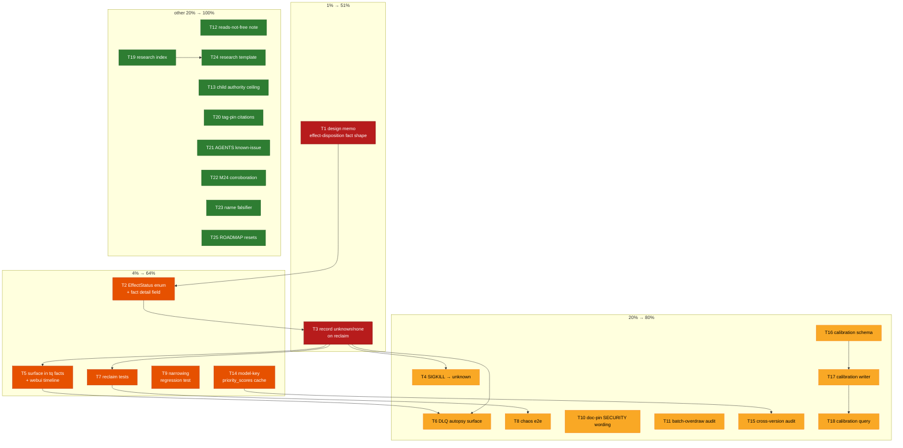

# SUPERB PLAN — Turnstone lessons → go-taskqueue execution

**Date:** 2026-10-09 19:32 (+0200) · **Base HEAD:** `570ec464`
**Author:** interactive owner window (non-queue; no `Task-Queue-ID`)
**Companion research:** `docs/research/2026-10-09_turnstone-lessons.md`
**Status report:** `docs/status/2026-10-09_19-23_turnstone-lessons-research-and-security-pin.md`

---

## 0. Context — what this plan is for

The turnstone research window produced **5 TODO rows** plus **~25 candidate
follow-ups**. This plan turns ALL of them into an ordered, effort-sized,
verifiable execution backlog. It is deliberately **conservative**: the one thing
this repo cannot afford is a "Verschlimmbesserung" of the facts-first journal —
every task below either (a) adds a _pure_ read/observability seam, (b) adds a
test/doc whose failure is safe, or (c) is explicitly **design-gated** before it
touches the hot path.

### Non-goals (explicitly rejected — do NOT do these)

- Importing turnstone's Markov formalism, cluster/node orchestration, workstream
  UI, SSE, RBAC/OIDC/MCP, provider lanes, or truncation policy (out of scope;
  see research note "Rejected / not applicable").
- Adding a second (LLM) risk tier to output — only the _merge promise_ is pinned.
- Rewriting `claims.go` reclaim ordering or the lease model. Effect disposition
  is **additive** (a fact detail), never a change to when/what claims.

### Goal (measurable)

1. The real defect closes: a crash mid-effect is recorded `unknown`, not silently
   re-run as if clean.
2. The two shipped security promises (learned-checks-narrow; deterministic-finding-
   never-lowered) become machine-checked, not prose.
3. Prioritization stays correct across model changes (cache keyed to model).
4. Verdicts become tunable from data (calibration dataset).
5. Every turnstone lesson is either DONE, a tracked TODO, or a recorded rejection.

---

## 1. Pareto breakdown

### 1% of the work → 51% of the result

| ID     | Item                                                                                                                    | Why it dominates                                                                                                                                                                       |
| ------ | ----------------------------------------------------------------------------------------------------------------------- | -------------------------------------------------------------------------------------------------------------------------------------------------------------------------------------- |
| **T1** | Design memo: effect disposition on reclaim (pick `EffectStatus`-on-released-fact vs `task.effect-unresolved` fact-type) | Converts the single real correctness hole from vague to decidable; ~45 min; unblocks T2–T8. Nothing else ships safely until the fact shape is fixed.                                   |
| **T3** | Record `unknown`/`none` on the reclaim path                                                                             | The actual fix. A handful of lines on an already-existing `Released` append (`claims.go:165`); removes the "double-run looks clean" hazard that defeats crash-reclaim's whole promise. |

**Cumulative ≈51%.** T1 and T3 are the whole point of the window; everything
else is hardening or hygiene.

### 4% of the work → 64% of the result

Add: **T2** (enum + fact detail field), **T5** (surface in `tq facts`/timeline),
**T7** (conform + worker reclaim tests), **T9** (narrowing regression test),
**T14** (model-key the `priority_scores` cache).

### 20% of the work → 80% of the result

Add: **T4** (SIGKILL → `unknown`), **T6** (DLQ autopsy surface), **T8** (chaos
e2e), **T10** (doc-pin the SECURITY wording), **T11** (batch-overdraw
serialization audit), **T15** (cross-version compare audit), **T16–T18**
(verdict→outcome calibration dataset).

### The other 20% of the work → 100%

Add: **T12** (reads-not-free bridge note), **T13** (child-task authority/budget
ceiling), **T19** (research index), **T20** (tag-pin citations), **T21**
(AGENTS.md known-issue if bytes freed), **T22** (paperclip M24 corroboration),
**T23** (name the state-ablation falsifier), **T24** (research-note template),
**T25** (ROADMAP daemon-resets row).

---

## 2. Comprehensive plan — ALL tasks sized 30–100 min

Sorted by **tier → impact/effort → customer-value**. `V` = customer-value
(operator-visible benefit). Effort in minutes.

| ID      | Task                                                                                                | Tier | Effort | Impact | V    | Deps   | Verification                                                  |
| ------- | --------------------------------------------------------------------------------------------------- | ---- | ------ | ------ | ---- | ------ | ------------------------------------------------------------- |
| **T1**  | Design memo: effect-disposition fact shape (append to research note or a new `docs/planning` memo)  | 1%   | 60     | HIGH   | HIGH | —      | Memo merged; owner §g answered                                |
| **T3**  | Reclaim path records `unknown` (mid-run crash) / `none` (never dispatched) on the `Released` detail | 1%   | 60     | HIGH   | HIGH | T1, T2 | conform reclaim test; `tq facts` shows status                 |
| **T2**  | `EffectStatus` Go enum + fact detail field (`internal/journal`, facades)                            | 4%   | 45     | HIGH   | MED  | T1     | enum pin + parity gate `check-facade-parity`                  |
| **T5**  | Surface disposition in `tq facts` + webui task timeline                                             | 4%   | 60     | HIGH   | HIGH | T2, T3 | CLI snapshot + webui render test                              |
| **T7**  | Tests: reclaim disposition (conform + worker + adapter)                                             | 4%   | 60     | HIGH   | MED  | T3     | `go test` per module green                                    |
| **T9**  | Regression test: no learned/merged path can lower a deterministic finding                           | 4%   | 60     | HIGH   | HIGH | —      | new `internal/executor` test rc=0; fails on injected lowering |
| **T14** | Model-key the `priority_scores` cache (annotate/invalidate on model change)                         | 4%   | 60     | MED    | MED  | —      | prioritize test: stale-model cache ignored                    |
| **T4**  | ADR-0005 SIGKILL mid-effect → record `unknown`                                                      | 20%  | 45     | MED    | MED  | T3     | cancel-path test asserts disposition                          |
| **T6**  | DLQ autopsy (`--dlq-fix`) reads + reports effect disposition                                        | 20%  | 45     | MED    | MED  | T5     | dlqfix test                                                   |
| **T8**  | Chaos e2e: kill worker mid-effect → reclaim marks `unknown`                                         | 20%  | 45     | MED    | MED  | T3, T7 | `internal/e2e` chaos test rc=0                                |
| **T10** | Doc-pin the SECURITY.md narrowing wording (drift smoke)                                             | 20%  | 45     | MED    | LOW  | —      | smoke green at HEAD + `--self-test`                           |
| **T11** | Audit + test: budget/exclusivity facts serialized across pools (no read-then-write overdraw)        | 20%  | 45     | MED    | MED  | —      | two-pool concurrency test rc=0                                |
| **T15** | Audit the `--prioritize` cross-version compare path; assert no stale-vs-fresh ranking               | 20%  | 45     | MED    | MED  | T14    | prioritize test                                               |
| **T16** | Calibration table schema + migration (verdict × derived outcome)                                    | 20%  | 60     | MED    | MED  | —      | migrate test; legacy-DB ALTER test                            |
| **T17** | Calibration writer: persist verdict + outcome from the verdict channel                              | 20%  | 45     | MED    | MED  | T16    | writer test                                                   |
| **T18** | Calibration query surface (`tq calibrate` or `tq audit --verdicts`)                                 | 20%  | 45     | MED    | LOW  | T17    | CLI snapshot                                                  |
| **T13** | Child-task authority/budget ceiling at claim time (subset of parent)                                | 100% | 90     | MED    | MED  | —      | claim-time ceiling test                                       |
| **T12** | SECURITY.md: "reads are not free" note for PapDashboard/CQA bridge fetches                          | 100% | 30     | LOW    | LOW  | —      | `check-doc-refs` green                                        |
| **T19** | `docs/research/README.md` index + rows for the research notes                                       | 100% | 30     | LOW    | LOW  | —      | new file; `check-doc-refs` green                              |
| **T20** | Tag-pin turnstone citations (SHA) + optional link-rot check                                         | 100% | 30     | LOW    | LOW  | —      | note reflow; links resolve                                    |
| **T21** | AGENTS.md reclaim-gap known-issue (only if bytes are freed by a prune)                              | 100% | 30     | LOW    | LOW  | —      | `check-agents-size` ≤18500                                    |
| **T22** | Annotate the paperclip M24 TODO row as "corroborated by turnstone"                                  | 100% | 15     | LOW    | LOW  | —      | TODO gate green                                               |
| **T23** | Name/keep the state-ablation falsifier test (doc the crash-resume probe)                            | 100% | 30     | LOW    | LOW  | —      | test comment + green                                          |
| **T24** | Research-note template in `docs/references/`                                                        | 100% | 30     | LOW    | LOW  | T19    | `check-doc-refs` green                                        |
| **T25** | ROADMAP row: scheduled self-audit of DLQ/incident/memory (daemon resets)                            | 100% | 20     | LOW    | LOW  | —      | `check-features-roadmap` green                                |

**Total: 25 tasks.** Tier counts: 1%→2, 4%→5, 20%→11, 100%→7.

---

## 3. Fine-grained plan — EVERY comprehensive task split to ≤12 min

Each row is a single, committable micro-step. Verify command is implied by the
parent's verification unless stated. Ownership: all agent-executable; T1/T3 carry
a design-gated pause.

### Phase A — Effect disposition (T1, T2, T3, T4, T5, T6, T7, T8)

| ID  | Parent | ≤12-min step                                                                                                    |
| --- | ------ | --------------------------------------------------------------------------------------------------------------- |
| F1  | T1     | `grep -n "Type: journal.Released"` all reclaim/cancel sites; list exact line + context                          |
| F2  | T1     | Enumerate what the worker _knows_ at reclaim (dispatched? effect observed?) from `worker.go`                    |
| F3  | T1     | Draft memo: option A (`EffectStatus` on released fact) vs B (`task.effect-unresolved` fact-type); recommend one |
| F4  | T1     | PAUSE: surface memo to owner §g2; record the ruling                                                             |
| F5  | T2     | Add `EffectStatus` constants to `internal/journal` (committed/none/unknown/partial/rolled_back)                 |
| F6  | T2     | Add the fact detail field / setter for disposition                                                              |
| F7  | T2     | Re-export via facade modules; run `scripts/check-facade-parity.sh`                                              |
| F8  | T3     | In `claims.go` reclaim branch, stamp `unknown` when prior attempt was mid-run                                   |
| F9  | T3     | Stamp `none` when the task never dispatched                                                                     |
| F10 | T3     | Add the same stamp on the cancel-path `Released` (`claims.go:136`)                                              |
| F11 | T4     | On ADR-0005 SIGKILL-to-group, mark the in-flight effect `unknown`                                               |
| F12 | T5     | Render disposition in `tq facts` output                                                                         |
| F13 | T5     | Render disposition in the webui task timeline                                                                   |
| F14 | T6     | Read disposition in `--dlq-fix` autopsy                                                                         |
| F15 | T7     | conform suite: reclaim disposition assertion                                                                    |
| F16 | T7     | worker reclaim test                                                                                             |
| F17 | T7     | adapter (sqlitev4/postgresv4) parity of the field                                                               |
| F18 | T8     | e2e: kill worker mid-effect, assert reclaim shows `unknown`                                                     |

### Phase B — Security invariants (T9, T10, T11, T12, T13)

| ID  | Parent | ≤12-min step                                                                                        |
| --- | ------ | --------------------------------------------------------------------------------------------------- |
| F19 | T9     | Identify every merge point (redaction, verify gate, auto-dismiss, prioritize)                       |
| F20 | T9     | Write the failing-first test: a crafted learned verdict that tries to lower a deterministic finding |
| F21 | T9     | Implement the `max`+union merge helper the test demands (if none exists)                            |
| F22 | T9     | Pin the helper against `SecretHits`/`IsGateArtifactDeath`                                           |
| F23 | T10    | Add the SECURITY.md narrowing paragraph to the drift smoke needles                                  |
| F24 | T10    | Add a `--self-test` mutation case for it                                                            |
| F25 | T11    | Trace budget facts to confirm single-writer serialization                                           |
| F26 | T11    | Write the two-pool overdraw concurrency test                                                        |
| F27 | T12    | Draft + place the "reads are not free" bridge paragraph                                             |
| F28 | T13    | Define the parent→child grant model (where stored)                                                  |
| F29 | T13    | Claim-time subset check                                                                             |
| F30 | T13    | Test: child exceeding parent budget/authority is refused                                            |

### Phase C — Prioritization correctness (T14, T15)

| ID  | Parent | ≤12-min step                                                 |
| --- | ------ | ------------------------------------------------------------ |
| F31 | T14    | Locate the `priority_scores` cache key + write path          |
| F32 | T14    | Add model+effort to the key (or invalidate on change)        |
| F33 | T14    | Test: scores from a prior model are not used for a new model |
| F34 | T15    | Audit the compare path for stale-vs-fresh ranking            |
| F35 | T15    | Add the guarding assertion/test                              |

### Phase D — Calibration dataset (T16, T17, T18)

| ID  | Parent | ≤12-min step                                       |
| --- | ------ | -------------------------------------------------- |
| F36 | T16    | Schema const + migrate ALTER + index               |
| F37 | T16    | Legacy-DB migration test                           |
| F38 | T17    | Writer from the verdict channel                    |
| F39 | T17    | Writer from derived outcomes (commits/files/usage) |
| F40 | T18    | Query CLI + snapshot                               |

### Phase E — Docs/discovery/hygiene (T19–T25)

| ID  | Parent | ≤12-min step                                                |
| --- | ------ | ----------------------------------------------------------- |
| F41 | T19    | Create `docs/research/README.md` + 2 rows                   |
| F42 | T20    | Replace `main` citations with a pinned SHA in the note      |
| F43 | T21    | Prune a stale AGENTS.md line to free bytes                  |
| F44 | T21    | Add the reclaim-gap known-issue bullet; `check-agents-size` |
| F45 | T22    | Annotate the paperclip M24 row                              |
| F46 | T23    | Doc the crash-resume probe as the state-ablation falsifier  |
| F47 | T24    | Research-note template file                                 |
| F48 | T25    | ROADMAP daemon-resets row; `check-features-roadmap`         |

**Total: 48 micro-steps** (T1–T25 → F1–F48).

---

## 4. Execution graph

**Critical path:** `T1 → T2 → T3 → T7/T5 → T8` (the defect). Everything else is
parallelizable and independent.

---

## 5. Guardrails (anti-Verschlimmbesserung)

1. **Design-gated hot path.** T1/T3 pause for the owner's §g2 ruling before any
   `claims.go` edit. No speculative fact-shape.
2. **Additive only.** Effect disposition is a _fact detail_, never a change to
   claim ordering, lease math, or the release trigger.
3. **Test-first for security.** T9 writes the failing test before the merge helper.
4. **Guards before prose.** Run `check-agents-size`, `check-todo-list`,
   `check-doc-refs`, `check-status-index`, `check-facade-parity`,
   `check-features-roadmap` after every doc/fact change.
5. **One committable change per micro-step.** Footer `Task-Queue-ID` when
   dispatched; none for interactive.
6. **Never revert foreign working-tree changes** (many concurrent agents).
7. **Modular gates.** Any `internal/…` change needs `go mod vendor` (root build)
   and per-module `GOWORK=off` build/vet/test (AGENTS.md).

## 6. Definition of done

- Reclaim path records `unknown`/`none`; `tq facts` shows it; tests + e2e green.
- Narrowing rule is code-enforced (test fails on a lowering path).
- `priority_scores` keyed to model; cross-version test green.
- Calibration table writing verdict×outcome; query surface works.
- All 5 TODO rows closed or explicitly rejected; guards green; changelog updated.
