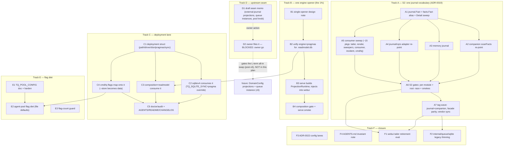

# CONFIG-SYSTEM-ALL-IN-BRIDGE — Pareto Execution Plan

**Date:** 2026-10-09 20:23
**Source decision:** `docs/architecture-understanding/2026-10-09_20-10_config-vs-system-composition-root.md`
("all-in on `system/`+`metaengine/` is the destination, not the next step")
**Living backlog:** TODO_LIST.md §"go-cqrs-lite platform adoption" (rows harvested 2026-10-09).
This file is a point-in-time snapshot — TODO_LIST wins when they drift.

**Mission:** execute the review's bridge — unify the journal (S2), make the
`system/` root load-bearing (kill the projection-home double-open),
consolidate the deployment lane into ONE struct, draft the upstream seam ask,
and pay down the flag surface — without touching a single invariant
(single serialized writer, facts-in-same-tx, task contexts survive shutdown,
`RowsAffected()` re-checks stay).

**Guardrails (anti-verschlimmbessern):**
- Every track ends at a green gate: per-module `GOWORK=off go build/vet/test`,
  root build+vet+`test -race`, smokes under `/tmp` with `TQ_DB=<scratch>`.
- Never edit `vendor/` by hand (`go mod vendor` after any go.mod touch);
  never lower a `go` directive; stage+commit BEFORE running gates.
- No behavior change rides the refactor tracks (S2 alias must be
  representation-only until A5 lands; B2 must keep the effective pragma set
  of the union, then tighten only with a gate run).
- Owner-gated items are tracked, not executed (D2 filing).

---

## 1. Pareto Breakdown

### The 1% that deliver 51%

| # | Task | Why it is the 51% |
| --- | --- | --- |
| B1+B2 | **Kill the projection-home double-open** — one engine opener for `<db>.readmodel.db` | Converts the ADR-0019 S4 root from decorative (GracefulClose-only, cmd/tq/main.go:3542) to load-bearing; collapses the only live split-brain; makes `DeploymentConfig` real instead of aspirational. Every later declarative step lands ON this. |
| D1 | **Draft the upstream seam memo** (external-journal projection source, queue instances, pool knob) | The entire "all-in" endgame is upstream-gated; a 60-minute draft unblocks the owner's one-click filing and starts the upstream clock (their v5 cut is the target window). |

### The 4% that deliver 64% (adds)

| # | Task | Why |
| --- | --- | --- |
| A1 | `journal.Fact` → alias of upstream `facts.Fact` (+ `Detail []byte` sweep) | The vocabulary flip is the prerequisite for every projection/journal move; pure-representation, mechanical, risk-free-able. |
| A2 | Companion `scanFacts` re-point | The store-side consumer of the unified vocabulary; small, high-certainty. |
| B3 | Fix layering: serve builds ProjectionRuntime, webui receives it | Removes the presentation→composition reach-in (webui/tailer.go:70) in the same touch as the engine unification — half the double-open's cost. |

### The 20% that deliver 80% (adds)

| # | Tasks | Why |
| --- | --- | --- |
| A3–A7 | Finish S2: memory journal, `journal/cqrs` adapter, the ~15-package consumer sweep, gates, tag wave | One journal vocabulary, engine-enforced facts-in-tx, ADR-0019's last open stage DONE. |
| B4 | Composition gate + serve smoke after single-opener | Locks B2/B3 in. |
| C1–C4 | Deployment struct: define → sqlitev4 → composition/readmodel → cmd/tq flags | The deployment lane goes from 5 smeared places to 1; `--store postgres://` becomes a data change (subsumes the owner-blocked CLI-wiring row). |
| F3 | ADR-0022: record the three-lane config model + all-in gating | Cheap now, expensive never-written. |

### The other 20% to reach 100%

C5 (doctor/audit/docs), E1–E3 (flag diet: TQ_POOL_CONFIG doc+hardening,
agent-pool diet, flag-count guard), F1 (webui tailer retirement eval),
F2 (`internal/queue/sqlite` legacy thinning), F4 (AGENTS.md invariants
update), D2 (owner files the memo — BLOCKED: owner go).

---

## 2. Execution Graph

Critical path: **A1 → A5 → A6** and **B1 → B2 → B3 → B4** run in parallel;
**C-track starts at C1 immediately but C3 lands after B2** (it consumes the
single opener). D1 has no dependencies — do it first or in a dead window.

---

## 3. Comprehensive Plan — medium tasks (30–100 min, ≤27)

Sorted by importance (tier → impact → effort asc). CustVal = customer value
for tq's users (dogfood fleet + public facades): ●●● high / ●● med / ● low.

| # | ID | Task (deliverable) | Tier | Imp | Eff | CustVal | Depends |
| --- | --- | --- | --- | --- | --- | --- | --- |
| 1 | B1 | Single-opener design note in internal/composition package doc: engine-accessor direction chosen (system root owns the engine; readmodel accepts an injected engine), pragma-union policy stated | 1% | 5 | 30m | ●● | — |
| 2 | B2 | Implement single opener: composition root's declared engine becomes THE engine for `<db>.readmodel.db`; `readmodel.Open` gains `WithEngine(metaengine.Engine)`; delete the divergent pragma copy (model.go:130); effective pragmas = documented union (WAL, busy_timeout 5000, synchronous NORMAL, cache_size -32768) | 1% | 5 | 90m | ●●● | B1 |
| 3 | D1 | Draft the go-cqrs-lite seam memo in docs/memos/: (i) injectable projection event source over a foreign `event.SeekableJournal` (no journal mirroring — cite the empty-DomainConfig ruling), (ii) queue-family instances in DeploymentConfig, (iii) engine pool-policy knob for MaxOpenConns(1); each with a tq evidence citation | 1% | 5 | 60m | ●● | — |
| 4 | A1 | `journal.Fact` → `= facts.Fact` alias + `Detail []byte` field sweep (internal/journal/journal.go:125); compile-only change, no behavior | 4% | 5 | 90m | ●●● | — |
| 5 | B3 | Layering fix: `tq serve` builds the ProjectionRuntime and injects it into webui.Server (constructor param); delete the webui→composition import (tailer.go:70) | 4% | 4 | 45m | ●● | B2 |
| 6 | A2 | Companion `scanFacts` re-point to the unified Fact (internal/queue/companion) + table-driven test update | 4% | 4 | 45m | ●●● | A1 |
| 7 | A5 | Consumer sweep to unified Fact: webui tailer+render, review/dlqfix/prioritize sweepers, consumer, incident (policy+recorder), cmd/tq (main, top, parked, ask, journalaudit), queue.go | 20% | 4 | 90m | ●●● | A1 |
| 8 | A3 | Memory journal migrated to the unified vocabulary (keeps tests hermetic) | 20% | 4 | 45m | ●● | A1 |
| 9 | A4 | `internal/journal/cqrs` adapter re-point (ADR-0014; stays READ-ONLY — no new write path) | 20% | 4 | 60m | ●● | A1 |
| 10 | C1 | Define tq deployment struct (root app layer or internal/config): DBPath, Driver(sqlite|postgres), DSN, Pragmas, SyncPolicy, ReadModelEnabled + `FromFlags`-shaped constructor | 20% | 4 | 45m | ●● | — |
| 11 | C2 | sqlitev4.Open consumes the struct; `TQ_SQLITE_SYNC` becomes a pragma override derived inside the struct (keep env name + semantics) | 20% | 4 | 60m | ●●● | C1 |
| 12 | C3 | composition + readmodel consume the struct — one pragma source for both homes (queue + projection); B2's opener reads from here | 20% | 4 | 60m | ●●● | C1, B2 |
| 13 | C4 | cmd/tq flags map onto the struct; `--store postgres://…` selects driver+DSN as a data change (subsumes the owner-blocked Postgres CLI-wiring TODO row) | 20% | 4 | 60m | ●●● | C1, C2, C3 |
| 14 | A6 | S2 gate run: all touched modules `GOWORK=off build/vet/test -count=1`, root build+vet+`test -race`, smokes (legacy-serve-upgrade, serve) with scratch TQ_DB | 20% | 4 | 60m | ●●● | A2, A3, A4, A5 |
| 15 | B4 | Post-opener gates: internal/composition module gate + serve smoke + readmodel pushdown counter equality (stats before/after) | 20% | 3 | 45m | ●● | B3 |
| 16 | F3 | Write ADR-0022: three-lane config model (deployment→DeploymentConfig-shaped struct, domain policy→Config structs, CLI→skin) + all-in gating on upstream v5 | rest | 4 | 45m | ●● | — |
| 17 | A7 | S2 tag wave: tag internal/journal + companion minors, `check-go-mods.sh`, `scripts/check-facade-parity.sh` before staging, `go mod vendor`, vendorHash if needed | rest | 3 | 45m | ●● | A6 |
| 18 | C5 | doctor/audit read the deployment struct; AGENTS.md store-invariants + README config section + CHANGELOG entries | rest | 3 | 45m | ●● | C4 |
| 19 | E1 | Document `TQ_POOL_CONFIG` (flag > env > file precedence already implemented, agentpool.go:293) in README + harden parser (unknown keys warn, typed decode) | rest | 3 | 45m | ●● | — |
| 20 | E2 | agent-pool flag diet: 53 registrations → file-configurable defaults; flags stay as overrides | rest | 3 | 90m | ●● | C4, E1 |
| 21 | E3 | Flag-count guard script (pin per-command registration counts; growth needs an explicit bump + note) wired into ci-local | rest | 3 | 45m | ●● | E2 |
| 22 | F2 | `internal/queue/sqlite` legacy thinning post-S2 (P5 remnant): delete shadowed surfaces the unified journal makes dead; conform wiring update | rest | 3 | 90m | ●● | A7 |
| 23 | F1 | webui tailer retirement evaluation post-S2 (metaengine Watcher/ServeSSE replaces hand tailer? decide + write outcome into ADR-0003 addendum) | rest | 2 | 45m | ● | A7 |
| 24 | F4 | AGENTS.md: single-opener rule + deployment-struct pointer into Store invariants; size-guard note for ADR-0022 | rest | 2 | 30m | ● | F3 |
| — | D2 | Owner files the seam memo upstream (M4 channel) | rest | 5 | 10m | ●●● | D1 — **BLOCKED: owner go for upstream filing** |

Executable total: **24 tasks, ~17.4 h** (1% tier ≈ 3 h, 4% tier ≈ 3 h,
20% tier ≈ 9.4 h, rest ≈ 7.6 h incl. parallelism-irrelevant sums).

---

## 4. Fine Breakdown — micro tasks (≤12 min each)

Same sort (tier → impact → effort). "Gate?" = run the module gate before
committing the micro (edit→commit→battery ordering; daemon sweeps <60 s).

| Micro | Task | Min | Dep |
| --- | --- | --- | --- |
| B1.1 | Read compose.go + model.go pragma sets; write the union list into the design note | 10 | — |
| B1.2 | Decide + note accessor direction (system root owns engine; readmodel takes WithEngine) incl. why-not-inverted | 10 | B1.1 |
| B1.3 | Commit design note (footer-less docs commit, mechanical) | 5 | B1.2 |
| B2.1 | Add `readmodel.WithEngine(eng)` option; nil-default keeps current open | 12 | B1.2 |
| B2.2 | Export the projection-home engine from the composition root (accessor over the deployment-declared instance) | 12 | B2.1 |
| B2.3 | ProjectionRuntime: build Model with the injected engine instead of path-open | 12 | B2.2 |
| B2.4 | Delete model.go:130 duplicate pragma set; document union in one place | 8 | B2.3 |
| B2.5 | Update compose_test + projection_runtime_test for injection; run composition module gate | 12 | B2.4 |
| B2.6 | Root build+vet; commit B2 with detailed message | 10 | B2.5 |
| D1.1 | Collect evidence citations (review §3 lines, roles.go:129, constructor.go:256, EngineConfig fields) | 10 | — |
| D1.2 | Write memo section (i): external-journal projection source — problem, proposal, tq evidence, non-goal (no mirroring) | 12 | D1.1 |
| D1.3 | Write memo section (ii): queue-family instances in DeploymentConfig | 12 | D1.2 |
| D1.4 | Write memo section (iii): pool-policy knob (MaxOpenConns-class) + single-writer invariant text | 10 | D1.3 |
| D1.5 | Add memo to TODO_LIST D2 row as the artifact link; commit | 8 | D1.4 |
| A1.1 | Add upstream facts require to internal/journal go.mod (+ replace per facade rules) | 10 | — |
| A1.2 | Convert Fact to alias; fix Detail []byte compile errors in internal/journal | 12 | A1.1 |
| A1.3 | journal module gate (GOWORK=off build/vet/test); commit | 10 | A1.2 |
| B3.1 | webui.Server gains optional runtime param (nil = old behavior) | 12 | B2.6 |
| B3.2 | serve wiring: build runtime, pass to webui.New | 10 | B3.1 |
| B3.3 | Delete webui→composition import + tailer self-build; fix tests | 12 | B3.2 |
| B3.4 | webui + root gates; commit B3 | 10 | B3.3 |
| A2.1 | Re-point companion scanFacts; adjust row scan for Detail []byte | 12 | A1.3 |
| A2.2 | companion module gate; commit | 10 | A2.1 |
| A5.1 | Sweep webui (tailer, render) — compile + tests | 12 | A1.3 |
| A5.2 | Sweep sweepers: review, dlqfix, prioritize | 12 | A5.1 |
| A5.3 | Sweep consumer + incident (policy, recorder) | 12 | A5.2 |
| A5.4 | Sweep cmd/tq: main, top, parked, ask, journalaudit | 12 | A5.3 |
| A5.5 | Sweep internal/queue queue.go signatures; root build+vet | 12 | A5.4 |
| A5.6 | Root `test -race`; fix fallout; commit A5 | 12 | A5.5 |
| A3.1 | Migrate memory journal store to unified Fact | 12 | A1.3 |
| A3.2 | journal module gate; commit | 8 | A3.1 |
| A4.1 | Re-point journal/cqrs adapter types; keep read-only surface | 12 | A1.3 |
| A4.2 | journal/cqrs module gate + parity with ADR-0014 pins; commit | 12 | A4.1 |
| C1.1 | Draft struct fields + validation (driver whitelist, pragma list) | 12 | — |
| C1.2 | Unit tests: FromFlags/env merge, TQ_SQLITE_SYNC override; commit | 12 | C1.1 |
| C2.1 | sqlitev4.Open signature takes the struct (keep old signature as thin wrapper for facades) | 12 | C1.2 |
| C2.2 | Derive DSN from struct (pragma chain builder moved in); adapter tests updated | 12 | C2.1 |
| C2.3 | sqlitev4 + companion gates; root vendor sync; commit | 12 | C2.2 |
| C3.1 | composition.New takes the struct; DeploymentConfig built from it | 12 | C2.3, B2.6 |
| C3.2 | readmodel PathFor/pragma source from struct; delete last literal | 10 | C3.1 |
| C3.3 | composition + readmodel gates; commit | 10 | C3.2 |
| C4.1 | `--store` flag: parse postgres:// into struct; sqlite default keeps path | 12 | C3.3 |
| C4.2 | serve/api/agent-pool/worker wiring uses struct end-to-end | 12 | C4.1 |
| C4.3 | root test -race + smokes; mark the Postgres CLI TODO row subsumed; commit | 12 | C4.2 |
| A6.1 | Per-module gate loop over touched modules | 12 | A5.6, A3.2, A4.2 |
| A6.2 | Root build+vet+`test -race`; battery rc to a file (no PIPESTATUS) | 12 | A6.1 |
| A6.3 | Smokes: legacy-serve-upgrade + serve with scratch TQ_DB | 12 | A6.2 |
| A6.4 | Update ADR-0019 addendum (S2 DONE); commit | 8 | A6.3 |
| B4.1 | Composition gate + serve smoke post-B3 | 10 | B3.4 |
| B4.2 | Stats equality check (pushdown counters before/after on a scratch DB); commit note | 12 | B4.1 |
| F3.1 | Draft ADR-0022 (context/decision/consequences, three lanes, gating) | 12 | — |
| F3.2 | Cross-link review + TODO rows; commit | 8 | F3.1 |
| A7.1 | Bump + tag internal/journal, companion (scripts per release flow) | 12 | A6.4 |
| A7.2 | check-go-mods + facade parity + go mod vendor + vendorHash if flake trips | 12 | A7.1 |
| A7.3 | ci-local; commit tag-wave residue | 10 | A7.2 |
| C5.1 | doctor/audit consume struct (drop local DSN knowledge) | 12 | C4.3 |
| C5.2 | AGENTS.md invariants + README config section + CHANGELOG; commit | 12 | C5.1 |
| E1.1 | README section for TQ_POOL_CONFIG (precedence, keys, example file) | 10 | — |
| E1.2 | Harden parser: unknown-key warning + typed decode + tests; commit | 12 | E1.1 |
| E2.1 | Enumerate agent-pool's 53 flags → config-file key mapping table in the plan dir | 12 | C4.3, E1.2 |
| E2.2 | Implement file-defaults layering for pool config; flags override | 12 | E2.1 |
| E2.3 | Update bootstrap/service docs; gates; commit | 12 | E2.2 |
| E3.1 | scripts/check-flag-count.sh: pin per-command counts from a generated manifest | 12 | E2.3 |
| E3.2 | Wire into ci-local + self-test pin; commit | 12 | E3.1 |
| F2.1 | Diff internal/queue/sqlite surfaces against S2-unified reality; list dead code | 12 | A7.3 |
| F2.2 | Delete dead surfaces + conform wiring; module gates | 12 | F2.1 |
| F2.3 | root -race + smokes; commit | 10 | F2.2 |
| F1.1 | Spike note: Watcher/ServeSSE vs hand tailer (perf, replay, CSP pins) | 12 | A7.3 |
| F1.2 | Decision + ADR-0003 addendum (adopt or keep, with why); commit | 12 | F1.1 |
| F4.1 | AGENTS.md Store-invariants: single-opener + deployment-struct rows | 10 | F3.2 |
| F4.2 | Run TestAgentsDocSizeGuard; commit | 8 | F4.1 |

Micro total: **74 tasks ≈ 12.8 h** (fits inside the medium envelope; the delta
is the medium tasks' gate/commit overhead).

---

## 5. Verification matrix (what "done" means per track)

| Track | Gate |
| --- | --- |
| A (S2) | All modules GOWORK=off green; root `-race` green; legacy-upgrade smoke green; ADR-0019 addendum says S2 DONE; tags pushed per release flow |
| B (opener) | Exactly one `sqliteengine` constructor call reachable from serve; composition gate green; stats pushdown equality on scratch DB |
| C (deploy struct) | One pragma literal left in repo (the struct's builder); `--store postgres://` works on worker/serve against a scratch pg DSN (or documented gated); smokes green |
| D (upstream) | Memo committed + linked from TODO_LIST; D2 row still BLOCKED: owner |
| E (flags) | check-flag-count green in ci-local; agent-pool runs from a config file with zero flags |
| F (closure) | ADR-0022 + AGENTS rows committed; size guard green |

## 6. Explicitly out of scope (owner-gated / upstream-gated)

- D2 filing (owner go). The DomainConfig-projections + queue-instance swap
  itself (upstream v5 + seams landed). Postgres dogfood cutover (owner).
- Anything in TODO_LIST outside the adoption section — this plan is the
  config→system bridge, not the whole backlog.
