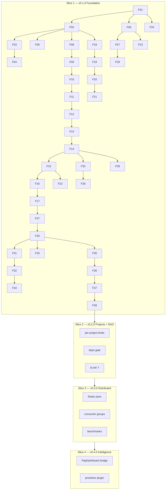

# SUPERB: TaskWorkQueue — Projects-Aware Distributed Task Work Queue/Pool

**Date:** 2026-09-05 17:22 CEST
**Status:** ~~EXECUTING~~ EXECUTED — the MVP shipped as v0.1.0 on 2026-09-06
(annotated tag, GitHub pre-release, proxy + pkg.go.dev verified; checklist
archived at `docs/release/archived/2026-09-06_v0.1.0_CHECKLIST.md`).
Deferred rows (P17 Redis store, P18 consumer groups, P19 benchmarks,
P21 prioritizer) live in ROADMAP.md (v0.2 / v0.4); the execution trail is
docs/status/ + CHANGELOG.md.
> **Archived 2026-09-09 (docs-health):** fully executed — moved from docs/planning/.
**Scope:** Single Go repo, zero-dep MVP → embeddable library → distributed backend
**Inputs:** Lars request (Discord, 2026-09-05) + prior repo-grounded analysis (go-cqrs-lite, PapDashboard, ai-task-prioritizer, kanban ops experience)
**Repo strategy:** NEW public repo `LarsArtmann/go-taskqueue` (GH Actions billing broken for private repos since Sep 4, public still CI; portfolio value; plugin ecosystem wants importable modules). Composes with — never modifies — go-cqrs-lite (projects/ mount read-only this session; v5 modules unreleased).

## The Problem

Lars runs ~296 project mirrors with multiple coding agents (Hermes, Crush, Claude Code, Codex) and stated the need directly: "a projects aware Tasks Work Queue/Pool System … some kind of distributed pluggable system." The recurring failure mode: work is scattered (agent chats, TODO_LIST.md across hundreds of repos, cron jobs), nothing routes by project, nothing is durable across crashes, and no single surface shows "what is running / failed / blocked right now, per project."

## Product Thesis

A task is a record: `{project, type, payload, attempts, deps}`. A worker claims a due task, heartbeats, executes a pluggable executor, and writes outcome facts to an append-only journal. Every state (enqueued / claimed / completed / failed / dead-lettered) is a fact in the journal; the queue view, retry state, and DLQ are projections of that journal — correct by construction, replayable from zero. Storage is a pluggable interface with an embedded default (SQLite) and distributed options (Redis, Postgres) as deployment flags, not redesigns.

**Non-goals (this plan):** rewriting go-cqrs-lite, modifying PapDashboard, building a GUI (dashboard comes later via projections), GPU scheduling.

---

## Pareto Breakdowns

### The 20% that delivers 80%

1. **Append-only journal core** — every other feature is a projection of durable facts. Queue/DLQ/stats become derived views; no state machines to drift apart.
2. **SQLite store with claim/lease semantics** — durable single-node queue in one file, zero external deps. Solves "tasks scattered across chats" for one machine.
3. **Worker loop (claim → heartbeat → execute → complete/fail)** with the Executor interface — the "pool" in work-pool; crash-safe via lease expiry.
4. **`tq` CLI (enqueue / worker / stats / replay)** — agent-friendly surface: any coding agent can drive the queue from a shell.
5. **Retry + backoff + DLQ-as-projection** — kills the #1 real failure mode (poison tasks crash-looping).
6. **`project` field + per-project stats + projects-dir discovery** — "projects-aware" made concrete; the differentiator vs generic queue libraries.

### The 4% that delivers 64%

1. **Lease expiry reclaim** — `ClaimDue` only picks unclaimed/expired tasks. Crash → task auto-returns after TTL. The entire distributed-safety story in one WHERE clause.
2. **Dependency promotion** — `deps` all-completed gate at claim time. DAG workflows (build → test → release) with no orchestrator.
3. **`tq replay`** — rebuild any view from facts. Audit trail, debug tool, and projection rebuild are the same code path.

### The 1% that delivers 51%

1. **The Task struct itself** — `project + type + deps + attempts + max_attempts + not_before + priority`. Every capability is a field plus a WHERE clause.
2. **Status enum with `CanTransitionTo`** — invalid states unrepresentable; no split-brain status bugs (same pattern as PapDashboard domains).

### The other 20% (hygiene to reach 100%)

- README + AGENTS.md + usage examples
- flake.nix (build/test/lint apps)
- GitHub Actions CI (vet + test + race + build)
- .gitignore, LICENSE (MIT), dprint.json
- Coverage gate ≥70% on core packages
- v0.1.0 tag + release notes + pkg.go.dev surface (doc.go files)

---

## Table 1 — Coarse Plan (30–100 min tasks)

Sorted by importance / impact / effort / customer-value.

| ID  | Task                                                                      | Slice | Impact | Effort | Value | Deps     |
| --- | ------------------------------------------------------------------------- | ----- | ------ | ------ | ----- | -------- |
| P01 | Core types: Task, Status, transitions, sentinel errors, TaskID            | 1     | 10     | M 60m  | 10    | —        |
| P02 | Journal: Fact, FactType, append-only Journal iface, MemoryJournal         | 1     | 10     | M 70m  | 10    | —        |
| P03 | SQLite store: DDL, Enqueue/Claim/ClaimDue/Complete/Fail/Heartbeat         | 1     | 10     | L 100m | 10    | P01      |
| P04 | Store tests: enqueue/claim/lease-expiry/complete/fail/deps                | 1     | 10     | M 60m  | 9     | P03      |
| P05 | Worker loop: claim→heartbeat→execute, shutdown, concurrency N             | 1     | 10     | M 80m  | 10    | P03      |
| P06 | Executors: Func, Command (exec), HTTP (webhook) + registry                | 1     | 9      | M 70m  | 9     | P01      |
| P07 | Retry policy + attempt facts + DLQ routing                                | 1     | 9      | M 50m  | 9     | P02, P05 |
| P08 | ADR-0001 (architecture) + ADR-0002 (repo/naming/layout)                   | 1     | 9      | S 40m  | 7     | —        |
| P09 | `tq` CLI: enqueue / worker / stats / replay (stdlib flag)                 | 1     | 10     | M 60m  | 10    | P03, P06 |
| P10 | E2E integration test: enqueue→worker→complete, race detector              | 1     | 9      | M 60m  | 9     | P05, P06 |
| P11 | flake.nix + build/test/lint apps                                          | 1     | 9      | M 70m  | 8     | P03      |
| P12 | GitHub Actions CI (Go 1.26, vet+test+race+build)                          | 1     | 9      | S 30m  | 8     | P10      |
| P13 | README + AGENTS.md + doc.go surfaces                                      | 1     | 10     | M 60m  | 10    | P10      |
| P14 | Per-project routing: concurrency limits, TQ_PROJECTS_DIR, stats --project | 2     | 8      | M 60m  | 10    | P05      |
| P15 | DAG deps: all-deps-completed gate at claim time + promotion               | 2     | 8      | M 50m  | 10    | P03      |
| P16 | `tq tail -f`: live journal fact stream                                    | 2     | 7      | S 30m  | 9     | P02      |
| P17 | Redis store (go-redis v9, Lua claim script)                               | 3     | 8      | L 100m | 8     | P03      |
| P18 | Consumer-group pool: multi-process safe (lease + fencing token)           | 3     | 8      | M 80m  | 8     | P17      |
| P19 | Benchmarks: enqueue+claim+complete throughput                             | 3     | 7      | S 30m  | 7     | P17      |
| P20 | PapDashboard bridge: DLQ → alert.triggered, decision → question           | 3.5   | 8      | S 40m  | 8     | P07      |
| P21 | ai-task-prioritizer: ranking → priority field                             | 3.5   | 6      | S 30m  | 5     | P14      |
| P22 | examples_test.go + pkg.go.dev polish                                      | 4     | 7      | M 60m  | 7     | P13      |
| P23 | v0.1.0 tag + gh release + ROADMAP.md                                      | 4     | 9      | S 30m  | 8     | P13      |

**v0.1.0 critical path (P01→P13): ≈ 10h focused dev.**

---

## Table 2 — Fine-Grained Plan (≤ 12 min tasks)

Sorted by importance / impact / effort / customer-value. Every row = one artifact + verify command.

| ID  | Task                                                                       | Parent | Impact | Effort | Verify                       |
| --- | -------------------------------------------------------------------------- | ------ | ------ | ------ | ---------------------------- |
| F01 | go.mod (github.com/larsartmann/go-taskqueue, go 1.26), .gitignore, LICENSE | P01    | 10     | 8m     | `go build ./...` exit 0      |
| F02 | task.go: Task struct + TaskID branded string                               | P01    | 10     | 12m    | `go vet ./internal/task`     |
| F03 | status.go: Status enum + CanTransitionTo                                   | P01    | 10     | 10m    | unit test green              |
| F04 | status_test.go: legal + illegal transitions                                | P01    | 10     | 8m     | `go test ./internal/task`    |
| F05 | errors.go: sentinels (NotFound, LeaseNotHeld, DepNotMet, DupID)            | P01    | 9      | 10m    | compile + used               |
| F06 | journal.go: Fact, FactType, Journal iface, MemoryJournal                   | P02    | 10     | 12m    | `go vet ./internal/journal`  |
| F07 | memory_journal_test.go: append/read/replay                                 | P02    | 9      | 8m     | `go test ./internal/journal` |
| F08 | queue.go: Store iface + Queue facade over store+journal                    | P03    | 10     | 12m    | `go vet ./internal/queue`    |
| F09 | sqlite.go: open + DDL (tasks + facts, WAL, busy_timeout)                   | P03    | 10     | 12m    | open/close test green        |
| F10 | sqlite.go: Enqueue with deps + dup-ID check                                | P03    | 10     | 12m    | enqueue test green           |
| F11 | sqlite.go: Claim/ClaimDue lease WHERE + expiry release                     | P03    | 10     | 12m    | claim tests green            |
| F12 | sqlite.go: Complete/Fail with lease check + DLQ routing                    | P03    | 10     | 10m    | complete/fail tests green    |
| F13 | sqlite.go: Heartbeat + List* queries + per-project filter                  | P03    | 9      | 12m    | list tests green             |
| F14 | store_test.go: full semantics suite (incl. lease expiry, deps block)       | P04    | 10     | 12m    | `go test ./internal/queue`   |
| F15 | worker.go: Worker struct + claim/heartbeat loop                            | P05    | 10     | 12m    | compile                      |
| F16 | worker.go: panic recovery + per-task timeout                               | P05    | 10     | 12m    | panic test green             |
| F17 | worker.go: graceful shutdown drain                                         | P05    | 9      | 12m    | shutdown test green          |
| F18 | executor.go: Executor iface + Func executor                                | P06    | 10     | 10m    | compile + vet                |
| F19 | executor.go: Command executor (stdout/stderr tail capture)                 | P06    | 9      | 12m    | command test green           |
| F20 | executor.go: HTTP executor (POST JSON, 2xx ok)                             | P06    | 8      | 12m    | httptest green               |
| F21 | registry.go: type→executor map + unknown-type fail                         | P06    | 9      | 8m     | registry test green          |
| F22 | retry.go: RetryPolicy (fixed/exponential), attempt facts                   | P07    | 9      | 12m    | retry test green             |
| F23 | ADR-0001: journal-first, Store pluggability, lease claiming                | P08    | 9      | 12m    | file committed               |
| F24 | ADR-0002: public repo, naming, internal/ layout until stable               | P08    | 9      | 8m     | file committed               |
| F25 | tq main.go: subcommand dispatch (stdlib flag)                              | P09    | 9      | 12m    | `go build ./cmd/tq`          |
| F26 | tq enqueue.go: --project --type --deps --priority --delay, JSON payload    | P09    | 9      | 12m    | manual round-trip            |
| F27 | tq worker.go: --concurrency N, SIGINT drain                                | P09    | 9      | 12m    | manual run drains            |
| F28 | tq stats.go: per-project/status counts, --project filter                   | P09    | 9      | 10m    | output matches journal       |
| F29 | tq replay.go: rebuild view from facts + diff vs live                       | P09    | 9      | 12m    | replay == live               |
| F30 | e2e_test.go: enqueue → worker → complete, journal facts                    | P10    | 10     | 12m    | integration test green       |
| F31 | race_test.go: 4 workers × 10 tasks, exactly-once                           | P10    | 10     | 12m    | `-race` green                |
| F32 | cli_test.go: script-driven enqueue/stats/worker one-shot                   | P10    | 8      | 12m    | script tests green           |
| F33 | flake.nix: build/test/lint apps                                            | P11    | 9      | 12m    | `nix build .#` succeeds      |
| F34 | ci.yml: setup-go 1.26 + vet+test+race+build                                | P12    | 9      | 10m    | CI green on master           |
| F35 | README.md: problem→quickstart→architecture→license                         | P13    | 10     | 12m    | rendered OK                  |
| F36 | AGENTS.md: commands, conventions, pitfalls, module map                     | P13    | 9      | 12m    | committed                    |
| F37 | doc.go per package + examples_test.go stub                                 | P22    | 7      | 12m    | `go doc` clean               |
| F38 | ROADMAP.md + v0.1.0 tag + gh release                                       | P23    | 9      | 8m     | release URL live             |

**38 tasks · ≈ 6.8h total · critical path ≈ 5h.** Slices 2–4 tasks (P14–P23) are follow-ups after v0.1.0 ships; they are listed here so ALL TODOs exist in one plan, as instructed.

---

## Execution Graph

## Verification Protocol (every task)

1. Write code → 2. `go vet` + `go test` the touched package → 3. only then mark done → 4. commit at slice boundaries with detailed messages. No task is done until its Verify column passes.
