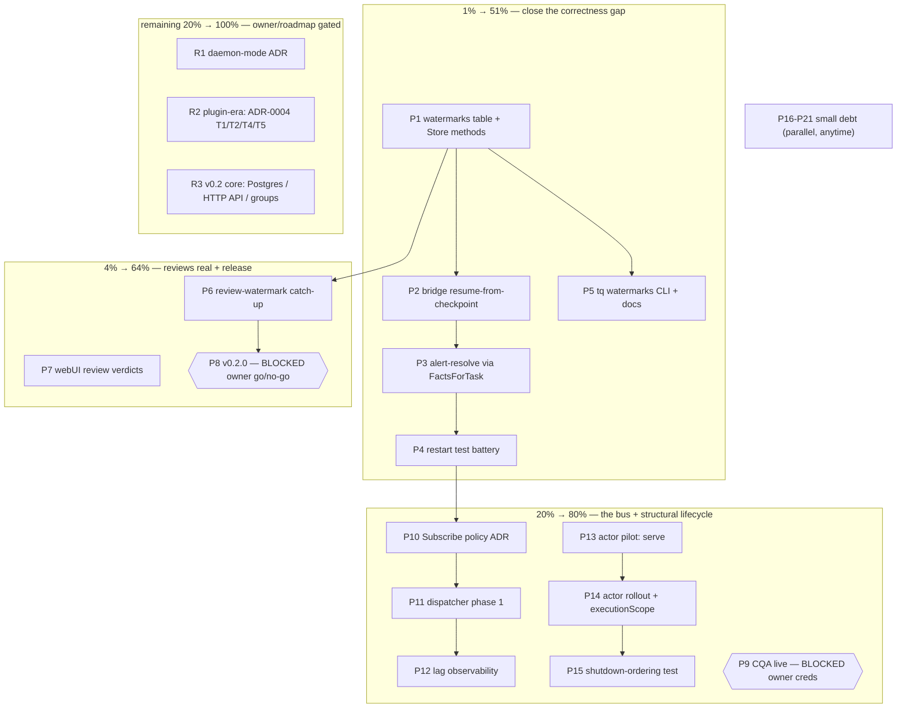

# SUPERB PLAN ROUND 6 — Watermarks, Reviews, and the Bus

**Date:** 2026-09-08 07:36
**Status:** ~~PLAN — ready for execution~~ EXECUTED 2026-09-08 — P1–P20 shipped (watermarks, review catch-up, dispatcher, actors, P17–P20 ops rows); completion report:
`docs/status/2026-09-08_20-58_round6-execution-watermarks-bus-actors.md`.

> **Archived 2026-09-09 (docs-health):** fully executed — moved from docs/planning/.
> **Author session:** library-evaluation session (05:24 report) + pareto-planning pass

## 0. Inputs (all re-verified at HEAD `b82d6b6`, tree clean)

- `docs/status/2026-09-08_05-24_cordis-samber-evaluation-journal-bus-recommendation.md` — the 50-item brainstorm
- `docs/planning/2026-09-08_journal-subscription-surface-inventory.md` — pool-verified: pull half of the bus already exists (`Facts`/`HeadSeq` on `queue.Store`); gaps are push-side; `journal.Journal` is production-dead (split brain)
- `docs/planning/2026-09-08_persisted-bridge-watermark-design.md` — pool-verified design with §7 implementation checklist (side table, checkpoint-after-forward, `alerted`→`FactsForTask` derivation, `FromSeq > persisted > head`)
- `docs/adr/0004-lifecycle-streaming-library-stance.md` — framework-free stance; cordis gated behind T1–T5 (T3 verified 2026-09-08: 86.2% cov, race-clean)
- `docs/planning/2026-09-08_sse-last-event-id-resume-mapping.md` — Subscribe NOT needed for the dashboard; filter-forwarding shipped
- `TODO_LIST.md` (8 unchecked items), `ROADMAP.md` (v0.2.0 arc + raw ideas)

**What changed since the 05:24 report:** the dogfood pool executed all 5 harvested verification/design items in ~2h, with code-verified verdicts. This plan is therefore an _implementation_ plan, not a research plan. The one discovery that reshapes it: the report's `Subscribe` proposal must target `queue.Store`, not `journal.Journal`, and its policy questions must be answered before dispatcher code exists.

## 1. Pareto breakdown

### The 1% that delivers 51%

**Persisted bridge watermarks (P1–P5).** The only known correctness gap in production-facing behavior: incidents fired while the pap bridge is down are never replayed, and alert-resolves die with the `alerted` map. Design is DONE and code-verified (§7 checklist). Implementation is mechanical. Everything else in this plan is improvement; this is gap-closing.

### The 4% that delivers 64%

**Make the agent-reviews ship real (P6–P7) + cut the release (P8).** Reviews just landed but are invisible (no webui badge) and lossy (sweeper starts at head — same watermark-gap class, reuses P1's table). v0.2.0 is additive and blocked only on owner go/no-go; shipping compounds everything after it.

### The 20% that delivers 80%

**The bus, phase 1 (P10–P12) + structural lifecycle (P13–P15) + small debt (P16–P21).** One policy ADR unlocks the dispatcher (push seam generalizing the bridge's loop, lag observability). The actor pattern (stdlib, per ADR-0004) makes shutdown ordering structural and pins it with a test. Plus five ≤60min TODOs.

### The other 20% to reach 100%

Owner-gated and roadmap work, deliberately NOT scheduled: daemon-mode ADR (owner gate g1), plugin-era cordis triggers T1/T2/T4/T5 (ADR-0004), v0.2.0 core arc (Postgres store, HTTP API, consumer groups — ROADMAP), filtered streams and per-fact SSE replay (post-dispatcher), journal compaction (raw idea; caveat codified in P21).

## 2. COMPREHENSIVE PLAN — tasks 30–100min, sorted by importance/impact/effort/customer-value

| ID  | Task (30–100min)                                                                                                                | Tier | Impact   | Effort | Customer value                           | Depends       | Gate / note                                          |
| --- | ------------------------------------------------------------------------------------------------------------------------------- | ---- | -------- | ------ | ---------------------------------------- | ------------- | ---------------------------------------------------- |
| P1  | `watermarks` side table + `Watermark`/`SaveWatermark` on `queue.Store` (monotonic upsert) + store tests                         | 1%   | Critical | 60m    | Enables P2/P6                            | —             | design §2.1/§7                                       |
| P2  | Bridge resume-from-checkpoint: `WatermarkStore` port, 3-branch `startWatermark`, batch-end checkpoint, startup log, package doc | 1%   | Critical | 90m    | Alerts never missed again                | P1            | checkpoint AFTER forward (§3)                        |
| P3  | Kill the `alerted` map: derive resolve-correlation from `FactsForTask` (read-only widening of `FactSource`)                     | 1%   | Critical | 60m    | Alert-resolve survives restarts          | P2            | design §5.1                                          |
| P4  | Bridge restart test battery (zero-loss, key identity, checkpoint-failure, precedence, bootstrap, resolve-after-restart)         | 1%   | Critical | 80m    | Proof the gap is closed                  | P2, P3        | design §7 tests row                                  |
| P5  | `tq watermarks show/set` + AGENTS.md + DOMAIN_LANGUAGE                                                                          | 1%   | High     | 35m    | Ops rescue hatch (rewind = safe replay)  | P1            | design §2.1                                          |
| P6  | Review-watermark catch-up: persist the `--review` sweeper cursor (same table) or documented lookback                            | 4%   | High     | 70m    | Reviews stop silently skipping           | P1            | evaluate first (TODO_LIST Lower #2)                  |
| P7  | WebUI: agent-review verdict badges + findings (table + trail) from `ReviewResult` fact detail                                   | 4%   | High     | 85m    | Operator sees the review loop            | —             | `templ fmt` + `nix run .#webui-css`                  |
| P8  | Cut v0.2.0: CHANGELOG, annotated tag, GitHub release, nix-binary smoke                                                          | 4%   | High     | 45m    | The product ships                        | P6 desirable  | **BLOCKED: owner go/no-go**                          |
| P9  | Verify CQA bridge against a live instance; fix contract drift                                                                   | 20%  | Medium   | 45m    | Ecosystem truth                          | —             | **BLOCKED: owner URL+token+ID**                      |
| P10 | Subscribe policy decision: slow-consumer semantics per subscriber class + journal split-brain resolution, as ADR amendment      | 20%  | High     | 45m    | Unblocks the bus without guesswork       | P4            | inventory §4 gaps 2+4, §5                            |
| P11 | Dispatcher phase 1: new seam over `Store` bounded reads generalizing the bridge loop (`Subscribe(ctx, since)`)                  | 20%  | High     | 100m   | Push path, shared reads, latency floor ↓ | P10           | never inside mutation tx                             |
| P12 | Lag observability: `HeadSeq − cursor` per subscriber, logged + `tq stats`                                                       | 20%  | Medium   | 30m    | Ops visibility                           | P11           | inventory gap 8                                      |
| P13 | Actor pilot: run.Group-style composition root for `tq serve` (interrupt actor, store/http actors)                               | 20%  | Med-High | 60m    | One signal story, deterministic teardown | —             | stdlib only (ADR-0004)                               |
| P14 | Actor rollout: `worker`/`agent-pool` + detached `executionScope` bounded by `--task-timeout`                                    | 20%  | High     | 90m    | Drain invariant becomes structural       | P13           | **invariant-sensitive: single owner, not pool food** |
| P15 | Shutdown-ordering e2e test: SIGTERM → SSE closed → bridge checkpoint flushed → pool waits execution scope → store closed        | 20%  | High     | 45m    | Pins P13/P14 forever                     | P13, P14      |                                                      |
| P16 | SSE reconnect-lag log (`head − N` on `Last-Event-ID` reconnect)                                                                 | 20%  | Low-Med  | 30m    | Cheap observability                      | —             | spike §4                                             |
| P17 | `TestCheckProjectsDir` unit tests                                                                                               | 20%  | Low      | 30m    | CI honesty                               | —             |                                                      |
| P18 | D91-lite: capture `crush --version` at pool start, warn when missing                                                            | 20%  | Low      | 30m    | Drift surfaces early                     | —             |                                                      |
| P19 | dprint gate: wire into treefmt or formally decide manual                                                                        | 20%  | Low      | 30m    | Docs stop drifting                       | —             | decision either way                                  |
| P20 | Sidecar retention: `--log-dir-max-age` sweep + plaintext warning docs                                                           | 20%  | Medium   | 60m    | Disks don't fill                         | —             |                                                      |
| P21 | Compaction caveat codified: Subscribe contract's error-vs-resync rule written into ADR-0001 amendment                           | 20%  | Low      | 20m    | Future-proof before compaction exists    | P10           | inventory §3.4                                       |
| R1  | Daemon-mode ADR (`tq daemon` = serve+pool+bridges+harvest, one process)                                                         | rest | High     | 45m    | Half the horizon items gate on it        | owner g1      | **NOT scheduled — owner gate**                       |
| R2  | Plugin-era: executor/bridge plugin API + cordis triggers T1/T2/T4/T5                                                            | rest | High     | L      | Third-party extensibility                | R1 + ADR-0004 | **NOT scheduled — ADR-0004 gates**                   |
| R3  | v0.2.0 core arc: Postgres store, HTTP API, consumer-group pool; filtered streams; compaction                                    | rest | High     | L      | Distribution seam                        | P8            | **ROADMAP — not this round**                         |

## 3. MICRO PLAN — every task ≤12min, sorted within parents (top = do first)

> Full table; `→ gates` = `go build ./... && go vet ./... && go test ./... -race` (+ relevant smoke). No task starts unless its parent's dependency tier is green.

| Micro                       | Task                                                                                     | Max |
| --------------------------- | ---------------------------------------------------------------------------------------- | --- |
| **P1** (60m)                |                                                                                          |     |
| M1.1                        | Add `watermarks` table to schema const (consumer PK, seq, updated_at)                    | 8m  |
| M1.2                        | Add `Watermark`/`SaveWatermark` to `queue.Store` interface                               | 5m  |
| M1.3                        | Implement `Watermark` (PK read, absent→0) in sqlite.go                                   | 8m  |
| M1.4                        | Implement `SaveWatermark` monotonic upsert (`WHERE seq < ?` semantics)                   | 10m |
| M1.5                        | Store test: absent consumer returns 0                                                    | 5m  |
| M1.6                        | Store test: save then read roundtrip                                                     | 5m  |
| M1.7                        | Store test: monotonic guard rejects regression                                           | 8m  |
| M1.8                        | Store test: legacy DB migrated (table appears)                                           | 10m |
| M1.9                        | → gates                                                                                  | 5m  |
| **P2** (90m)                |                                                                                          |     |
| M2.1                        | Define `WatermarkStore` port (2 methods) in bridge package                               | 8m  |
| M2.2                        | Inject into `papdashboard.New`; extend `fakeSource` test fake                            | 10m |
| M2.3                        | `startWatermark` 3-branch: FromSeq > persisted > head                                    | 12m |
| M2.4                        | Startup log naming the branch that fired                                                 | 5m  |
| M2.5                        | Batch-end checkpoint call in `Run`'s drain loop (after last accepted fact)               | 12m |
| M2.6                        | Checkpoint failure = forward failure (stop drain, retry next poll)                       | 10m |
| M2.7                        | Rewrite package doc: "resumed from checkpoint; re-sends idempotent"                      | 8m  |
| M2.8                        | → gates + existing bridge tests green                                                    | 8m  |
| **P3** (60m)                |                                                                                          |     |
| M3.1                        | Add read-only `FactsForTask` to bridge `FactSource`                                      | 8m  |
| M3.2                        | Implement on `fakeSource`                                                                | 5m  |
| M3.3                        | On `Completed`: derive via `FactsForTask` + `alertTitle` instead of map                  | 12m |
| M3.4                        | Delete `alerted` map + its bookkeeping                                                   | 5m  |
| M3.5                        | Update/extend resolve tests for derive-don't-store contract                              | 12m |
| M3.6                        | → gates                                                                                  | 5m  |
| **P4** (80m)                |                                                                                          |     |
| M4.1                        | Test: restart mid-stream loses zero facts                                                | 12m |
| M4.2                        | Test: re-forwarded facts keep identical idempotency keys                                 | 10m |
| M4.3                        | Test: checkpoint write failure does not advance cursor                                   | 12m |
| M4.4                        | Test: FromSeq precedence over persisted watermark                                        | 8m  |
| M4.5                        | Test: first run bootstraps at head (no history replay)                                   | 10m |
| M4.6                        | Test: resolve-after-restart closes a pre-restart alert                                   | 12m |
| M4.7                        | Full battery + `scripts/smoke/papdashboard-e2e.sh` green                                 | 10m |
| **P5** (35m)                |                                                                                          |     |
| M5.1                        | `tq watermarks show` (SELECT, table output)                                              | 10m |
| M5.2                        | `tq watermarks set <consumer> <seq>` (ops rewind)                                        | 10m |
| M5.3                        | AGENTS.md: watermarks table line + contract note                                         | 5m  |
| M5.4                        | DOMAIN_LANGUAGE: watermark/consumer/checkpoint entries                                   | 8m  |
| M5.5                        | → gates                                                                                  | 5m  |
| **P6** (70m)                |                                                                                          |     |
| M6.1                        | Evaluate lookback vs persisted watermark for the review sweeper; pick (design §6 analog) | 12m |
| M6.2                        | Consumer key + checkpoint wiring in the sweeper                                          | 12m |
| M6.3                        | Checkpoint after sweep batch (same ack rule)                                             | 8m  |
| M6.4                        | Test: tasks completed while sweeper down get reviewed                                    | 12m |
| M6.5                        | Docs: review catch-up semantics                                                          | 8m  |
| M6.6                        | → gates                                                                                  | 5m  |
| **P7** (85m)                |                                                                                          |     |
| M7.1                        | Helper: parse `executor.ReviewResult` from completion-fact detail                        | 10m |
| M7.2                        | Verdict badge component (approve / request_changes)                                      | 12m |
| M7.3                        | Findings fragment (title + severity list)                                                | 12m |
| M7.4                        | Integrate badge into task table row                                                      | 10m |
| M7.5                        | Integrate badge + findings into task trail                                               | 10m |
| M7.6                        | Tests + `templ fmt` + `nix run .#webui-css` + webui smoke                                | 12m |
| **P8** (45m, BLOCKED owner) |                                                                                          |     |
| M8.1                        | Finalize CHANGELOG `[Unreleased]` → v0.2.0                                               | 10m |
| M8.2                        | Annotated tag + release checklist run                                                    | 12m |
| M8.3                        | GitHub release + proxy/pkg.go.dev verify                                                 | 10m |
| M8.4                        | Nix-built binary smoke (`result/bin/tq --help`, stats)                                   | 8m  |
| **P9** (45m, BLOCKED owner) |                                                                                          |     |
| M9.1                        | Run bridge against live CQA; record drift                                                | 12m |
| M9.2                        | Fix response shapes; upgrade FEATURES.md status                                          | 12m |
| **P10** (45m)               |                                                                                          |     |
| M10.1                       | Table of subscriber classes × required semantics (exact vs signal)                       | 10m |
| M10.2                       | Decide slow-consumer policy per class (block/drop/ring+lag)                              | 12m |
| M10.3                       | Decide journal split-brain: demote `journal.Journal` to test-double vs unify pagination  | 10m |
| M10.4                       | Write ADR amendment (ADR-0001/0003 touchpoints)                                          | 12m |
| M10.5                       | Self-review pass vs inventory §5 stance                                                  | 5m  |
| **P11** (100m)              |                                                                                          |     |
| M11.1                       | Dispatcher seam type in a new consumer package (NOT on `Store` yet)                      | 12m |
| M11.2                       | Paging loop generalizing the bridge's exact-delivery shape                               | 12m |
| M11.3                       | Per-class subscriber semantics enforcement                                               | 12m |
| M11.4                       | v1 wake strategy: keep poll; notify-after-commit hook documented as v2                   | 8m  |
| M11.5                       | `Subscribe(ctx, since)` + cancel; slow-consumer per policy                               | 12m |
| M11.6                       | Race/concurrency tests (slow consumer, rapid append)                                     | 12m |
| M11.7                       | Migrate NOTHING by default; pilot behind the bridge only if P4 is green                  | 10m |
| M11.8                       | → gates                                                                                  | 5m  |
| **P12** (30m)               |                                                                                          |     |
| M12.1                       | Lag helper (`HeadSeq − cursor`) per subscriber                                           | 8m  |
| M12.2                       | Expose: periodic log + `tq stats` column                                                 | 10m |
| M12.3                       | Test                                                                                     | 8m  |
| **P13** (60m)               |                                                                                          |     |
| M13.1                       | `internal/runactor` helper (errgroup-based; no new deps)                                 | 10m |
| M13.2                       | Interrupt actor (signal → cancel, second signal → hard exit)                             | 8m  |
| M13.3                       | Serve: store actor (open/close) + http actor (Run)                                       | 12m |
| M13.4                       | Rewire `cmdServe` onto the group; defer-Close sites collapse                             | 12m |
| M13.5                       | webui smoke + gates                                                                      | 8m  |
| **P14** (90m, single-owner) |                                                                                          |     |
| M14.1                       | Worker command onto actor group                                                          | 12m |
| M14.2                       | Agent-pool onto actor group                                                              | 12m |
| M14.3                       | `executionScope`: detached context for in-flight tasks, bounded only by `--task-timeout` | 12m |
| M14.4                       | Assertion/test: task ctx NOT cancelled by pool shutdown signal                           | 12m |
| M14.5                       | Race tests under SIGTERM                                                                 | 12m |
| M14.6                       | Gates + chaos/e2e suites green                                                           | 10m |
| **P15** (45m)               |                                                                                          |     |
| M15.1                       | e2e test: SIGTERM ordering (SSE → bridge flush → execution scope → store)                | 12m |
| M15.2                       | Assert bridge checkpoint flushed before store close                                      | 12m |
| M15.3                       | Assert pool waits for execution scope                                                    | 10m |
| M15.4                       | Wire into e2e suite; CI green                                                            | 8m  |
| **P16** (30m)               |                                                                                          |     |
| M16.1                       | Log `reconnect lag = head − N` when `Last-Event-ID` present                              | 10m |
| M16.2                       | Test                                                                                     | 8m  |
| **P17** (30m)               |                                                                                          |     |
| M17.1                       | `TestCheckProjectsDir` table tests (`/`, `$HOME`, valid)                                 | 12m |
| M17.2                       | → gates                                                                                  | 5m  |
| **P18** (30m)               |                                                                                          |     |
| M18.1                       | Capture `crush --version` in pool startup; warn when binary missing                      | 10m |
| M18.2                       | Test (stub binary)                                                                       | 10m |
| **P19** (30m)               |                                                                                          |     |
| M19.1                       | Trial dprint over docs/; count churn                                                     | 12m |
| M19.2                       | Wire into treefmt gate OR record formal manual-formatting decision in AGENTS.md          | 10m |
| **P20** (60m)               |                                                                                          |     |
| M20.1                       | `--log-dir-max-age` flag + env                                                           | 10m |
| M20.2                       | Sweep loop on the sidecar dir                                                            | 12m |
| M20.3                       | Docs: plaintext + repo-paths warning                                                     | 8m  |
| M20.4                       | Test (aged files removed, live kept)                                                     | 10m |
| **P21** (20m)               |                                                                                          |     |
| M21.1                       | Write the compaction/resync rule into ADR-0001 amendment + DOMAIN_LANGUAGE               | 10m |
| M21.2                       | Cross-link from the inventory doc §3.4                                                   | 5m  |

**Counts:** 21 actionable macro tasks (≈20.5h), 103 micro tasks, 2 owner-blocked tasks, 3 roadmap-routed rows. All micro tasks ≤12min.

## 4. Execution graph

## 5. Guardrails — do NOT verschlimmbessern

1. **Single serialized writer is sacred**: no connection pool, no reads/dispatches inside mutation transactions, checkpoint writes share the one conn.
2. **Checkpoint AFTER forward, never before**; 4xx counts as acked; checkpoint failure stops the drain (at-least-once stays at-least-once).
3. **First run bootstraps at head** — persistence must not replay history into existing deployments.
4. **`FactSource` stays read-only** (`FactsForTask` is a read); writes go through the separate `WatermarkStore` port — never widen `FactSource` with mutations.
5. **SSE wire format unchanged**; the hub stays payload-less; the tailer's batch-jump never enters fact-delivery paths.
6. **Task execution context stays detached** from pool shutdown, bounded only by `--task-timeout` (the stranded-in-`running` lesson).
7. **No frameworks** (ADR-0004): stdlib actors; do/ro/cordis stay behind their triggers.
8. **Committed artifacts**: `*_templ.go` and `static/app.css` stay committed; recompile CSS after any templ change.
9. **No mass baseline lint fixes**; touch only what the slice touches.
10. Every slice ends green: `go build ./... && go vet ./... && go test ./... -race` (+ smoke where relevant) before the next micro starts.

## 6. Verification protocol

- Per micro: compile + focused test. Per task (P-row): full gates + relevant smoke (`scripts/smoke/webui.sh`, `scripts/smoke/papdashboard-e2e.sh`).
- Per tier: re-run `./scripts/ci-local.sh` (the pre-push gate) before declaring the tier done.
- P4 and P15 are themselves tests — their green run IS the acceptance criterion for tiers 1% and 20% respectively.
- Concurrency: expect parallel-agent churn; `git pull` assumptions before each slice, never revert others' diffs.

## 7. Owner gates (cannot be self-answered)

1. **v0.2.0 go/no-go** (P8) — release timing is yours.
2. **CQA instance URL + owner ID + token** (P9).
3. **Daemon-mode direction** (R1) — gates half the horizon work; asked in the 05:24 report, still open.

## 8. Ownership recommendation

- **Pool-safe (designed, bounded, tests exist as spec):** P1–P7, P10–P12, P16–P21. These are exactly what the dogfood pool executes well — designs and checklists are committed.
- **Single-owner, invariant-sensitive (do NOT pool):** P13–P14 (shutdown semantics; the drain-invariant bug class lives here). A senior session should own these start-to-finish.
- **Owner-only:** P8, P9, R1, R2.
