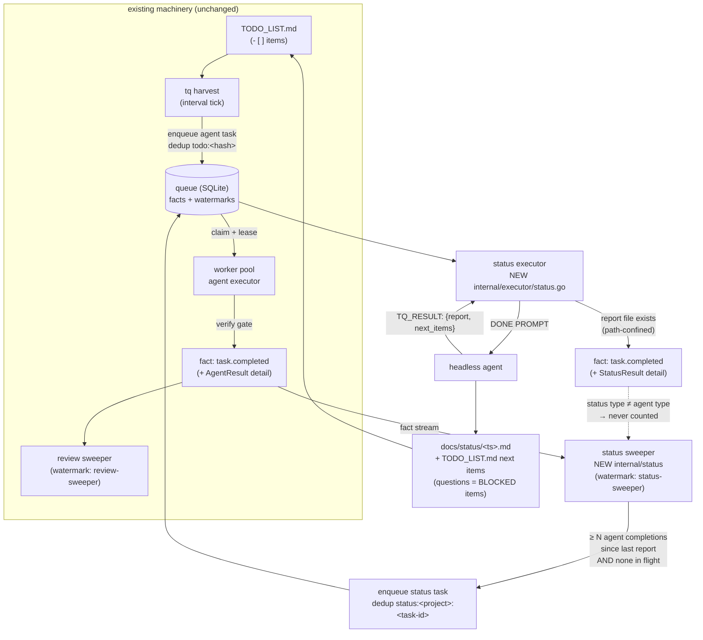

# SUPERB PLAN ROUND 7 — The Automated DONE-PROMPT Loop (Status Sweeper)

**Date:** 2026-09-08 20:40
**Status:** ~~EXECUTING~~ EXECUTED 2026-09-08 — shipped, hardened and dogfooded; reports:
`docs/status/2026-09-08_20-56_round7-status-loop-shipped.md`,
`docs/status/2026-09-08_21-51_round8-status-loop-hardened-dogfooded-and-self-reviewed.md`.

> **Archived 2026-09-09 (docs-health):** fully executed — moved from docs/planning/.
> **Author:** Crush (planning session)
> **Scope:** Automate the full loop: real tasks → agent execution → completion → DONE PROMPT
> (status report + next items) → back to real tasks. No human step inside the loop.

## The goal

Today the loop closes only halfway: harvest feeds TODO_LIST.md items to agent pools,
reviews gate quality — but the "What did you forget? Write a status report! What's next?"
ritual still needs a human to trigger it. This plan makes the queue do it itself:

```
TODO_LIST.md ──harvest──> agent tasks ──worker──> completion facts
      ▲                                              │
      │                                              ▼ (every N completions per repo)
      └── status agent appends next items ── status task (DONE PROMPT)
                                                  writes docs/status/<ts>.md
```

The DONE PROMPT (user's wording, adapted for headless runs):

- Full comprehensive status update: a) fully done, b) partially done, c) not started,
  d) totally fucked up, e) what to improve, f) up to 50 next items, g) up to 3 questions.
- `date` CLI for the timestamp; report lands at `docs/status/<YYYY-MM-DD_HH-MM_WELL-NAMED>.md`.
- **Loop-closing addition (new, required for autonomy):** next items + questions are
  appended to TODO_LIST.md as `- [ ]` checkboxes (questions as `— BLOCKED: <question>`);
  the harvester skips BLOCKED items until a human answers — the human-in-the-loop hatch.
- "Wait for instructions" is dropped: headless agents cannot wait. The report IS the wait.
- Ends with the mechanical contract line: `TQ_RESULT: {"report": "...", "next_items": N}`.

## Pareto breakdown

### The 1% that delivers 51%

**`StatusExecutor` + the DONE PROMPT + the mechanical contract.**
The entire value of the feature is "an agent finished → a report exists → next items land
in the backlog". Without this piece nothing else matters. It is a ~150-line executor that
clones the proven ReviewExecutor mechanics (agent run, preflight, timeout, TQ_RESULT
parsing) with a different prompt and one extra gate: the report file must exist under the
repo or the attempt fails (retryable — the model may comply on retry).

### The 4% that delivers 64%

**`internal/status` sweeper: the N-completion window.**
Turns one-shot reports into THE loop. Watches the journal (same watermark mechanics as the
review sweeper: bootstrap at head, checkpoint after the batch's last fact, dedup keys make
replays free). Per project: when ≥ N agent tasks have completed since the last status
report (and no report is in flight), mint ONE `status` task. Loop safety is structural:
only type `agent` completions are counted — status tasks never trigger status tasks.
No new persisted state: the window is derived from queue queries (task UpdatedAt vs the
last report's creation), so restarts cannot desynchronize the counter.

### The 20% that delivers 80%

**Wiring + tests + contracts.**

- `--status-every N` flag on `tq agent-pool` (0 = off, default off — opt-in like `--review`).
- Status executor registered in EVERY agent-capable pool (`agent-pool` and `tq worker
  --agents`), so pools without the flag still CARRY status tasks another pool minted
  (exact parity with the review executor story).
- Sweep runs in the tick loop and in the `--once` drain watcher, next to the review sweep.
- Tests: sweeper window/dedup/loop-safety/resume; executor contract incl. path
  confinement (a model-echoed `../../etc/passwd` report path must be rejected).
- Docs: AGENTS.md payload contract + package row, CHANGELOG, FEATURES.

### The other 20% to reach 100%

- Shared `ResultLine` helper (dedupe TQ_RESULT regex parsing between review + status).
- Docs polish and cross-references; this plan file; full `ci-local.sh` gate; commit + push.
- Deliberately OUT of scope (recorded decisions, not forgotten work):
  - **Count-based harvest trigger** ("after X runs → harvest"): interval harvest
    (default 5m, budget-gated) already subsumes it; a second trigger would be
    verschlimmbessern.
  - **Status-of-status / report aggregation across repos**: one report per repo per
    window is the honest unit; cross-repo rollups belong to the web UI later.
  - **Auto-unblocking BLOCKED questions**: questions exist to be answered by humans.

## Execution graph



## Medium-granularity plan (30–100 min units, sorted by impact/effort)

| #  | Task                                                               | Impact   | Effort | Value | Tier |
| -- | ------------------------------------------------------------------ | -------- | ------ | ----- | ---- |
| M1 | Extract shared `ResultLine` helper (executor/result.go, review.go) | enabler  | 20m    | ★★★   | 1%   |
| M2 | `StatusExecutor`: payload, prompt, contract, report-file gate      | 51%      | 60m    | ★★★★★ | 1%   |
| M3 | `internal/status` sweeper: cursor, N-window, mint, dedup           | 64%      | 60m    | ★★★★★ | 4%   |
| M4 | Pool wiring: `--status-every`, registration ×2, tick + drain sweep | 80%      | 40m    | ★★★★  | 20%  |
| M5 | Executor tests: contract, path confinement, happy path (stub bin)  | safety   | 45m    | ★★★★  | 20%  |
| M6 | Sweeper tests: window, dedup, loop safety, in-flight, resume       | safety   | 45m    | ★★★★  | 20%  |
| M7 | Docs: AGENTS.md contract + package row, CHANGELOG, FEATURES        | maintain | 25m    | ★★★   | 20%  |
| M8 | Full gates (`ci-local.sh`), commit, push                           | ship     | 20m    | ★★★   | 100% |

## Fine-granularity plan (≤ 12 min units)

| #   | Unit                                                                   | Parent |
| --- | ---------------------------------------------------------------------- | ------ |
| F1  | Add `ResultLine(output) (json.RawMessage, error)` to result.go         | M1     |
| F2  | review.ParseResult delegates to ResultLine; run executor tests         | M1     |
| F3  | status.go: `TaskTypeStatus`, `StatusPayload`, `StatusCompletion` types | M2     |
| F4  | status.go: `StatusResult` + `statusPrompt` (the DONE PROMPT)           | M2     |
| F5  | status.go: `StatusExecutor.Execute` decode + preflight + timeout       | M2     |
| F6  | status.go: run agent, parse TQ_RESULT, path-confine, file gate         | M2     |
| F7  | status.go: SetResultDetail with StatusResult; build + vet              | M2     |
| F8  | sweep.go: package doc, ConsumerKey, SweeperConfig, SweepStats          | M3     |
| F9  | sweep.go: NewSweeper watermark bootstrap (clone review mechanics)      | M3     |
| F10 | sweep.go: Sweep paging + checkpoint loop                               | M3     |
| F11 | sweep.go: handleFact agent-only filter + window query + in-flight      | M3     |
| F12 | sweep.go: mintStatus payload + StatusDedupKey + window cap             | M3     |
| F13 | main.go: `--status-every` flag + sweeper construction                  | M4     |
| F14 | main.go: register status executor at both registration sites           | M4     |
| F15 | main.go: sweep calls in runTick + --once drain watcher + banner        | M4     |
| F16 | status_test.go: payload contract permanence cases                      | M5     |
| F17 | status_test.go: TQ_RESULT parse + missing-file failure                 | M5     |
| F18 | status_test.go: happy path with stub binary + path escape rejection    | M5     |
| F19 | sweep_test.go: harness (clone review's) + below-N no-mint              | M6     |
| F20 | sweep_test.go: N-th completion mints exactly one, re-sweep dedups      | M6     |
| F21 | sweep_test.go: status completions never trigger (loop safety)          | M6     |
| F22 | sweep_test.go: in-flight report suppresses; next window re-arms        | M6     |
| F23 | sweep_test.go: bootstrap-at-head (no history replay)                   | M6     |
| F24 | AGENTS.md: package table row + payload-contract bullet                 | M7     |
| F25 | CHANGELOG.md + FEATURES.md entries                                     | M7     |
| F26 | `go build`, `go vet`, `go test ./... -race`                            | M8     |
| F27 | `./scripts/ci-local.sh`                                                | M8     |
| F28 | Detailed commit + push                                                 | M8     |

## Invariants this design preserves

1. **Facts-first**: status tasks are ordinary tasks; their completion is a fact with
   StatusResult detail. The sweeper's watermark is consumer state, not task state.
2. **Loop safety is structural**: `status` type is never counted by the sweeper
   (only `agent` is), exactly like reviews are never reviewed.
3. **Budgetary bound**: every minted status task is an enqueue → counts against
   `--daily-budget` / `--budget-cmd` like everything else.
4. **Single serialized writer**: the sweeper only uses Store calls (Enqueue/List/
   Watermark); it never writes tasks outside the store.
5. **Checkpoint AFTER the batch's last accepted fact** — the watermark rule from
   ADR/persisted-bridge design applies verbatim (clone of review sweeper).
6. **Path confinement**: the report path echoed in TQ_RESULT must be repo-relative
   and local (`filepath.IsLocal`); absolute paths and `..` escapes are failed attempts.
7. **Headless honesty**: no "wait for instructions" — BLOCKED items in TODO_LIST.md are
   the question-answering surface, and the harvester already skips them by design.
