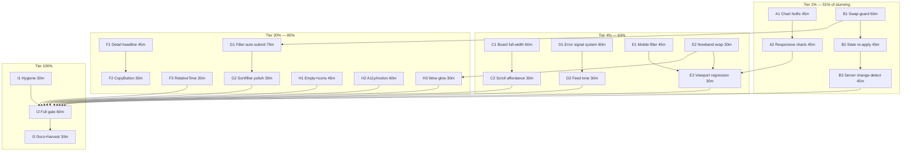

# UI STUNNING OVERHAUL — tq web dashboard

> **EXECUTED — ARCHIVED 2026-09-21 (docs-health archive sweep)** — all 23 workstreams SHIPPED 2026-09-14 (header stamp); leftovers routed rows 242-249; execution log in the 17-35 report.

**Date:** 2026-09-14 13:24 CEST · **Status:** SHIPPED 2026-09-14 15:50-17:30 (all 23 workstreams; execution log: research report §05 + docs/status/archived/2026-09-14_17-35_ui-stunning-overhaul-execution.md)
**Evidence base:** `docs/research/2026-09-14_templ-components-deep-dive.html` (§04 visual
pass, 10 screenshot captures) + status report
`docs/status/2026-09-14_11-41_templ-components-deep-dive-webui-ux-audit.md` (+ addendum).
**Goal state:** the operator opens `tq serve` and is STUNNED — legible instrument charts,
a board that shows every lane, error signal instead of a red wall, live interaction that
never fights the operator, zero clipped edges at any viewport.

---

## 0. Non-negotiable guardrails (VERSCHLIMMBESSER protection)

1. **Scratch journal only** for all visual work: `TQ_DB=<scratch>` (never the production
   `/mnt/pool/services/tq/tq.db`; assume every bare `tq` touches production).
2. **Adoption table same-commit**: every newly adopted library component gets an
   `### templ-components adoption` row in the same change — `TestAdoptionTableCoversTemplates`
   fails otherwise (both directions).
3. **CSS artifact chain**: after any `theme.css`/`.templ` edit run `templ generate` +
   `nix run .#webui-css`; committed minified `app.css` must be byte-reproducible.
4. **No new dependencies** (closed budget: templ + tailwind-merge-go + go-error-family).
   Filter auto-submit uses the existing hand-rolled SSE client, NOT a new runtime.
5. **Theme duality**: every custom CSS addition carries light+dark values; nowband stays
   deliberately always-dark; all motion gets `prefers-reduced-motion` fallbacks.
6. **Visual regression harness**: the /tmp/tqshot chromedp set (table light/dark, board,
   detail, 375/768/1440, populated) is captured BEFORE the first change and re-run after
   each workstream — a capture that regresses blocks merge of that workstream.
7. **Tests green before/after**: `export GOEXPERIMENT=jsonv2; go build ./... && go vet ./...
   && go test ./... -race` + `./scripts/smoke/webui.sh` (read-only surface contract).
8. One workstream per commit-series; concurrent agents own other files — re-read before
   every write (repo is multi-agent live).

---

## 1. Pareto breakdown — what delivers the stunning?

### The 1% that delivers 51%

| # | Item                                                        | Why it is the 1%                                                                                                                 |
| - | ----------------------------------------------------------- | -------------------------------------------------------------------------------------------------------------------------------- |
| 1 | **Chart repair** (height, legible axes, responsive scaling) | The illegible y-axis smear sits above the fold on EVERY page in BOTH themes. It is the single loudest "this is broken" signal.   |
| 2 | **SSE swap-guard + state re-apply**                         | The dashboard currently destroys typing/forms/folds/focus every tick. Stunning is impossible while the page fights its operator. |

### The 4% that delivers 64% (1% + these)

| # | Item                                                                 | Why                                                                                          |
| - | -------------------------------------------------------------------- | -------------------------------------------------------------------------------------------- |
| 3 | **Board full-width rework + scroll affordance**                      | 2 of 5 lanes invisible = "broken grid" first impression.                                     |
| 4 | **Error/DLQ presentation discipline**                                | The red wall reads as panic, not instrument. Severity tint + fade + expand = calm authority. |
| 5 | **Mobile/tablet repairs** (filter row, nowband wrap, chart clipping) | 375px currently looks unfinished.                                                            |

### The 20% that delivers 80% (4% + these)

| #  | Item                                                                                                      | Why                                                             |
| -- | --------------------------------------------------------------------------------------------------------- | --------------------------------------------------------------- |
| 6  | **Copy affordances everywhere** (CopyButton on IDs, paths, payloads)                                      | Operator delight; library ships it CSP-safe.                    |
| 7  | **Detail headline rework** (short ID + badge + copy; RelativeTime)                                        | 26-char ULID at 2xl is the noisiest element on the detail page. |
| 8  | **Filter auto-submit** (fetch+pushState via existing client; htmx ruling not required)                    | Removes the full-reload "apply" clunk.                          |
| 9  | **Void reclamation** (aside dead-end, board empty space, journal browser integration)                     | Whitespace voids read as unfinished.                            |
| 10 | **Micro-polish pass** (empty-state actions, icon accents, focus/motion tuning, "running glow" on nowband) | The last 10% of perceived quality.                              |

### The remaining 80% → 100%

| #  | Item                                                                               |
| -- | ---------------------------------------------------------------------------------- |
| 11 | `navigation.Pagination` adoption (numbered pages)                                  |
| 12 | `display.ListNote` for "+N more projects" chip                                     |
| 13 | `errorpage.WriteError` for 500s (styled, chrome-consistent)                        |
| 14 | A11y pack for custom surfaces (touch targets, forced-colors, prefers-contrast)     |
| 15 | Upstream chart contribution (tick thinning / MaxTicks prop) — verify-before-filing |
| 16 | Hygiene: dead `factLines`, gopls pile triage, RelativeTime adoption in feed        |
| 17 | templ-components bump when the unreleased a11y pack ships                          |

---

## 2. Comprehensive plan — 30–100 min tasks (ALL todos)

Sorted by impact ÷ effort. WS = workstream. "Ev" = evidence link (R§ = research report §).

| ID | WS      | Task (30–100 min each)                                                                                                                                                              | Impact | Effort | Depends  | Ev        |
| -- | ------- | ----------------------------------------------------------------------------------------------------------------------------------------------------------------------------------- | ------ | ------ | -------- | --------- |
| A1 | Charts  | **Chart hotfix**: Height 120→200, audit both charts' domains (fact-rate spike reads empty; clamp/annotate), x-label fit                                                             | H      | 45m    | —        | R§04      |
| A2 | Charts  | **Responsive scaling**: verify svg viewBox, add `#frag-metrics svg{width:100%;height:auto}` pattern + visual check 375/768/1440                                                     | H      | 45m    | A1       | R§04      |
| B1 | Live    | **Swap-guard** in app.js `applyFragment`: skip fragment while it contains `activeElement`, open `
`, or `[data-expanded]`; defer skipped ids to next tick                   | H      | 60m    | —        | R§F1      |
| B2 | Live    | **State re-apply** post-swap: `.tq-settled` open state, expanded error cells, `.journal-scroll` scrollTop                                                                           | H      | 45m    | B1       | R§F1      |
| B3 | Live    | **Server change-detection**: skip `#frag-filters` re-render unless FilterState hash changed (render.go)                                                                             | M      | 45m    | B1       | R§F1      |
| C1 | Board   | **Full-width board**: `view=board` renders the board as a full-bleed region (aside drops below), lanes get `flex-1 min-w-0` up to 5-across at 1440                                  | H      | 60m    | —        | R§04      |
| C2 | Board   | **Scroll affordance**: edge fade + scroll-snap on the lane strip; `+N older` stays pinned visible                                                                                   | M      | 30m    | C1       | R§04      |
| D1 | Errors  | **Error signal system**: DLQ rows neutral; severity carried by one accent (badge/left rule); error text ellipsis-fade + existing expand; drop row tint                              | H      | 60m    | —        | R§04      |
| D2 | Errors  | **Feed tone discipline**: failure tones only on the fact tag, message text stays neutral gray (red reserved for dead)                                                               | M      | 30m    | D1       | R§04      |
| E1 | Mobile  | **Filter row rework**: wrap order (search full row, selects compact), hit targets ≥24px, apply sticky-right                                                                         | M      | 45m    | —        | R§04      |
| E2 | Mobile  | **Nowband wrap polish**: `auto-fit` segments, meta row alignment, alarm glow survives wrap                                                                                          | M      | 30m    | —        | R§04      |
| E3 | Mobile  | **Viewport regression pass**: 375/768/1024/1440 captures vs baseline set; fix stragglers                                                                                            | M      | 30m    | A2,E1,E2 | R§04      |
| F1 | Detail  | **Headline rework**: `…50cf273` short ID (2xl) + copy + full ULID as quiet subtitle + status badge row                                                                              | M      | 45m    | —        | R§04      |
| F2 | Detail  | **CopyButton adoption**: payload command/raw, report path, fact IDs (adopt display.CopyButton; update adoption table)                                                               | M      | 30m    | F1       | R§F6      |
| F3 | Detail  | **RelativeTime adoption** (created/updated rows; delete dead `factLines`; feed timestamps decision documented)                                                                      | M      | 30m    | —        | R§F3      |
| G1 | Filter  | **Auto-submit via existing client**: submit → fetch `/?…` → swap `#frag-table` + `#frag-stats`, `history.pushState`, debounce 300ms on search; SSE stream URL stays source-of-truth | M      | 75m    | B1       | R§F5      |
| G2 | Filter  | **Sort/filter UX polish**: sort state as removable chip; verify header sort links against theme                                                                                     | L      | 30m    | G1       | —         |
| H1 | Polish  | **Empty-state + icon pass**: EmptyState `Action` ("clear filters"), icon accents on apply/DLQ headings (adoption table rows)                                                        | L      | 45m    | —        | R§F6      |
| H2 | Polish  | **A11y/focus/motion**: forced-colors focus restore for custom links, prefers-contrast borders, motion-reduce audit, lamp pulse tuning                                               | M      | 60m    | —        | R§04      |
| H3 | Polish  | **The wow**: running>0 ambient nowband glow (CSS only, reduced-motion safe), dead alarm refinement                                                                                  | L      | 30m    | E2       | —         |
| I1 | Hygiene | **Repo hygiene**: delete `factLines`, hub.go infertypeargs, 2× templ QF1003, `go mod tidy -diff` triage                                                                             | L      | 30m    | —        | status §d |
| I2 | Verify  | **Full gate**: build/vet/test -race, smoke webui, screenshot set re-run, adoption guard, `check-webui-css.sh` via ci-local                                                          | H      | 60m    | all      | —         |
| I3 | Docs    | **Docs close-out**: adoption table rows, research report §05 execution log, HARVEST leftovers → TODO_LIST                                                                           | M      | 30m    | I2       | —         |

**Totals:** 23 tasks, ≈ 21 h focused work. Critical path: A1 → A2 → E3 and B1 → B2/B3 → G1.

---

## 3. Detailed breakdown — ≤12 min micro-tasks (ALL todos)

Order = execution order within tier. (T# = tracks the task above.)

### Tier 1% (51%)

| µID  | T  | Micro-task (≤12 min each)                                                                                           |
| ---- | -- | ------------------------------------------------------------------------------------------------------------------- |
| A1.1 | A1 | Baseline captures: run /tmp/tqshot harness, archive PNGs as `docs/research/assets/<date>/` (git-ignore check first) |
| A1.2 | A1 | `fragments.templ`: Height 120→200 both AreaCharts                                                                   |
| A1.3 | A1 | Verify svg viewBox present in library output (grep `_templ.go`), else plan fallback                                 |
| A1.4 | A1 | Fact-rate: clamp/round y max to bucket quantum; note in chart title when clamped                                    |
| A1.5 | A1 | Recapture dashboard dark+light; diff vs baseline; `templ generate`                                                  |
| A2.1 | A2 | Add `#frag-metrics svg{width:100%;height:auto}` + container query cap in theme.css                                  |
| A2.2 | A2 | Capture 375/768: x-labels unclipped? adjust padding if labels truncate                                              |
| A2.3 | A2 | `nix run .#webui-css`; byte-check committed app.css                                                                 |
| A2.4 | A2 | Full-screen sweep: charts at all four widths look intentional                                                       |
| B1.1 | B1 | app.js: extract `fragmentBusy(el)` (activeElement / open details / [data-expanded="1"])                             |
| B1.2 | B1 | `applyFragment`: skip busy fragments, queue ids in `pendingSwap` set                                                |
| B1.3 | B1 | Flush pendingSwap on next `frag`/idle timer (max staleness ~2 ticks)                                                |
| B1.4 | B1 | Test script: type in search + fire enqueue loop → input keeps text                                                  |
| B2.1 | B2 | Capture pre-swap state map (details.open by id, data-expanded, scrollTop)                                           |
| B2.2 | B2 | Re-apply map post-swap; feed pane keeps scroll position                                                             |
| B2.3 | B2 | Settled-fold open across burst — manual verify via seeded loop                                                      |
| B2.4 | B2 | Error-cell expand survives swap; keyboard focus lands sensibly after swap                                           |
| B3.1 | B3 | render.go: FilterState → stable hash; skip frag-filters when unchanged                                              |
| B3.2 | B3 | handlers.go: filter fragments list per hash before SendJSON                                                         |
| B3.3 | B3 | Verify chips still update on project-link navigation (cross-fragment path)                                          |
| G1.1 | G1 | ADR note in research §05: fetch+pushState chosen, htmx stays out (one paragraph)                                    |
| G1.2 | G1 | app.js: form submit interceptor (GET /, serialize, fetch, no full reload)                                           |
| G1.3 | G1 | Swap `#frag-table`+`#frag-stats` from response (parse HTML, extract containers)                                     |
| G1.4 | G1 | `history.pushState`; back/forward re-triggers swap (popstate handler)                                               |
| G1.5 | G1 | Debounce 300ms on `#search-box` input; Enter still submits immediately                                              |
| G1.6 | G1 | SSE streamURL rebuilds from pushState location (filter changes stay live)                                           |
| G1.7 | G1 | Loading cue: apply button brief busy state (existing tq-action styling)                                             |

### Tier 4% (64%)

| µID  | T  | Micro-task (≤12 min each)                                                               |
| ---- | -- | --------------------------------------------------------------------------------------- |
| C1.1 | C1 | layout.templ: board view → `#sec-tasks` spans full row; aside section moves below board |
| C1.2 | C1 | fragments.templ Board: lanes `flex-1 min-w-0 sm:flex-none sm:w-64` (fit 5-across ≥1280) |
| C1.3 | C1 | Column header/count row aligns at all widths; empty-lane box shrinks                    |
| C1.4 | C1 | Capture board 1440/1024: all five lanes visible without scroll at ≥1280                 |
| C2.1 | C2 | Edge fade gradients (mask-image) on the lane strip; hidden when at scroll end           |
| C2.2 | C2 | `snap-x` on strip, `snap-start` on lanes; verify `+N older` links stay visible          |
| D1.1 | D1 | Design tokens: severity accent = left 2px rule + badge only; row bg neutral             |
| D1.2 | D1 | fragments.templ deadRows/taskRows error cell: ellipsis-fade (max-lines) + title         |
| D1.3 | D1 | Keep click-to-expand (data-error) wired to new markup; focus style on cell              |
| D1.4 | D1 | theme.css: `.tq-err` classes light+dark; remove red row tint usages                     |
| D1.5 | D1 | Capture DLQ 10-dead state: wall-of-red gone, severity scannable                         |
| D2.1 | D2 | FactFeed: tone color applies to tag only; error tail neutral gray                       |
| D2.2 | D2 | Dead-lettered tag keeps red; failed stays amber; verify contrast both themes            |
| E1.1 | E1 | FilterBar: order = search (full row, basis-full) → selects+apply row                    |
| E1.2 | E1 | Selects/inputs min height ≥24px hit area at 375; apply button right-aligned             |
| E1.3 | E1 | Capture 375 filter row: nothing crushed, "sear…" gone                                   |
| E2.1 | E2 | nowband-inner: `display:grid; grid-template-columns:repeat(auto-fit,minmax(88px,1fr))`  |
| E2.2 | E2 | Meta row wraps under band full-width; alarm glow preserved per segment                  |
| E2.3 | E2 | Capture 375 nowband single-glance readable                                              |
| E3.1 | E3 | Capture matrix 375/768/1024/1440 × light/dark × table/board/detail                      |
| E3.2 | E3 | Fix any overflow/clip stragglers found (≤3 small CSS patches)                           |
| E3.3 | E3 | Write before/after strip into research §05                                              |

### Tier 20% (80%)

| µID  | T  | Micro-task (≤12 min each)                                                                  |
| ---- | -- | ------------------------------------------------------------------------------------------ |
| F1.1 | F1 | fragments.templ taskDetailCard headline: short ID + Badge row; ULID to subtitle line       |
| F1.2 | F1 | theme.css: headline stack styles (mono short id, quiet full id)                            |
| F1.3 | F1 | Capture detail dark+light: hierarchy reads at a glance                                     |
| F2.1 | F2 | Adopt display.CopyButton on payload command/raw blocks (adoption table +guard)             |
| F2.2 | F2 | CopyButton on statusReport path; nonce wiring via ctx                                      |
| F2.3 | F2 | CopyButton next to detail short ID; capture feedback state                                 |
| F3.1 | F3 | Delete dead `factLines` (components.go) + its build check                                  |
| F3.2 | F3 | RelativeTime on detail created/updated (adoption row; Now param from data.Now)             |
| F3.3 | F3 | Feed timestamps: document decision (keep wall-clock; RelativeTime only on detail)          |
| H1.1 | H1 | Filtered-empty EmptyState gains Action "clear filters" (href `/`)                          |
| H1.2 | H1 | Icon accents: apply button (check), DLQ heading (archive-box already imported)             |
| H1.3 | H1 | Adoption table rows for icons/CopyButton/ListNote additions                                |
| H2.1 | H2 | forced-colors: focus outline restore for `.tq-action`, viewToggle, clear-all               |
| H2.2 | H2 | prefers-contrast: border gray remap in theme.css (mirror library rule)                     |
| H2.3 | H2 | motion audit: lamp pulse, alarm glow, fold chevron — all motion-reduce safe                |
| H2.4 | H2 | Tab-pass: visible focus on every interactive element (capture focus states)                |
| H3.1 | H3 | nowband running glow: box-shadow pulse on RUNNING seg when count>0 (CSS class from server) |
| H3.2 | H3 | Dead alarm refinement: label blink removed, keep static glow (calmer)                      |
| H3.3 | H3 | Capture "2 running" state: glow present, tasteful, reduced-motion respects                 |

### Tier 100% (the rest)

| µID  | T  | Micro-task (≤12 min each)                                                                                                         |
| ---- | -- | --------------------------------------------------------------------------------------------------------------------------------- |
| I1.1 | I1 | Delete factLines (if not in F3.1), run build                                                                                      |
| I1.2 | I1 | hub.go: drop explicit type args; build                                                                                            |
| I1.3 | I1 | templ QF1003: 2× if-chain → switch in fragments.templ; regenerate                                                                 |
| I1.4 | I1 | `go mod tidy -diff` root; classify each warning (keep/fix/ignore)                                                                 |
| I2.1 | I2 | `export GOEXPERIMENT=jsonv2; go build ./... && go vet ./... && go test ./... -race`                                               |
| I2.2 | I2 | `./scripts/smoke/webui.sh` green                                                                                                  |
| I2.3 | I2 | Screenshot full set re-run; side-by-side vs baseline; no regressions                                                              |
| I2.4 | I2 | `./scripts/ci-local.sh` (master-CI precheck included)                                                                             |
| I3.1 | I3 | AGENTS.md adoption table + conventions updated (RelativeTime, CopyButton, ListNote)                                               |
| I3.2 | I3 | Research report §05 execution log (what shipped, captures)                                                                        |
| I3.3 | I3 | docs-health HARVEST: leftover P2s (Pagination, ListNote chip, errorpage, upstream filing, a11y pack, version bump) → TODO_LIST.md |
| I3.4 | I3 | Commit series per workstream with detailed messages; push (user-authorized)                                                       |

---

## 4. Execution graph

Parallel tracks: **A** (charts) and **B** (live swaps) are independent — two agents can
run them concurrently. C/D/E start any time; G waits for B1; I2 is the single gate.

---

## 5. Definition of stunning (acceptance)

1. Every chart axis legible at 375/768/1440, both themes; no clipped labels anywhere.
2. Operator can type, open a cancel form, expand an error, and scroll the feed — while
   live — and nothing snaps away (swap-guard + re-apply proven by seeded burst test).
3. Board at 1440 shows all five lanes; scroll (if any) is discoverable.
4. Ten dead tasks look like a calm incident list, not a fire.
5. Detail page: short ID + copy at a glance; RelativeTime rows; no full-ULID shouting.
6. Focus visible everywhere; motion respects reduced-motion; forced-colors usable.
7. Full gate green (race tests, webui smoke, css byte-check) + before/after capture strip
   committed to the research report.

_Plan written 2026-09-14 13:24 CEST from the 2026-09-14 audit evidence. Format note:
skill default is styled HTML; user explicitly requested .md + mermaid — override honored._
